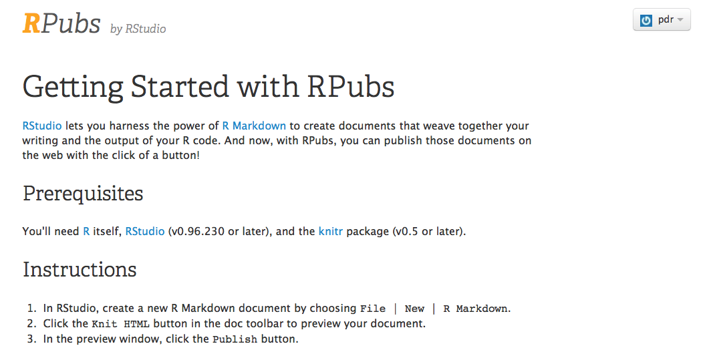
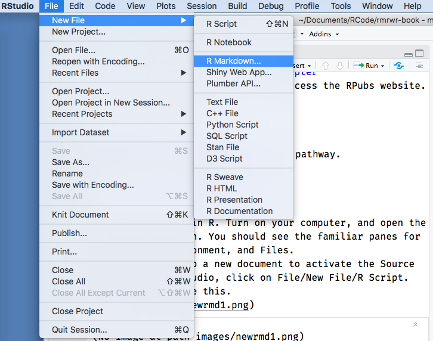
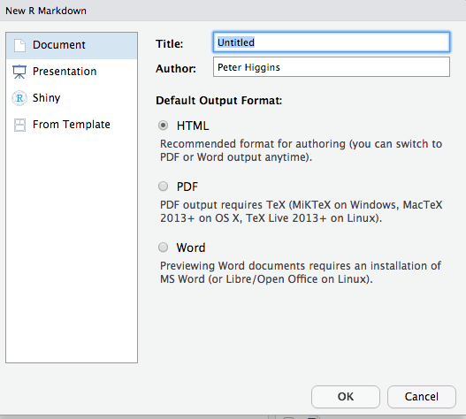
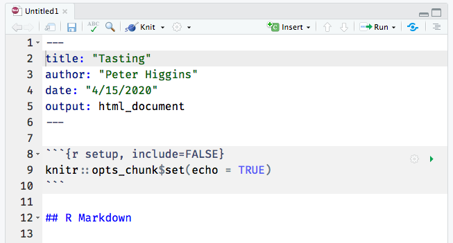
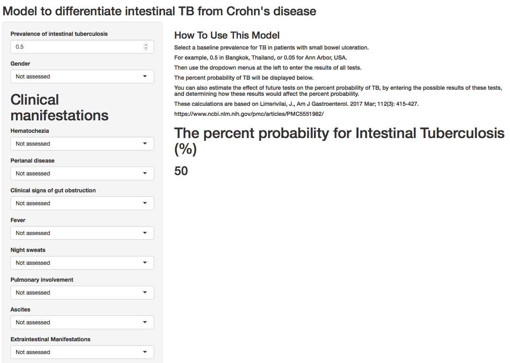

# A Tasting Menu of R

In this chapter, we will introduce you to a lot of neat things that you can do with R and RStudio, and you will publish a simple data analysis on the Internet that you can share with friends and family.


## Setting the Table

In this chapter, you will get a rapid overview of the kind of things you can do with R.
You will

-   create an Rmarkdown document

-   read in data

-   wrangle your data

-   create a data visualization and

-   publish your findings.

    At the end of this chapter, you will publish your data analysis to *RPubs*, a free website site where you can share your data analyses and visualizations.

## Goals for this Chapter

-   Set up an RPubs account
-   Open a New Rmarkdown document
-   Read in Data from a file
-   Wrangle Your Data
-   Visualize Your Data
-   Publish your work to RPubs
-   Check out Interactive Plots
-   Check out Animated Graphics
-   Check out a Clinical Trial Dashboard
-   Check out a Shiny App

## Packages needed for this Chapter

In this chapter, we will use the following R packages:

-   tidyverse

-   janitor

-   rstatix

-   medicaldata

If you have not installed these packages on your computer already, we will walk you through installation after you open your Rmarkdown document (see below).

## Website links needed for this Chapter

In this chapter, you will need to access the RPubs website.\
\
<https://rpubs.com/>

## Setting up RPubs

First you will need to set up a free account on RPubs.
Start by opening a new tab in your browser, and navigating to this link [RPubs link](https://rpubs.com/users/new).
It should look like the image below.

\
Enter your name, email, username and password, (remember these, you will need them later) and click on the *Register Now* button, and you will be set up to use RPubs
.

\
This will bring you to this page.
In the image below, we have set up an account for pdr.

\


Click on the *Here's How You Get Started* link (blue text).

\

You are now all set up and ready to go.
Now you have a place on the internet to share your R creations.
On to the creation part!

## Open a New Rmarkdown document

Let's get started in R.
Turn on your computer, and open the RStudio application.
You should see the familiar panes for the Console, Environment, and Files.\
You need to open up a new document to activate the Source pane.
While in RStudio, click on File/New File/RMarkdown.
It should look like this.



Now you will see the window below.
Rename the document from "Untitled" to "Tasting".
Enter your own name as the Author, and click the OK button.



Now the file is open, and looks like the window below (with title "Tasting" and author "Peter Higgins". Click on the save icon (like a floppy disk in the top left), and save this document as my_data_analysis.Rmd.



You have created a new Rmarkdown document.
An Rmarkdown document lets you mix data, code, and descriptive text.
It is very helpful for presenting and explaining data and visualizations.
An Rmarkdown document can be converted (Knit) to HTML for a web page, or to Microsoft Word, Powerpoint, PDF, and several other output formats.


**Code chunks** are in a gray color, and both start and end with 3 backticks (\`\`\`), like this.


``` r
code goes here
```

**Text** can be body text, or can be headers and titles.
The number of hashtags before some header text defines what level the header is.\
You can insert **links**, **images**, and even YouTube **videos** into Rmarkdown documents if it is helpful to explain your point.

You can change the way that the Rmarkdown document is displayed with two buttons in the top right of the new Tasting document tab.
The button with several horizontal lines that looks like an outline can be clicked to toggle an outline pane on and off.
When the outline pane is on, you can click on the entries to go to a different part of your document quickly.

The button that looks a bit like an Angstrom symbol (A with a circle on top), or perhaps it looks like a compass to you, allows you to turn on Visual Editing, or WYSIWIG (what you see is what you get) visual editing.
When this is off, you can see the markdown codes that make the words "R Markdown" a level 2 header (right after the setup chunk), with two hashtags right before the text.
But when the Visual Editing button is turned on, you can see the formatting as it will appear in the output document, and a new formatting bar appears at the top of the document below the Knit button.
This formatting bar adds the ability to select text and change the heading level (top left), or make text bold, italic, underlined, etc.
The formatting bar also lets you insert images, links, and tables into your document, much like you would with a word processor.

The first code chunk in each Rmarkdown document is named `setup`.
Find this code chunk in your "Tasting" document.
The code chunk name (in this case, setup) comes after the left curly brace and the r (`{r`) at the beginning of the each code chunk.
The letter `r` tells RStudio that what is coming on the next line is R code (RStudio can also use SQL, C++, python, and several other commputer languages).
After a comma, you can define options for this code chunk.
In the case of this **setup** chunk, the option `include` is set to FALSE, so that when this Rmarkdown document is knitted, this code chunk will run, but no output or warnings or messages will appear in the output document.

## Knitting your Rmarkdown document

While this is just an example template, you can see that there is some explanatory text, some formatting, and two code chunks.
One code chunk has the option, echo = FALSE, which means that the code in that code chunk will not appear in the output document, but the results of the code chunk **will** appear.

To see what the output of this Rmarkdown document looks like, click on the Knit button - this is at the top center of your Tasting document next to a blue ball of yarn with a knitting needle.

When you knit the Rmarkdown document, the default result is an HTML output document.
Notice that you can see the code for the cars code chunk, but that the setup code chunk and pressure code chunk do not appear.

But you do get results: a summary of the cars dataset and a plot of the pressure data.

You also have the option of knitting Rmarkdown documents to other kinds of output, including Microsoft Word, Microsoft Powerpoint, posters for medical meetings, books (like this book), and pdf documents.

### Installing Packages

Before we begin working on your Rmarkdown document, you will need to install a few R packages on your computer.

Go to your Console tab (lower left in RStudio), and type in (or copy and paste in) the following 5 lines:


``` r
install.packages('tidyverse')
install.packages('janitor')
install.packages('rstatix')
install.packages('remotes')
remotes::install_github('higgi13425/medicaldata')
```

Press Enter to run these functions.
These will install the 5 packages, {tidyverse}, {janitor}, {rstatix}, {remotes}, and {medicaldata}.
Installing packages is like buying apps for your phone.
But these apps are not loaded into your current R session unless you tell R and RStudio that you want them loaded in the current session.
You do this with the *library()* function.

### Loading Packages with library()

Copy and paste to add the following 5 lines to your `setup` chunk in your "Tasting.Rmd" Rmarkdown document:


``` r
library(tidyverse)
library(janitor)
library(rstatix)
library(medicaldata)
prostate <- medicaldata::blood_storage %>% clean_names()
```

These functions will load 4 packages and read in data from a study of prostate cancer and blood storage into the `prostate` object.

Now run these functions, by clicking on the green rightward arrow at the top right of the `setup` code chunk in your Rmarkdown document.

The installation of the {tidyverse} package (it is actually a meta-package that contains multiple packages) will be quite chatty, telling you which packages are being attached, and when conflicts with identically-named functions in the {stat} package have occurred.

When you call the functions, *filter()* and *lag()*, the versions from the {tidyverse} package will be used by default, and the versions from the {stats} package will be masked.

The {janitor} package will tell you that it has 2 conflicts with the {stats} package, and will supercede (mask) the {stats} functions for *chisq.test()* and *fisher.test().*

If you really want to access the versions from the {stats} package, you can do so by using the **package::function** construction, e.g. `stats::chisq.test()`, which tells R that you want to use the version of the function from the {stats} package, rather than the {janitor} package.

If you check the Environment tab in the top right pane of RStudio, you will find that you now have a **prostate** object under the Data header.
You can click on the white-on-blue arrow to the left of the word prostate to get an overview of each variable, the variable type (numeric, string, etc.), and the first few values of each variable.

You can also click on the word **prostate** in the Environment window to open up a View of the whole dataset in the Source pane (top left).
You can scroll up and down the rows, or right and left in the columns to inspect the data.

If you check the Console tab (lower left), you will see that when you clicked on prostate, this sent a function to the console to **View(prostate)**.
You can view any dataset in the Environment tab with this function.

You can also look at your data in the Console, by running (type in and press Enter for each line)

`glimpse(prostate)`

`summary(prostate)`

to provide some information on the contents of the prostate dataframe, and a summary of the data.

## Your Turn to Write Text

Underneath the setup chunk, change the text of the first header ("R Markdown") to "Analysis of Prostate Data".

Now delete the next two paragraphs of Normal text and write something about the prostate dataset, based on the summary in the console .
You write body text for your documents in Normal text, and you can add new headers by starting a line with 2 hashtags, a space, and text like this

\#\# Headline about Prostate data

Write a few sentences after your heading.
You can add *italics* or **bold** text by wrapping the text to be highlighted in underscores or 2 asterisks, respectively.

If you are using the Visual Editor mode, you can do these things more easily by selecting your text, and clicking on the bold or italic icons in the formatting bar.
You can also change a line of text to a header by selecting it, then clicking the dropdown arrow next to the word "Normal" at the top left of the formatting bar.
You can make this into one of 6 levels of Headings, or a code chunk.
We often reserve the level 1 Heading for the title.
Try adding some text and formatting to your text.

## Wrangle Your Data

Find the {r cars} code chunk.

Edit the name "cars" to "wrangle"

Delete the one line of code from the template - "summary(cars)"

We will replace this with a few lines of code to improve the data in the prostate dataset.

We will be modifying the prostate dataset (with the **mutate** function), particularly the variables **aa** and **fam_hx** into properly labeled categorical variables, called ***factors*** in R.
Then we will save (assign) the result to the **prostate_factors** object, while retaining the previous version in the **prostate** object.
Copy the lines of code below and paste them into the new **wrangle** code chunk.

You can see in the code that we start with the prostate dataset, and then (the pipe symbol [%\>%] is read as "and then") mutate the **aa** variable to a labelled factor, and then mutate the **fam_hx** variable to a labelled factor.
Then the resulting dataframe is **assigned** to the new prostate_factors object.
This version of the data will be helpful for plotting later.


``` r
prostate %>% 
  mutate(aa = factor(aa, levels = c(0,1), 
                     labels = c("White", "African-American"))) %>% 
  mutate(fam_hx = factor(fam_hx, levels = c(0,1), 
      labels = c("No Family History", "FHx of Prostate Cancer"))) ->
prostate_factors
```

::: {.warning}
Note that R will not ask you if you want to over-write an object.

This is just a reminder to be careful when you assign data to an object.
You don't want to re-use an object name (like prostate) and inadvertently over-write your previous work.
It is fine if this is what you intended, but make sure it is that this is you want to do.
It is generally a good practice to assign data to well-named objects, so that you know what they are, where they came from, and how they have changed since the last data wrangling iteration.
It is generally **not** a good idea to over-write your data.
:::

## Summarize Your Data

Now you will Insert a new R code chunk, after the **wrangle** chunk.
First, click with your mouse to place your cursor on a blank line below the wrangle chunk.
Now open a new code chunk.
To do this, find the green **code (C) button** in the menu bar at the top of your Rmarkdown document.
Click on it and select R as the language being used.
You will get a gray code chunk with the **{r}** label at the top.
Insert your cursor after the r, and before the closing brace.
Add a space, then type the name, **summarize**.
In this chunk, we will run some code to summarize three variables.
Paste the four lines of code below into your new code chunk.


``` r
prostate %>% 
  select(age, p_vol, preop_psa, aa, fam_hx) %>% 
  group_by(aa, fam_hx) %>% 
  summarize(across(age:preop_psa, mean, na.rm=TRUE))
```

This code starts with the prostate dataset, and then selects 5 of the variables.
Then it groups the observations by African-American race and Family history of prostate cancer.
Then it summarizes across 3 variables to get the mean value of each one (after removing any missing values).

Try this out by clicking on the rightward green arrow at the top right of your **summarize** code chunk.
This should produce a summary table of results for age, prostate volume, and preoperative PSA.

Add some body text below the code chunk, with your interpretation of these results, and some hypotheses about these summary results, including the contrasts by family history and race.
Depending on the sample size, some of these differences might be statistically significant.
Which ones would you like to test?

## Visualize Your Data

Now let's plot the prostate_factors data.
Change the name of the previous **plot** chunk to "**visualize"**.
Delete the one line of code from the example.
We will produce a scatterplot, faceted by African-American race and Family History.
Copy and paste the code below into your Rmarkdown document in this **visualize** code chunk.


``` r
ggplot(prostate_factors) + 
  aes(x = p_vol, y = preop_psa, col = aa) + 
  geom_point() +
  geom_smooth(method = "lm") +
  facet_grid(aa ~ fam_hx) +
  labs(x = 'Prostate Volume', y = "Preoperative PSA",
       title = 'Relationship Between Prostate Volume and Preop PSA,\nSubdivided by Family History and Race') +
  theme(legend.position = "bottom")
```

This will run the code to generate a plot.
Note that these steps for a ggplot are connected with **`+`** signs, while the data wrangling steps are connected with the pipe ( %\>% ) symbol.
Let's walk through each step of the code.
First you are stating the dataset to plot, with `ggplot(prostate)`, and then the aesthetic mappings are stated, with p_vol mapped to x, preop_psa mapped to y, and the aa variable mapped to color.
This all happens in the `aes(x = p_vol, y = preop_psa, col = aa)` step.

Then these are plotted as scatterplot points with `geom_point`, and linear regression lines are added with `geom_smooth(method = "lm")` (method = "lm" is for linear model).
Then the plot is faceted (broken into comparison plots) by the **aa** and **fam_hx** variables with `facet_grid(aa ~ fam_hx)`.
Then labels for x and y and the title are added.
Then a theme option is used to move the legend position to the bottom.

You can run the **visualize** code chunk and see the plot by clicking on the green arrow at the top right of the code chunk.

Do you think that the slopes of the linear regression lines are all the same?
Are there differences or patterns?
Add some text below your plot stating your interpretation of these plots, and any hypotheses generated by this visualization of the data.

## Statistical Testing of Differences

Based on the previous summary, it looks like the African-American patients in this dataset may have, on average, a higher preoperative PSA level.
We can test this with Student's t test.

Insert a new header for Statistical Testing (or T testing).
Make sure it is in the Heading 2 format.

Then insert some Normal text in which you state your hypothesis.

Then insert a code chunk (green C button, select the R language).
Name this new code chunk "t-test".

Paste in the three lines of code below to get the results of a t test comparing preop_psa levels between African-Americans and Whites in this dataset.


``` r
prostate_factors %>% 
  t_test(formula = preop_psa ~ aa,
         detailed = TRUE)
```

Now write some body text below the results, with your interpretation for this result in this dataset and sample size.

## Publish your work to RPubs

Now you have a complete data analysis, including data wrangling, summarizing, plotting, and statistical testing.
Your report combines code, results, graphics, and text introduction of the questions, and text interpretation of the results.

Go ahead and Knit this Rmarkdown document to see the final result.
Use the Knit button (blue ball of yarn with knitting needle) near the top left of your Rmarkdown document.
Now you can share this document with others, by publishing your results and interpretation on the web.

Now that you have a knitted HTML document, look for the Publish button at the top right of the HTML output (it looks sort of like a blue eye, or two blue semicircles wrapped around a blue dot).
Click on this and select RPubs.
The knitted HTML document will now be uploaded to RPubs, and your result can be found at <https://rpubs.com/username>, based on your RPubs username.
You may have to click on the username dropdown at the top right to reach View Profile, which will show the documents that you have published.
Click on the thumbnail of your new document to go to the full link and see it in its full HTML glory.

This page will have a specific link, which will be something like at [[[https://rpubs.com/username](https://rpubs.com/username/123456)](https://rpubs.com/username)/123456](https://rpubs.com/username) , which is a dedicated link you can share with other people who want to see your results.
You can share this link via email, and anyone (collaborators, mentors, friends) can see your results report from anywhere with a web connection.

You did it!
You should feel like an Rmarkdown rock star!


You can also knit Rmarkdown documents to:

-   Microsoft Word (1st draft of manuscript)

-   Microsoft Powerpoint (1st draft of presentation)

-   Posterdown (a poster-making package - for meeting posters)

so that you don't need to copy/paste your results or plots, and you can easily re-run your analyses and produce new outputs if you get more data.

This chapter should give you a taste of the powerful tools for research reproducibility in R that can make your research work more efficient and more reproducible.

## The Dessert Cart

Below are some examples of more neat things you can do with medical data in R.
These are more advanced approaches, but completely doable when you have more experience with R.

### Interactive Plots

Below is an interactive plot.
Click on the plot to activate it.
Then you can hover your mouse over each point to get more details about the data.
You can also use the crosshairs to draw a zoom rectangle, or use the plotly menu bar at top right to zoom in or out of a region of the data.


```{=html}
<div class="plotly html-widget html-fill-item" id="htmlwidget-55e21a1f76344f313c8c" style="width:672px;height:480px;"></div>
<script type="application/json" data-for="htmlwidget-55e21a1f76344f313c8c">{"x":{"data":[{"x":[5.1600000000000001,79.049999999999997,33.020000000000003,92.709999999999994,8.7100000000000009,30.98,14.23,4.5300000000000002,9.6600000000000001,18.789999999999999,27.760000000000002,5.1900000000000004,19.420000000000002,99.420000000000002,88.569999999999993,14,14.619999999999999,18.329999999999998,13.699999999999999,30.390000000000001,10.970000000000001,4.5,5.6799999999999997,70.739999999999995,151.59,173.83000000000001],"y":[3.5499999999999998,65.120000000000005,28.550000000000001,22.050000000000001,23.949999999999999,85.189999999999998,17.710000000000001,3.25,6.7999999999999998,0.66000000000000003,0.76000000000000001,1.3500000000000001,2.73,1.1499999999999999,1.1499999999999999,3.2200000000000002,29.309999999999999,23.66,34,3.6099999999999999,20.34,8.9000000000000004,3.0600000000000001,0.98999999999999999,21.68,3.3199999999999998],"text":["time.to.transplant:   5.16<br />time.to.agvhd:  3.55<br />factor(donor.cmv): 0","time.to.transplant:  79.05<br />time.to.agvhd: 65.12<br />factor(donor.cmv): 0","time.to.transplant:  33.02<br />time.to.agvhd: 28.55<br />factor(donor.cmv): 0","time.to.transplant:  92.71<br />time.to.agvhd: 22.05<br />factor(donor.cmv): 0","time.to.transplant:   8.71<br />time.to.agvhd: 23.95<br />factor(donor.cmv): 0","time.to.transplant:  30.98<br />time.to.agvhd: 85.19<br />factor(donor.cmv): 0","time.to.transplant:  14.23<br />time.to.agvhd: 17.71<br />factor(donor.cmv): 0","time.to.transplant:   4.53<br />time.to.agvhd:  3.25<br />factor(donor.cmv): 0","time.to.transplant:   9.66<br />time.to.agvhd:  6.80<br />factor(donor.cmv): 0","time.to.transplant:  18.79<br />time.to.agvhd:  0.66<br />factor(donor.cmv): 0","time.to.transplant:  27.76<br />time.to.agvhd:  0.76<br />factor(donor.cmv): 0","time.to.transplant:   5.19<br />time.to.agvhd:  1.35<br />factor(donor.cmv): 0","time.to.transplant:  19.42<br />time.to.agvhd:  2.73<br />factor(donor.cmv): 0","time.to.transplant:  99.42<br />time.to.agvhd:  1.15<br />factor(donor.cmv): 0","time.to.transplant:  88.57<br />time.to.agvhd:  1.15<br />factor(donor.cmv): 0","time.to.transplant:  14.00<br />time.to.agvhd:  3.22<br />factor(donor.cmv): 0","time.to.transplant:  14.62<br />time.to.agvhd: 29.31<br />factor(donor.cmv): 0","time.to.transplant:  18.33<br />time.to.agvhd: 23.66<br />factor(donor.cmv): 0","time.to.transplant:  13.70<br />time.to.agvhd: 34.00<br />factor(donor.cmv): 0","time.to.transplant:  30.39<br />time.to.agvhd:  3.61<br />factor(donor.cmv): 0","time.to.transplant:  10.97<br />time.to.agvhd: 20.34<br />factor(donor.cmv): 0","time.to.transplant:   4.50<br />time.to.agvhd:  8.90<br />factor(donor.cmv): 0","time.to.transplant:   5.68<br />time.to.agvhd:  3.06<br />factor(donor.cmv): 0","time.to.transplant:  70.74<br />time.to.agvhd:  0.99<br />factor(donor.cmv): 0","time.to.transplant: 151.59<br />time.to.agvhd: 21.68<br />factor(donor.cmv): 0","time.to.transplant: 173.83<br />time.to.agvhd:  3.32<br />factor(donor.cmv): 0"],"type":"scatter","mode":"markers","marker":{"autocolorscale":false,"color":"rgba(248,118,109,1)","opacity":1,"size":5.6692913385826778,"symbol":"circle","line":{"width":1.8897637795275593,"color":"rgba(248,118,109,1)"}},"hoveron":"points","name":"0","legendgroup":"0","showlegend":true,"xaxis":"x","yaxis":"y","hoverinfo":"text","frame":null},{"x":[35.579999999999998,11.4,2.4300000000000002,9.5899999999999999,null,43.43,39,17.84,4.5300000000000002,21.32,16.329999999999998,162.40000000000001,13.699999999999999,76.090000000000003,10.35,5.4500000000000002,3.6499999999999999,6.9000000000000004,3.1899999999999999,8.6699999999999999,136.87,4.0700000000000003,9.9199999999999999,12.880000000000001,8.4800000000000004,11.699999999999999,13.039999999999999,1.8400000000000001,43.890000000000001,7.8200000000000003,46.82,24.34,10.74,2.5299999999999998,4.0099999999999998,33.539999999999999,8.9399999999999995,24.440000000000001],"y":[3.75,2.79,3.8799999999999999,2.9900000000000002,4.7999999999999998,0.68999999999999995,2.1400000000000001,1.4099999999999999,10.58,12.48,9.5899999999999999,77.540000000000006,21.32,0.71999999999999997,84.469999999999999,78.290000000000006,0.81999999999999995,2.6299999999999999,44.710000000000001,16.260000000000002,18.530000000000001,2.04,21.68,53.780000000000001,3.6499999999999999,2.9900000000000002,3.29,2.6000000000000001,9.6600000000000001,0.94999999999999996,2.2000000000000002,11.1,31.539999999999999,7.9199999999999999,2.0699999999999998,11.300000000000001,7.4299999999999997,8.0500000000000007],"text":["time.to.transplant:  35.58<br />time.to.agvhd:  3.75<br />factor(donor.cmv): 1","time.to.transplant:  11.40<br />time.to.agvhd:  2.79<br />factor(donor.cmv): 1","time.to.transplant:   2.43<br />time.to.agvhd:  3.88<br />factor(donor.cmv): 1","time.to.transplant:   9.59<br />time.to.agvhd:  2.99<br />factor(donor.cmv): 1","time.to.transplant:     NA<br />time.to.agvhd:  4.80<br />factor(donor.cmv): 1","time.to.transplant:  43.43<br />time.to.agvhd:  0.69<br />factor(donor.cmv): 1","time.to.transplant:  39.00<br />time.to.agvhd:  2.14<br />factor(donor.cmv): 1","time.to.transplant:  17.84<br />time.to.agvhd:  1.41<br />factor(donor.cmv): 1","time.to.transplant:   4.53<br />time.to.agvhd: 10.58<br />factor(donor.cmv): 1","time.to.transplant:  21.32<br />time.to.agvhd: 12.48<br />factor(donor.cmv): 1","time.to.transplant:  16.33<br />time.to.agvhd:  9.59<br />factor(donor.cmv): 1","time.to.transplant: 162.40<br />time.to.agvhd: 77.54<br />factor(donor.cmv): 1","time.to.transplant:  13.70<br />time.to.agvhd: 21.32<br />factor(donor.cmv): 1","time.to.transplant:  76.09<br />time.to.agvhd:  0.72<br />factor(donor.cmv): 1","time.to.transplant:  10.35<br />time.to.agvhd: 84.47<br />factor(donor.cmv): 1","time.to.transplant:   5.45<br />time.to.agvhd: 78.29<br />factor(donor.cmv): 1","time.to.transplant:   3.65<br />time.to.agvhd:  0.82<br />factor(donor.cmv): 1","time.to.transplant:   6.90<br />time.to.agvhd:  2.63<br />factor(donor.cmv): 1","time.to.transplant:   3.19<br />time.to.agvhd: 44.71<br />factor(donor.cmv): 1","time.to.transplant:   8.67<br />time.to.agvhd: 16.26<br />factor(donor.cmv): 1","time.to.transplant: 136.87<br />time.to.agvhd: 18.53<br />factor(donor.cmv): 1","time.to.transplant:   4.07<br />time.to.agvhd:  2.04<br />factor(donor.cmv): 1","time.to.transplant:   9.92<br />time.to.agvhd: 21.68<br />factor(donor.cmv): 1","time.to.transplant:  12.88<br />time.to.agvhd: 53.78<br />factor(donor.cmv): 1","time.to.transplant:   8.48<br />time.to.agvhd:  3.65<br />factor(donor.cmv): 1","time.to.transplant:  11.70<br />time.to.agvhd:  2.99<br />factor(donor.cmv): 1","time.to.transplant:  13.04<br />time.to.agvhd:  3.29<br />factor(donor.cmv): 1","time.to.transplant:   1.84<br />time.to.agvhd:  2.60<br />factor(donor.cmv): 1","time.to.transplant:  43.89<br />time.to.agvhd:  9.66<br />factor(donor.cmv): 1","time.to.transplant:   7.82<br />time.to.agvhd:  0.95<br />factor(donor.cmv): 1","time.to.transplant:  46.82<br />time.to.agvhd:  2.20<br />factor(donor.cmv): 1","time.to.transplant:  24.34<br />time.to.agvhd: 11.10<br />factor(donor.cmv): 1","time.to.transplant:  10.74<br />time.to.agvhd: 31.54<br />factor(donor.cmv): 1","time.to.transplant:   2.53<br />time.to.agvhd:  7.92<br />factor(donor.cmv): 1","time.to.transplant:   4.01<br />time.to.agvhd:  2.07<br />factor(donor.cmv): 1","time.to.transplant:  33.54<br />time.to.agvhd: 11.30<br />factor(donor.cmv): 1","time.to.transplant:   8.94<br />time.to.agvhd:  7.43<br />factor(donor.cmv): 1","time.to.transplant:  24.44<br />time.to.agvhd:  8.05<br />factor(donor.cmv): 1"],"type":"scatter","mode":"markers","marker":{"autocolorscale":false,"color":"rgba(0,191,196,1)","opacity":1,"size":5.6692913385826778,"symbol":"circle","line":{"width":1.8897637795275593,"color":"rgba(0,191,196,1)"}},"hoveron":"points","name":"1","legendgroup":"1","showlegend":true,"xaxis":"x","yaxis":"y","hoverinfo":"text","frame":null}],"layout":{"margin":{"t":43.762557077625573,"r":7.3059360730593621,"b":40.182648401826498,"l":37.260273972602747},"plot_bgcolor":"rgba(255,255,255,1)","paper_bgcolor":"rgba(255,255,255,1)","font":{"color":"rgba(0,0,0,1)","family":"","size":14.611872146118724},"title":{"text":"Time to Transplant vs Time to Acute GVHD by Donor CMV Status","font":{"color":"rgba(0,0,0,1)","family":"","size":17.534246575342465},"x":0,"xref":"paper"},"xaxis":{"domain":[0,1],"automargin":true,"type":"linear","autorange":false,"range":[-6.759500000000001,182.42950000000002],"tickmode":"array","ticktext":["0","50","100","150"],"tickvals":[-8.8817841970012523e-16,50.000000000000007,100,150],"categoryorder":"array","categoryarray":["0","50","100","150"],"nticks":null,"ticks":"outside","tickcolor":"rgba(51,51,51,1)","ticklen":3.6529680365296811,"tickwidth":0.66417600664176002,"showticklabels":true,"tickfont":{"color":"rgba(77,77,77,1)","family":"","size":11.68949771689498},"tickangle":-0,"showline":false,"linecolor":null,"linewidth":0,"showgrid":true,"gridcolor":"rgba(235,235,235,1)","gridwidth":0.66417600664176002,"zeroline":false,"anchor":"y","title":{"text":"Time to Transplant","font":{"color":"rgba(0,0,0,1)","family":"","size":14.611872146118724}},"hoverformat":".2f"},"yaxis":{"domain":[0,1],"automargin":true,"type":"linear","autorange":false,"range":[-3.5665000000000004,89.416499999999999],"tickmode":"array","ticktext":["0","20","40","60","80"],"tickvals":[0,20,40,60,80],"categoryorder":"array","categoryarray":["0","20","40","60","80"],"nticks":null,"ticks":"outside","tickcolor":"rgba(51,51,51,1)","ticklen":3.6529680365296811,"tickwidth":0.66417600664176002,"showticklabels":true,"tickfont":{"color":"rgba(77,77,77,1)","family":"","size":11.68949771689498},"tickangle":-0,"showline":false,"linecolor":null,"linewidth":0,"showgrid":true,"gridcolor":"rgba(235,235,235,1)","gridwidth":0.66417600664176002,"zeroline":false,"anchor":"x","title":{"text":"Time to Acute GVHD","font":{"color":"rgba(0,0,0,1)","family":"","size":14.611872146118724}},"hoverformat":".2f"},"shapes":[{"type":"rect","fillcolor":"transparent","line":{"color":"rgba(51,51,51,1)","width":0.66417600664176002,"linetype":"solid"},"yref":"paper","xref":"paper","x0":0,"x1":1,"y0":0,"y1":1}],"showlegend":true,"legend":{"bgcolor":"rgba(255,255,255,1)","bordercolor":"transparent","borderwidth":1.8897637795275593,"font":{"color":"rgba(0,0,0,1)","family":"","size":11.68949771689498},"title":{"text":"Donor<br />CMV<br />Status","font":{"color":"rgba(0,0,0,1)","family":"","size":14.611872146118724}}},"hovermode":"closest","barmode":"relative"},"config":{"doubleClick":"reset","modeBarButtonsToAdd":["hoverclosest","hovercompare"],"showSendToCloud":false},"source":"A","attrs":{"159f26c5498e9":{"x":{},"y":{},"colour":{},"type":"scatter"}},"cur_data":"159f26c5498e9","visdat":{"159f26c5498e9":["function (y) ","x"]},"highlight":{"on":"plotly_click","persistent":false,"dynamic":false,"selectize":false,"opacityDim":0.20000000000000001,"selected":{"opacity":1},"debounce":0},"shinyEvents":["plotly_hover","plotly_click","plotly_selected","plotly_relayout","plotly_brushed","plotly_brushing","plotly_clickannotation","plotly_doubleclick","plotly_deselect","plotly_afterplot","plotly_sunburstclick"],"base_url":"https://plot.ly"},"evals":[],"jsHooks":[]}</script>
```

### Animated Graphics

Here is an example of animated graphics that you can create in R to illustrate changes in data over time.

<!-- -->

### A Clinical Trial Dashboard

Below is an screen capture picture of a web flexdashboard to track the data in an ongoing clinical trial (which is now completed and published).
You can see the actual web dashboard [here](https://jenthompson.me/examples/progressdash.html).

Check out the various tabs.
Imagine how useful it would be to track enrollment, exclusions, missing data, and outcomes in real time.

Details on how this is done can be found [here](https://jenthompson.me/2018/02/09/flexdashboards-monitoring/), and the underlying code [here](https://github.com/jenniferthompson/MOSAICProgress).

All of this work was done in R by [Jenn Thompson](https://jenthompson.me/about/).


### A Shiny App

The frame below shows a publicly available Shiny web application, built with R, which can help clinicians calculate the probablity of intestinal TB vs. Crohn's disease with available clinical data.
And to determine how new test results would change this estimate.

The web app can be accessed [here](https://www.pathology.med.umich.edu/shiny/tbcrohns/).



### An Example of Synergy in the R Community

One of the remarkable things about the open source R community is that people build all kinds of new R functions and packages that are useful to them, and then share them publicly with tools like *Github* so that they can be useful to others.
Often combining bits of several packages leads to **emergent properties** - completely new creations that can only occur because all of the parts (packages) are present.
The collaborative nature of the R community, in this case on Twitter (follow the \#rstats hashtag), can lead to surprising collaborations and outcomes.\
Go ahead and play the example below, which uses rayrendering (all coded entirely in R) to show a 3D map of John Snow's cholera case data in 1854, which led him to identify the Broad Street water pump as the source of the cholera outbreak, and led to the removal of the pump handle and the end of outbreak.
\

<iframe width="560" height="315" src="https://www.youtube.com/embed/B_UsX5vfPJU" frameborder="0" allow="accelerometer; autoplay; encrypted-media; gyroscope; picture-in-picture" allowfullscreen>

</iframe>


If you are not familiar with John Snow and the Broad Street pump, there is a fun series of YouTube animations (parts 1-3 and an epilogue) to explain the history.
Start by clicking [here](https://www.youtube.com/watch?v=TLpzHHbFrHY&feature=emb_rel_end).
