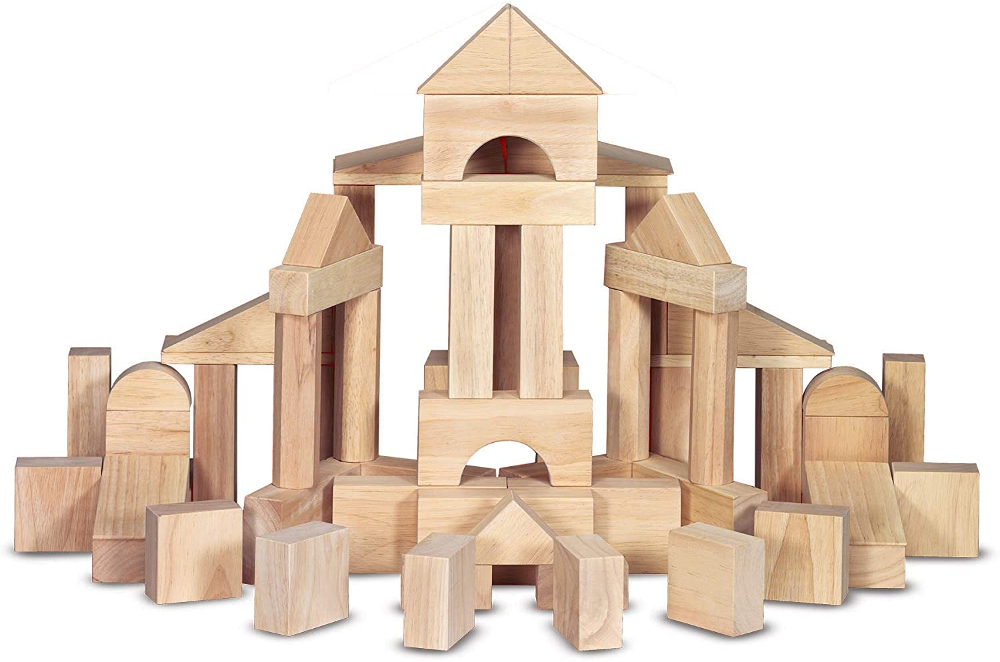
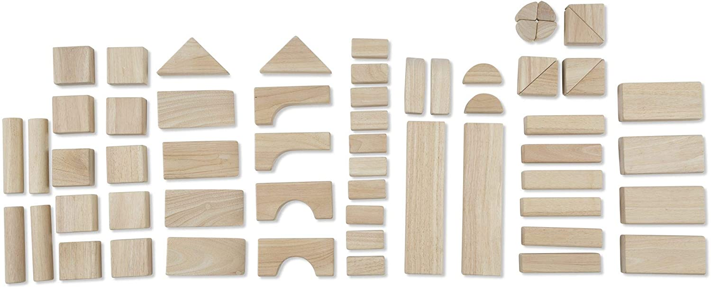

# The Building Blocks of R: data types, data structures, functions, and packages

In this chapter, we will learn about some critical building blocks in R
that can lead to a lot of frustration if you do not understand these
building blocks and how they are used. Once you understand how these
building blocks work, you will be able to avoid these frustrations and
build some pretty amazing data analysis pipelines.



## Data Types

There are actually six data types in R, though we usually use only use 4
of these for data analysis.

-   **logical** (TRUE or FALSE)

-   **integer** (1L, 2L) - these take up less memory than a double. You
    specify a number as an integer (rather than a double) by adding a
    capital L after the number.

-   **double** (aka real or decimal - 2.4, 4.7, pi). Double means that
    the value is stored in 64 bits (aka double precision)

    -   note that both integers and doubles have the class of *numeric*

-   **character** ("myeloma" or "michigan")

-   [complex]{.ul} ( 1+3i, 4-7i) - used under the hood for calculations

-   [raw]{.ul} (hexadecimal codes like B3 or FF) - used to communicate
    with devices like printers

Note that there is not a true data type for categorical variables, like
gender, or race, or ethnicity. These are encoded as **factors**, which
behave mostly like a data type, but are technically a data class. For
the purposes of dataframes, factors can be thought of as the 5th data
type, but the result of *typeof() on* a factor variable will be
"integer", as that is how factors are stored, with text attributes for
the level names.

Note also that there is not a true data type for dates, or date:times,
as these are stored as doubles in R. Their `typeof()` will be double,
but their `class()` will be date or dttm. Storing these as doubles does
make it easier to do math to calculate intervals of time.

Note that you can test the type of an object in R with the *typeof()*
function, which will return the data type.

You can also test for a specific data type - is this the right kind of
input, with the is.x functions, like *is.character()*, *is.logical()*,
or *is.numeric().* These will return the logical values TRUE or FALSE.
This can be important, as many functions will report (or "throw") an
error when they receive the wrong kind of input data.

When needed, you can also convert between data types, by manually
**coercing** an object to a different data type with the as.x functions,
like *as.character()*, *as.logical()*, *as.integer()*, or *as.numeric()
[as.double() \~\~ as.numeric()]*.

Here are 4 examples of testing vectors with the *typeof()* function.
Guess what the returned value will be before you run the code (click on
the green arrow at the top right).


``` r
# you can test vectors with typeof

typeof(c(1.7, 5.3, 9.2))
```

```
[1] "double"
```

``` r
typeof(c("hypertension", "diabetes", "atherosclerosis"))
```

```
[1] "character"
```

``` r
typeof(c(2L, 4L))
```

```
[1] "integer"
```

``` r
typeof(c(TRUE, FALSE, TRUE))
```

```
[1] "logical"
```

``` r
table(InsectSprays$spray)
```

```

 A  B  C  D  E  F 
12 12 12 12 12 12 
```

``` r
typeof(InsectSprays$spray)
```

```
[1] "integer"
```

Here are 3 examples of coverting vectors from one type to another with
*as.x()* functions. Guess what the returned value will be before you run
the code (click on the green arrow at the top right).


``` r
# you can convert vectors with as.x

numeric <- (c(1.7, 5.3, 9.2))
newvec1 <- as.character(numeric)
newvec1
```

```
[1] "1.7" "5.3" "9.2"
```

``` r
typeof(newvec1)
```

```
[1] "character"
```

``` r
logical <- c(TRUE, FALSE, TRUE)
newvec2 <- as.integer(logical)
newvec2
```

```
[1] 1 0 1
```

``` r
typeof(newvec2)
```

```
[1] "integer"
```

``` r
character <- c("2.4", "5.3", "7.2")
newvec3 <- as.numeric(character)
newvec3
```

```
[1] 2.4 5.3 7.2
```

``` r
typeof(newvec3)
```

```
[1] "double"
```

## Data Structures


Data structures are the **nouns** of programming in R. The data items of
different types are organized into data structures. R has many data
structures, and these include

-   **vector** - the most common and basic data structure in R. Most
    functions in R operate on vectors. These *vectorized* functions act
    on every item in the vector, without you having to write a loop.
    Every item in a vector **must** be of the same data type. If the
    items added to a vector are of different data types, they will be
    silently and automatically **coerced** to a common data type.
    Sometimes this is helpful, but sometimes it can surprise you.

    \<Demo\> constructing vectors with concatenate, recycling of values,
    seq and seqalong, length (vs nchar). Use letters and LETTERS - two
    built in vectors in base R.

    ::: {.warning}
    Automatic coercion can be a common source of problems, especially
    for beginners. R tries to "helpfully" convert vectors from more
    specific types to more general types automatically and silently when
    you have mixed data types in a vector/variable column. Imagine you
    have a numeric vector of potassium values, like\
    k \<- c(4.2, 3.9, 4.5, 4.3, 4.1)\
    This is fine. k is a numeric class vector, with *typeof(k)* =
    double.\
    But if the next value from the lab comes back as "sample lysed",\
    k \<- c(4.2, 3.9, 4.5, 4.3, 4.1. "sample lysed"),\
    R will automatically and silently convert this vector to a more
    general class and type ("character")\
    The ordering of coercion (from more specific to more general) is:\
    logical -\> integer -\> numeric -\> character -\> list\
    Watch out for:\
    data of the wrong type in your variable vectors, and\
    silent changing of your data type - check your variable data types
    with *glimpse()* before you dive into data analysis.
    :::

-   **factors** - factors are special vectors used for categorical data.
    These factors can be ordinal or nominal (unordered), and are
    important in lots of clinical data, and for modeling or plotting
    different categories. Factors are essentially integers with special
    labels (levels) attached. Factors can ***look like*** character
    vectors, but are actually stored as integers, which sometimes leads
    to unfortunate surprises.

-   **matrix** - a matrix is a special case of a vector in R. A matrix
    must also have only a single data type, and has 2 dimensions. The
    matrix is filled with values by column as the default, and recycles
    values if needed. Matrices are often used for gene expression arrays
    and Omics applications to store lots of numeric results. Matrices
    are also often used "under the hood" for complex calculations, in
    the linear algebra used to fit many models.

    \<Demo matrix letters, nrow=2 vs nrow =6, dim(), matrix(letters,
    nrow=13), matrix(letters, nrow=2)

-   **list** - a list is an all-purpose container for a variety of data
    types and vectors of any length. Lists are often heterogeneous in
    both data types and **the length** of vectors. Lists can even
    contain other lists. Lists are helpful when you have a related group
    of heterogeneous objects as results - vectors, dataframes, strings,
    etc., which can be bundled together in a list.

    One example of a list occurs in the `starwars` dataset, which has a
    row for each character. The column for which films they have
    appeared in is a `list` column. Each cell contains a character
    vectors of varying length, as each character has appeared in
    anywhere from 1 to 9 movies (as of 2021).

    
    ``` r
    starwars %>% select(name, films)
    ```
    
    ```
    # A tibble: 87 × 2
       name               films    
       <chr>              <list>   
     1 Luke Skywalker     <chr [5]>
     2 C-3PO              <chr [6]>
     3 R2-D2              <chr [7]>
     4 Darth Vader        <chr [4]>
     5 Leia Organa        <chr [5]>
     6 Owen Lars          <chr [3]>
     7 Beru Whitesun Lars <chr [3]>
     8 R5-D4              <chr [1]>
     9 Biggs Darklighter  <chr [1]>
    10 Obi-Wan Kenobi     <chr [6]>
    # ℹ 77 more rows
    ```
    
    ``` r
    starwars$films %>% head()
    ```
    
    ```
    [[1]]
    [1] "A New Hope"              "The Empire Strikes Back"
    [3] "Return of the Jedi"      "Revenge of the Sith"    
    [5] "The Force Awakens"      
    
    [[2]]
    [1] "A New Hope"              "The Empire Strikes Back"
    [3] "Return of the Jedi"      "The Phantom Menace"     
    [5] "Attack of the Clones"    "Revenge of the Sith"    
    
    [[3]]
    [1] "A New Hope"              "The Empire Strikes Back"
    [3] "Return of the Jedi"      "The Phantom Menace"     
    [5] "Attack of the Clones"    "Revenge of the Sith"    
    [7] "The Force Awakens"      
    
    [[4]]
    [1] "A New Hope"              "The Empire Strikes Back"
    [3] "Return of the Jedi"      "Revenge of the Sith"    
    
    [[5]]
    [1] "A New Hope"              "The Empire Strikes Back"
    [3] "Return of the Jedi"      "Revenge of the Sith"    
    [5] "The Force Awakens"      
    
    [[6]]
    [1] "A New Hope"           "Attack of the Clones"
    [3] "Revenge of the Sith" 
    ```

    Lists can be a bit clunky to work with, as they nest more than a
    single value into a single cell. Sometimes this nested format can be
    helpful, and sometimes it is preferable to *unnest()* the data into
    a longer format. \

    
    ``` r
    starwars %>% select(name, films)
    ```
    
    ```
    # A tibble: 87 × 2
       name               films    
       <chr>              <list>   
     1 Luke Skywalker     <chr [5]>
     2 C-3PO              <chr [6]>
     3 R2-D2              <chr [7]>
     4 Darth Vader        <chr [4]>
     5 Leia Organa        <chr [5]>
     6 Owen Lars          <chr [3]>
     7 Beru Whitesun Lars <chr [3]>
     8 R5-D4              <chr [1]>
     9 Biggs Darklighter  <chr [1]>
    10 Obi-Wan Kenobi     <chr [6]>
    # ℹ 77 more rows
    ```
    
    ``` r
    # gives you a hidden list of films
    starwars %>%
      select(name, films) %>%
      unnest(cols = c(films))
    ```
    
    ```
    # A tibble: 173 × 2
       name           films                  
       <chr>          <chr>                  
     1 Luke Skywalker A New Hope             
     2 Luke Skywalker The Empire Strikes Back
     3 Luke Skywalker Return of the Jedi     
     4 Luke Skywalker Revenge of the Sith    
     5 Luke Skywalker The Force Awakens      
     6 C-3PO          A New Hope             
     7 C-3PO          The Empire Strikes Back
     8 C-3PO          Return of the Jedi     
     9 C-3PO          The Phantom Menace     
    10 C-3PO          Attack of the Clones   
    # ℹ 163 more rows
    ```
    
    ``` r
    # unnest expands to multiple rows to show detail
    ```

    Lists can be useful for bundling togther related data of different
    types, like the results of a t-test.

    
    ``` r
    t_test_output <- list(
      "Welch Two Sample t-test",
      c("data: height by gender"),
      data.frame(t = -1.5596, df = 37.315, p = 0.1273)
    )
    t_test_output
    ```
    
    ```
    [[1]]
    [1] "Welch Two Sample t-test"
    
    [[2]]
    [1] "data: height by gender"
    
    [[3]]
            t     df      p
    1 -1.5596 37.315 0.1273
    ```

-   **data frame** - a very important data structure in R, which
    corresponds to rectangular data in a spreadsheet. A data frame is a
    table of vectors (columns of variables) of the **same length**. If
    new vectors are added with a different length, an error will occur.
    Unlike a matrix, each vector (aka column, aka variable) in a
    dataframe can be a different data type. So you can combine character
    strings, integers, real numbers, logical values, and factors in a
    rectangular data frame in which **each row is one observation**, and
    the variables/columns/vectors are the **values that are measured**
    at that observation. A data frame can be thought of as a strict
    version of a list, in which each item in the list is an atomic
    vector (single data type) and **must** have the same length. You can
    even have list columns within a data frame. Note that if you run the
    *typeof()* function on a dataframe, it will report that it is a
    list.\
    \
    You can build a dataframe from a set of vectors (variables) by
    binding these together as columns/variables with the `tibble()`
    function.

    
    ``` r
    pat_id <- c(1, 1, 2, 2, 3, 3)
    date <- c(lubridate::ymd("2020-11-07", "2020-12-03", "2020-12-02", "2020-12-15", "2020-11-09", "2020-12-02"))
    crp <- c(5.1, 3.2, 7.6, 4.1, 4.3, 1.7)
    new_df <- tibble(pat_id, date, crp)
    new_df
    ```
    
    ```
    # A tibble: 6 × 3
      pat_id date         crp
       <dbl> <date>     <dbl>
    1      1 2020-11-07   5.1
    2      1 2020-12-03   3.2
    3      2 2020-12-02   7.6
    4      2 2020-12-15   4.1
    5      3 2020-11-09   4.3
    6      3 2020-12-02   1.7
    ```

    -   **tibble** - a tibble is a modern upgrade to the data frame,
        with clear delineation of data types and printing that does not
        continuously spew out of your console. It also has the
        properties of a data frame underneath the additional features.
        You can convert a dataframe to a tibble with `tibble()`, or use
        tibble to build with vectors

    
    ``` r
    tibble(new_df)
    ```
    
    ```
    # A tibble: 6 × 3
      pat_id date         crp
       <dbl> <date>     <dbl>
    1      1 2020-11-07   5.1
    2      1 2020-12-03   3.2
    3      2 2020-12-02   7.6
    4      2 2020-12-15   4.1
    5      3 2020-11-09   4.3
    6      3 2020-12-02   1.7
    ```
    
    ``` r
    tibble(pat_id, date, crp)
    ```
    
    ```
    # A tibble: 6 × 3
      pat_id date         crp
       <dbl> <date>     <dbl>
    1      1 2020-11-07   5.1
    2      1 2020-12-03   3.2
    3      2 2020-12-02   7.6
    4      2 2020-12-15   4.1
    5      3 2020-11-09   4.3
    6      3 2020-12-02   1.7
    ```

    You can also build new row-wise tibbles with the `tribble()`
    function.

    
    ``` r
    tribble(
      ~pat_id, ~date, ~crp,
      1, lubridate::ymd("2020-12-04"), 5.1,
      1, lubridate::ymd("2020-12-09"), 3.7,
      2, lubridate::ymd("2020-11-23"), 3.6,
      2, lubridate::ymd("2020-11-29"), 1.9,
      3, lubridate::ymd("2020-12-14"), 1.9,
      3, lubridate::ymd("2020-12-27"), 0.6
    )
    ```
    
    ```
    # A tibble: 6 × 3
      pat_id date         crp
       <dbl> <date>     <dbl>
    1      1 2020-12-04   5.1
    2      1 2020-12-09   3.7
    3      2 2020-11-23   3.6
    4      2 2020-11-29   1.9
    5      3 2020-12-14   1.9
    6      3 2020-12-27   0.6
    ```

R uses many other custom objects to contain things like a linear model,
or the results of a t test. Many functions and packages build specific
custom objects which are built upon these basic data structures.

Similar to data types, functions in R are often designed to work on a
specific data structure, and using the wrong data structure as input to
a function will result in errors. It is important to be able to check
your data structures as part of your initial DEV (Data Evaluation and
Validation) process in order to avoid problems and prevent errors.

## Examining Data Types and Data Structures

There are a number of helpful base R functions to help you examine what
the objects in your Environment actually are. This is an important step
in avoiding errors, or in avoiding needing to diagnose them after the
fact.

assigning an object (not =)

When you create a new object (dataframe, tibble, vector), it is
transient. As soon as it prints to the Console, it is gone. If you want
to refer back to it, or process it further later, you need to assign it
to an object in your environment. When you do this, it will appear in
your Environment pane in RStudio.

To do this, you use an arrow from your code to the name of the new
object. It is helpful to use concise names that are descriptive, in
lower case with minimal punctuation (underscores and dashes are fine),
no spaces, and that start with letters rather than numbers. It is
important to avoid using R function names (like **data** or **df** or
**sum**) as names for your objects. You can use either leftward arrows
(Less than then dash key) `<-` or rightward arrows `->` (dash key then
greater than key) to assign data to an object.


``` r
# example 1
tall <- starwars %>%
  filter(height > 200)

# example 2
starwars %>%
  filter(height < 70) ->
short
```

Leftward arrows are thought of as sort of like the title of a recipe. In
the first example above, you can read this as, "I am going to make a
tibble of tall characters. I will start with the **starwars** dataset,
then filter by height \>100 to get this tall tibble".

But most people don't think or talk this way, and it is recommended to
write "literate code" - which can be read naturally by humans **and** by
computers. These data pipelines should read like sentences. Generally,
we use the literate programming format in example 2 above for data
wrangling, starting with a **subject** (starwars dataset), then one or
more (automatically indented) **verbs** (functions) that wrangle the
data, then end with the predicate (a new **noun** - the new resulting
dataset). To do this requires the rightward arrow. To avoid hiding the
resulting dataset in a thicket of code, remove the automatic indent and
put this new object on the left margin.

Once you have an object, you can use several functions to examine what
you have, and to make sure that it is in the right format for future
data wrangling or plotting functions.

The `str()` function, denoting structure, is a good place to start
interrogating data structures.

Try this out. Run `str(starwars)` in your RStudio console.


``` r
str(starwars)
```

```
tibble [87 × 14] (S3: tbl_df/tbl/data.frame)
 $ name      : chr [1:87] "Luke Skywalker" "C-3PO" "R2-D2" "Darth Vader" ...
 $ height    : int [1:87] 172 167 96 202 150 178 165 97 183 182 ...
 $ mass      : num [1:87] 77 75 32 136 49 120 75 32 84 77 ...
 $ hair_color: chr [1:87] "blond" NA NA "none" ...
 $ skin_color: chr [1:87] "fair" "gold" "white, blue" "white" ...
 $ eye_color : chr [1:87] "blue" "yellow" "red" "yellow" ...
 $ birth_year: num [1:87] 19 112 33 41.9 19 52 47 NA 24 57 ...
 $ sex       : chr [1:87] "male" "none" "none" "male" ...
 $ gender    : chr [1:87] "masculine" "masculine" "masculine" "masculine" ...
 $ homeworld : chr [1:87] "Tatooine" "Tatooine" "Naboo" "Tatooine" ...
 $ species   : chr [1:87] "Human" "Droid" "Droid" "Human" ...
 $ films     :List of 87
  ..$ : chr [1:5] "A New Hope" "The Empire Strikes Back" "Return of the Jedi" "Revenge of the Sith" ...
  ..$ : chr [1:6] "A New Hope" "The Empire Strikes Back" "Return of the Jedi" "The Phantom Menace" ...
  ..$ : chr [1:7] "A New Hope" "The Empire Strikes Back" "Return of the Jedi" "The Phantom Menace" ...
  ..$ : chr [1:4] "A New Hope" "The Empire Strikes Back" "Return of the Jedi" "Revenge of the Sith"
  ..$ : chr [1:5] "A New Hope" "The Empire Strikes Back" "Return of the Jedi" "Revenge of the Sith" ...
  ..$ : chr [1:3] "A New Hope" "Attack of the Clones" "Revenge of the Sith"
  ..$ : chr [1:3] "A New Hope" "Attack of the Clones" "Revenge of the Sith"
  ..$ : chr "A New Hope"
  ..$ : chr "A New Hope"
  ..$ : chr [1:6] "A New Hope" "The Empire Strikes Back" "Return of the Jedi" "The Phantom Menace" ...
  ..$ : chr [1:3] "The Phantom Menace" "Attack of the Clones" "Revenge of the Sith"
  ..$ : chr [1:2] "A New Hope" "Revenge of the Sith"
  ..$ : chr [1:5] "A New Hope" "The Empire Strikes Back" "Return of the Jedi" "Revenge of the Sith" ...
  ..$ : chr [1:4] "A New Hope" "The Empire Strikes Back" "Return of the Jedi" "The Force Awakens"
  ..$ : chr "A New Hope"
  ..$ : chr [1:3] "A New Hope" "Return of the Jedi" "The Phantom Menace"
  ..$ : chr [1:3] "A New Hope" "The Empire Strikes Back" "Return of the Jedi"
  ..$ : chr "A New Hope"
  ..$ : chr [1:5] "The Empire Strikes Back" "Return of the Jedi" "The Phantom Menace" "Attack of the Clones" ...
  ..$ : chr [1:5] "The Empire Strikes Back" "Return of the Jedi" "The Phantom Menace" "Attack of the Clones" ...
  ..$ : chr [1:3] "The Empire Strikes Back" "Return of the Jedi" "Attack of the Clones"
  ..$ : chr "The Empire Strikes Back"
  ..$ : chr "The Empire Strikes Back"
  ..$ : chr [1:2] "The Empire Strikes Back" "Return of the Jedi"
  ..$ : chr "The Empire Strikes Back"
  ..$ : chr [1:2] "Return of the Jedi" "The Force Awakens"
  ..$ : chr "Return of the Jedi"
  ..$ : chr "Return of the Jedi"
  ..$ : chr "Return of the Jedi"
  ..$ : chr "Return of the Jedi"
  ..$ : chr "The Phantom Menace"
  ..$ : chr [1:3] "The Phantom Menace" "Attack of the Clones" "Revenge of the Sith"
  ..$ : chr "The Phantom Menace"
  ..$ : chr [1:3] "The Phantom Menace" "Attack of the Clones" "Revenge of the Sith"
  ..$ : chr [1:2] "The Phantom Menace" "Attack of the Clones"
  ..$ : chr "The Phantom Menace"
  ..$ : chr "The Phantom Menace"
  ..$ : chr "The Phantom Menace"
  ..$ : chr [1:2] "The Phantom Menace" "Attack of the Clones"
  ..$ : chr "The Phantom Menace"
  ..$ : chr "The Phantom Menace"
  ..$ : chr [1:2] "The Phantom Menace" "Attack of the Clones"
  ..$ : chr "The Phantom Menace"
  ..$ : chr "Return of the Jedi"
  ..$ : chr [1:3] "The Phantom Menace" "Attack of the Clones" "Revenge of the Sith"
  ..$ : chr "The Phantom Menace"
  ..$ : chr "The Phantom Menace"
  ..$ : chr "The Phantom Menace"
  ..$ : chr "The Phantom Menace"
  ..$ : chr [1:3] "The Phantom Menace" "Attack of the Clones" "Revenge of the Sith"
  ..$ : chr [1:3] "The Phantom Menace" "Attack of the Clones" "Revenge of the Sith"
  ..$ : chr [1:3] "The Phantom Menace" "Attack of the Clones" "Revenge of the Sith"
  ..$ : chr [1:2] "The Phantom Menace" "Revenge of the Sith"
  ..$ : chr [1:2] "The Phantom Menace" "Revenge of the Sith"
  ..$ : chr [1:2] "The Phantom Menace" "Revenge of the Sith"
  ..$ : chr "The Phantom Menace"
  ..$ : chr [1:3] "The Phantom Menace" "Attack of the Clones" "Revenge of the Sith"
  ..$ : chr [1:2] "The Phantom Menace" "Attack of the Clones"
  ..$ : chr "Attack of the Clones"
  ..$ : chr "Attack of the Clones"
  ..$ : chr "Attack of the Clones"
  ..$ : chr [1:2] "Attack of the Clones" "Revenge of the Sith"
  ..$ : chr [1:2] "Attack of the Clones" "Revenge of the Sith"
  ..$ : chr "Attack of the Clones"
  ..$ : chr "Attack of the Clones"
  ..$ : chr [1:2] "Attack of the Clones" "Revenge of the Sith"
  ..$ : chr [1:2] "Attack of the Clones" "Revenge of the Sith"
  ..$ : chr "Attack of the Clones"
  ..$ : chr "Attack of the Clones"
  ..$ : chr "Attack of the Clones"
  ..$ : chr "Attack of the Clones"
  ..$ : chr "Attack of the Clones"
  ..$ : chr "Attack of the Clones"
  ..$ : chr [1:2] "Attack of the Clones" "Revenge of the Sith"
  ..$ : chr "Attack of the Clones"
  ..$ : chr "Attack of the Clones"
  ..$ : chr [1:2] "Attack of the Clones" "Revenge of the Sith"
  ..$ : chr "Revenge of the Sith"
  ..$ : chr "Revenge of the Sith"
  ..$ : chr [1:2] "A New Hope" "Revenge of the Sith"
  ..$ : chr [1:2] "Attack of the Clones" "Revenge of the Sith"
  ..$ : chr "Revenge of the Sith"
  ..$ : chr "The Force Awakens"
  ..$ : chr "The Force Awakens"
  ..$ : chr "The Force Awakens"
  ..$ : chr "The Force Awakens"
  ..$ : chr "The Force Awakens"
 $ vehicles  :List of 87
  ..$ : chr [1:2] "Snowspeeder" "Imperial Speeder Bike"
  ..$ : chr(0) 
  ..$ : chr(0) 
  ..$ : chr(0) 
  ..$ : chr "Imperial Speeder Bike"
  ..$ : chr(0) 
  ..$ : chr(0) 
  ..$ : chr(0) 
  ..$ : chr(0) 
  ..$ : chr "Tribubble bongo"
  ..$ : chr [1:2] "Zephyr-G swoop bike" "XJ-6 airspeeder"
  ..$ : chr(0) 
  ..$ : chr "AT-ST"
  ..$ : chr(0) 
  ..$ : chr(0) 
  ..$ : chr(0) 
  ..$ : chr "Snowspeeder"
  ..$ : chr(0) 
  ..$ : chr(0) 
  ..$ : chr(0) 
  ..$ : chr(0) 
  ..$ : chr(0) 
  ..$ : chr(0) 
  ..$ : chr(0) 
  ..$ : chr(0) 
  ..$ : chr(0) 
  ..$ : chr(0) 
  ..$ : chr(0) 
  ..$ : chr(0) 
  ..$ : chr(0) 
  ..$ : chr "Tribubble bongo"
  ..$ : chr(0) 
  ..$ : chr(0) 
  ..$ : chr(0) 
  ..$ : chr(0) 
  ..$ : chr(0) 
  ..$ : chr(0) 
  ..$ : chr(0) 
  ..$ : chr(0) 
  ..$ : chr(0) 
  ..$ : chr(0) 
  ..$ : chr(0) 
  ..$ : chr "Sith speeder"
  ..$ : chr(0) 
  ..$ : chr(0) 
  ..$ : chr(0) 
  ..$ : chr(0) 
  ..$ : chr(0) 
  ..$ : chr(0) 
  ..$ : chr(0) 
  ..$ : chr(0) 
  ..$ : chr(0) 
  ..$ : chr(0) 
  ..$ : chr(0) 
  ..$ : chr(0) 
  ..$ : chr(0) 
  ..$ : chr(0) 
  ..$ : chr(0) 
  ..$ : chr(0) 
  ..$ : chr(0) 
  ..$ : chr(0) 
  ..$ : chr(0) 
  ..$ : chr(0) 
  ..$ : chr(0) 
  ..$ : chr(0) 
  ..$ : chr "Flitknot speeder"
  ..$ : chr(0) 
  ..$ : chr(0) 
  ..$ : chr "Koro-2 Exodrive airspeeder"
  ..$ : chr(0) 
  ..$ : chr(0) 
  ..$ : chr(0) 
  ..$ : chr(0) 
  ..$ : chr(0) 
  ..$ : chr(0) 
  ..$ : chr(0) 
  ..$ : chr(0) 
  ..$ : chr "Tsmeu-6 personal wheel bike"
  ..$ : chr(0) 
  ..$ : chr(0) 
  ..$ : chr(0) 
  ..$ : chr(0) 
  ..$ : chr(0) 
  ..$ : chr(0) 
  ..$ : chr(0) 
  ..$ : chr(0) 
  ..$ : chr(0) 
 $ starships :List of 87
  ..$ : chr [1:2] "X-wing" "Imperial shuttle"
  ..$ : chr(0) 
  ..$ : chr(0) 
  ..$ : chr "TIE Advanced x1"
  ..$ : chr(0) 
  ..$ : chr(0) 
  ..$ : chr(0) 
  ..$ : chr(0) 
  ..$ : chr "X-wing"
  ..$ : chr [1:5] "Jedi starfighter" "Trade Federation cruiser" "Naboo star skiff" "Jedi Interceptor" ...
  ..$ : chr [1:3] "Naboo fighter" "Trade Federation cruiser" "Jedi Interceptor"
  ..$ : chr(0) 
  ..$ : chr [1:2] "Millennium Falcon" "Imperial shuttle"
  ..$ : chr [1:2] "Millennium Falcon" "Imperial shuttle"
  ..$ : chr(0) 
  ..$ : chr(0) 
  ..$ : chr "X-wing"
  ..$ : chr "X-wing"
  ..$ : chr(0) 
  ..$ : chr(0) 
  ..$ : chr "Slave 1"
  ..$ : chr(0) 
  ..$ : chr(0) 
  ..$ : chr "Millennium Falcon"
  ..$ : chr(0) 
  ..$ : chr(0) 
  ..$ : chr(0) 
  ..$ : chr "A-wing"
  ..$ : chr(0) 
  ..$ : chr "Millennium Falcon"
  ..$ : chr(0) 
  ..$ : chr(0) 
  ..$ : chr(0) 
  ..$ : chr [1:3] "Naboo fighter" "H-type Nubian yacht" "Naboo star skiff"
  ..$ : chr(0) 
  ..$ : chr(0) 
  ..$ : chr(0) 
  ..$ : chr "Naboo Royal Starship"
  ..$ : chr(0) 
  ..$ : chr(0) 
  ..$ : chr(0) 
  ..$ : chr(0) 
  ..$ : chr "Scimitar"
  ..$ : chr(0) 
  ..$ : chr(0) 
  ..$ : chr(0) 
  ..$ : chr(0) 
  ..$ : chr(0) 
  ..$ : chr(0) 
  ..$ : chr(0) 
  ..$ : chr(0) 
  ..$ : chr(0) 
  ..$ : chr(0) 
  ..$ : chr(0) 
  ..$ : chr(0) 
  ..$ : chr(0) 
  ..$ : chr "Jedi starfighter"
  ..$ : chr(0) 
  ..$ : chr "Naboo fighter"
  ..$ : chr(0) 
  ..$ : chr(0) 
  ..$ : chr(0) 
  ..$ : chr(0) 
  ..$ : chr(0) 
  ..$ : chr(0) 
  ..$ : chr(0) 
  ..$ : chr(0) 
  ..$ : chr(0) 
  ..$ : chr(0) 
  ..$ : chr(0) 
  ..$ : chr(0) 
  ..$ : chr(0) 
  ..$ : chr(0) 
  ..$ : chr(0) 
  ..$ : chr(0) 
  ..$ : chr(0) 
  ..$ : chr(0) 
  ..$ : chr "Belbullab-22 starfighter"
  ..$ : chr(0) 
  ..$ : chr(0) 
  ..$ : chr(0) 
  ..$ : chr(0) 
  ..$ : chr(0) 
  ..$ : chr(0) 
  ..$ : chr "X-wing"
  ..$ : chr(0) 
  ..$ : chr(0) 
```

You can see from the output that this is a tibble, with 87 rows and 14
columns. It also meets the definitions of a table and a dataframe. Then
the output shows each variable. The first 11 are either character or
integer types. The last 3 (films, vehicles, starships) are all
list-columns, and are more complicated.

Note that `glimpse(starwars)` provides a prettier version of this output


``` r
glimpse(starwars)
```

```
Rows: 87
Columns: 14
$ name       <chr> "Luke Skywalker", "C-3PO", "R2-D2", "Da…
$ height     <int> 172, 167, 96, 202, 150, 178, 165, 97, 1…
$ mass       <dbl> 77, 75, 32, 136, 49, 120, 75, 32, 84, 7…
$ hair_color <chr> "blond", NA, NA, "none", "brown", "brow…
$ skin_color <chr> "fair", "gold", "white, blue", "white",…
$ eye_color  <chr> "blue", "yellow", "red", "yellow", "bro…
$ birth_year <dbl> 19.0, 112.0, 33.0, 41.9, 19.0, 52.0, 47…
$ sex        <chr> "male", "none", "none", "male", "female…
$ gender     <chr> "masculine", "masculine", "masculine", …
$ homeworld  <chr> "Tatooine", "Tatooine", "Naboo", "Tatoo…
$ species    <chr> "Human", "Droid", "Droid", "Human", "Hu…
$ films      <list> <"A New Hope", "The Empire Strikes Bac…
$ vehicles   <list> <"Snowspeeder", "Imperial Speeder Bike…
$ starships  <list> <"X-wing", "Imperial shuttle">, <>, <>…
```

If you want more detail about a given variable inside this dataframe,
you can use `typeof()` or `class()`.


``` r
typeof(starwars$mass)
```

```
[1] "double"
```

``` r
class(starwars$mass)
```

```
[1] "numeric"
```

For character variables, `typeof()` is the same as `class()`. But these
are different for doubles and factors.

Sometimes you want a quick look at all the variable names of a dataset.
The functions `names()` or `colnames()` can quickly get you a vector of
these names.


``` r
names(starwars)
```

```
 [1] "name"       "height"     "mass"       "hair_color"
 [5] "skin_color" "eye_color"  "birth_year" "sex"       
 [9] "gender"     "homeworld"  "species"    "films"     
[13] "vehicles"   "starships" 
```

``` r
colnames(starwars)
```

```
 [1] "name"       "height"     "mass"       "hair_color"
 [5] "skin_color" "eye_color"  "birth_year" "sex"       
 [9] "gender"     "homeworld"  "species"    "films"     
[13] "vehicles"   "starships" 
```

If you want the dimensions of your dataset, you can use `dim()`. To just
get the number of rows or columns, you can use `nrow()` or `ncol()`.

When you have a numeric matrix, sometimes you have a 'bonus" column of
`rownames`, which is a special column that specifies the observation,
but does not have a normal column name. This keeps character strings out
of the matrix, which can only have one data type. This is kind of a
pain, especially if you need to access the information in the rownames
column. When this is the case, the dplyr function
`rownames_to_column(matrix_name)` is very helpful. The default name is
`rowname`, but you can supply a better one. Run the example below in
your Console pane.


``` r
rownames_to_column(mtcars, var = "make_model")
```

```
            make_model  mpg cyl  disp  hp drat    wt  qsec
1            Mazda RX4 21.0   6 160.0 110 3.90 2.620 16.46
2        Mazda RX4 Wag 21.0   6 160.0 110 3.90 2.875 17.02
3           Datsun 710 22.8   4 108.0  93 3.85 2.320 18.61
4       Hornet 4 Drive 21.4   6 258.0 110 3.08 3.215 19.44
5    Hornet Sportabout 18.7   8 360.0 175 3.15 3.440 17.02
6              Valiant 18.1   6 225.0 105 2.76 3.460 20.22
7           Duster 360 14.3   8 360.0 245 3.21 3.570 15.84
8            Merc 240D 24.4   4 146.7  62 3.69 3.190 20.00
9             Merc 230 22.8   4 140.8  95 3.92 3.150 22.90
10            Merc 280 19.2   6 167.6 123 3.92 3.440 18.30
11           Merc 280C 17.8   6 167.6 123 3.92 3.440 18.90
12          Merc 450SE 16.4   8 275.8 180 3.07 4.070 17.40
13          Merc 450SL 17.3   8 275.8 180 3.07 3.730 17.60
14         Merc 450SLC 15.2   8 275.8 180 3.07 3.780 18.00
15  Cadillac Fleetwood 10.4   8 472.0 205 2.93 5.250 17.98
16 Lincoln Continental 10.4   8 460.0 215 3.00 5.424 17.82
17   Chrysler Imperial 14.7   8 440.0 230 3.23 5.345 17.42
18            Fiat 128 32.4   4  78.7  66 4.08 2.200 19.47
19         Honda Civic 30.4   4  75.7  52 4.93 1.615 18.52
20      Toyota Corolla 33.9   4  71.1  65 4.22 1.835 19.90
21       Toyota Corona 21.5   4 120.1  97 3.70 2.465 20.01
22    Dodge Challenger 15.5   8 318.0 150 2.76 3.520 16.87
23         AMC Javelin 15.2   8 304.0 150 3.15 3.435 17.30
24          Camaro Z28 13.3   8 350.0 245 3.73 3.840 15.41
25    Pontiac Firebird 19.2   8 400.0 175 3.08 3.845 17.05
26           Fiat X1-9 27.3   4  79.0  66 4.08 1.935 18.90
27       Porsche 914-2 26.0   4 120.3  91 4.43 2.140 16.70
28        Lotus Europa 30.4   4  95.1 113 3.77 1.513 16.90
29      Ford Pantera L 15.8   8 351.0 264 4.22 3.170 14.50
30        Ferrari Dino 19.7   6 145.0 175 3.62 2.770 15.50
31       Maserati Bora 15.0   8 301.0 335 3.54 3.570 14.60
32          Volvo 142E 21.4   4 121.0 109 4.11 2.780 18.60
   vs am gear carb
1   0  1    4    4
2   0  1    4    4
3   1  1    4    1
4   1  0    3    1
5   0  0    3    2
6   1  0    3    1
7   0  0    3    4
8   1  0    4    2
9   1  0    4    2
10  1  0    4    4
11  1  0    4    4
12  0  0    3    3
13  0  0    3    3
14  0  0    3    3
15  0  0    3    4
16  0  0    3    4
17  0  0    3    4
18  1  1    4    1
19  1  1    4    2
20  1  1    4    1
21  1  0    3    1
22  0  0    3    2
23  0  0    3    2
24  0  0    3    4
25  0  0    3    2
26  1  1    4    1
27  0  1    5    2
28  1  1    5    2
29  0  1    5    4
30  0  1    5    6
31  0  1    5    8
32  1  1    4    2
```

## Functions

Functions are the **verbs** of programming in R. Functions act on
existing data objects to rearrange them, change them, analyze them, plot
them, or report them. Functions in R can do almost anything, and can
work together in pipelines (aka chains) to do more complex and
interesting things. Functions can call (activate) other functions, and
you can build your own custom functions, which comes in handy when you
want to do something similar multiple times, like summarizing data on 5
different variables.

You could run a custom summary function on each variable (the
**argument** to the function) each time, or use a programming function
like **map** to run the function over a vector or list of the variables
needed.

::: {.tryit}
You can see the inner workings of a function by just entering it into
the RStudio console without parentheses. For example, for sd (standard
deviation).


``` r
sd
```

```
function (x, na.rm = FALSE) 
sqrt(var(if (is.vector(x) || is.factor(x)) x else as.double(x), 
    na.rm = na.rm))
<bytecode: 0x140afd0b0>
<environment: namespace:stats>
```
:::

You can see the inner workings of the sd function. This function takes
the variance, then the square root of a vector, which is correct for
producing a standard deviation. To run any function, you need to supply
the parentheses, which normally contain the arguments (options) and
identify the input data. Note that in a data pipe, the first argument is
the incoming data, and does not need to be explicitly named in tidyverse
functions. In older, non-tidyverse functions, data is often not the
first argument, and needs to be named explicitly in a data pipeline,
with the argument `data = .` telling the function to use the incoming
data from the pipeline.

To actually **run** any function, you need to include the parentheses at
the end, even if you do not include any arguments. Two examples to try
on your own are:

-   `Sys.Date()`

```{=html}
<!-- -->
```
-   `installed.packages()`

Give these a try in your Console pane.

## Packages

Packages make functions transportable and shareable. You can bundle a
group of related functions into a package, and put it on Github, or even
on CRAN, where other people can download it and use these functions for
themselves. This can be helpful for miscellaneous functions that
co-workers often use, or for a group of functions that work well
together in a particular workflow.

Packages can also contain data, which can be used for teaching examples,
or as a way to share data. Packages can also contain tutorials related
to the functions or the data in the package.

Packages are like apps that you add to a phone to give it new functions.
Packages enhance what you can do with R. When you start an R session in
RStudio, your base R installation comes with 9 packages. You can see
these listed by Clicking on Session/Restart R, then running
*print(.packages())* or *search()* in the Console pane. These packages
include stats, graphics, grDevices, utils, datasets, devtools, usethis,
methods, and base. You will also see the Global Environment and rstudio
tools, and any autoloaded packages in this list. These are listed by
their order on the ***search path***.

When you run (aka call) a function, R will search this path in order,
starting with the Global Environment, then sequentially in the packages
loaded, in order, for the function. This means that a function in a
package loaded last (at the beginning of the search path) will **mask**
a function with the same name in a package loaded earlier (like base,
which is at the end of the search path). When you run the *library()*
function to load a package, R will warn you about conflicts if you load
a package with a function with the same name as a function in an
already-loaded package.

You can install more packages with the *.install.packages()* function,
and see a pretty printed version of a list of all the installed packages
with the *library()* function (with no arguments in the parentheses).
You can get a matrix version (less pretty, but more
accessible/manipulable) with the *.installed.packages()* function in the
Console pane. You only have to install a package into your current
library once. But to use a package in a current R session, you have to
load it with the *library(packagename)* function.

::: {.tryit}
Let's try this out on your own computer, within RStudio.

First, within RStudio, go to the top menu bar and select Session/Restart
R (Shift-Cmd-F10) to restart R and get a fresh, clean session.

Then go to the Console pane and run the `search()` function. [Type in
search() and press Return]

You will see the search path, and all the currently loaded packages, in
order.

You can get a vector of just the loaded packages by going to the Console
pane and running `print(.packages())`

Now load the tidyverse package by running the following in the Console
pane:\
`library(tidyverse)`

Note that there are 8 packages installed in addition to the {tidyverse}
package (tidyverse is a meta-package, composed of multiple packages).\
Also note that there are two Conflicts reported. Two functions in the
{dplyr} package, `filter()` and `lag()` have the same names as functions
in the {stat} package.

This means that when you run `filter()` or `lag()`, the default will be
to run the {dplyr} versions, as these were installed last. These are
earlier in the search path, and will mask the {stats} versions.

You can still use the stats versions if you want to, by using the
package prefix, with the format `stats::filter()` to make clear that you
want this version, rather than dplyr::filter().

Now check what your search path looks like with `search()`*.* The nine
packages from tidyverse (including tidyverse itself) should now be right
after `.GlobalEnv` at the front of the search path, as they were
installed last.

If you now run `print(.packages())` in the Console pane, you should now
have 18 packages loaded.
:::

\<Demo - run library(tidyverse) - see the Conflicts warning about filter
and lag.\>\<run search() again to see that tidyverse is a meta-package -
with multiple new packages loaded in the search path).

Packages are stored in libraries. You have a global library, and you can
have project-specific libraries. You can see the file paths to your
available libraries with the function *.libPaths()*. This will print (to
the Console) the path to your package library for your specific major
version of R.


``` r
# You can check your own library path
# Run this function in your Rstudio Console to find the current library on your computer
.libPaths()
```

```
[1] "/Library/Frameworks/R.framework/Versions/4.4-arm64/Resources/library"
```

## The Building Blocks of R

Now you know about the 4 key building blocks of R, and how they work.



Being able to check data types with *typeof()* and data structures with
*str()* will help you avoid running functions on data that is not in the
right format for a particular function. Dataframes and tibbles will be
the key data structures which you will frequently manipulate with
functions to wrangle, analyze, visualize, and report your medical
research.
