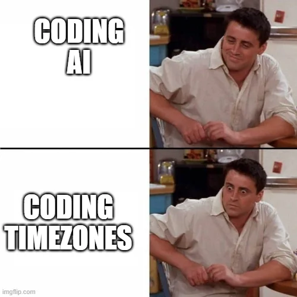
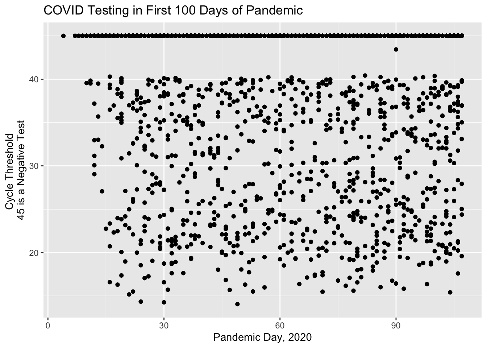

# Dates and Times in R

The horrors of dates and times (especially times and time zones) is a
bane of computing. Dates have changed by government fiat (Gregorian to
Julian, etc.) several times in history, and time zones and daylight
savings time practices change more frequently.  To add to the complications, there are many,
many date formats around the world, with different countries and
cultures mixing and matching days, months, and years willy-nilly to
indicate a particular date. For this reason, there is an international
standard, [ISO
8601](https://en.wikipedia.org/wiki/ISO_8601 "link to ISO8601 wikipedia page"),
for dates and times. The standard calls for listing all dates in
YYYY-MM-DD format, with numbers for the 4 digit year, 2 digit month, and
2 digit day, as in 2021-04-17 for April 17, 2021. All numbers are
zero-padded (necessary zeroes added to the left) to maintain 4 or two
digits as needed. **Use this format** whenever you can, for consistency
and to avoid errors that will be painful later. **Insist** that all of
your collaborators use ISO8601 format, and your life will be vastly
improved.

Time in ISO8601 uses a 24 hour clock, and is formatted in two ways:
the *basic format* is T[hh][mm][ss] and the *extended format* is
T[hh]:[mm]:[ss]. Each number in a time is two digits, and is zero-padded
when needed, so that one second after midnight is T00:00:01.

When possible, use only dates in your data analysis. Times are complex
and surprisingly painful, due to unusual cases that frequently cause
trouble. These include:

-   GMT (the time zone for Greenwich mean time) is close to, but not the
    same as UTC. Coordinated Universal Time (UTC) has no daylight
    savings, while GMT does.

-   There are leap years, and leap seconds, to keep track of.

-   January 30 + 1 month = NA, because there is no Feb 30.

-   There are more than 24 time zones, because of episodic local
    changes. For example, tz = "America/Detroit" is not quite the same
    as Eastern Standard Time, as Michigan had daylight savings from
    1916-1968, not from 1969-72, then returned to DST in 1973 and
    thereafter.

-   With all of the odd geopolitical time zone and DST variations, there
    are now more than 600 distinct valid time zones that R keeps track
    of, and you can print these with the base R function *OlsonNames()*.
    Arthur David Olson was the original maintainer of the time zone
    database, which is now managed by the Internet Assigned Numbers
    Authority (IANA), currently led by Paul Eggert at UCLA.

Unless you absolutely need time stamps to track intervals of less than a
day, I strongly urge you to convert all date-times to simple ISO8601
dates.



## Data Types for Dates and Times

Data for dates and times comes in several formats. - POSIXct - calendar
time (also called continuous time or count time, as it counts seconds) -
POSIXlt - local time (also called list time) - Date - date-time <dttm>

POSIX is probably unfamiliar to you - it stands for the Portable
Operating System Interface for uniX used to make standards for UNIX
across Operating systems.

POSIX Dates use the reference point of 1970-01-01 T 0:00:00 UTC
(midnight at the start of the year 1970 in coordinated universal time)
as zero seconds. All dates after that are counted in seconds in POSIXct.
Dates prior to 1970 are counted in negative seconds. POSIXct is very
memory-efficient for storing dates, but not very human-readable.

In the code chunk below, we will start with a ISO 8601 date, with a time
zone. We will then print it out, and then show it as it is stored, are
using the unclass function. Copy and run the code chunk to see the
results.


``` r
date1 <- as.POSIXct("2018-01-16 04:34:45", 
                    tz = "America/Detroit")
date1
```

```
## [1] "2018-01-16 04:34:45 EST"
```

``` r
unclass(date1)
```

```
## [1] 1516095285
## attr(,"tzone")
## [1] "America/Detroit"
```

You get a nicely formatted ISO8601 date when you print the date, but
when it is unclassed, you get a large integer, which corresponds to the
number of seconds since midnight, UTC on January 1, 1970. POSIXct dates
are stored as integer seconds.

## Using POSIXlt

POSIXlt is another version of the POSIX standard, but in a more
human-readable format. The 'lt' stands for local time, but it is often
thought of as list time, as the data of POSIXlt is stored in a list
format of human-readable items.

POSIXlt stores separate items in a list. The list includes 10 distinct
items:

-   seconds (sec)
-   minutes (min)
-   hours (hour)
-   day of month (mday)
-   month (mon) - numeric, with January as zero, and December as 11
-   year (year) - since 1900 as zero, so the year 2018 = 118
-   weekday numeric (wday), with Sunday = 0, Saturday = 6
-   daylight savings (isdst), 0 for no, 1 for yes
-   time zone (zone)
-   Offset from UTC in seconds (gmtoff)

In the code chunk below, we will start with the same ISO 8601 date, with
a time zone. We will then print it out, and then show it as it is
stored, are using the unclass function. We will then extract the month
and year. Copy and run the code chunk to see the results.


``` r
date2 <- as.POSIXlt(date1)
date2
```

```
## [1] "2018-01-16 04:34:45 EST"
```

``` r
unclass(date2)
```

```
## $sec
## [1] 45
## 
## $min
## [1] 34
## 
## $hour
## [1] 4
## 
## $mday
## [1] 16
## 
## $mon
## [1] 0
## 
## $year
## [1] 118
## 
## $wday
## [1] 2
## 
## $yday
## [1] 15
## 
## $isdst
## [1] 0
## 
## $zone
## [1] "EST"
## 
## $gmtoff
## [1] -18000
## 
## attr(,"tzone")
## [1] "America/Detroit" "EST"             "EDT"            
## attr(,"balanced")
## [1] TRUE
```

``` r
date2$mon
```

```
## [1] 0
```

``` r
date2$year
```

```
## [1] 118
```

Again, we get a nicely formatted ISO8601 date when you print the date,
but when it is unclassed, you get a list of date items. When we extract
the month and year, these can be surprising (January = 0, Year 2018 =
118). POSIXlt dates are stored as a list of date items.

## Formatting dates

-   as.Date
-   strptime
-   formatting codes
-   the parsedate package

### Code Chunk Icons

+------------------------------+------------------------------------+
| Icon                         | Uses                               |
+==============================+====================================+
| Settings Gear                | Allows you to                      |
|                              |                                    |
|                              | -   Name the code chunk            |
|                              |                                    |
|                              | -   Set options for this chunk     |
+------------------------------+------------------------------------+
| Run Chunks Above (down       | Runs all of the preceding code     |
| arrow)                       | chunks, including the setup chunk  |
+------------------------------+------------------------------------+
| Run Chunk (rightward arrow)  | Runs the entire current chunk      |
+------------------------------+------------------------------------+

: Code Chunk Icons

## Including Plots


``` r
covid <- medicaldata::covid_testing
covid %>% 
  ggplot() +
  aes(x = pan_day, y = ct_result) +
  geom_point() +
  labs(title = "COVID Testing in First 100 Days of Pandemic",
       x = "Pandemic Day, 2020",
       y = "Cycle Threshold \n45 is a Negative Test")
```



## Including Tables


``` r
covid %>% 
  count(demo_group, gender) %>% 
  gt() %>% 
  tab_header(title = "Demographics of COVID Testing",
             subtitle = "By Group and Gender") %>% 
  tab_source_note(source_note = "From CHOP, 2020") %>% 
  cols_label(demo_group = "Group",
             gender = "Gender",
             n = "Count")
```

```{=html}
<div id="ffsjjstdfs" style="padding-left:0px;padding-right:0px;padding-top:10px;padding-bottom:10px;overflow-x:auto;overflow-y:auto;width:auto;height:auto;">
<style>#ffsjjstdfs table {
  font-family: system-ui, 'Segoe UI', Roboto, Helvetica, Arial, sans-serif, 'Apple Color Emoji', 'Segoe UI Emoji', 'Segoe UI Symbol', 'Noto Color Emoji';
  -webkit-font-smoothing: antialiased;
  -moz-osx-font-smoothing: grayscale;
}

#ffsjjstdfs thead, #ffsjjstdfs tbody, #ffsjjstdfs tfoot, #ffsjjstdfs tr, #ffsjjstdfs td, #ffsjjstdfs th {
  border-style: none;
}

#ffsjjstdfs p {
  margin: 0;
  padding: 0;
}

#ffsjjstdfs .gt_table {
  display: table;
  border-collapse: collapse;
  line-height: normal;
  margin-left: auto;
  margin-right: auto;
  color: #333333;
  font-size: 16px;
  font-weight: normal;
  font-style: normal;
  background-color: #FFFFFF;
  width: auto;
  border-top-style: solid;
  border-top-width: 2px;
  border-top-color: #A8A8A8;
  border-right-style: none;
  border-right-width: 2px;
  border-right-color: #D3D3D3;
  border-bottom-style: solid;
  border-bottom-width: 2px;
  border-bottom-color: #A8A8A8;
  border-left-style: none;
  border-left-width: 2px;
  border-left-color: #D3D3D3;
}

#ffsjjstdfs .gt_caption {
  padding-top: 4px;
  padding-bottom: 4px;
}

#ffsjjstdfs .gt_title {
  color: #333333;
  font-size: 125%;
  font-weight: initial;
  padding-top: 4px;
  padding-bottom: 4px;
  padding-left: 5px;
  padding-right: 5px;
  border-bottom-color: #FFFFFF;
  border-bottom-width: 0;
}

#ffsjjstdfs .gt_subtitle {
  color: #333333;
  font-size: 85%;
  font-weight: initial;
  padding-top: 3px;
  padding-bottom: 5px;
  padding-left: 5px;
  padding-right: 5px;
  border-top-color: #FFFFFF;
  border-top-width: 0;
}

#ffsjjstdfs .gt_heading {
  background-color: #FFFFFF;
  text-align: center;
  border-bottom-color: #FFFFFF;
  border-left-style: none;
  border-left-width: 1px;
  border-left-color: #D3D3D3;
  border-right-style: none;
  border-right-width: 1px;
  border-right-color: #D3D3D3;
}

#ffsjjstdfs .gt_bottom_border {
  border-bottom-style: solid;
  border-bottom-width: 2px;
  border-bottom-color: #D3D3D3;
}

#ffsjjstdfs .gt_col_headings {
  border-top-style: solid;
  border-top-width: 2px;
  border-top-color: #D3D3D3;
  border-bottom-style: solid;
  border-bottom-width: 2px;
  border-bottom-color: #D3D3D3;
  border-left-style: none;
  border-left-width: 1px;
  border-left-color: #D3D3D3;
  border-right-style: none;
  border-right-width: 1px;
  border-right-color: #D3D3D3;
}

#ffsjjstdfs .gt_col_heading {
  color: #333333;
  background-color: #FFFFFF;
  font-size: 100%;
  font-weight: normal;
  text-transform: inherit;
  border-left-style: none;
  border-left-width: 1px;
  border-left-color: #D3D3D3;
  border-right-style: none;
  border-right-width: 1px;
  border-right-color: #D3D3D3;
  vertical-align: bottom;
  padding-top: 5px;
  padding-bottom: 6px;
  padding-left: 5px;
  padding-right: 5px;
  overflow-x: hidden;
}

#ffsjjstdfs .gt_column_spanner_outer {
  color: #333333;
  background-color: #FFFFFF;
  font-size: 100%;
  font-weight: normal;
  text-transform: inherit;
  padding-top: 0;
  padding-bottom: 0;
  padding-left: 4px;
  padding-right: 4px;
}

#ffsjjstdfs .gt_column_spanner_outer:first-child {
  padding-left: 0;
}

#ffsjjstdfs .gt_column_spanner_outer:last-child {
  padding-right: 0;
}

#ffsjjstdfs .gt_column_spanner {
  border-bottom-style: solid;
  border-bottom-width: 2px;
  border-bottom-color: #D3D3D3;
  vertical-align: bottom;
  padding-top: 5px;
  padding-bottom: 5px;
  overflow-x: hidden;
  display: inline-block;
  width: 100%;
}

#ffsjjstdfs .gt_spanner_row {
  border-bottom-style: hidden;
}

#ffsjjstdfs .gt_group_heading {
  padding-top: 8px;
  padding-bottom: 8px;
  padding-left: 5px;
  padding-right: 5px;
  color: #333333;
  background-color: #FFFFFF;
  font-size: 100%;
  font-weight: initial;
  text-transform: inherit;
  border-top-style: solid;
  border-top-width: 2px;
  border-top-color: #D3D3D3;
  border-bottom-style: solid;
  border-bottom-width: 2px;
  border-bottom-color: #D3D3D3;
  border-left-style: none;
  border-left-width: 1px;
  border-left-color: #D3D3D3;
  border-right-style: none;
  border-right-width: 1px;
  border-right-color: #D3D3D3;
  vertical-align: middle;
  text-align: left;
}

#ffsjjstdfs .gt_empty_group_heading {
  padding: 0.5px;
  color: #333333;
  background-color: #FFFFFF;
  font-size: 100%;
  font-weight: initial;
  border-top-style: solid;
  border-top-width: 2px;
  border-top-color: #D3D3D3;
  border-bottom-style: solid;
  border-bottom-width: 2px;
  border-bottom-color: #D3D3D3;
  vertical-align: middle;
}

#ffsjjstdfs .gt_from_md > :first-child {
  margin-top: 0;
}

#ffsjjstdfs .gt_from_md > :last-child {
  margin-bottom: 0;
}

#ffsjjstdfs .gt_row {
  padding-top: 8px;
  padding-bottom: 8px;
  padding-left: 5px;
  padding-right: 5px;
  margin: 10px;
  border-top-style: solid;
  border-top-width: 1px;
  border-top-color: #D3D3D3;
  border-left-style: none;
  border-left-width: 1px;
  border-left-color: #D3D3D3;
  border-right-style: none;
  border-right-width: 1px;
  border-right-color: #D3D3D3;
  vertical-align: middle;
  overflow-x: hidden;
}

#ffsjjstdfs .gt_stub {
  color: #333333;
  background-color: #FFFFFF;
  font-size: 100%;
  font-weight: initial;
  text-transform: inherit;
  border-right-style: solid;
  border-right-width: 2px;
  border-right-color: #D3D3D3;
  padding-left: 5px;
  padding-right: 5px;
}

#ffsjjstdfs .gt_stub_row_group {
  color: #333333;
  background-color: #FFFFFF;
  font-size: 100%;
  font-weight: initial;
  text-transform: inherit;
  border-right-style: solid;
  border-right-width: 2px;
  border-right-color: #D3D3D3;
  padding-left: 5px;
  padding-right: 5px;
  vertical-align: top;
}

#ffsjjstdfs .gt_row_group_first td {
  border-top-width: 2px;
}

#ffsjjstdfs .gt_row_group_first th {
  border-top-width: 2px;
}

#ffsjjstdfs .gt_summary_row {
  color: #333333;
  background-color: #FFFFFF;
  text-transform: inherit;
  padding-top: 8px;
  padding-bottom: 8px;
  padding-left: 5px;
  padding-right: 5px;
}

#ffsjjstdfs .gt_first_summary_row {
  border-top-style: solid;
  border-top-color: #D3D3D3;
}

#ffsjjstdfs .gt_first_summary_row.thick {
  border-top-width: 2px;
}

#ffsjjstdfs .gt_last_summary_row {
  padding-top: 8px;
  padding-bottom: 8px;
  padding-left: 5px;
  padding-right: 5px;
  border-bottom-style: solid;
  border-bottom-width: 2px;
  border-bottom-color: #D3D3D3;
}

#ffsjjstdfs .gt_grand_summary_row {
  color: #333333;
  background-color: #FFFFFF;
  text-transform: inherit;
  padding-top: 8px;
  padding-bottom: 8px;
  padding-left: 5px;
  padding-right: 5px;
}

#ffsjjstdfs .gt_first_grand_summary_row {
  padding-top: 8px;
  padding-bottom: 8px;
  padding-left: 5px;
  padding-right: 5px;
  border-top-style: double;
  border-top-width: 6px;
  border-top-color: #D3D3D3;
}

#ffsjjstdfs .gt_last_grand_summary_row_top {
  padding-top: 8px;
  padding-bottom: 8px;
  padding-left: 5px;
  padding-right: 5px;
  border-bottom-style: double;
  border-bottom-width: 6px;
  border-bottom-color: #D3D3D3;
}

#ffsjjstdfs .gt_striped {
  background-color: rgba(128, 128, 128, 0.05);
}

#ffsjjstdfs .gt_table_body {
  border-top-style: solid;
  border-top-width: 2px;
  border-top-color: #D3D3D3;
  border-bottom-style: solid;
  border-bottom-width: 2px;
  border-bottom-color: #D3D3D3;
}

#ffsjjstdfs .gt_footnotes {
  color: #333333;
  background-color: #FFFFFF;
  border-bottom-style: none;
  border-bottom-width: 2px;
  border-bottom-color: #D3D3D3;
  border-left-style: none;
  border-left-width: 2px;
  border-left-color: #D3D3D3;
  border-right-style: none;
  border-right-width: 2px;
  border-right-color: #D3D3D3;
}

#ffsjjstdfs .gt_footnote {
  margin: 0px;
  font-size: 90%;
  padding-top: 4px;
  padding-bottom: 4px;
  padding-left: 5px;
  padding-right: 5px;
}

#ffsjjstdfs .gt_sourcenotes {
  color: #333333;
  background-color: #FFFFFF;
  border-bottom-style: none;
  border-bottom-width: 2px;
  border-bottom-color: #D3D3D3;
  border-left-style: none;
  border-left-width: 2px;
  border-left-color: #D3D3D3;
  border-right-style: none;
  border-right-width: 2px;
  border-right-color: #D3D3D3;
}

#ffsjjstdfs .gt_sourcenote {
  font-size: 90%;
  padding-top: 4px;
  padding-bottom: 4px;
  padding-left: 5px;
  padding-right: 5px;
}

#ffsjjstdfs .gt_left {
  text-align: left;
}

#ffsjjstdfs .gt_center {
  text-align: center;
}

#ffsjjstdfs .gt_right {
  text-align: right;
  font-variant-numeric: tabular-nums;
}

#ffsjjstdfs .gt_font_normal {
  font-weight: normal;
}

#ffsjjstdfs .gt_font_bold {
  font-weight: bold;
}

#ffsjjstdfs .gt_font_italic {
  font-style: italic;
}

#ffsjjstdfs .gt_super {
  font-size: 65%;
}

#ffsjjstdfs .gt_footnote_marks {
  font-size: 75%;
  vertical-align: 0.4em;
  position: initial;
}

#ffsjjstdfs .gt_asterisk {
  font-size: 100%;
  vertical-align: 0;
}

#ffsjjstdfs .gt_indent_1 {
  text-indent: 5px;
}

#ffsjjstdfs .gt_indent_2 {
  text-indent: 10px;
}

#ffsjjstdfs .gt_indent_3 {
  text-indent: 15px;
}

#ffsjjstdfs .gt_indent_4 {
  text-indent: 20px;
}

#ffsjjstdfs .gt_indent_5 {
  text-indent: 25px;
}

#ffsjjstdfs .katex-display {
  display: inline-flex !important;
  margin-bottom: 0.75em !important;
}

#ffsjjstdfs div.Reactable > div.rt-table > div.rt-thead > div.rt-tr.rt-tr-group-header > div.rt-th-group:after {
  height: 0px !important;
}
</style>
<table class="gt_table" data-quarto-disable-processing="false" data-quarto-bootstrap="false">
  <thead>
    <tr class="gt_heading">
      <td colspan="3" class="gt_heading gt_title gt_font_normal" style>Demographics of COVID Testing</td>
    </tr>
    <tr class="gt_heading">
      <td colspan="3" class="gt_heading gt_subtitle gt_font_normal gt_bottom_border" style>By Group and Gender</td>
    </tr>
    <tr class="gt_col_headings">
      <th class="gt_col_heading gt_columns_bottom_border gt_left" rowspan="1" colspan="1" scope="col" id="demo_group">Group</th>
      <th class="gt_col_heading gt_columns_bottom_border gt_left" rowspan="1" colspan="1" scope="col" id="gender">Gender</th>
      <th class="gt_col_heading gt_columns_bottom_border gt_right" rowspan="1" colspan="1" scope="col" id="n">Count</th>
    </tr>
  </thead>
  <tbody class="gt_table_body">
    <tr><td headers="demo_group" class="gt_row gt_left">client</td>
<td headers="gender" class="gt_row gt_left">female</td>
<td headers="n" class="gt_row gt_right">314</td></tr>
    <tr><td headers="demo_group" class="gt_row gt_left">client</td>
<td headers="gender" class="gt_row gt_left">male</td>
<td headers="n" class="gt_row gt_right">290</td></tr>
    <tr><td headers="demo_group" class="gt_row gt_left">misc adult</td>
<td headers="gender" class="gt_row gt_left">female</td>
<td headers="n" class="gt_row gt_right">1214</td></tr>
    <tr><td headers="demo_group" class="gt_row gt_left">misc adult</td>
<td headers="gender" class="gt_row gt_left">male</td>
<td headers="n" class="gt_row gt_right">1227</td></tr>
    <tr><td headers="demo_group" class="gt_row gt_left">other adult</td>
<td headers="gender" class="gt_row gt_left">female</td>
<td headers="n" class="gt_row gt_right">126</td></tr>
    <tr><td headers="demo_group" class="gt_row gt_left">other adult</td>
<td headers="gender" class="gt_row gt_left">male</td>
<td headers="n" class="gt_row gt_right">97</td></tr>
    <tr><td headers="demo_group" class="gt_row gt_left">patient</td>
<td headers="gender" class="gt_row gt_left">female</td>
<td headers="n" class="gt_row gt_right">6178</td></tr>
    <tr><td headers="demo_group" class="gt_row gt_left">patient</td>
<td headers="gender" class="gt_row gt_left">male</td>
<td headers="n" class="gt_row gt_right">6077</td></tr>
    <tr><td headers="demo_group" class="gt_row gt_left">unidentified</td>
<td headers="gender" class="gt_row gt_left">male</td>
<td headers="n" class="gt_row gt_right">1</td></tr>
  </tbody>
  <tfoot class="gt_sourcenotes">
    <tr>
      <td class="gt_sourcenote" colspan="3">From CHOP, 2020</td>
    </tr>
  </tfoot>
  
</table>
</div>
```

## Other languages in code chunks

## Code Chunk Options

+---------------+------------------------+------------------------+
| Option        | Values                 | Output                 |
+===============+========================+========================+
| eval          | TRUE/FALSE             | Whether or not the     |
|               |                        | code is run.           |
+---------------+------------------------+------------------------+
| echo          | TRUE/FALSE             | Show or hide the code  |
+---------------+------------------------+------------------------+
| include       | TRUE/FALSE             | Whether or not the     |
|               |                        | resulting output of a  |
|               |                        | code chunk is          |
|               |                        | displayed in the       |
|               |                        | document. `FALSE`      |
|               |                        | means that the code    |
|               |                        | *will* run, but will   |
|               |                        | not display results.   |
|               |                        | `include = FALSE` is   |
|               |                        | often used for the     |
|               |                        | setup chunk.           |
+---------------+------------------------+------------------------+
| warning       | TRUE/FALSE             | Whether warnings       |
|               |                        | generated from your    |
|               |                        | code will be displayed |
|               |                        | in the document.       |
+---------------+------------------------+------------------------+
| message       | TRUE/FALSE             | Whether messages       |
|               |                        | generated from your    |
|               |                        | code will be displayed |
|               |                        | in the document.       |
+---------------+------------------------+------------------------+
| fig.align     | default, left, right,  | Where on the page the  |
|               | center                 | output figure should   |
|               |                        | align. Text options    |
|               |                        | should be in quotes,   |
|               |                        | like\                  |
|               |                        | `f ig.align = "right"` |
+---------------+------------------------+------------------------+
| fig.width     | default = 7            | figure width in inches |
+---------------+------------------------+------------------------+
| fig .height   | default = 7            | figure height in       |
|               |                        | inches                 |
+---------------+------------------------+------------------------+
| error         | TRUE/FALSE             | If `TRUE`, will not    |
|               |                        | stop building the      |
|               |                        | document if there is   |
|               |                        | an error in a code     |
|               |                        | chunk.                 |
+---------------+------------------------+------------------------+
| cache         | TRUE/FALSE             | If `TRUE`, will store  |
|               |                        | the results and not    |
|               |                        | re-run the chunk.      |
|               |                        | Helpful for long, slow |
|               |                        | calculations. But      |
|               |                        | watch out for this if  |
|               |                        | your data change and   |
|               |                        | your results do        |
|               |                        | not(!!).               |
+---------------+------------------------+------------------------+

: Code Chunk Options

::: tryit
## Try Out Other Chunk Options

Try adding different chunk options, including

-   `include = FALSE`

-   `eval = FALSE, echo = TRUE`

-   `eval=TRUE, echo = FALSE`
:::

## The `setup` chunk

## The Easy Button - Visual Markdown Editing

The mean cycle threshold in this study was
<div class='webex-radiogroup' id='radio_WMQCUCZASB'><label><input type="radio" autocomplete="off" name="radio_WMQCUCZASB" value="answer"></input> <span>r covid %>%  mean(ct_result, na.rm = TRUE) %>% format(digits = 5)</span></label><label><input type="radio" autocomplete="off" name="radio_WMQCUCZASB" value=""></input> <span>r covid %>% median(ct_result, na.rm = TRUE) %>% format(digits = 7)</span></label><label><input type="radio" autocomplete="off" name="radio_WMQCUCZASB" value=""></input> <span>r covid %>%  sd(ct_result, na.rm=TRUE) %>% format(digits =3)</span></label></div>

<br>

The standard deviation of the cycle threshold in this study was
<div class='webex-radiogroup' id='radio_DVNOBMECKS'><label><input type="radio" autocomplete="off" name="radio_DVNOBMECKS" value=""></input> <span>r covid %>%  mean(ct_result, na.rm = TRUE) %>% format(digits = 5)</span></label><label><input type="radio" autocomplete="off" name="radio_DVNOBMECKS" value=""></input> <span>r covid %>% median(ct_result, na.rm = TRUE) %>% format(digits = 7)</span></label><label><input type="radio" autocomplete="off" name="radio_DVNOBMECKS" value="answer"></input> <span>r covid %>%  sd(ct_result, na.rm=TRUE) %>% format(digits =3)</span></label></div>


<br>

:::

## A Quick Quiz

1.  Which code chunk option hides the code?
    <select class='webex-select'><option value='blank'></option><option value=''>eval = TRUE</option><option value=''>warning = FALSE</option><option value='answer'>echo = FALSE</option></select>
2.  Which code chunk always comes first, and includes libraries and data
    import steps? <select class='webex-select'><option value='blank'></option><option value=''>plot</option><option value='answer'>setup</option><option value=''>top_chunk</option></select>
3.  What is the name of the code block (and the markup language it is
    written in), set off with 3 hyphens(---) at the very top of your
    Rmarkdown document, that tells `pandoc` how to format the final
    document? <select class='webex-select'><option value='blank'></option><option value=''>HTML</option><option value='answer'>YAML</option><option value=''>SPAM</option><option value=''>formatter</option></select>
4.  What symbols do you use to make text bold in Rmarkdown?
    <select class='webex-select'><option value='blank'></option><option value=''>one asterisk</option><option value='answer'>two asterisks</option><option value=''>underscores</option><option value=''>Exclamation points</option></select>
5.  Which {knitr} function do you use to add images to your document
    with a code chunk?
    <select class='webex-select'><option value='blank'></option><option value=''>paste()</option><option value='answer'>include_image()</option><option value=''>insert()</option><option value=''>insert_pic()</option></select>
