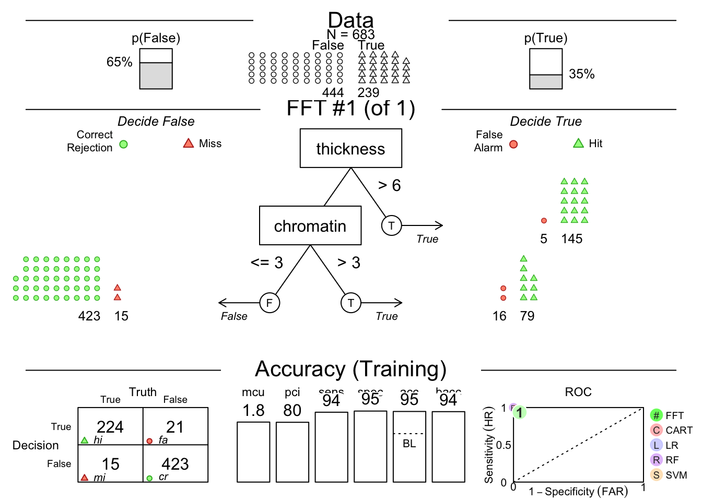
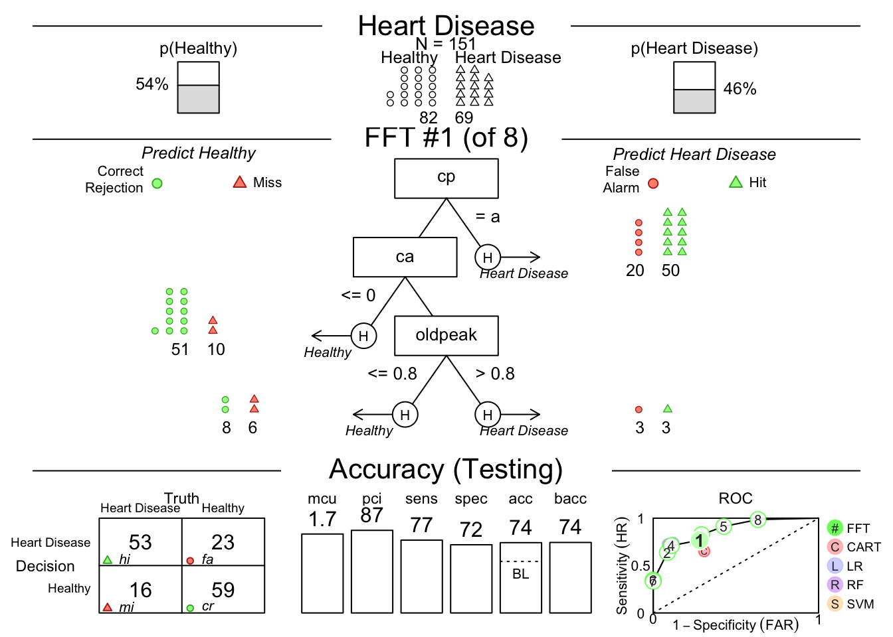
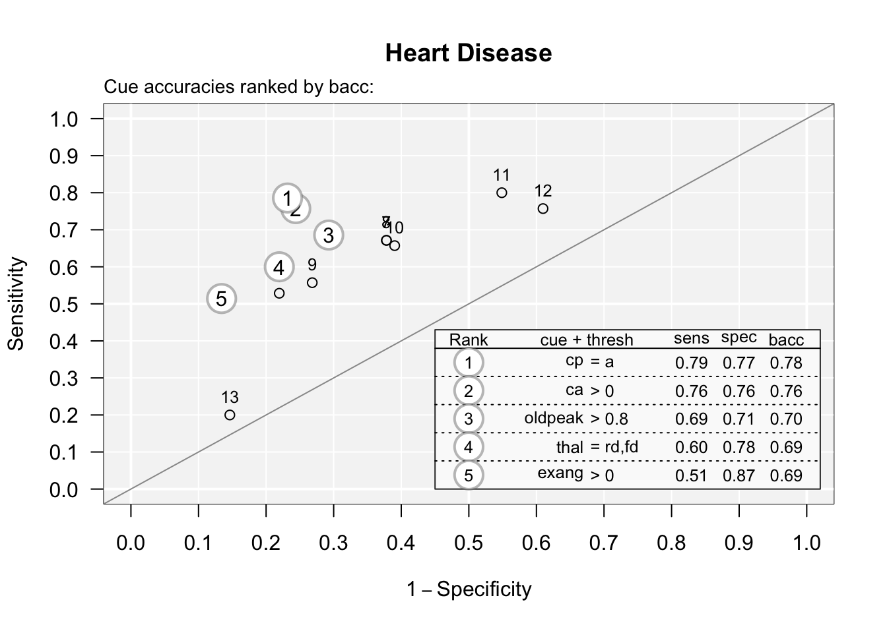
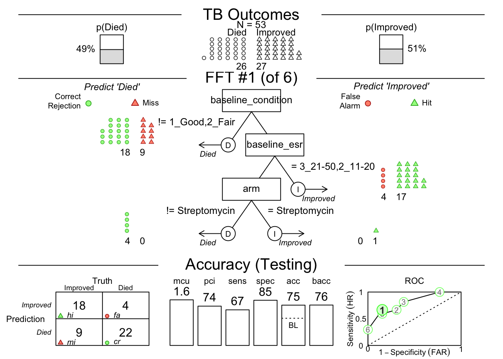
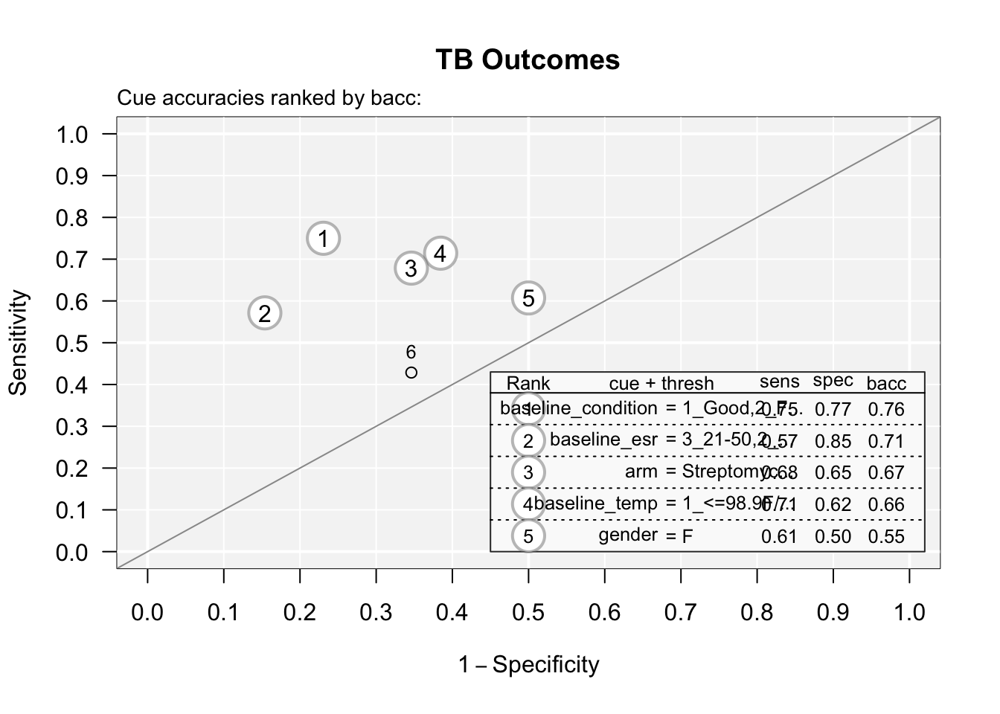

# Fast and Frugal Trees with the {FFTrees} Package

Tree-based models are one of the earliest forms of machine learning, which have some specific advantages over traditional linear or logistic regression models.
As a general rule, tree-based models handle interactions between independent predictor variables well, while traditional models struggle with interactions.
This can be helpful in biology and medicine where things like cations and electrochemical balance have inevitable interactions.
Tree-based models use a series of binary splits to create a tree structure that predicts the outcome.
The tree is built by selecting the best split at each node, based on the predictor variables.
The tree is grown until a stopping criterion is met, such as a minimum number of cases in a node, or a maximum depth of the tree.
Each split is optimized to create a more pure 'branch' of one outcome.
The tree is then pruned to avoid overfitting, and the final tree is used to make predictions on new data.
The original tree-based models were CART (Classification and Regression Trees) models, which were developed by Breiman et al. in the 1980s.
The CART algorithm is a recursive partitioning algorithm that creates binary splits in the data to create a tree structure.
The tree is grown until a stopping criterion is met, such as a minimum number of cases in a node, or a maximum depth of the tree.
The tree is then pruned to avoid overfitting, and the final tree is used to make predictions on new data.
We have since developed more complicated tree-based models, like random Forests, which start with a random subset of predictor variables and begin partitioning the observations.
This uses the entirety of the information more completely than a single tree.
A single tree is often not very accurate, but a forest of trees, called a random forest, can be very accurate.
Random forests are an ensemble method that creates many trees, each on a random subset of the data, and averages the predictions of the trees to create a more accurate prediction.
Random forests are one of the most accurate machine learning algorithms available, and are widely used in biology and medicine.
The advantage of a single tree is its transparency.
You can see where and what the splitting nodes are, and gain a better understanding of the reasons for the outcome.
These are also referred to as 'white box' models, as opposed to 'black box' models like neural networks and random Forests, which are difficult to interpret.
These are also easier to use in clinical practice.
In order to get the best of both worlds, we can use a fast and frugal tree model, which is a simple tree model that is easy to interpret and use in clinical practice.
The {FFTrees} package makes the fftrees algorithm easy to use in R.

We will work through 3 example datasets and show the use of the FFTrees package to create a simple tree model.
We will use the FFTrees package to create a simple tree model to diagnose breast cancer from a digitized biopsy slide, to identify heart disease in at-risk people, and to predict survival in tuberculosis in the strep_tb trial.

## Setup

1.  Install the "FFTrees" package from CRAN.
2.  Load this package with `library(FFTrees)`.
3.  Load the "medicaldata" package with `library(medicaldata)`.

## The Breast Cancer Dataset

This dataset is from the UCI Machine Learning Repository, and each observation comes from a digitized image of a fine needle aspirate (FNA) of a breast mass.
The dataset contains 569 observations and 32 variables, including the diagnosis of breast cancer (malignant or benign) and 30 features that are computed from a digitized image of the FNA.
The features describe characteristics of the cell nuclei present in the image.
The dataset is available in the {FFTrees} package as `breast_cancer`, and details can be found at: [breast_cancer-FNA](https://www.kaggle.com/datasets/salihacur/breastcancerwisconsin).

An edge detection algorithm was used to identify the edges of the nuclei, and from these borders, cell and nuclear features were derived, including:

-   diagnosis - TRUE (cancer) or FALSE (not cancer)

-   thickness - thickness of clumps (1-10)

-   cellsize.unif - uniformity of cell size (1-10)

-   cellshape.unif - uniformity of cell shape (1-10)

-   adhesion - a score for how much cells are adherent to each other (1-10)

-   epithelial - a score for how much epithelium is present (1-10)

-   nuclei.bare - a score for how many bare nuclei (without cytoplasm or cell membrane) are found (1-10)

-   chromatin - a score for presence of bland chromatin (1-10)

-   nucleoli - a score for presence of normal nucleoli (1-10)

-   mitoses - a score for presence of mitoses (1-10)

2.  Make predictions about future cases (patients) with their measured predictors on this continuous outcome.

Load the data into RStudio by copying and running the code below.


``` r
data("breastcancer") 
```

### Data Inspection

You can inspect the `breastcancer` data in the data Viewer by going to the Environment pane and clicking on it to open the dataset.
Take a look, and get a rough sense of which variables (with high scores) are associated with a TRUE diagnosis of breast cancer.
In the data Viewer, you can click on the variable `diagnosis` to sort observations to look at the predictor variable values for TRUE and FALSE cases.
Clicking on the `diagnosis` variable again will sort the observations in the reverse order.

### Check Your Progress


1.  How many observations are there in the breast cancer dataset?

<select class='webex-select'><option value='blank'></option><option value=''>200</option><option value='answer'>683</option><option value=''>811</option></select>

2.  What is the range of the `mitoses` variable?

<select class='webex-select'><option value='blank'></option><option value=''>1-2</option><option value='answer'>1-10</option><option value=''>0-400</option></select>

## Building a FFTrees Model for Breast Cancer

We will build a simple tree model to predict the diagnosis of breast cancer from the features of the cell nuclei.
Let's walk through the code block below, which builds a tree model using the `FFTrees` function from the `FFTrees` package.

1.  We will name the resulting model `breast.fft`, and use the assignment arrow to make this happen.
2.  We will use the `FFTrees` function to build the model.
3.  We will specify the first argument as the formula for the model, which is `diagnosis ~ .`, meaning we will predict the diagnosis from *all* other variables in the dataset.
4.  We will specify the second argument as the data, which is `breastcancer`.
5.  We will specify the `train.p` argument as 0.5, which means we will randomly use half of the data to train the model and half to test the model.
6.  We will specify the `main` argument as "Breast Cancer", which will be the title of the plot.
7.  We will specify the `decision.labels` argument as `c("Healthy", "Disease")`, which will be the labels for the outcome variable in the plot. This works because the underlying value for FALSE is 0, and the underlying value for TRUE is 1, so that these are in the correct order.


``` r
set.seed(123)
# the seed is used to get reproducible outcomes, as the random split into train and test will give slightly different results each time.
# note we are not using the cost argument - we will use the default for this.
breast.fft <- FFTrees(formula = diagnosis ~ .,
  data = breastcancer,
  train.p = 0.5,
  main = "Breast Cancer",
  decision.labels = c("Healthy", "Disease"))
```

Now copy this code block and run it in your local RStudio instance.
This should rank the predictor variables (`cues`), train some FFT models on the training data, rank them by their performance on the test data, and give you a short printout.
You should also see a new assigned object, `breast.fft` in your Environment pane.
To see the fft object, copy and run the code below:


``` r
breast.fft
```

```
## Breast Cancer
## FFTrees 
## - Trees: 6 fast-and-frugal trees predicting diagnosis
## - Cost of outcomes:  hi = 0,  fa = 1,  mi = 1,  cr = 0
## 
## FFT #1: Definition
## [1] If cellsize.unif <= 2, decide Healthy.
## [2] If cellshape.unif > 2, decide Disease, otherwise, decide Healthy.
## 
## FFT #1: Training Accuracy
## Training data: N = 342, Pos (+) = 120 (35%) 
## 
## |          | True + | True - | Totals:
## |----------|--------|--------|
## | Decide + | hi 116 | fa   9 |     125
## | Decide - | mi   4 | cr 213 |     217
## |----------|--------|--------|
##   Totals:       120      222   N = 342
## 
## acc  = 96.2%   ppv  = 92.8%   npv  = 98.2%
## bacc = 96.3%   sens = 96.7%   spec = 95.9%
## 
## FFT #1: Training Speed, Frugality, and Cost
## mcu = 1.4,  pci = 0.84,  cost_dec = 0.038
```

This prints out the (default) assigned cost of 1 for false positives (fa for false alarm) and false negatives (mi for miss), the definition of the best tree model (with 2 nodes or branch points), the best tree model's performance on the training data, and some accuracy statistics.

Now let's plot how this model does on the test data.
Copy and run the code below:


``` r
plot(breast.fft, data = "test")
```


You may need to click the Zoom button at the top left of your Plots pane to get a good view.

This shows us that among the 341 randomly selected test cases (342 used for training), only 35% had TRUE breast cancer.
Then it shows model 1, which has 2 nodes, splitting on uniformity of cell size below 3, and uniformity of cell shape below 3.
You can see how each split 'purifies' the outcomes - never perfectly, but pretty well.
There is a confusion matrix at the lower left to show us false negatives and false positives - also known as hits, misses, false alarms, and correct rejections.
The model (on the Testing Set) has a sensitivity of 0.89, specificity of 0.96, and accuracy of 0.93.
The `bacc` variable is balanced accuracy, which is `sens * 0.5 + spec * 0.5`.
The mcu is `mean cues used` per observation, and pci is `percent of cues ignored`.
There is an ROC curve at the lower right comparing the model to alternative types of model, including CART, logistic regression, random forest, and support vector machine models.
They are all quite good, and sensitivity and specificity are well balanced.

In some cases, sensitivity and specificity are not well balanced.
You may place a greater negative value on missed diagnoses, and want to shift the model to be more sensitive.
You can do this by changing the cost of a miss (mi) to be higher than the cost of a false alarm (fa).
You can do this by changing the `cost` argument in the `FFTrees` function.
For example, you could set `cost = c(fa = 1, mi = 2)`.
This would mean that a missed diagnosis is twice as costly as a false alarm.
You can also change the cost of a false alarm by setting `fa = 2` and `mi = 1`.
This would mean that a false alarm is twice as costly as a missed diagnosis.
It depends on the clinical situation and your judgement, but you should think about the relative cost/harm of these two types of errors and adjust the cost argument if needed.

You can see the accuracy of each predictor by plotting these with the code below:


``` r
plot(breast.fft, what = "cues")
```

```
## Plotting cue training statistics:
## — Cue accuracies ranked by bacc
```


You can see that predictor (cue) #9 is not great.
You can print these out with:


``` r
breast.fft$cues$stats$train
```

```
##              cue   class threshold direction   n  hi fa mi
## 1      thickness integer         4         > 342 108 46 12
## 2  cellsize.unif integer         2         > 342 118 18  2
## 3 cellshape.unif integer         2         > 342 117 21  3
## 4       adhesion integer         1         > 342 104 39 16
## 5     epithelial integer         2         > 342 110 23 10
## 6    nuclei.bare numeric         1         > 342 114 25  6
## 7      chromatin integer         3         > 342  98  8 22
## 8       nucleoli integer         2         > 342  98 11 22
## 9        mitoses integer         1         > 342  51  7 69
##    cr      sens      spec       ppv       npv       acc
## 1 176 0.9000000 0.7927928 0.7012987 0.9361702 0.8304094
## 2 204 0.9833333 0.9189189 0.8676471 0.9902913 0.9415205
## 3 201 0.9750000 0.9054054 0.8478261 0.9852941 0.9298246
## 4 183 0.8666667 0.8243243 0.7272727 0.9195980 0.8391813
## 5 199 0.9166667 0.8963964 0.8270677 0.9521531 0.9035088
## 6 197 0.9500000 0.8873874 0.8201439 0.9704433 0.9093567
## 7 214 0.8166667 0.9639640 0.9245283 0.9067797 0.9122807
## 8 211 0.8166667 0.9504505 0.8990826 0.9055794 0.9035088
## 9 215 0.4250000 0.9684685 0.8793103 0.7570423 0.7777778
##        bacc      wacc   dprime    cost_dec        cost
## 1 0.8463964 0.8463964 2.086002 -0.16959064 -0.16959064
## 2 0.9511261 0.9511261 3.473574 -0.05847953 -0.05847953
## 3 0.9402027 0.9402027 3.234896 -0.07017544 -0.07017544
## 4 0.8454955 0.8454955 2.032886 -0.16081871 -0.16081871
## 5 0.9065315 0.9065315 2.628155 -0.09649123 -0.09649123
## 6 0.9186937 0.9186937 2.835223 -0.09064327 -0.09064327
## 7 0.8903153 0.8903153 2.683437 -0.08771930 -0.08771930
## 8 0.8835586 0.8835586 2.537226 -0.09649123 -0.09649123
## 9 0.6967342 0.6967342 1.655776 -0.22222222 -0.22222222
##   cost_cue
## 1        0
## 2        0
## 3        0
## 4        0
## 5        0
## 6        0
## 7        0
## 8        0
## 9        0
```

And see that counting mitoses (#9) is not a great use of your pathologist's time, with a sensitivity of 0.425.
Several of these potential predictors are just not that useful, compared to size and shape uniformity.

You can see the best model in text (words) with:


``` r
inwords(breast.fft, tree = 1)
```

```
## [1] "If cellsize.unif <= 2, decide Healthy."                           
## [2] "If cellshape.unif > 2, decide Disease, otherwise, decide Healthy."
```

which gives you a simple decision algorithm.
If you want to see the accuracy for all of the trees generated, you can use


``` r
breast.fft$trees$stats$test
```

```
## # A tibble: 6 × 20
##    tree     n    hi    fa    mi    cr  sens  spec    far
##   <int> <int> <int> <int> <int> <int> <dbl> <dbl>  <dbl>
## 1     1   341   106    11    13   211 0.891 0.950 0.0495
## 2     2   341    97     5    22   217 0.815 0.977 0.0225
## 3     3   341   116    37     3   185 0.975 0.833 0.167 
## 4     4   341    88     5    31   217 0.739 0.977 0.0225
## 5     5   341   119    59     0   163 1     0.734 0.266 
## 6     6   341   119    67     0   155 1     0.698 0.302 
## # ℹ 11 more variables: ppv <dbl>, npv <dbl>, dprime <dbl>,
## #   acc <dbl>, bacc <dbl>, wacc <dbl>, cost_dec <dbl>,
## #   cost_cue <dbl>, cost <dbl>, pci <dbl>, mcu <dbl>
```

You can see the definitions of all trees with:


``` r
breast.fft$trees$definitions
```

```
## # A tibble: 6 × 7
##    tree nodes classes cues       directions thresholds exits
##   <int> <int> <chr>   <chr>      <chr>      <chr>      <chr>
## 1     1     2 i;i     cellsize.… >;>        2;2        0;0.5
## 2     2     3 i;i;n   cellsize.… >;>;>      2;2;1      0;0;…
## 3     3     2 i;i     cellsize.… >;>        2;2        1;0.5
## 4     4     4 i;i;n;i cellsize.… >;>;>;>    2;2;1;2    0;0;…
## 5     5     3 i;i;n   cellsize.… >;>;>      2;2;1      1;1;…
## 6     6     4 i;i;n;i cellsize.… >;>;>;>    2;2;1;2    1;1;…
```

If sensitivity is really important, you might choose model 5 or 6, which both have a sensitivity of 1.


You can also predict the outcome for new data from the best training tree with:


``` r
predict(breast.fft, 
        newdata = breastcancer[1:10,],
        type = "prob")
```

```
## ✔ Applied 6 FFTs to 'test' data.
```

```
## ✔ Generated predictions for tree 1.
```

```
## # A tibble: 10 × 2
##    prob_0 prob_1
##     <dbl>  <dbl>
##  1 0.986  0.0144
##  2 0.0787 0.921 
##  3 0.986  0.0144
##  4 0.0787 0.921 
##  5 0.986  0.0144
##  6 0.0787 0.921 
##  7 0.986  0.0144
##  8 0.986  0.0144
##  9 0.986  0.0144
## 10 0.986  0.0144
```

This gives you the probability of FALSE (no cancre) and TRUE (cancer) for the first 10 observations in the dataset.
You can also use `type = "class"` to get the predicted class (FALSE or TRUE) for each observation, or use type = "both" if you want to see both.
<br> You can also manually control which predictors go into the model.
<br> For example, you could use only bare nuclei and bland chromatin predictors with the code below:


``` r
breast.fft <- FFTrees(formula = diagnosis ~ nuclei.bare + chromatin,
  data = breastcancer,
  train.p = 0.5,
  main = "Breast Cancer",
  decision.labels = c("Healthy", "Disease"))

plot(breast.fft, data = "test")
```


Or you can manually specify a model with the example code below:.
Copy and paste into your local RStudio instance.


``` r
breast.fft <- FFTrees(diagnosis ~ .,
  data = breastcancer,
  my.tree = "If thickness > 6, predict TRUE. If chromatin >3, predict TRUE. Otherwise, predict FALSE.")

plot(breast.fft, data = "train")
```



## Your Turn with Heart Disease Data

We will now use one of the other datasets in the FFTrees package, heartdisease.
Load this dataset with the code below.
Copy and paste into your local RStudio instance.
Then click on the dataset in your Environment pane (it will appear as a `Promise` under Values) to see the data.


``` r
data(heartdisease)
```

This dataset from the Cleveland Clinic has 14 variables:

-   `diagnosis` - 0=healthy, 1=disease
-   `age` - age in years
-   `sex` - sex, 0=female, 1=male
-   `cp` - chest pain type: 1=typical angina, 2=atypical angina, 3=non-anginal pain, 4=asymptomatic
-   `trestbps` - resting blood pressure systolic in mmHg
-   `chol` - serum cholesterol in mg/dL
-   `fbs` - fasting blood sugar \> 120, 0=no, 1=yes
-   `restecg` - resting electrocardiographic results, 0=normal, 1=ST-T wave abnormality, 2=left ventricular hypertrophy
-   `thalach` - maximum heart rate achieved during thallium study
-   `exang` - exercise induced angina, 0=no, 1=yes
-   `oldpeak` - ST depression induced by exercise relative to rest
-   `slope` - the slope of the peak exercise ST segment, 1=upsloping, 2=flat, 3=downsloping
-   `ca` - number of major vessels open during catheterization
-   `thal` - thallium study results: 3=normal, 6=fixed defect, 7=reversible defect

Take a look at which variables seem to correlate with heart disease.
You can sort by the diagnosis variable and scroll a bit to get a first impression of the data.

Now, let's build a model to predict heart disease.
We will use all of the variables in the dataset.
Copy and paste the code below into your local RStudio instance.
I have **left several black spaces** for you to fill in.


``` r
set.seed(111) # note that the actual seed number does not matter, but if you change it, the randomization of train and test (and your results) will change slightly
heart.fft <- FFTrees(--- ~ .,
  data = '---',
  train.p = 0.5,
  main = "Heart Disease",
  decision.labels = c("---", "---"))
```

```
## Error in -~.: invalid argument to unary operator
```

Fix the code, then run it.
If the model is not running, peek at the solution below.


<div class='webex-solution'><button>Click here to see the Solution</button>


``` r
set.seed(111)
heart.fft <- FFTrees(diagnosis ~ .,
  data = heartdisease,
  train.p = 0.5,
  main = "Heart Disease",
  decision.labels = c("Healthy", "Heart Disease"))
```

```
## Warning in comp_pred(formula = x$formula, data.train =
## x$data$train, data.test = x$data$test, : 4 cases in the
## test data could not be predicted by 'e' due to new factor
## values. These cases will be excluded
```

```
## Warning in comp_pred(formula = x$formula, data.train =
## x$data$train, data.test = x$data$test, : NAs introduced by
## coercion
```

```
## Warning in !ix_NA_pred & !ix_NA_crit: longer object length
## is not a multiple of shorter object length
```

```
## Warning in comp_pred(formula = x$formula, data.train =
## x$data$train, data.test = x$data$test, : 4 cases in the
## test data could not be predicted by 'e' due to new factor
## values. These cases will be excluded
```

```
## Warning in comp_pred(formula = x$formula, data.train =
## x$data$train, data.test = x$data$test, : 4 cases in the
## test data could not be predicted by 'e' due to new factor
## values. These cases will be excluded
```

```
## Warning in comp_pred(formula = x$formula, data.train =
## x$data$train, data.test = x$data$test, : 4 cases in the
## test data could not be predicted by 'e' due to new factor
## values. These cases will be excluded
```


</div>


You can then plot the model.


``` r
plot(heart.fft, data = "test")
```



You can see the accuracy of each predictor by plotting the cues with the code below:


``` r
plot(heart.fft, what = "cues")
```

```
## Plotting cue training statistics:
## — Cue accuracies ranked by bacc
```



You can see that one predictor (cue) #13 when used in isolation is almost a coin flip.
You can print these out with:


``` r
heart.fft$cues$stats$train
```

```
##         cue     class   threshold direction   n hi fa mi cr
## 1       age   numeric          56         > 152 47 31 23 51
## 2       sex   numeric           0         > 152 56 45 14 37
## 3        cp character           a         = 152 55 19 15 63
## 4  trestbps   numeric         124         > 152 53 50 17 32
## 5      chol   numeric         253         > 152 39 22 31 60
## 6       fbs   numeric           0         > 152 14 12 56 70
## 7   restecg character hypertrophy         = 152 46 32 24 50
## 8   thalach   numeric         145        <= 152 37 18 33 64
## 9     exang   numeric           0         > 152 36 11 34 71
## 10  oldpeak   numeric         0.8         > 152 48 24 22 58
## 11    slope character   flat,down         = 152 47 31 23 51
## 12       ca   numeric           0         > 152 53 20 17 62
## 13     thal character       rd,fd         = 152 42 18 28 64
##         sens      spec       ppv       npv       acc
## 1  0.6714286 0.6219512 0.6025641 0.6891892 0.6447368
## 2  0.8000000 0.4512195 0.5544554 0.7254902 0.6118421
## 3  0.7857143 0.7682927 0.7432432 0.8076923 0.7763158
## 4  0.7571429 0.3902439 0.5145631 0.6530612 0.5592105
## 5  0.5571429 0.7317073 0.6393443 0.6593407 0.6513158
## 6  0.2000000 0.8536585 0.5384615 0.5555556 0.5526316
## 7  0.6571429 0.6097561 0.5897436 0.6756757 0.6315789
## 8  0.5285714 0.7804878 0.6727273 0.6597938 0.6644737
## 9  0.5142857 0.8658537 0.7659574 0.6761905 0.7039474
## 10 0.6857143 0.7073171 0.6666667 0.7250000 0.6973684
## 11 0.6714286 0.6219512 0.6025641 0.6891892 0.6447368
## 12 0.7571429 0.7560976 0.7260274 0.7848101 0.7565789
## 13 0.6000000 0.7804878 0.7000000 0.6956522 0.6973684
##         bacc      wacc    dprime   cost_dec       cost
## 1  0.6466899 0.6466899 0.7491666 -0.3552632 -0.3552632
## 2  0.6256098 0.6256098 0.7122113 -0.3881579 -0.3881579
## 3  0.7770035 0.7770035 1.5126224 -0.2236842 -0.2236842
## 4  0.5736934 0.5736934 0.4143740 -0.4407895 -0.4407895
## 5  0.6444251 0.6444251 0.7564326 -0.3486842 -0.3486842
## 6  0.5268293 0.5268293 0.2089082 -0.4473684 -0.4473684
## 7  0.6334495 0.6334495 0.6785982 -0.3684211 -0.3684211
## 8  0.6545296 0.6545296 0.8392760 -0.3355263 -0.3355263
## 9  0.6900697 0.6900697 1.1323661 -0.2960526 -0.2960526
## 10 0.6965157 0.6965157 1.0219430 -0.3026316 -0.3026316
## 11 0.6466899 0.6466899 0.7491666 -0.3552632 -0.3552632
## 12 0.7566202 0.7566202 1.3801880 -0.2434211 -0.2434211
## 13 0.6902439 0.6902439 1.0196178 -0.3026316 -0.3026316
##    cost_cue
## 1         0
## 2         0
## 3         0
## 4         0
## 5         0
## 6         0
## 7         0
## 8         0
## 9         0
## 10        0
## 11        0
## 12        0
## 13        0
```

And look at the sens (0.84) and spec (0.16) numbers to find this (order is rearranged) - this was an isolated elevated fasting blood sugar without considering symptoms, demographics, or thallium results - sensitive but not specific (note that \# 12 is an isolated EKG, and that this dataset is from the pre-Troponin (or even CK-MB) era.)

### Test what you have learned


1.  What is the decision criterion for the first node, cp?

<select class='webex-select'><option value='blank'></option><option value=''>aa (atypical angina) = Healthy</option><option value='answer'>a (typical angina) = Heart Disease</option><option value=''>ta (totally asymptomatic) = Heart Disease</option><option value=''>np (non-anginal pain) = Heart Disease</option></select>

1.  How many people of the 151 in the testing set predicted to be healthy by this model actually had heart disease?

<select class='webex-select'><option value='blank'></option><option value='answer'>16</option><option value=''>23</option><option value=''>53</option></select>

## Your Turn to Build and Interpret a Model

We will now look at the `strep_tb` dataset from the {medicaldata} package.
This dataset has 13 variables:

-   `patient_id` - a unique identifier for each patient
-   `arm` - treatment arm, Control or Strep
-   `dose_strep_g` - dose of Streptomycin in grams
-   `gender` - M or F
-   `baseline_condition` 1=Good, 2=Fair, 3=Poor
-   `baseline_temp` - coded as 1-4
-   `baseline_esr` - erythrocyte sedimentation rate - levels 1-4
-   `baseline_cavitation` - cavitation on chest x-ray as yes or no.
-   improved - FALSE (died) or TRUE (improved)

there are some other outcome variables like strep_resistance and radiologic_6m, but we will focus on improved.
However, we do not want to use these as predictors, so we will clean up the dataset a bit.
Copy and run the code below to remove some extraneous variables for our purposes today.


``` r
strep_tb <- medicaldata::strep_tb |> 
  dplyr::select(-strep_resistance,-rad_num, -radiologic_6m, -dose_strep_g, -dose_PAS_g, -patient_id) 
```

## Now build your FFTrees model to predict improved status (vs. death)

You will get just a starter bit of code to get you going.
Pull up the (FFTrees} package [website](https://cran.r-project.org/web/packages/FFTrees/vignettes/FFTrees_examples.html). Fix up this code and run it in your local RStudio to answer the questions below.


``` r
set.seed(99)
tb.fft <- FFTrees(outcome ~ ,
  data = name,
  train.p = ,
  main = "Streptomycin TB",
  decision.labels = )
```

```
## Error in parse(text = input): <text>:2:29: unexpected ','
## 1: set.seed(99)
## 2: tb.fft <- FFTrees(outcome ~ ,
##                                ^
```

Fix the code, then run it.
If the model is not running, peek at the solution below.


<div class='webex-solution'><button>Click here to see the Solution</button>


``` r
set.seed(99)
tb.fft <- FFTrees(improved ~ .,
  data = strep_tb,
  train.p = 0.5,
  main = "TB Outcomes",
  decision.labels = c("Died", "Improved"))
```


</div>


You can then print the model:


``` r
# code here
```


<div class='webex-solution'><button>Show Code</button>


``` r
print(tb.fft)
```

```
## TB Outcomes
## FFTrees 
## - Trees: 6 fast-and-frugal trees predicting improved
## - Cost of outcomes:  hi = 0,  fa = 1,  mi = 1,  cr = 0
## 
## FFT #1: Definition
## [1] If baseline_condition != {1_Good,2_Fair}, decide Died.
## [2] If baseline_esr = {3_21-50,2_11-20}, decide Improved.
## [3] If arm = {Streptomycin}, decide Improved, otherwise, decide Died.
## 
## FFT #1: Training Accuracy
## Training data: N = 54, Pos (+) = 28 (52%) 
## 
## |          | True + | True - |Totals:
## |----------|--------|--------|
## | Decide + | hi  21 | fa   4 |     25
## | Decide - | mi   7 | cr  22 |     29
## |----------|--------|--------|
##   Totals:        28       26   N = 54
## 
## acc  = 79.6%   ppv  = 84.0%   npv  = 75.9%
## bacc = 79.8%   sens = 75.0%   spec = 84.6%
## 
## FFT #1: Training Speed, Frugality, and Cost
## mcu = 1.63,  pci = 0.73,  cost_dec = 0.204
```

</div>


1.  For the best model (#1), how many patients were predicted to die, but still lived?\

<select class='webex-select'><option value='blank'></option><option value=''>26</option><option value='answer'>2</option><option value=''>5</option><option value=''>21</option></select>

2.  What did the best model predict would happen to patients with very low or very high ESR?\

<select class='webex-select'><option value='blank'></option><option value=''>Did not know</option><option value='answer'>Improved</option><option value=''>Died</option></select>

3.  What did the best model predict would happen to patients with very high (level 4, over 38.2C) temperatures?

<select class='webex-select'><option value='blank'></option><option value=''>Did not know</option><option value='answer'>Died</option><option value=''>Improved</option></select>

You can then plot the model on the test data set:


``` r
# code here
```


<div class='webex-solution'><button>Show Code</button>


``` r
plot(tb.fft, data = "test")
```



</div>


1.  For the best model (#1), what is the decision criterion at the first node?\

    <select class='webex-select'><option value='blank'></option><option value=''>baseline_temp = 4 -> Died</option><option value='answer'>baseline condition = not 1 or 1 -> Died</option><option value=''>baseline_esr = 4 -> Died</option></select>

2.  By the confusion matrix on the test set, how many people predicted to improve actually died?\

    <select class='webex-select'><option value='blank'></option><option value=''>9</option><option value=''>18</option><option value='answer'>4</option><option value=''>22</option></select>

<br>
You can see the accuracy of each predictor by plotting the cues with the code below:


``` r
# code here
```


<div class='webex-solution'><button>Show Code</button>


``` r
plot(tb.fft, what = "cues")
```

```
## Plotting cue training statistics:
## — Cue accuracies ranked by bacc
```



</div>


1.  What are the two best single predictors of TB outcome?\
    <select class='webex-select'><option value='blank'></option><option value=''>baseline_temp & baseline_esr</option><option value='answer'>baseline_esr & baseline_condition</option><option value=''>baseline_esr & arm</option></select>

2.  What are the two worst single predictors of TB outcome?\
    <select class='webex-select'><option value='blank'></option><option value=''>baseline_cavitation & baseline_condition</option><option value='answer'>gender & baseline_cavitation</option><option value=''>baseline_esr & baseline_temp</option></select>


