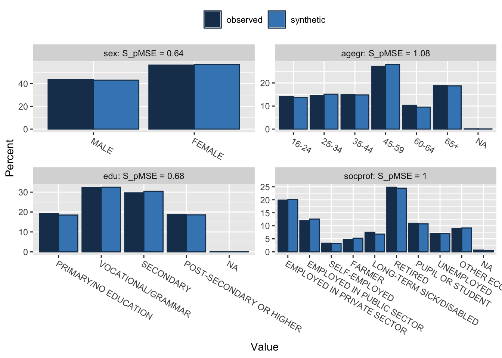
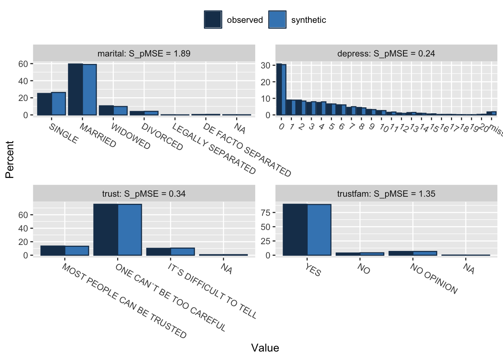
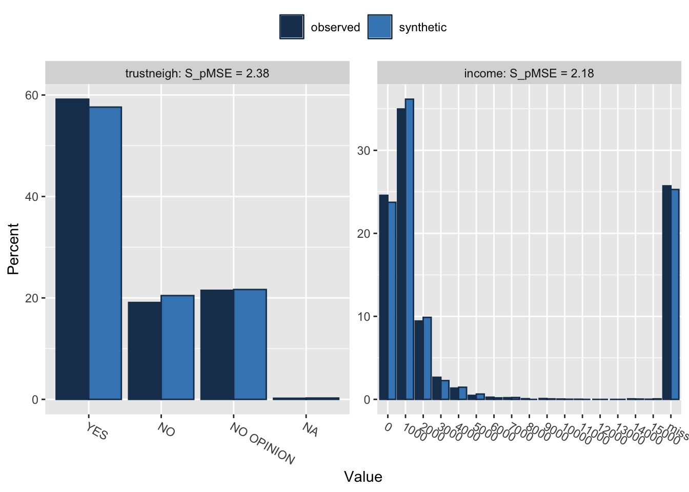

# Protecting PHI (Protected Health Information)

If you are working with medical data, there is a good chance that you are frequently working with Protected Health Information (PHI). PHI is any information in a medical record that can be used to identify an individual, and that was created, used, or disclosed in the course of providing a healthcare service, such as a diagnosis or treatment. PHI includes many common identifiers, such as names, addresses, dates of birth, and Social Security numbers. PHI also includes any other information that could be used to identify a patient, such as medical record numbers, photographs, and biometric data.

It is CRITICAL to maintaining your credibility as a data analyst, as well as your access to medical data, that you take the necessary steps to protect PHI. This includes not sharing PHI, encrypting data, and using synthetic data when possible.

## Protecting (Not Inadvertently Sharing) PHI

The first important step in protecting PHI is to not share it. This means not sharing data that contains PHI, and not sharing code that contains PHI.
This is especially important when backing up data to the cloud, or sharing data with collaborators. A very common way to back up data and collaborate on a shared project is to establish a repository (repo) on GitHub.

It is important that you know how to use the `.gitignore` file to prevent PHI from being shared on GitHub. The `.gitignore` file is a text file that tells Git which files or folders to ignore in a project. The `.gitignore` file should be placed in the root directory of your project. You can include an R-specific `.gitignore` file when you create the repository on GitHub (this is a dropdown on the Github page when creating a new repo), or you can add it later.

You can create a `.gitignore` file by opening a text editor, and saving the file as `.gitignore`. For this example, you can then add the following lines to the file:

- `*.csv`
- `*.Rd`
- `*.RData`
- `data/`
- `output/`

These lines tell git to ignore the following kinds of files:

- anything that ends in `.csv`
- anything that ends in `.Rd`
- anything that ends in `.RData`
- any files in the `data` directory
- any files in the `output` directory

So that when you share your code on GitHub, you are not sharing any PHI.

## Identifying PHI

Protected health information (PHI) is any information in the medical record or designated record set that can be used to identify an individual and that was created, used, or disclosed in the course of providing a health care service such as diagnosis or treatment. HIPAA regulations allow researchers to access and use PHI when necessary to conduct research. However, HIPAA applies only to research that uses, creates, or discloses PHI that enters the medical record or is used for healthcare services, such as treatment, payment, or operations.

Identifying PHI in your data files is the next step in protecting PHI. Per US law, there are 18 types of data that are considered PHI. 

1. Names;
2. All geographical subdivisions smaller than a State, including street address, city, county, precinct, zip code, and their equivalent geocodes, except for the initial three digits of a zip code, if according to the current publicly available data from the Bureau of the Census: (1) The geographic unit formed by combining all zip codes with the same three initial digits contains more than 20,000 people; and (2) The initial three digits of a zip code for all such geographic units containing 20,000 or fewer people is changed to 000.
3. All elements of dates (except year) for dates directly related to an individual, including birth date, admission date, discharge date, date of death; and all ages over 89 and all elements of dates (including year) indicative of such age, except that such ages and elements may be aggregated into a single category of age 90 or older;
4. Phone numbers;
5. Fax numbers;
6. Electronic mail addresses;
7. Social Security numbers;
8. Medical record numbers;
9. Health plan beneficiary numbers;
10. Account numbers;
11. Certificate/license numbers;
12. Vehicle identifiers and serial numbers, including license plate numbers;
13. Device identifiers and serial numbers;
14. Web Universal Resource Locators (URLs);
15. Internet Protocol (IP) address numbers;
16. Biometric identifiers, including finger and voice prints;
17. Full face photographic images and any comparable images; and
18. Any other unique identifying number, characteristic, or code (note this does not mean the unique code assigned by the investigator to code the data [aka study_id])

## Selectively Deleting PHI

If this will not affect your data wrangling, you can use the `select` function in {dplyr} to remove PHI from your data files. For example, if you have a data file called `data`, you can use the following code to remove PHI:


``` r
data_no_phi <- data |> 
  select(-name, -address, -dob, -phone, -email, -ssn, 
         -mrn, -hpb, -account, -cert, -vehicle, -device, 
         -url, -ip, -biometric, -image, -date_admitted)
```
And then be sure that the `data` file is in your `.gitignore` file, and you can share the `data_no_phi` file with collaborators.

You might even want to create a folder called `data_with_phi` and a folder called `data_no_phi` to keep track of your data files separately by PHI status. The `data_with_phi` folder can show up in your `.gitignore` file as `data_with_phi/`, so that you are not sharing PHI.

## Problems with PHI-free data

PHI-free data are great for sharing and collaborating, but may be problematic for data wrangling.

You may find that you need **some** PHI fields in your early steps of data wrangling to match and join data files from different sources.

It is not uncommon to need some PHI to be the unique IDs to conduct data wrangling and analyses. You may need a medical record number to join data from different data sources. You may need dates to determine the interval between events, like the last screening colonoscopy and a colon cancer diagnosis. You may need a patient's age to determine if they are eligible for a study.

There are some workarounds. You can 

1. Keep data with PHI in a separate folder (a `data_with_phi` folder) which gets added to your `.gitignore` file, then after the joins are done and PHI-free data are created, save the PHI-free data to a `data_no_phi` folder.
2. Use phony dates shifted by a random number of days to that the dates are not real, but you can still calculate intervals (note that this is an export option in REDCap)

## Encrypting PHI

You can also keep, but encrypt your data fields, using strong RSA (2048 bit) encryption, with the {encryptr} package. This package can be installed from CRAN, with `install.packages("encryptr")`. You can find the full documentation at `https://encrypt-r.org/`.

The basis of RSA encryption is a public/private key pair and is the method used of many modern encryption applications. The public key can be shared with collaborators and is used to encrypt the information.

The private key is sensitive and should not be shared. The private key requires a password to be set. This password should follow modern rules on password complexity. You know what you should do. If lost, it cannot be recovered.

### Generating Public and Private keys

The `genkeys()` function generates a public and private key pair. The public key `id_rsa.pub` can then be shared with collaborators. The private key `id_rsa` should be kept secure and not shared. It should be listed in your `.gitignore` file. Set up a new project repository on your GitHub site, and copy the SSH to start a new project in RStudio using version control. Then run the code below (a novel password will be required), then open your `.gitignore` file in the project, and add `id_rsa` to the file.


``` r
library(encryptr)
genkeys()
# > Private key written with name 'id_rsa'
# > Public key written with name 'id_rsa.pub'
```

You can open a new project and test this with the gp dataset provided with the [encryptr} package. Try it out!


``` r
data(gp)
head(gp)
```

```
## # A tibble: 6 × 12
##   organisation_code name        address1 address2 address3 city  county postcode
##   <chr>             <chr>       <chr>    <chr>    <chr>    <chr> <chr>  <chr>   
## 1 S10002            MUIRHEAD M… LIFF RO… MUIRHEAD <NA>     DUND… ANGUS  DD2 5NH 
## 2 S10017            THE BLUE P… CRIEFF … KING ST… <NA>     CRIE… PERTH… PH7 3SA 
## 3 S10036            ABERFELDY … TAYBRID… <NA>     <NA>     ABER… PERTH… PH15 2BL
## 4 S10060            ABERFELDY … TAYBRID… <NA>     <NA>     ABER… PERTH… PH15 2BH
## 5 S10106            GROVE HEAL… 129 DUN… BROUGHT… <NA>     DUND… ANGUS  DD5 1DU 
## 6 S10125            ALYTH HEAL… NEW ALY… ALYTH    <NA>     BLAI… PERTH… PH11 8EQ
## # ℹ 4 more variables: opendate <date>, closedate <date>, telephone <chr>,
## #   practice_type <dbl>
```

You can see a listing of the 1212 general NHS practices in Scotland, and you can imagine that you might want to encrypt some fields (telephone, etc.)  and delete some unneeded ones in this data before sharing it publicly on GitHub.


``` r
library(dplyr)
gp_encrypt = gp %>% 
  select(-c(name, address1, address2, address3)) %>% 
  encrypt(postcode, telephone)

gp_encrypt 
```

```
## # A tibble: 1,212 × 8
##    organisation_code city        county postcode opendate   closedate  telephone
##    <chr>             <chr>       <chr>  <chr>    <date>     <date>     <chr>    
##  1 S10002            DUNDEE      ANGUS  8d41ef0… 1995-05-01 NA         6fe5a725…
##  2 S10017            CRIEFF      PERTH… 359a552… 1996-04-06 NA         30792c57…
##  3 S10036            ABERFELDY   PERTH… 025ff02… 2008-04-01 NA         1dea8be1…
##  4 S10060            ABERFELDY   PERTH… 6cec5d4… 1975-04-01 2008-03-31 539575e3…
##  5 S10106            DUNDEE      ANGUS  62b57aa… 1996-07-08 NA         9d9e7bec…
##  6 S10125            BLAIRGOWRIE PERTH… 5b4a3c2… 1979-10-01 NA         7e159bec…
##  7 S10182            ARBROATH    ANGUS  10553d2… 1977-10-01 NA         5461bbd5…
##  8 S10233            ARBROATH    ANGUS  2aa1890… 1986-08-01 NA         805bd6c4…
##  9 S10286            ARBROATH    ANGUS  879b8cb… 1975-08-01 NA         3872ad83…
## 10 S10322            ARBROATH    ANGUS  13769b1… 1971-10-01 NA         24511c1c…
## # ℹ 1,202 more rows
## # ℹ 1 more variable: practice_type <dbl>
```

You can see that postcode and telephone are now encrypted. You can share this data on GitHub, and collaborators can use the private key to decrypt the data when necessary.

Decryption requires the private key generated using genkeys() and the password set at the time. The password and file are not replaceable so need to be kept safe and secure. The code below will ask you for the password you set when you generated the keys before it provides the decrypted data.


``` r
gp_encrypt %>%  
  decrypt(postcode, telephone)
```

```
## # A tibble: 1,212 × 8
##    organisation_code city        county postcode opendate   closedate  telephone
##    <chr>             <chr>       <chr>  <chr>    <date>     <date>     <chr>    
##  1 S10002            DUNDEE      ANGUS  DD2 5NH  1995-05-01 NA         01382 58…
##  2 S10017            CRIEFF      PERTH… PH7 3SA  1996-04-06 NA         01764 65…
##  3 S10036            ABERFELDY   PERTH… PH15 2BL 2008-04-01 NA         01887 82…
##  4 S10060            ABERFELDY   PERTH… PH15 2BH 1975-04-01 2008-03-31 01887 82…
##  5 S10106            DUNDEE      ANGUS  DD5 1DU  1996-07-08 NA         01382 77…
##  6 S10125            BLAIRGOWRIE PERTH… PH11 8EQ 1979-10-01 NA         01828 63…
##  7 S10182            ARBROATH    ANGUS  DD11 1AD 1977-10-01 NA         01241 43…
##  8 S10233            ARBROATH    ANGUS  DD11 1EN 1986-08-01 NA         01241 87…
##  9 S10286            ARBROATH    ANGUS  DD11 1ES 1975-08-01 NA         01241 87…
## 10 S10322            ARBROATH    ANGUS  DD11 1ES 1971-10-01 NA         01241 87…
## # ℹ 1,202 more rows
## # ℹ 1 more variable: practice_type <dbl>
```

As an alternative to increase data security, you can store the PHI encrypted data in a separate 'lookup table' that is not shared on GitHub. This lookup table can be used to decrypt the data when necessary.

This can be accomplished by adding a `lookup` argument to the `encrypt` function. The `lookup` argument creates a data frame that contains the PHI data that was encrypted. 


``` r
gp_encrypt <- gp %>% 
  select(-c(name, address1, address2, address3)) %>% 
  encrypt(postcode, telephone, lookup = TRUE)
  
# Lookup table object created with name 'lookup'
# Lookup table written to file with name 'lookup.csv'
```


``` r
gp_encrypt
```

```
## # A tibble: 1,212 × 8
##    organisation_code city        county postcode opendate   closedate  telephone
##    <chr>             <chr>       <chr>  <chr>    <date>     <date>     <chr>    
##  1 S10002            DUNDEE      ANGUS  8d41ef0… 1995-05-01 NA         6fe5a725…
##  2 S10017            CRIEFF      PERTH… 359a552… 1996-04-06 NA         30792c57…
##  3 S10036            ABERFELDY   PERTH… 025ff02… 2008-04-01 NA         1dea8be1…
##  4 S10060            ABERFELDY   PERTH… 6cec5d4… 1975-04-01 2008-03-31 539575e3…
##  5 S10106            DUNDEE      ANGUS  62b57aa… 1996-07-08 NA         9d9e7bec…
##  6 S10125            BLAIRGOWRIE PERTH… 5b4a3c2… 1979-10-01 NA         7e159bec…
##  7 S10182            ARBROATH    ANGUS  10553d2… 1977-10-01 NA         5461bbd5…
##  8 S10233            ARBROATH    ANGUS  2aa1890… 1986-08-01 NA         805bd6c4…
##  9 S10286            ARBROATH    ANGUS  879b8cb… 1975-08-01 NA         3872ad83…
## 10 S10322            ARBROATH    ANGUS  13769b1… 1971-10-01 NA         24511c1c…
## # ℹ 1,202 more rows
## # ℹ 1 more variable: practice_type <dbl>
```

You can then add `lookup.csv` to your `.gitignore` file, and share the main file for collaborators. Decryption is performed by passing the lookup object or file to the decrypt() function.


``` r
gp_encrypt %>%  
  decrypt(postcode, telephone, lookup_object = lookup)
```

```
## Error: object 'lookup' not found
```

Learn more about how to encrypt PHI-containing fields from the documentation of {encryptr} at `https://encrypt-r.org/`.

## Sharing synthetic data with {synthpop}

If you need to share data with PHI, you can use the {synthpop} package to create synthetic data that can be shared. The {synthpop} package is a tool for creating synthetic versions of sensitive or PHI data. It will create a 'synthetic' version of the data that is not real but has the same statistical properties as the original data. The synthetic data can be shared without concern for privacy.

You will find that your analytic code will all work, but will frequently be (estimates, p values) a few decimal places off from your actual data. This is because the synthetic data is not real, but is a close approximation of the real data with a bit of random noise added.

Synthetic data will allow anyone to run your code with near-real data, and get **similar** results, without disclosing any PHI.

You can find the full documentation at `https://cran.r-project.org/web/packages/synthpop/synthpop.pdf`, and a ** Getting Started ** page at https://www.synthpop.org.uk/get-started.html.

You can install synthpop from CRAN with `install.packages("synthpop")`. Then use `library(synthpop)` to load the package. 

Let's start with the `SD2011` survey dataset provided with the {synthpop} package. This dataset contains 5000 records of a 2011 survey in Poland. The dataset contains 35 variables. Run the code below to get a preview of this dataset, and a subset called `mydata` with only 10 variables.


``` r
data(SD2011)
mydata <- SD2011 |> 
  select(sex, agegr, edu, socprof, marital, depress, trust, trustfam, trustneigh, income)
glimpse(mydata)
```

```
## Rows: 5,000
## Columns: 10
## $ sex        <fct> FEMALE, MALE, FEMALE, FEMALE, FEMALE, MALE, FEMALE, MALE, F…
## $ agegr      <fct> 45-59, 16-24, 16-24, 65+, 45-59, 16-24, 35-44, 35-44, 35-44…
## $ edu        <fct> VOCATIONAL/GRAMMAR, VOCATIONAL/GRAMMAR, VOCATIONAL/GRAMMAR,…
## $ socprof    <fct> RETIRED, PUPIL OR STUDENT, PUPIL OR STUDENT, RETIRED, SELF-…
## $ marital    <fct> MARRIED, SINGLE, SINGLE, WIDOWED, MARRIED, SINGLE, MARRIED,…
## $ depress    <dbl> 6, 0, 0, 16, 4, 5, 2, 4, 0, 6, 0, 6, 4, 3, 3, 0, 11, 11, 1,…
## $ trust      <fct> ONE CAN`T BE TOO CAREFUL, IT`S DIFFICULT TO TELL, MOST PEOP…
## $ trustfam   <fct> YES, YES, YES, NO, YES, YES, YES, YES, NO OPINION, YES, NO …
## $ trustneigh <fct> NO, NO OPINION, NO, YES, YES, NO OPINION, NO OPINION, YES, …
## $ income     <dbl> 800, 350, NA, 900, 1500, -8, 2000, 1197, 580, 1400, 1500, 1…
```

There are 603 income values listed as '-8' in the dataset. These are missing values. You can replace these with NA using the code below.

``` r
library(naniar)
mydata <- mydata |> 
  replace_with_na(replace = list(income = -8))
```

You can now create a synthetic version of the data using the `syn` function. The `syn` function requires the data,  and the seed. The seed is used to ensure reproducibility. The `syn` function will create a synthetic version of the data that can be shared without concern for privacy. Note the you need a constant seed to get the same result each time. There is some randomness in the synthesis that will produce different results each time without the same seed.

The `syn` default method is CART, which stands for Classification and Regression Trees. This highly adaptive method is used to create synthetic data that is similar to the original data. There are many available methods to synthesize new variables. Each variable is synthesized in order of appearance in the dataset, using the data from the previous variables. If you want to model for a particular variable, you may want to move that variable to the end of the dataset (as we did with income), to ensure that the other variables are synthesized first, and each variable is synthesized conditional on all of the previously synthesized variables. This preserves their statistical relationships for correlations or regression modeling.

The synthesis initially generates a `synds` object, which can be used for initial comparisons and modeling with special functions that end with  `.synds`, like `glm.synds` and `lm.synds`. Then the `write.syn` function will return a standard synthetic dataset in formats like csv and RData that can be used for analysis.

Run the code block below to do a basic synthesis.


``` r
syn_data <- syn(mydata, seed = 123)
```

```
## 
## Synthesis
## -----------
##  sex agegr edu socprof marital depress trust trustfam trustneigh income
```

Additional arguments to syn can include:
- `method` - the method used to create the synthetic data. The default is "cart". Other options are "norm", "random forests", "ranger", "polr",  and "logreg", among many. You use a vector of methods to set a different method for each variable in the dataset.
- `m` - the number of rows in the synthetic data. You can make it smaller or larger than the original data. The default is the same size as the original data m = nrow(original).
- `maxfaclevels` - the maximum number of factor levels in the synthetic data. The default is 60. Beyond this is considered numeric. Large numbers for maxfaclevels can lead to slow computational speed.
- `numtocat` - a vector of numeric variables to convert to categorical factors. The default is NULL.
- `catgroups` - a vector of integers of the same length as numtocat, which represents the number of factor levels for each factor variable. 


``` r
compare(syn_data, mydata, stats = c("counts", "means", "medians", "sds"))
```

```
## Calculations done for sex 
## Calculations done for agegr 
## Calculations done for edu 
## Calculations done for socprof 
## Calculations done for marital 
## Calculations done for depress 
## Calculations done for trust 
## Calculations done for trustfam 
## Calculations done for trustneigh 
## Calculations done for income
```

```
## 
## Comparing percentages observed with synthetic
```



```
## Press return for next variable(s):
```



```
## Press return for next variable(s):
```



```
## 
## Selected utility measures:
##                pMSE   S_pMSE df
## sex        0.000008 0.638460  1
## agegr      0.000081 1.079941  6
## edu        0.000034 0.675029  4
## socprof    0.000112 0.998075  9
## marital    0.000141 1.886650  6
## depress    0.000012 0.239234  4
## trust      0.000013 0.344532  3
## trustfam   0.000051 1.353151  3
## trustneigh 0.000089 2.383880  3
## income     0.000136 2.182507  5
```

You can see that the synthetic data are very similar to the original data. You can write this data to a file with the `write.syn` function to share this synthetic data with collaborators without concern for privacy. In the code block below, you can write the synthetic data to a CSV file, and then read it back in to check that it is looks right.


``` r
write.syn(object = syn_data,
          convert.factors = TRUE,
          filename = "syn_SD", 
          filetype = "csv", # options include RData, Stata, SAS
          data.labels = TRUE )
```

```
## Synthetic data exported as csv file(s).
## Information on synthetic data written to
##   /Users/peterhiggins/Documents/RCode/rmrwr-book/synthesis_info_syn_SD.txt
```

``` r
read.csv("syn_SD.csv") -> syn_SD
glimpse(syn_SD)
```

```
## Rows: 5,000
## Columns: 10
## $ sex        <chr> "MALE", "FEMALE", "MALE", "MALE", "FEMALE", "FEMALE", "MALE…
## $ agegr      <chr> "65+", "65+", "25-34", "35-44", "25-34", "16-24", "45-59", …
## $ edu        <chr> "PRIMARY/NO EDUCATION", "VOCATIONAL/GRAMMAR", "POST-SECONDA…
## $ socprof    <chr> "RETIRED", "RETIRED", "EMPLOYED IN PUBLIC SECTOR", "EMPLOYE…
## $ marital    <chr> "MARRIED", "WIDOWED", "SINGLE", "MARRIED", "SINGLE", "SINGL…
## $ depress    <int> 11, 14, 0, 3, 11, 2, 0, 3, 7, 4, 2, 2, 2, 0, 1, 11, 16, 1, …
## $ trust      <chr> "ONE CAN`T BE TOO CAREFUL", "ONE CAN`T BE TOO CAREFUL", "ON…
## $ trustfam   <chr> "YES", "YES", "YES", "NO OPINION", "YES", "YES", "YES", "YE…
## $ trustneigh <chr> "YES", "YES", "YES", "NO", "NO OPINION", "NO OPINION", "YES…
## $ income     <int> 2000, 990, 1800, 3000, 1000, 1400, 3300, 1500, 500, 1000, 2…
```

One small issue is that string factors are synthesized as character vectors. If these are meant to be ordered factors, we have to redefine these as ordered factors if we want the same ordering which is helpful for modeling. We can 'borrow' the order from the original dataset. Run the code block below to redefine six variables as ordered factors.


``` r
syn_SD$sex <- factor(syn_SD$sex, levels = levels(mydata$sex))
syn_SD$agegr <- factor(syn_SD$agegr, levels = levels(mydata$agegr))
syn_SD$edu <- factor(syn_SD$edu, levels = levels(mydata$edu))
syn_SD$socprof <- factor(syn_SD$socprof, levels = levels(mydata$socprof))
syn_SD$marital <- factor(syn_SD$marital, levels = levels(mydata$marital))
```

Now we can compare the original data with the synthetic data by modeling a linear regression for income with each dataset in turn


``` r
orig_model <- lm(income ~ sex + agegr + edu + socprof + marital, data = mydata)
broom::tidy(orig_model)
```

```
## # A tibble: 23 × 5
##    term                        estimate std.error statistic  p.value
##    <chr>                          <dbl>     <dbl>     <dbl>    <dbl>
##  1 (Intercept)                    1149.     106.      10.8  6.63e-27
##  2 sexFEMALE                      -510.      37.4    -13.6  2.74e-41
##  3 agegr25-34                      338.     103.       3.27 1.10e- 3
##  4 agegr35-44                      604.     109.       5.55 3.01e- 8
##  5 agegr45-59                      467.     108.       4.35 1.43e- 5
##  6 agegr60-64                      526.     127.       4.14 3.57e- 5
##  7 agegr65+                        476.     132.       3.62 3.03e- 4
##  8 eduVOCATIONAL/GRAMMAR           108.      55.1      1.97 4.95e- 2
##  9 eduSECONDARY                    414.      53.6      7.72 1.46e-14
## 10 eduPOST-SECONDARY OR HIGHER    1158.      62.4     18.6  1.13e-73
## # ℹ 13 more rows
```


``` r
syn_model <- lm(income ~ sex + agegr + edu + socprof + marital, data = syn_SD)

broom::tidy(syn_model)
```

```
## # A tibble: 23 × 5
##    term                        estimate std.error statistic  p.value
##    <chr>                          <dbl>     <dbl>     <dbl>    <dbl>
##  1 (Intercept)                    1231.     107.      11.5  3.85e-30
##  2 sexFEMALE                      -455.      36.9    -12.3  2.80e-34
##  3 agegr25-34                      164.     104.       1.57 1.17e- 1
##  4 agegr35-44                      502.     111.       4.53 5.97e- 6
##  5 agegr45-59                      381.     109.       3.49 4.94e- 4
##  6 agegr60-64                      500.     130.       3.84 1.28e- 4
##  7 agegr65+                        329.     131.       2.52 1.18e- 2
##  8 eduVOCATIONAL/GRAMMAR           137.      56.0      2.46 1.41e- 2
##  9 eduSECONDARY                    479.      54.3      8.83 1.58e-18
## 10 eduPOST-SECONDARY OR HIGHER    1014.      62.9     16.1  1.11e-56
## # ℹ 13 more rows
```

You can see that the coefficients are very similar in the two models, between the original and synthetic data. This is a good sign that the synthetic data is a good approximation of the original data. These estimates and p values will **never** be exactly the same, as then you would not have a de-identified synthetic dataset, but they should be close enough for most purposes.
