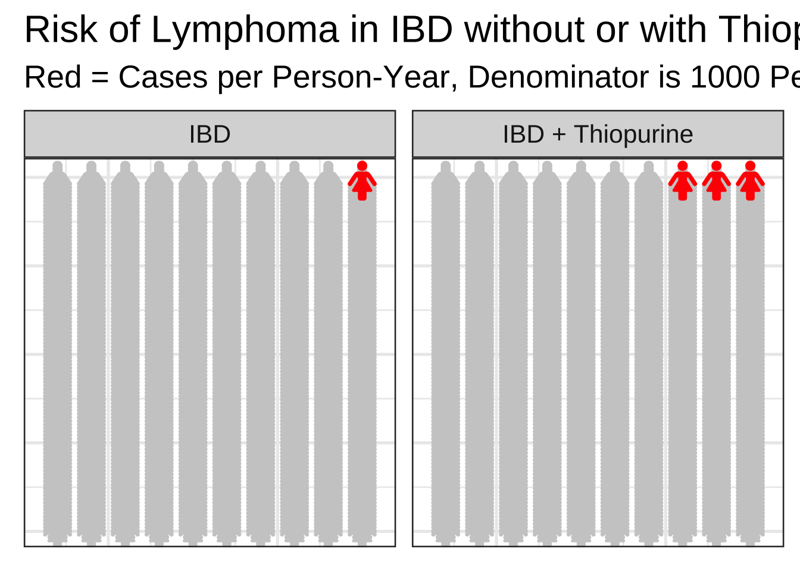

# Creating Risk Pictograms in {ggplot2}

::: tip
This chapter is part of the **Data Visualization** pathway. <br> Packages needed for this chapter include {waffle}, {tidyverse}, {hrbrthemes}, {gt}, and {emojifont}. If you don't have these packages installed, you can install them by copying the code chunk below and running it in your local RStudio session.


``` r
install.packages('hrbrthemes')
install.packages('emojifont')
install.packages('gt')
install.packages('remotes')
remotes::install_github("hrbrmstr/waffle")
```
:::

## Why Risk Pictograms?

Patients are often innumerate, and have trouble understanding risk, percentages, and fractions. While you may be able to reel off these numbers, patients will have trouble understanding and comparing these relative risks and benefits. These can be better explained with Risk Pictograms.

Today we will walk through how to make Risk Pictograms in R.

## Loading Libraries

You need to load the key libraries for this project. Copy and run the code chunk below to load these libraries into your local Rstudio session:


``` r
library(waffle)
library(tidyverse)
library(hrbrthemes)
library(emojifont)
library(gt)
load.fontawesome()
```

## Risk of Lymphoma

We will start by presenting the risk of lymphoma in patients with IBD, with or without taking a thiopurine medication, which will increase their risk. Note that these are very rough estimates for the sake of examples. First, we will read in our data estimates into a dataframe called `df`. Run the code chunk below to create this dataframe, which presents risk data per 1000 patient-years:


``` r
df <- tibble(
    group = c("IBD", "IBD", "IBD + Thiopurine", "IBD + Thiopurine"), 
        outcomes = c("Good", "Lymphoma", "Good", "Lymphoma"), 
     counts = c(999, 1, 997, 3))

df |> 
  gt()
```

```{=html}
<div id="luhclopwpg" style="padding-left:0px;padding-right:0px;padding-top:10px;padding-bottom:10px;overflow-x:auto;overflow-y:auto;width:auto;height:auto;">
<style>#luhclopwpg table {
  font-family: system-ui, 'Segoe UI', Roboto, Helvetica, Arial, sans-serif, 'Apple Color Emoji', 'Segoe UI Emoji', 'Segoe UI Symbol', 'Noto Color Emoji';
  -webkit-font-smoothing: antialiased;
  -moz-osx-font-smoothing: grayscale;
}

#luhclopwpg thead, #luhclopwpg tbody, #luhclopwpg tfoot, #luhclopwpg tr, #luhclopwpg td, #luhclopwpg th {
  border-style: none;
}

#luhclopwpg p {
  margin: 0;
  padding: 0;
}

#luhclopwpg .gt_table {
  display: table;
  border-collapse: collapse;
  line-height: normal;
  margin-left: auto;
  margin-right: auto;
  color: #333333;
  font-size: 16px;
  font-weight: normal;
  font-style: normal;
  background-color: #FFFFFF;
  width: auto;
  border-top-style: solid;
  border-top-width: 2px;
  border-top-color: #A8A8A8;
  border-right-style: none;
  border-right-width: 2px;
  border-right-color: #D3D3D3;
  border-bottom-style: solid;
  border-bottom-width: 2px;
  border-bottom-color: #A8A8A8;
  border-left-style: none;
  border-left-width: 2px;
  border-left-color: #D3D3D3;
}

#luhclopwpg .gt_caption {
  padding-top: 4px;
  padding-bottom: 4px;
}

#luhclopwpg .gt_title {
  color: #333333;
  font-size: 125%;
  font-weight: initial;
  padding-top: 4px;
  padding-bottom: 4px;
  padding-left: 5px;
  padding-right: 5px;
  border-bottom-color: #FFFFFF;
  border-bottom-width: 0;
}

#luhclopwpg .gt_subtitle {
  color: #333333;
  font-size: 85%;
  font-weight: initial;
  padding-top: 3px;
  padding-bottom: 5px;
  padding-left: 5px;
  padding-right: 5px;
  border-top-color: #FFFFFF;
  border-top-width: 0;
}

#luhclopwpg .gt_heading {
  background-color: #FFFFFF;
  text-align: center;
  border-bottom-color: #FFFFFF;
  border-left-style: none;
  border-left-width: 1px;
  border-left-color: #D3D3D3;
  border-right-style: none;
  border-right-width: 1px;
  border-right-color: #D3D3D3;
}

#luhclopwpg .gt_bottom_border {
  border-bottom-style: solid;
  border-bottom-width: 2px;
  border-bottom-color: #D3D3D3;
}

#luhclopwpg .gt_col_headings {
  border-top-style: solid;
  border-top-width: 2px;
  border-top-color: #D3D3D3;
  border-bottom-style: solid;
  border-bottom-width: 2px;
  border-bottom-color: #D3D3D3;
  border-left-style: none;
  border-left-width: 1px;
  border-left-color: #D3D3D3;
  border-right-style: none;
  border-right-width: 1px;
  border-right-color: #D3D3D3;
}

#luhclopwpg .gt_col_heading {
  color: #333333;
  background-color: #FFFFFF;
  font-size: 100%;
  font-weight: normal;
  text-transform: inherit;
  border-left-style: none;
  border-left-width: 1px;
  border-left-color: #D3D3D3;
  border-right-style: none;
  border-right-width: 1px;
  border-right-color: #D3D3D3;
  vertical-align: bottom;
  padding-top: 5px;
  padding-bottom: 6px;
  padding-left: 5px;
  padding-right: 5px;
  overflow-x: hidden;
}

#luhclopwpg .gt_column_spanner_outer {
  color: #333333;
  background-color: #FFFFFF;
  font-size: 100%;
  font-weight: normal;
  text-transform: inherit;
  padding-top: 0;
  padding-bottom: 0;
  padding-left: 4px;
  padding-right: 4px;
}

#luhclopwpg .gt_column_spanner_outer:first-child {
  padding-left: 0;
}

#luhclopwpg .gt_column_spanner_outer:last-child {
  padding-right: 0;
}

#luhclopwpg .gt_column_spanner {
  border-bottom-style: solid;
  border-bottom-width: 2px;
  border-bottom-color: #D3D3D3;
  vertical-align: bottom;
  padding-top: 5px;
  padding-bottom: 5px;
  overflow-x: hidden;
  display: inline-block;
  width: 100%;
}

#luhclopwpg .gt_spanner_row {
  border-bottom-style: hidden;
}

#luhclopwpg .gt_group_heading {
  padding-top: 8px;
  padding-bottom: 8px;
  padding-left: 5px;
  padding-right: 5px;
  color: #333333;
  background-color: #FFFFFF;
  font-size: 100%;
  font-weight: initial;
  text-transform: inherit;
  border-top-style: solid;
  border-top-width: 2px;
  border-top-color: #D3D3D3;
  border-bottom-style: solid;
  border-bottom-width: 2px;
  border-bottom-color: #D3D3D3;
  border-left-style: none;
  border-left-width: 1px;
  border-left-color: #D3D3D3;
  border-right-style: none;
  border-right-width: 1px;
  border-right-color: #D3D3D3;
  vertical-align: middle;
  text-align: left;
}

#luhclopwpg .gt_empty_group_heading {
  padding: 0.5px;
  color: #333333;
  background-color: #FFFFFF;
  font-size: 100%;
  font-weight: initial;
  border-top-style: solid;
  border-top-width: 2px;
  border-top-color: #D3D3D3;
  border-bottom-style: solid;
  border-bottom-width: 2px;
  border-bottom-color: #D3D3D3;
  vertical-align: middle;
}

#luhclopwpg .gt_from_md > :first-child {
  margin-top: 0;
}

#luhclopwpg .gt_from_md > :last-child {
  margin-bottom: 0;
}

#luhclopwpg .gt_row {
  padding-top: 8px;
  padding-bottom: 8px;
  padding-left: 5px;
  padding-right: 5px;
  margin: 10px;
  border-top-style: solid;
  border-top-width: 1px;
  border-top-color: #D3D3D3;
  border-left-style: none;
  border-left-width: 1px;
  border-left-color: #D3D3D3;
  border-right-style: none;
  border-right-width: 1px;
  border-right-color: #D3D3D3;
  vertical-align: middle;
  overflow-x: hidden;
}

#luhclopwpg .gt_stub {
  color: #333333;
  background-color: #FFFFFF;
  font-size: 100%;
  font-weight: initial;
  text-transform: inherit;
  border-right-style: solid;
  border-right-width: 2px;
  border-right-color: #D3D3D3;
  padding-left: 5px;
  padding-right: 5px;
}

#luhclopwpg .gt_stub_row_group {
  color: #333333;
  background-color: #FFFFFF;
  font-size: 100%;
  font-weight: initial;
  text-transform: inherit;
  border-right-style: solid;
  border-right-width: 2px;
  border-right-color: #D3D3D3;
  padding-left: 5px;
  padding-right: 5px;
  vertical-align: top;
}

#luhclopwpg .gt_row_group_first td {
  border-top-width: 2px;
}

#luhclopwpg .gt_row_group_first th {
  border-top-width: 2px;
}

#luhclopwpg .gt_summary_row {
  color: #333333;
  background-color: #FFFFFF;
  text-transform: inherit;
  padding-top: 8px;
  padding-bottom: 8px;
  padding-left: 5px;
  padding-right: 5px;
}

#luhclopwpg .gt_first_summary_row {
  border-top-style: solid;
  border-top-color: #D3D3D3;
}

#luhclopwpg .gt_first_summary_row.thick {
  border-top-width: 2px;
}

#luhclopwpg .gt_last_summary_row {
  padding-top: 8px;
  padding-bottom: 8px;
  padding-left: 5px;
  padding-right: 5px;
  border-bottom-style: solid;
  border-bottom-width: 2px;
  border-bottom-color: #D3D3D3;
}

#luhclopwpg .gt_grand_summary_row {
  color: #333333;
  background-color: #FFFFFF;
  text-transform: inherit;
  padding-top: 8px;
  padding-bottom: 8px;
  padding-left: 5px;
  padding-right: 5px;
}

#luhclopwpg .gt_first_grand_summary_row {
  padding-top: 8px;
  padding-bottom: 8px;
  padding-left: 5px;
  padding-right: 5px;
  border-top-style: double;
  border-top-width: 6px;
  border-top-color: #D3D3D3;
}

#luhclopwpg .gt_last_grand_summary_row_top {
  padding-top: 8px;
  padding-bottom: 8px;
  padding-left: 5px;
  padding-right: 5px;
  border-bottom-style: double;
  border-bottom-width: 6px;
  border-bottom-color: #D3D3D3;
}

#luhclopwpg .gt_striped {
  background-color: rgba(128, 128, 128, 0.05);
}

#luhclopwpg .gt_table_body {
  border-top-style: solid;
  border-top-width: 2px;
  border-top-color: #D3D3D3;
  border-bottom-style: solid;
  border-bottom-width: 2px;
  border-bottom-color: #D3D3D3;
}

#luhclopwpg .gt_footnotes {
  color: #333333;
  background-color: #FFFFFF;
  border-bottom-style: none;
  border-bottom-width: 2px;
  border-bottom-color: #D3D3D3;
  border-left-style: none;
  border-left-width: 2px;
  border-left-color: #D3D3D3;
  border-right-style: none;
  border-right-width: 2px;
  border-right-color: #D3D3D3;
}

#luhclopwpg .gt_footnote {
  margin: 0px;
  font-size: 90%;
  padding-top: 4px;
  padding-bottom: 4px;
  padding-left: 5px;
  padding-right: 5px;
}

#luhclopwpg .gt_sourcenotes {
  color: #333333;
  background-color: #FFFFFF;
  border-bottom-style: none;
  border-bottom-width: 2px;
  border-bottom-color: #D3D3D3;
  border-left-style: none;
  border-left-width: 2px;
  border-left-color: #D3D3D3;
  border-right-style: none;
  border-right-width: 2px;
  border-right-color: #D3D3D3;
}

#luhclopwpg .gt_sourcenote {
  font-size: 90%;
  padding-top: 4px;
  padding-bottom: 4px;
  padding-left: 5px;
  padding-right: 5px;
}

#luhclopwpg .gt_left {
  text-align: left;
}

#luhclopwpg .gt_center {
  text-align: center;
}

#luhclopwpg .gt_right {
  text-align: right;
  font-variant-numeric: tabular-nums;
}

#luhclopwpg .gt_font_normal {
  font-weight: normal;
}

#luhclopwpg .gt_font_bold {
  font-weight: bold;
}

#luhclopwpg .gt_font_italic {
  font-style: italic;
}

#luhclopwpg .gt_super {
  font-size: 65%;
}

#luhclopwpg .gt_footnote_marks {
  font-size: 75%;
  vertical-align: 0.4em;
  position: initial;
}

#luhclopwpg .gt_asterisk {
  font-size: 100%;
  vertical-align: 0;
}

#luhclopwpg .gt_indent_1 {
  text-indent: 5px;
}

#luhclopwpg .gt_indent_2 {
  text-indent: 10px;
}

#luhclopwpg .gt_indent_3 {
  text-indent: 15px;
}

#luhclopwpg .gt_indent_4 {
  text-indent: 20px;
}

#luhclopwpg .gt_indent_5 {
  text-indent: 25px;
}

#luhclopwpg .katex-display {
  display: inline-flex !important;
  margin-bottom: 0.75em !important;
}

#luhclopwpg div.Reactable > div.rt-table > div.rt-thead > div.rt-tr.rt-tr-group-header > div.rt-th-group:after {
  height: 0px !important;
}
</style>
<table class="gt_table" data-quarto-disable-processing="false" data-quarto-bootstrap="false">
  <thead>
    <tr class="gt_col_headings">
      <th class="gt_col_heading gt_columns_bottom_border gt_left" rowspan="1" colspan="1" scope="col" id="group">group</th>
      <th class="gt_col_heading gt_columns_bottom_border gt_left" rowspan="1" colspan="1" scope="col" id="outcomes">outcomes</th>
      <th class="gt_col_heading gt_columns_bottom_border gt_right" rowspan="1" colspan="1" scope="col" id="counts">counts</th>
    </tr>
  </thead>
  <tbody class="gt_table_body">
    <tr><td headers="group" class="gt_row gt_left">IBD</td>
<td headers="outcomes" class="gt_row gt_left">Good</td>
<td headers="counts" class="gt_row gt_right">999</td></tr>
    <tr><td headers="group" class="gt_row gt_left">IBD</td>
<td headers="outcomes" class="gt_row gt_left">Lymphoma</td>
<td headers="counts" class="gt_row gt_right">1</td></tr>
    <tr><td headers="group" class="gt_row gt_left">IBD + Thiopurine</td>
<td headers="outcomes" class="gt_row gt_left">Good</td>
<td headers="counts" class="gt_row gt_right">997</td></tr>
    <tr><td headers="group" class="gt_row gt_left">IBD + Thiopurine</td>
<td headers="outcomes" class="gt_row gt_left">Lymphoma</td>
<td headers="counts" class="gt_row gt_right">3</td></tr>
  </tbody>
  
  
</table>
</div>
```

Now let's build the pictogram. We will use the `geom_pictogram` function from the {waffle} package. We will use the female icon for persons, and red for cases of lymphoma (vs. gray60 for a good outcome). Experiment with other colors to produce a good contrast (white might work with the standard theme with a gray background) and make the lymphoma cases stand out. We will remove the axis titles, labels, and ticks, with a black and white theme.


``` r
df %>% ggplot(aes(label = outcomes)) +
    geom_pictogram(
        n_rows = 10, aes(color = outcomes, values = counts),
        family = "fontawesome-webfont",
        flip = TRUE
    ) +
    scale_label_pictogram(
        name = "Case",
        values = c("female"),
        breaks = c("IBD", "IBD + Thiopurine"),
        labels = c("Good", "Lymphoma")
    ) +
    scale_color_manual(
        name = "Case",
        values = c("Good" = "gray80", "Lymphoma" = "red"),
        breaks = c("IBD", "IBD + Thiopurine"),
        labels = c("Good", "Lymphoma")
    ) +
    facet_grid(~group) + 
      theme_bw(base_size = 20) +
   theme(axis.title =element_blank(),
        axis.text =element_blank(),
        axis.ticks =element_blank()) +
  labs(title = "Risk of Lymphoma in IBD without or with Thiopurine Therapy",
       subtitle = "Red = Cases per Person-Year, Denominator is 1000 Person-Years")
```



## Risk of Surgery in CD - Your Turn

Now we will try to present the risk of surgery in Crohn's Disease, with or without anti-TNF therapy. Note that these are very rough estimates. Copy the code chunk below to your local RStudio session, and read in the data with the code chunk below.


``` r
df <- tibble(
    group = c("Crohn's", "Crohn's", "Crohn's + Anti-TNF", "Crohn's + Anti-TNF"), 
        outcomes = c("Good", "Surgery in Lifetime", "Good", "Surgery in Lifetime"), 
     counts = c(35, 65, 65, 35))

df |> 
  gt()
```

```{=html}
<div id="yoabkuzjdt" style="padding-left:0px;padding-right:0px;padding-top:10px;padding-bottom:10px;overflow-x:auto;overflow-y:auto;width:auto;height:auto;">
<style>#yoabkuzjdt table {
  font-family: system-ui, 'Segoe UI', Roboto, Helvetica, Arial, sans-serif, 'Apple Color Emoji', 'Segoe UI Emoji', 'Segoe UI Symbol', 'Noto Color Emoji';
  -webkit-font-smoothing: antialiased;
  -moz-osx-font-smoothing: grayscale;
}

#yoabkuzjdt thead, #yoabkuzjdt tbody, #yoabkuzjdt tfoot, #yoabkuzjdt tr, #yoabkuzjdt td, #yoabkuzjdt th {
  border-style: none;
}

#yoabkuzjdt p {
  margin: 0;
  padding: 0;
}

#yoabkuzjdt .gt_table {
  display: table;
  border-collapse: collapse;
  line-height: normal;
  margin-left: auto;
  margin-right: auto;
  color: #333333;
  font-size: 16px;
  font-weight: normal;
  font-style: normal;
  background-color: #FFFFFF;
  width: auto;
  border-top-style: solid;
  border-top-width: 2px;
  border-top-color: #A8A8A8;
  border-right-style: none;
  border-right-width: 2px;
  border-right-color: #D3D3D3;
  border-bottom-style: solid;
  border-bottom-width: 2px;
  border-bottom-color: #A8A8A8;
  border-left-style: none;
  border-left-width: 2px;
  border-left-color: #D3D3D3;
}

#yoabkuzjdt .gt_caption {
  padding-top: 4px;
  padding-bottom: 4px;
}

#yoabkuzjdt .gt_title {
  color: #333333;
  font-size: 125%;
  font-weight: initial;
  padding-top: 4px;
  padding-bottom: 4px;
  padding-left: 5px;
  padding-right: 5px;
  border-bottom-color: #FFFFFF;
  border-bottom-width: 0;
}

#yoabkuzjdt .gt_subtitle {
  color: #333333;
  font-size: 85%;
  font-weight: initial;
  padding-top: 3px;
  padding-bottom: 5px;
  padding-left: 5px;
  padding-right: 5px;
  border-top-color: #FFFFFF;
  border-top-width: 0;
}

#yoabkuzjdt .gt_heading {
  background-color: #FFFFFF;
  text-align: center;
  border-bottom-color: #FFFFFF;
  border-left-style: none;
  border-left-width: 1px;
  border-left-color: #D3D3D3;
  border-right-style: none;
  border-right-width: 1px;
  border-right-color: #D3D3D3;
}

#yoabkuzjdt .gt_bottom_border {
  border-bottom-style: solid;
  border-bottom-width: 2px;
  border-bottom-color: #D3D3D3;
}

#yoabkuzjdt .gt_col_headings {
  border-top-style: solid;
  border-top-width: 2px;
  border-top-color: #D3D3D3;
  border-bottom-style: solid;
  border-bottom-width: 2px;
  border-bottom-color: #D3D3D3;
  border-left-style: none;
  border-left-width: 1px;
  border-left-color: #D3D3D3;
  border-right-style: none;
  border-right-width: 1px;
  border-right-color: #D3D3D3;
}

#yoabkuzjdt .gt_col_heading {
  color: #333333;
  background-color: #FFFFFF;
  font-size: 100%;
  font-weight: normal;
  text-transform: inherit;
  border-left-style: none;
  border-left-width: 1px;
  border-left-color: #D3D3D3;
  border-right-style: none;
  border-right-width: 1px;
  border-right-color: #D3D3D3;
  vertical-align: bottom;
  padding-top: 5px;
  padding-bottom: 6px;
  padding-left: 5px;
  padding-right: 5px;
  overflow-x: hidden;
}

#yoabkuzjdt .gt_column_spanner_outer {
  color: #333333;
  background-color: #FFFFFF;
  font-size: 100%;
  font-weight: normal;
  text-transform: inherit;
  padding-top: 0;
  padding-bottom: 0;
  padding-left: 4px;
  padding-right: 4px;
}

#yoabkuzjdt .gt_column_spanner_outer:first-child {
  padding-left: 0;
}

#yoabkuzjdt .gt_column_spanner_outer:last-child {
  padding-right: 0;
}

#yoabkuzjdt .gt_column_spanner {
  border-bottom-style: solid;
  border-bottom-width: 2px;
  border-bottom-color: #D3D3D3;
  vertical-align: bottom;
  padding-top: 5px;
  padding-bottom: 5px;
  overflow-x: hidden;
  display: inline-block;
  width: 100%;
}

#yoabkuzjdt .gt_spanner_row {
  border-bottom-style: hidden;
}

#yoabkuzjdt .gt_group_heading {
  padding-top: 8px;
  padding-bottom: 8px;
  padding-left: 5px;
  padding-right: 5px;
  color: #333333;
  background-color: #FFFFFF;
  font-size: 100%;
  font-weight: initial;
  text-transform: inherit;
  border-top-style: solid;
  border-top-width: 2px;
  border-top-color: #D3D3D3;
  border-bottom-style: solid;
  border-bottom-width: 2px;
  border-bottom-color: #D3D3D3;
  border-left-style: none;
  border-left-width: 1px;
  border-left-color: #D3D3D3;
  border-right-style: none;
  border-right-width: 1px;
  border-right-color: #D3D3D3;
  vertical-align: middle;
  text-align: left;
}

#yoabkuzjdt .gt_empty_group_heading {
  padding: 0.5px;
  color: #333333;
  background-color: #FFFFFF;
  font-size: 100%;
  font-weight: initial;
  border-top-style: solid;
  border-top-width: 2px;
  border-top-color: #D3D3D3;
  border-bottom-style: solid;
  border-bottom-width: 2px;
  border-bottom-color: #D3D3D3;
  vertical-align: middle;
}

#yoabkuzjdt .gt_from_md > :first-child {
  margin-top: 0;
}

#yoabkuzjdt .gt_from_md > :last-child {
  margin-bottom: 0;
}

#yoabkuzjdt .gt_row {
  padding-top: 8px;
  padding-bottom: 8px;
  padding-left: 5px;
  padding-right: 5px;
  margin: 10px;
  border-top-style: solid;
  border-top-width: 1px;
  border-top-color: #D3D3D3;
  border-left-style: none;
  border-left-width: 1px;
  border-left-color: #D3D3D3;
  border-right-style: none;
  border-right-width: 1px;
  border-right-color: #D3D3D3;
  vertical-align: middle;
  overflow-x: hidden;
}

#yoabkuzjdt .gt_stub {
  color: #333333;
  background-color: #FFFFFF;
  font-size: 100%;
  font-weight: initial;
  text-transform: inherit;
  border-right-style: solid;
  border-right-width: 2px;
  border-right-color: #D3D3D3;
  padding-left: 5px;
  padding-right: 5px;
}

#yoabkuzjdt .gt_stub_row_group {
  color: #333333;
  background-color: #FFFFFF;
  font-size: 100%;
  font-weight: initial;
  text-transform: inherit;
  border-right-style: solid;
  border-right-width: 2px;
  border-right-color: #D3D3D3;
  padding-left: 5px;
  padding-right: 5px;
  vertical-align: top;
}

#yoabkuzjdt .gt_row_group_first td {
  border-top-width: 2px;
}

#yoabkuzjdt .gt_row_group_first th {
  border-top-width: 2px;
}

#yoabkuzjdt .gt_summary_row {
  color: #333333;
  background-color: #FFFFFF;
  text-transform: inherit;
  padding-top: 8px;
  padding-bottom: 8px;
  padding-left: 5px;
  padding-right: 5px;
}

#yoabkuzjdt .gt_first_summary_row {
  border-top-style: solid;
  border-top-color: #D3D3D3;
}

#yoabkuzjdt .gt_first_summary_row.thick {
  border-top-width: 2px;
}

#yoabkuzjdt .gt_last_summary_row {
  padding-top: 8px;
  padding-bottom: 8px;
  padding-left: 5px;
  padding-right: 5px;
  border-bottom-style: solid;
  border-bottom-width: 2px;
  border-bottom-color: #D3D3D3;
}

#yoabkuzjdt .gt_grand_summary_row {
  color: #333333;
  background-color: #FFFFFF;
  text-transform: inherit;
  padding-top: 8px;
  padding-bottom: 8px;
  padding-left: 5px;
  padding-right: 5px;
}

#yoabkuzjdt .gt_first_grand_summary_row {
  padding-top: 8px;
  padding-bottom: 8px;
  padding-left: 5px;
  padding-right: 5px;
  border-top-style: double;
  border-top-width: 6px;
  border-top-color: #D3D3D3;
}

#yoabkuzjdt .gt_last_grand_summary_row_top {
  padding-top: 8px;
  padding-bottom: 8px;
  padding-left: 5px;
  padding-right: 5px;
  border-bottom-style: double;
  border-bottom-width: 6px;
  border-bottom-color: #D3D3D3;
}

#yoabkuzjdt .gt_striped {
  background-color: rgba(128, 128, 128, 0.05);
}

#yoabkuzjdt .gt_table_body {
  border-top-style: solid;
  border-top-width: 2px;
  border-top-color: #D3D3D3;
  border-bottom-style: solid;
  border-bottom-width: 2px;
  border-bottom-color: #D3D3D3;
}

#yoabkuzjdt .gt_footnotes {
  color: #333333;
  background-color: #FFFFFF;
  border-bottom-style: none;
  border-bottom-width: 2px;
  border-bottom-color: #D3D3D3;
  border-left-style: none;
  border-left-width: 2px;
  border-left-color: #D3D3D3;
  border-right-style: none;
  border-right-width: 2px;
  border-right-color: #D3D3D3;
}

#yoabkuzjdt .gt_footnote {
  margin: 0px;
  font-size: 90%;
  padding-top: 4px;
  padding-bottom: 4px;
  padding-left: 5px;
  padding-right: 5px;
}

#yoabkuzjdt .gt_sourcenotes {
  color: #333333;
  background-color: #FFFFFF;
  border-bottom-style: none;
  border-bottom-width: 2px;
  border-bottom-color: #D3D3D3;
  border-left-style: none;
  border-left-width: 2px;
  border-left-color: #D3D3D3;
  border-right-style: none;
  border-right-width: 2px;
  border-right-color: #D3D3D3;
}

#yoabkuzjdt .gt_sourcenote {
  font-size: 90%;
  padding-top: 4px;
  padding-bottom: 4px;
  padding-left: 5px;
  padding-right: 5px;
}

#yoabkuzjdt .gt_left {
  text-align: left;
}

#yoabkuzjdt .gt_center {
  text-align: center;
}

#yoabkuzjdt .gt_right {
  text-align: right;
  font-variant-numeric: tabular-nums;
}

#yoabkuzjdt .gt_font_normal {
  font-weight: normal;
}

#yoabkuzjdt .gt_font_bold {
  font-weight: bold;
}

#yoabkuzjdt .gt_font_italic {
  font-style: italic;
}

#yoabkuzjdt .gt_super {
  font-size: 65%;
}

#yoabkuzjdt .gt_footnote_marks {
  font-size: 75%;
  vertical-align: 0.4em;
  position: initial;
}

#yoabkuzjdt .gt_asterisk {
  font-size: 100%;
  vertical-align: 0;
}

#yoabkuzjdt .gt_indent_1 {
  text-indent: 5px;
}

#yoabkuzjdt .gt_indent_2 {
  text-indent: 10px;
}

#yoabkuzjdt .gt_indent_3 {
  text-indent: 15px;
}

#yoabkuzjdt .gt_indent_4 {
  text-indent: 20px;
}

#yoabkuzjdt .gt_indent_5 {
  text-indent: 25px;
}

#yoabkuzjdt .katex-display {
  display: inline-flex !important;
  margin-bottom: 0.75em !important;
}

#yoabkuzjdt div.Reactable > div.rt-table > div.rt-thead > div.rt-tr.rt-tr-group-header > div.rt-th-group:after {
  height: 0px !important;
}
</style>
<table class="gt_table" data-quarto-disable-processing="false" data-quarto-bootstrap="false">
  <thead>
    <tr class="gt_col_headings">
      <th class="gt_col_heading gt_columns_bottom_border gt_left" rowspan="1" colspan="1" scope="col" id="group">group</th>
      <th class="gt_col_heading gt_columns_bottom_border gt_left" rowspan="1" colspan="1" scope="col" id="outcomes">outcomes</th>
      <th class="gt_col_heading gt_columns_bottom_border gt_right" rowspan="1" colspan="1" scope="col" id="counts">counts</th>
    </tr>
  </thead>
  <tbody class="gt_table_body">
    <tr><td headers="group" class="gt_row gt_left">Crohn's</td>
<td headers="outcomes" class="gt_row gt_left">Good</td>
<td headers="counts" class="gt_row gt_right">35</td></tr>
    <tr><td headers="group" class="gt_row gt_left">Crohn's</td>
<td headers="outcomes" class="gt_row gt_left">Surgery in Lifetime</td>
<td headers="counts" class="gt_row gt_right">65</td></tr>
    <tr><td headers="group" class="gt_row gt_left">Crohn's + Anti-TNF</td>
<td headers="outcomes" class="gt_row gt_left">Good</td>
<td headers="counts" class="gt_row gt_right">65</td></tr>
    <tr><td headers="group" class="gt_row gt_left">Crohn's + Anti-TNF</td>
<td headers="outcomes" class="gt_row gt_left">Surgery in Lifetime</td>
<td headers="counts" class="gt_row gt_right">35</td></tr>
  </tbody>
  
  
</table>
</div>
```

Using the Risk Pictogram example above, try to create one for the risk of surgery in Crohn's Disease, with or without anti-TNF therapy. Use the 'male' icon for persons, and red for cases of surgery (vs. gray60 for a good outcome). We will remove the axis titles, labels, and ticks, with a black and white theme and a base font size of 18.

You can select different icons from the fontawesome web icons at this [website](https://fontawesome.com/search?ic=free). Try searching for icons for 'medical', 'scissors', 'health', or 'doctor' to find an appropriate icon for other health outcomes.

Give this a try in your local RStudio environment. If you need help, the solution is below.


<div class='webex-solution'><button>Solution</button>


``` r
df %>% ggplot(aes(label = outcomes)) +
    geom_pictogram(
        n_rows = 10, aes(color = outcomes, values = counts),
        family = "fontawesome-webfont",
        flip = TRUE
    ) +
    scale_label_pictogram(
        name = "Case",
        values = c("male"), #icon - could be male
        breaks = c("Crohn's", "Crohn's + TNF"),
        labels = c("Good", "Surgery")
    ) +
    scale_color_manual(
        name = "Case",
        values = c("Good" = "gray60", "Surgery in Lifetime" = "red"),
        breaks = c("Crohn's", "Crohn's + TNF"),
        labels = c("Good", "Surgery in Lifetime")
    ) +
    facet_grid(~group) + 
   coord_equal() +
  theme_bw( base_size = 18) +
   theme(axis.title =element_blank(),
        axis.text =element_blank(),
        axis.ticks =element_blank()) +
  theme(panel.grid.major = element_blank(), panel.grid.minor = element_blank()) +
  labs(title = "Risk of Surgery in Crohn's without or with anti-TNF Therapy",
       subtitle = "Red: Surgery Required at Least Once in Lifetime, \nDenominator is 100 Persons")
```


</div>


## Risk of Hepatocellular Carcinoma with Hepatitis C Virus and Alcoholism - Your Turn

Now we will try to present the risk of hepatocellular carcinoma in patients with no liver problems, or Hepatitis C Virus, with or without alcoholism. Copy the code chunk below to your local RStudio session, and read in the data with the code chunk below. Note that these are very rough estimates.


``` r
df <- tibble(
    group = c("No Liver Problems", "No Liver Problems", "Hepatitis C", "Hepatitis C", "Hepatitis C + Alcoholism", "Hepatitis C + Alcoholism"), 
        outcomes = c("Good", "HCC", "Good", "HCC", "Good", "HCC"), 
     counts = c(99, 1, 96, 4, 80, 20)) |> 
  mutate(group = factor(group, levels = c("No Liver Problems", "Hepatitis C", "Hepatitis C + Alcoholism")))

df |>
  gt()
```

```{=html}
<div id="rwygiyzrph" style="padding-left:0px;padding-right:0px;padding-top:10px;padding-bottom:10px;overflow-x:auto;overflow-y:auto;width:auto;height:auto;">
<style>#rwygiyzrph table {
  font-family: system-ui, 'Segoe UI', Roboto, Helvetica, Arial, sans-serif, 'Apple Color Emoji', 'Segoe UI Emoji', 'Segoe UI Symbol', 'Noto Color Emoji';
  -webkit-font-smoothing: antialiased;
  -moz-osx-font-smoothing: grayscale;
}

#rwygiyzrph thead, #rwygiyzrph tbody, #rwygiyzrph tfoot, #rwygiyzrph tr, #rwygiyzrph td, #rwygiyzrph th {
  border-style: none;
}

#rwygiyzrph p {
  margin: 0;
  padding: 0;
}

#rwygiyzrph .gt_table {
  display: table;
  border-collapse: collapse;
  line-height: normal;
  margin-left: auto;
  margin-right: auto;
  color: #333333;
  font-size: 16px;
  font-weight: normal;
  font-style: normal;
  background-color: #FFFFFF;
  width: auto;
  border-top-style: solid;
  border-top-width: 2px;
  border-top-color: #A8A8A8;
  border-right-style: none;
  border-right-width: 2px;
  border-right-color: #D3D3D3;
  border-bottom-style: solid;
  border-bottom-width: 2px;
  border-bottom-color: #A8A8A8;
  border-left-style: none;
  border-left-width: 2px;
  border-left-color: #D3D3D3;
}

#rwygiyzrph .gt_caption {
  padding-top: 4px;
  padding-bottom: 4px;
}

#rwygiyzrph .gt_title {
  color: #333333;
  font-size: 125%;
  font-weight: initial;
  padding-top: 4px;
  padding-bottom: 4px;
  padding-left: 5px;
  padding-right: 5px;
  border-bottom-color: #FFFFFF;
  border-bottom-width: 0;
}

#rwygiyzrph .gt_subtitle {
  color: #333333;
  font-size: 85%;
  font-weight: initial;
  padding-top: 3px;
  padding-bottom: 5px;
  padding-left: 5px;
  padding-right: 5px;
  border-top-color: #FFFFFF;
  border-top-width: 0;
}

#rwygiyzrph .gt_heading {
  background-color: #FFFFFF;
  text-align: center;
  border-bottom-color: #FFFFFF;
  border-left-style: none;
  border-left-width: 1px;
  border-left-color: #D3D3D3;
  border-right-style: none;
  border-right-width: 1px;
  border-right-color: #D3D3D3;
}

#rwygiyzrph .gt_bottom_border {
  border-bottom-style: solid;
  border-bottom-width: 2px;
  border-bottom-color: #D3D3D3;
}

#rwygiyzrph .gt_col_headings {
  border-top-style: solid;
  border-top-width: 2px;
  border-top-color: #D3D3D3;
  border-bottom-style: solid;
  border-bottom-width: 2px;
  border-bottom-color: #D3D3D3;
  border-left-style: none;
  border-left-width: 1px;
  border-left-color: #D3D3D3;
  border-right-style: none;
  border-right-width: 1px;
  border-right-color: #D3D3D3;
}

#rwygiyzrph .gt_col_heading {
  color: #333333;
  background-color: #FFFFFF;
  font-size: 100%;
  font-weight: normal;
  text-transform: inherit;
  border-left-style: none;
  border-left-width: 1px;
  border-left-color: #D3D3D3;
  border-right-style: none;
  border-right-width: 1px;
  border-right-color: #D3D3D3;
  vertical-align: bottom;
  padding-top: 5px;
  padding-bottom: 6px;
  padding-left: 5px;
  padding-right: 5px;
  overflow-x: hidden;
}

#rwygiyzrph .gt_column_spanner_outer {
  color: #333333;
  background-color: #FFFFFF;
  font-size: 100%;
  font-weight: normal;
  text-transform: inherit;
  padding-top: 0;
  padding-bottom: 0;
  padding-left: 4px;
  padding-right: 4px;
}

#rwygiyzrph .gt_column_spanner_outer:first-child {
  padding-left: 0;
}

#rwygiyzrph .gt_column_spanner_outer:last-child {
  padding-right: 0;
}

#rwygiyzrph .gt_column_spanner {
  border-bottom-style: solid;
  border-bottom-width: 2px;
  border-bottom-color: #D3D3D3;
  vertical-align: bottom;
  padding-top: 5px;
  padding-bottom: 5px;
  overflow-x: hidden;
  display: inline-block;
  width: 100%;
}

#rwygiyzrph .gt_spanner_row {
  border-bottom-style: hidden;
}

#rwygiyzrph .gt_group_heading {
  padding-top: 8px;
  padding-bottom: 8px;
  padding-left: 5px;
  padding-right: 5px;
  color: #333333;
  background-color: #FFFFFF;
  font-size: 100%;
  font-weight: initial;
  text-transform: inherit;
  border-top-style: solid;
  border-top-width: 2px;
  border-top-color: #D3D3D3;
  border-bottom-style: solid;
  border-bottom-width: 2px;
  border-bottom-color: #D3D3D3;
  border-left-style: none;
  border-left-width: 1px;
  border-left-color: #D3D3D3;
  border-right-style: none;
  border-right-width: 1px;
  border-right-color: #D3D3D3;
  vertical-align: middle;
  text-align: left;
}

#rwygiyzrph .gt_empty_group_heading {
  padding: 0.5px;
  color: #333333;
  background-color: #FFFFFF;
  font-size: 100%;
  font-weight: initial;
  border-top-style: solid;
  border-top-width: 2px;
  border-top-color: #D3D3D3;
  border-bottom-style: solid;
  border-bottom-width: 2px;
  border-bottom-color: #D3D3D3;
  vertical-align: middle;
}

#rwygiyzrph .gt_from_md > :first-child {
  margin-top: 0;
}

#rwygiyzrph .gt_from_md > :last-child {
  margin-bottom: 0;
}

#rwygiyzrph .gt_row {
  padding-top: 8px;
  padding-bottom: 8px;
  padding-left: 5px;
  padding-right: 5px;
  margin: 10px;
  border-top-style: solid;
  border-top-width: 1px;
  border-top-color: #D3D3D3;
  border-left-style: none;
  border-left-width: 1px;
  border-left-color: #D3D3D3;
  border-right-style: none;
  border-right-width: 1px;
  border-right-color: #D3D3D3;
  vertical-align: middle;
  overflow-x: hidden;
}

#rwygiyzrph .gt_stub {
  color: #333333;
  background-color: #FFFFFF;
  font-size: 100%;
  font-weight: initial;
  text-transform: inherit;
  border-right-style: solid;
  border-right-width: 2px;
  border-right-color: #D3D3D3;
  padding-left: 5px;
  padding-right: 5px;
}

#rwygiyzrph .gt_stub_row_group {
  color: #333333;
  background-color: #FFFFFF;
  font-size: 100%;
  font-weight: initial;
  text-transform: inherit;
  border-right-style: solid;
  border-right-width: 2px;
  border-right-color: #D3D3D3;
  padding-left: 5px;
  padding-right: 5px;
  vertical-align: top;
}

#rwygiyzrph .gt_row_group_first td {
  border-top-width: 2px;
}

#rwygiyzrph .gt_row_group_first th {
  border-top-width: 2px;
}

#rwygiyzrph .gt_summary_row {
  color: #333333;
  background-color: #FFFFFF;
  text-transform: inherit;
  padding-top: 8px;
  padding-bottom: 8px;
  padding-left: 5px;
  padding-right: 5px;
}

#rwygiyzrph .gt_first_summary_row {
  border-top-style: solid;
  border-top-color: #D3D3D3;
}

#rwygiyzrph .gt_first_summary_row.thick {
  border-top-width: 2px;
}

#rwygiyzrph .gt_last_summary_row {
  padding-top: 8px;
  padding-bottom: 8px;
  padding-left: 5px;
  padding-right: 5px;
  border-bottom-style: solid;
  border-bottom-width: 2px;
  border-bottom-color: #D3D3D3;
}

#rwygiyzrph .gt_grand_summary_row {
  color: #333333;
  background-color: #FFFFFF;
  text-transform: inherit;
  padding-top: 8px;
  padding-bottom: 8px;
  padding-left: 5px;
  padding-right: 5px;
}

#rwygiyzrph .gt_first_grand_summary_row {
  padding-top: 8px;
  padding-bottom: 8px;
  padding-left: 5px;
  padding-right: 5px;
  border-top-style: double;
  border-top-width: 6px;
  border-top-color: #D3D3D3;
}

#rwygiyzrph .gt_last_grand_summary_row_top {
  padding-top: 8px;
  padding-bottom: 8px;
  padding-left: 5px;
  padding-right: 5px;
  border-bottom-style: double;
  border-bottom-width: 6px;
  border-bottom-color: #D3D3D3;
}

#rwygiyzrph .gt_striped {
  background-color: rgba(128, 128, 128, 0.05);
}

#rwygiyzrph .gt_table_body {
  border-top-style: solid;
  border-top-width: 2px;
  border-top-color: #D3D3D3;
  border-bottom-style: solid;
  border-bottom-width: 2px;
  border-bottom-color: #D3D3D3;
}

#rwygiyzrph .gt_footnotes {
  color: #333333;
  background-color: #FFFFFF;
  border-bottom-style: none;
  border-bottom-width: 2px;
  border-bottom-color: #D3D3D3;
  border-left-style: none;
  border-left-width: 2px;
  border-left-color: #D3D3D3;
  border-right-style: none;
  border-right-width: 2px;
  border-right-color: #D3D3D3;
}

#rwygiyzrph .gt_footnote {
  margin: 0px;
  font-size: 90%;
  padding-top: 4px;
  padding-bottom: 4px;
  padding-left: 5px;
  padding-right: 5px;
}

#rwygiyzrph .gt_sourcenotes {
  color: #333333;
  background-color: #FFFFFF;
  border-bottom-style: none;
  border-bottom-width: 2px;
  border-bottom-color: #D3D3D3;
  border-left-style: none;
  border-left-width: 2px;
  border-left-color: #D3D3D3;
  border-right-style: none;
  border-right-width: 2px;
  border-right-color: #D3D3D3;
}

#rwygiyzrph .gt_sourcenote {
  font-size: 90%;
  padding-top: 4px;
  padding-bottom: 4px;
  padding-left: 5px;
  padding-right: 5px;
}

#rwygiyzrph .gt_left {
  text-align: left;
}

#rwygiyzrph .gt_center {
  text-align: center;
}

#rwygiyzrph .gt_right {
  text-align: right;
  font-variant-numeric: tabular-nums;
}

#rwygiyzrph .gt_font_normal {
  font-weight: normal;
}

#rwygiyzrph .gt_font_bold {
  font-weight: bold;
}

#rwygiyzrph .gt_font_italic {
  font-style: italic;
}

#rwygiyzrph .gt_super {
  font-size: 65%;
}

#rwygiyzrph .gt_footnote_marks {
  font-size: 75%;
  vertical-align: 0.4em;
  position: initial;
}

#rwygiyzrph .gt_asterisk {
  font-size: 100%;
  vertical-align: 0;
}

#rwygiyzrph .gt_indent_1 {
  text-indent: 5px;
}

#rwygiyzrph .gt_indent_2 {
  text-indent: 10px;
}

#rwygiyzrph .gt_indent_3 {
  text-indent: 15px;
}

#rwygiyzrph .gt_indent_4 {
  text-indent: 20px;
}

#rwygiyzrph .gt_indent_5 {
  text-indent: 25px;
}

#rwygiyzrph .katex-display {
  display: inline-flex !important;
  margin-bottom: 0.75em !important;
}

#rwygiyzrph div.Reactable > div.rt-table > div.rt-thead > div.rt-tr.rt-tr-group-header > div.rt-th-group:after {
  height: 0px !important;
}
</style>
<table class="gt_table" data-quarto-disable-processing="false" data-quarto-bootstrap="false">
  <thead>
    <tr class="gt_col_headings">
      <th class="gt_col_heading gt_columns_bottom_border gt_center" rowspan="1" colspan="1" scope="col" id="group">group</th>
      <th class="gt_col_heading gt_columns_bottom_border gt_left" rowspan="1" colspan="1" scope="col" id="outcomes">outcomes</th>
      <th class="gt_col_heading gt_columns_bottom_border gt_right" rowspan="1" colspan="1" scope="col" id="counts">counts</th>
    </tr>
  </thead>
  <tbody class="gt_table_body">
    <tr><td headers="group" class="gt_row gt_center">No Liver Problems</td>
<td headers="outcomes" class="gt_row gt_left">Good</td>
<td headers="counts" class="gt_row gt_right">99</td></tr>
    <tr><td headers="group" class="gt_row gt_center">No Liver Problems</td>
<td headers="outcomes" class="gt_row gt_left">HCC</td>
<td headers="counts" class="gt_row gt_right">1</td></tr>
    <tr><td headers="group" class="gt_row gt_center">Hepatitis C</td>
<td headers="outcomes" class="gt_row gt_left">Good</td>
<td headers="counts" class="gt_row gt_right">96</td></tr>
    <tr><td headers="group" class="gt_row gt_center">Hepatitis C</td>
<td headers="outcomes" class="gt_row gt_left">HCC</td>
<td headers="counts" class="gt_row gt_right">4</td></tr>
    <tr><td headers="group" class="gt_row gt_center">Hepatitis C + Alcoholism</td>
<td headers="outcomes" class="gt_row gt_left">Good</td>
<td headers="counts" class="gt_row gt_right">80</td></tr>
    <tr><td headers="group" class="gt_row gt_center">Hepatitis C + Alcoholism</td>
<td headers="outcomes" class="gt_row gt_left">HCC</td>
<td headers="counts" class="gt_row gt_right">20</td></tr>
  </tbody>
  
  
</table>
</div>
```

Using the Risk Pictogram examples above, try to create one for the risk of hepatocellular carcinoma in patients with no liver problems, or Hepatitis C Virus, with or without alcoholism. Use the 'hospital' icon for persons, and red for cases of HCC (vs. gray60 for a good outcome). We will remove the axis titles, labels, and ticks, with a black and white theme and a base font size of 18.

Give this a try in your local RStudio environment. If you need help, the solution is below.


<div class='webex-solution'><button>Solution</button>


``` r
df %>% ggplot(aes(label = outcomes)) +
    geom_pictogram(
        n_rows = 10, aes(color = outcomes, values = counts),
        family = "fontawesome-webfont",
        flip = TRUE
    ) +
    scale_label_pictogram(
        name = "Case",
        values = c("hospital"), #icon - could be hospital
        labels = c("Good", "HCC")
    ) +
    scale_color_manual(
        name = "Case",
        values = c("Good" = "gray60", "HCC" = "red"),

        labels = c("Good", "HCC")
    ) +
    facet_grid(~group) + 
   coord_equal() +
  theme_bw( base_size = 14) +
   theme(axis.title =element_blank(),
        axis.text =element_blank(),
        axis.ticks =element_blank()) +
  theme(panel.grid.major = element_blank(), panel.grid.minor = element_blank()) +
  labs(title = "Risk of Hepatocellular Carcinoma in Patients with No Liver Problems, \nHepatitis C, or Hepatitis C + Alcoholism",
       subtitle = "Red: Cases per 1000 Person-Years")
```


</div>

