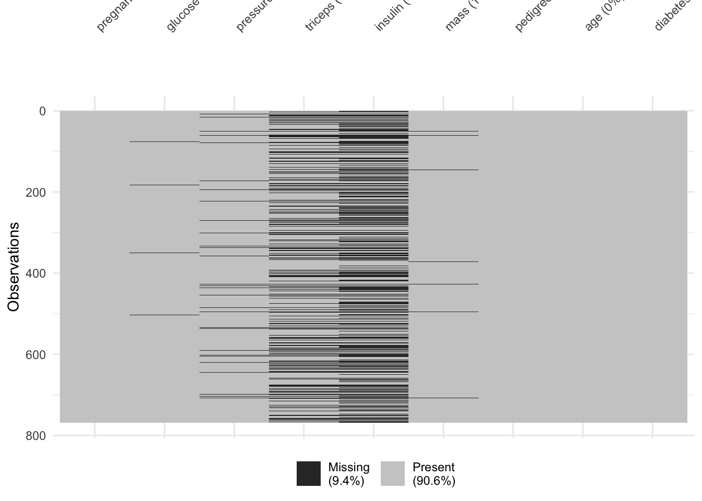
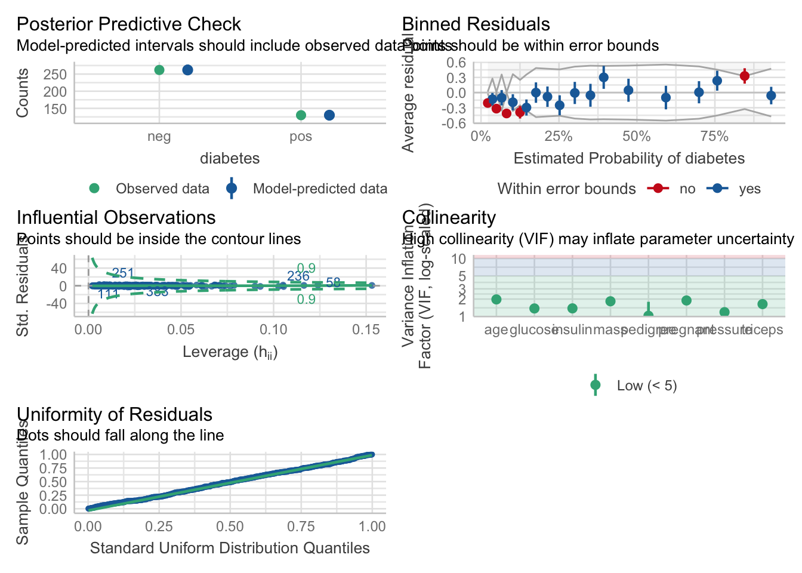
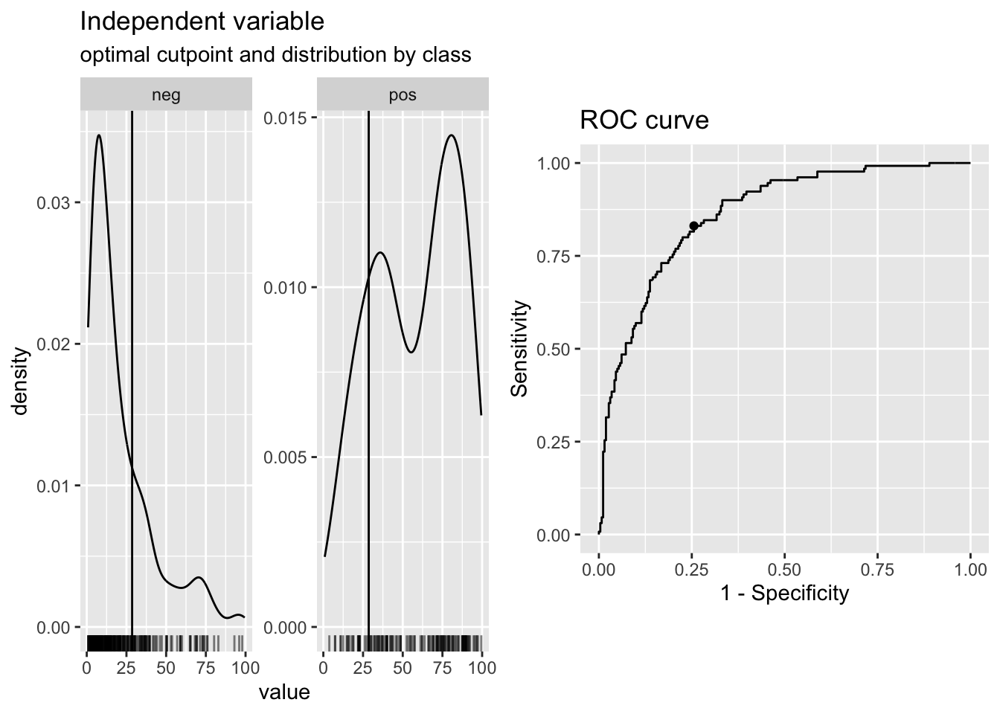

# Logistic Regression and Broom for Tidying Models

Logistic regression allows you to:

1. Estimate the effects of predictors (independent variables) on an dichotomous outcome (dependent variable), like alive/dead, remission/not in remission.

2. Make predictions about future cases (patients) with their measured predictors on this continuous outcome.

Let’s look at a simple logistic model to predict recurrence in prostate cancer.


```r
prostate <- medicaldata::blood_storage %>% 
  janitor::clean_names()

prostate %>% 
  glm(formula = recurrence ~ fam_hx + b_gs,
      data = .,
      family = binomial) ->
prostate_model

prostate_model
```

```
## 
## Call:  glm(formula = recurrence ~ fam_hx + b_gs, family = binomial, 
##     data = .)
## 
## Coefficients:
## (Intercept)       fam_hx         b_gs  
##     -3.4485      -0.8983       1.1839  
## 
## Degrees of Freedom: 313 Total (i.e. Null);  311 Residual
##   (2 observations deleted due to missingness)
## Null Deviance:	    281.9 
## Residual Deviance: 246.8 	AIC: 252.8
```

We use the glm() function from the base stats package, which is for *generalized linear model*. This function can use a variety of model families, including logistic, poisson, gamma, quasibinomial, gamma, etc., and the family of models needs to be specified in the family argument.

The formula for the dependent variable (outcome) ~ independent variables (predictors) is the same as with linear modeling with the *lm()* function.

We specify the dataset with the *data* argument, and when we the pipe, we set `data = .`.

When you print out the prostate model, you get the 

- Call (the glm function and arguments) 
- the coefficients for the intercept and each predictor 
- the degrees of freedom 
- how many observations were deleted due to missingness (IMPORTANT, DO NOT BLOW BY THIS),  
- two values for Deviance and 
- AIC.

Let’s walk through what these mean: 

- the **coefficients** estimate how much a change of one unit in each predictor will affect the outcome (in logit units - more about this later).

- The **degrees of freedom** are related to the number of observations, and how many predictors you have used. If you look at the mean value in the prostate dataset for recurrence, it is 0.1708861, which means that 17% of the participants experienced a recurrence of prostate cancer. If you are calculating the mean of 315 of the 316 observations, and you know the overall mean of all 315, you (mathematically) **know** the value of the last observation - recurrence or not - it has no degrees of freedom. So for 316 observations, you have n-1 or 315, degrees of freedom. For each predictor in your model you ‘use up’ one degree of freedom. The degrees of freedom affect the significance of the test statistic (T, or chi-squared, or F statistic).

- how many **observations were deleted due to missingness** - the logistic model will only work on *complete cases*, so if one of your predictors or the outcome is frequently missing, your effective dataset size will shrink rapidly. You want to know if this is an issue, as this might change which predictors you use (avoid frequently missing ones), or lead you to consider imputation of missing values.

- Null Deviance and Residual Deviance. The null deviance is measured for the null model, with only an intercept. The residual deviance is measured for your model with predictors. Your residual deviance **should** be lower than the null deviance. You can even measure whether your model is significantly better than the null model by calculating the difference between the Null Deviance and the Residual Deviance. This difference [281.9 - 246.8 = 35.1] has a chi-square distribution. You can look up the value for chi-square with 2 degrees (because you had 2 predictors) of freedom. Or you can calculate this in R with pchisq(q = 35.1, df=2, lower.tail = TRUE) which gives you a p value of 1.

- The **AIC** is Aikaike’s Information Criterion, which estimates prediction error. A lower values is better when comparing similar models.

## The Model Summary

You can get more information from a summary of the model.


```r
summary(prostate_model)
```

```
## 
## Call:
## glm(formula = recurrence ~ fam_hx + b_gs, family = binomial, 
##     data = .)
## 
## Coefficients:
##             Estimate Std. Error z value            Pr(>|z|)
## (Intercept)  -3.4485     0.4347  -7.932 0.00000000000000215
## fam_hx       -0.8983     0.4785  -1.877              0.0605
## b_gs          1.1839     0.2193   5.399 0.00000006698872947
##                
## (Intercept) ***
## fam_hx      .  
## b_gs        ***
## ---
## Signif. codes:  
## 0 '***' 0.001 '**' 0.01 '*' 0.05 '.' 0.1 ' ' 1
## 
## (Dispersion parameter for binomial family taken to be 1)
## 
##     Null deviance: 281.88  on 313  degrees of freedom
## Residual deviance: 246.81  on 311  degrees of freedom
##   (2 observations deleted due to missingness)
## AIC: 252.81
## 
## Number of Fisher Scoring iterations: 5
```


Again, you get the call (to orient you to which model). The Deviance Residuals should have a Median near zero, and be roughly symmetric around zero. If the median is close to zero, the model is not biased in one direction (the outcome is not over- nor under-estimated).

Now, in addition to estimates, we get standard errors for each estimate (which can be used to calculate confidence intervals), z statistic values for each predictor, and the resulting p value (calculated with the statistic and the degrees of freedom). As a general rule of thumb, a z value with an absolute value of > 1.96 should have a p value less than 0.05, and an absolute value > 2.576 should have a p value of less than 0.01. These values should sound familiar from the normal distribution (95% and 99% confidence interval Z values).

## Evaluating your Model Assumptions

You can do this in base R with `plot(model)`, but there is a prettier version in the {performance} package in the {easystats} meta-package. Just run the `check_model()` function on your model. You can set the argument panel = TRUE for a multipanel figure, or panel = FALSE for single figures in the Plots tab. Try it both ways to see which you prefer. If the multipanel seems too small, click on the Zoom button in the Plots tab to make it bigger.


```r
check_model(prostate_model, panel = FALSE)
```

This generates graphs with nice subtitles to help you interpret the output. Big deviations should make you worry about one or more of the model assumptions, and may require rescaling one of your predictors.

If all is well, you want to look at how your model predictors actually predict the outcome. You make a nicer looking regression table with the tidy() function from the {broom} package.


```r
prostate_model %>% 
      broom::tidy()
```

```
## # A tibble: 3 × 5
##   term        estimate std.error statistic  p.value
##   <chr>          <dbl>     <dbl>     <dbl>    <dbl>
## 1 (Intercept)   -3.45      0.435     -7.93 2.15e-15
## 2 fam_hx        -0.898     0.478     -1.88 6.05e- 2
## 3 b_gs           1.18      0.219      5.40 6.70e- 8
```

This model has 3 terms: an intercept, and two predictors. The family history predictor (fam_hx) is not significant, but trends toward an association with a decreased odds of recurrence, while the baseline Gleason score (b_gs) is significant and is associated with an 18% increased log-odds of recurrence for each extra point in the Gleason score. Note that this is expressed in logit, or log-odds, not probability, which can take some finagling to get to percentages and probabilities.

A positive estimate indicates that increasing that predictor will be associated with increasing odds of the outcome. Conversely, a negative estimate indicates that increasing that predictor will be associated with decreasing odds of the outcome.

The quantity log[p/(1-p)] is called the logarithm of the odds, also known as the log-odds or logit. Despite this being commonly written as “log”, it is not base 10 logarithms, but the natural log, with the base e (2.718…). Why would anyone use logit? It is really hard to model zeroes and ones (dichotomous outcomes). The logit is a link function, or a way to convert zeroes and ones to a continuous function that does not cross zero or one. Once you have a continuous function, you can use generalized linear models to model it. Why not just model probability? For complicated mathematical reasons, it was easier to convert probabilities to odds and then take the natural log. There will be times when using logistic regression that it will be fairly painful to convert between probabilities and odds and logit units. But R has functions to do that for us. We just have to **watch out** for when we have probabilities vs. odds vs. logit.

One way is to look at the range of the estimates. Probabilities always have a range from zero to 1. Logit units generally range from about -4 to +4, with zero meaning an equal probability of no event or the event outcome occurring. Odds ratios can range from very small (but positive) numbers to very large positive numbers.

You can see this by re-running broom::tidy() with the exp = TRUE option. This will exponentiate the logit, or log-odds estimates, to give us the estimates as odds ratios.


```r
prostate_model %>% 
      broom::tidy(exp = TRUE)
```

```
## # A tibble: 3 × 5
##   term        estimate std.error statistic  p.value
##   <chr>          <dbl>     <dbl>     <dbl>    <dbl>
## 1 (Intercept)   0.0318     0.435     -7.93 2.15e-15
## 2 fam_hx        0.407      0.478     -1.88 6.05e- 2
## 3 b_gs          3.27       0.219      5.40 6.70e- 8
```

Now the estimates are all positive, with the *previously* most negative (intercept was logit -3.45) now being a small positive number of 0.0318, and the most positive (b_gs was logit 1.18) now a larger positive odds ratio of 3.27.

These odds ratios versions of the estimates are more easily interpretable than logit scores. Odds ratios of less than one means that an increase in that predictor makes the outcome **less** likely to occur, and an odds ratio of greater than one means that an increase in that predictor makes the outcome **more** likely to occur. For example, the odds ratio estimate of 0.407 means that for someone with a positive family history of prostate cancer, the odds of their having a recurrence are 59.3% ((1-0.407) x 100) lower than someone without a family history. Similarly, for each unit increase in the baseline Gleason score (b_gs), the odds of recurrence increase by 227% ((3.27-1) x 100).

:::tryit
## Converting between logit, odds ratios, and probability

Let’s step back and try a real-world example. If the percent probability of snow on january 10th is 72%, then p, the probability is 0.72. The probability of no snow (1-p) is 1-0.72 = 0.28. The odds of snow are p/(1-p) = 0.72/0.28 = 2.57. If we take the natural log of these odds, this gives us an estimate in logit terms, with ln(2.57) = 0.944. This estimate in logit units is what you get as a default estimate from logistic regression.

To convert these logit estimates back to probability, you need to do the reverse. First, exponentiate the logit estimate of 0.944, exp(0.944) = 2.57. This is the odds ratio. To convert odds to probability - calculate odds / (1 + odds) = 2.57/3.57 = 0.72, which is the probability. To get the percent probability, you can multiply the probability by 100 to get 72%.

Fortunately, R has functions to help us do this sort of conversion. You just have to be able to recognize which units (logit, odds, or probability) that you are looking at.
:::

We can look at the overall quality of the model with the glance() function in {broom}. Let’s look at 2 versions of the model, one with **fam_hx** only, and one with both predictors.


```r
prostate %>% 
  glm(recurrence ~ fam_hx,
      data = .,
      family = binomial) %>% 
      broom::glance()
```

```
## # A tibble: 1 × 8
##   null.deviance df.null logLik   AIC   BIC deviance
##           <dbl>   <int>  <dbl> <dbl> <dbl>    <dbl>
## 1          289.     315  -142.  288.  296.     284.
## # ℹ 2 more variables: df.residual <int>, nobs <int>
```

```r
prostate %>% 
  glm(recurrence ~ fam_hx + b_gs,
      data = .,
      family = binomial) %>% 
      broom::glance()
```

```
## # A tibble: 1 × 8
##   null.deviance df.null logLik   AIC   BIC deviance
##           <dbl>   <int>  <dbl> <dbl> <dbl>    <dbl>
## 1          282.     313  -123.  253.  264.     247.
## # ℹ 2 more variables: df.residual <int>, nobs <int>
```

You can see that adding the baseline Gleason score improves the model, as it lowers both AIC and BIC. This is not surprising, as it was a significant predictor.

You can add predicted (fitted) values and residuals for each observation in your dataset with `broom::augment()`


```r
model <- prostate %>% 
  glm(recurrence ~ fam_hx + b_gs,
      data = .,
      family = binomial) 
augment(model)
```

```
## # A tibble: 314 × 10
##    .rownames recurrence fam_hx  b_gs .fitted .resid    .hat
##    <chr>          <dbl>  <dbl> <dbl>   <dbl>  <dbl>   <dbl>
##  1 1                  1      0     3   0.103  1.13  0.0244 
##  2 2                  1      0     2  -1.08   1.66  0.00607
##  3 3                  0      0     3   0.103 -1.22  0.0244 
##  4 4                  0      0     1  -2.26  -0.445 0.00532
##  5 5                  0      0     2  -1.08  -0.764 0.00607
##  6 6                  0      0     1  -2.26  -0.445 0.00532
##  7 7                  0      0     1  -2.26  -0.445 0.00532
##  8 8                  1      0     1  -2.26   2.17  0.00532
##  9 9                  0      0     1  -2.26  -0.445 0.00532
## 10 10                 0      0     2  -1.08  -0.764 0.00607
## # ℹ 304 more rows
## # ℹ 3 more variables: .sigma <dbl>, .cooksd <dbl>,
## #   .std.resid <dbl>
```

Note that the fitted data are both positive and negative, with a range within +/- 4. This should tell you that they are in logit (log-odds) units (ln(p/1-p)), in which 0 is a 50% probability of either outcome.

We can do a variety of other things with this model in base R. Let’s look at a few.

If you just want the coefficients and a 95% confidence interval for each (in logit units), you can use the coef() and the confint() functions.


```r
coef(model) # estimated coefficients for predictors
```

```
## (Intercept)      fam_hx        b_gs 
##  -3.4485111  -0.8982539   1.1839261
```


```r
confint(model) # 95% confidence interval for coefficients
```

```
## Waiting for profiling to be done...
```

```
##                  2.5 %      97.5 %
## (Intercept) -4.3420982 -2.63133270
## fam_hx      -1.9305806 -0.02633492
## b_gs         0.7619884  1.62560896
```

If you would prefer these as odds ratios, you can exponentiate these.


```r
exp(coef(model)) # show the odds ratios, rather than log-odds for coefficients
```

```
## (Intercept)      fam_hx        b_gs 
##  0.03179294  0.40728019  3.26717619
```


```r
exp(confint(model)) # 95% confidence interval for coefficients, now expressed as odds ratios
```

```
## Waiting for profiling to be done...
```

```
##                 2.5 %     97.5 %
## (Intercept) 0.0130092 0.07198247
## fam_hx      0.1450639 0.97400882
## b_gs        2.1425321 5.08151255
```

Notice that these are all now greater than zero, rather than from -4 to 4.

You can also use functions to make predictions (fitted) from your data, or even from new data. The default output is in logit units, but if you use the “response” type argument in the predict() function, you get probabilities on a zero to 1 scale.


```r
predict(model) %>% 
  head() # predictions for each observation 
```

```
##          1          2          3          4          5 
##  0.1032671 -1.0806590  0.1032671 -2.2645850 -1.0806590 
##          6 
## -2.2645850
```

```r
# in the prostate dataset on the logit scale 
# from around -4 (very unlikely to have event) 
# to +4 (very likely to have event)
```


```r
predict(model, type = "response") %>% 
  head() # predictions for each observation in 
```

```
##          1          2          3          4          5 
## 0.52579385 0.25338133 0.52579385 0.09409879 0.25338133 
##          6 
## 0.09409879
```

```r
# the prostate dataset using 0-1 probabilities 
# (can multiply by 100 to get percent probability 
# if you prefer)
```

You can then classify these probabilities as likely (>0.5) or unlikely (<=0.5) and compare these class predictions to the true recurrence outcomes. By calculating the mean of the observations that match, you can calculate an overall accuracy of your classification model.


```r
probabilities <- predict(model, type = "response") 
predicted.classes <- ifelse(probabilities > 0.5, 0, 1)
# predictions as pos or neg

mean(predicted.classes == prostate$recurrence) 
```

```
## Warning in predicted.classes == prostate$recurrence: longer
## object length is not a multiple of shorter object length
```

```
## [1] 0.193038
```

```r
# calcuated accuracy
```

You can even make predictions on new data (in this case, a random 3% sample of the original dataset)


```r
predict(model, newdata = slice_sample(prostate, prop = 0.03), type = "response") 
```

```
##          1          2          3          4          5 
## 0.25338133 0.09409879 0.09409879 0.09409879 0.12143477 
##          6          7          8          9 
## 0.09409879 0.04058836 0.52579385 0.25338133
```

Let’s see how this works with another dataset, from which we will use predictors to classify diabetes cases. We will start by loading the data into dm_data, and building an “all predictors” model, by specifying the formula predictors as “.” - this means to use all other variables (except the outcome variable) as predictors. Look at the model output for problems.


```r
data("PimaIndiansDiabetes2", package = "mlbench")
dm_data <- PimaIndiansDiabetes2
rm(PimaIndiansDiabetes2)

# build model, with all variables
dm_mod <- glm(diabetes ~ ., 
              data = dm_data, 
              family = "binomial")
dm_mod
```

```
## 
## Call:  glm(formula = diabetes ~ ., family = "binomial", data = dm_data)
## 
## Coefficients:
## (Intercept)     pregnant      glucose     pressure  
## -10.0407392    0.0821594    0.0382695   -0.0014203  
##     triceps      insulin         mass     pedigree  
##   0.0112214   -0.0008253    0.0705376    1.1409086  
##         age  
##   0.0339516  
## 
## Degrees of Freedom: 391 Total (i.e. Null);  383 Residual
##   (376 observations deleted due to missingness)
## Null Deviance:	    498.1 
## Residual Deviance: 344 	AIC: 362
```

Did you notice that 376 observations were deleted due to missingness? We can use the vis_miss() function from the {visdat} package to figure out which are the problem variables.


```r
visdat::vis_miss(dm_data)
```



It looks like triceps and insulin measurements were missing fairly often. Would a model without these measures be better? Let’s try.


```r
dm_mod_miss <- glm(diabetes ~ glucose + pressure + mass + pedigree + age, 
              data = dm_data, 
              family = "binomial")
dm_mod_miss
```

```
## 
## Call:  glm(formula = diabetes ~ glucose + pressure + mass + pedigree + 
##     age, family = "binomial", data = dm_data)
## 
## Coefficients:
## (Intercept)      glucose     pressure         mass  
##   -9.014890     0.034567    -0.007433     0.088641  
##    pedigree          age  
##    0.923290     0.034523  
## 
## Degrees of Freedom: 723 Total (i.e. Null);  718 Residual
##   (44 observations deleted due to missingness)
## Null Deviance:	    931.9 
## Residual Deviance: 685.7 	AIC: 697.7
```

Apparently not. Even with all the missing data, the AIC of the reduced model is 697.7, and the AIC of the full model was 362. This suggests that insulin and triceps measurements are pretty helpful in predicting diabetes.

Let’s look at how well the full model works, with our usual battery of model functions.


```r
# output
summary(dm_mod)
```

```
## 
## Call:
## glm(formula = diabetes ~ ., family = "binomial", data = dm_data)
## 
## Coefficients:
##                Estimate  Std. Error z value
## (Intercept) -10.0407392   1.2176743  -8.246
## pregnant      0.0821594   0.0554255   1.482
## glucose       0.0382695   0.0057677   6.635
## pressure     -0.0014203   0.0118334  -0.120
## triceps       0.0112214   0.0170837   0.657
## insulin      -0.0008253   0.0013064  -0.632
## mass          0.0705376   0.0273421   2.580
## pedigree      1.1409086   0.4274337   2.669
## age           0.0339516   0.0183817   1.847
##                         Pr(>|z|)    
## (Intercept) < 0.0000000000000002 ***
## pregnant                 0.13825    
## glucose          0.0000000000324 ***
## pressure                 0.90446    
## triceps                  0.51128    
## insulin                  0.52757    
## mass                     0.00989 ** 
## pedigree                 0.00760 ** 
## age                      0.06474 .  
## ---
## Signif. codes:  
## 0 '***' 0.001 '**' 0.01 '*' 0.05 '.' 0.1 ' ' 1
## 
## (Dispersion parameter for binomial family taken to be 1)
## 
##     Null deviance: 498.10  on 391  degrees of freedom
## Residual deviance: 344.02  on 383  degrees of freedom
##   (376 observations deleted due to missingness)
## AIC: 362.02
## 
## Number of Fisher Scoring iterations: 5
```


```r
# test model assumptions
check_model(dm_mod)
```




```r
# tidy version of estimates
tidy(dm_mod)
```

```
## # A tibble: 9 × 5
##   term          estimate std.error statistic  p.value
##   <chr>            <dbl>     <dbl>     <dbl>    <dbl>
## 1 (Intercept) -10.0        1.22       -8.25  1.64e-16
## 2 pregnant      0.0822     0.0554      1.48  1.38e- 1
## 3 glucose       0.0383     0.00577     6.64  3.24e-11
## 4 pressure     -0.00142    0.0118     -0.120 9.04e- 1
## 5 triceps       0.0112     0.0171      0.657 5.11e- 1
## 6 insulin      -0.000825   0.00131    -0.632 5.28e- 1
## 7 mass          0.0705     0.0273      2.58  9.89e- 3
## 8 pedigree      1.14       0.427       2.67  7.60e- 3
## 9 age           0.0340     0.0184      1.85  6.47e- 2
```


```r
# model performance
glance(dm_mod)
```

```
## # A tibble: 1 × 8
##   null.deviance df.null logLik   AIC   BIC deviance
##           <dbl>   <int>  <dbl> <dbl> <dbl>    <dbl>
## 1          498.     391  -172.  362.  398.     344.
## # ℹ 2 more variables: df.residual <int>, nobs <int>
```

OK, let’s make some predictions, and convert these to percent probability (0-100 range).


```r
# augment data with fitted predictions and residuals
dm_data_plus <- augment(dm_mod) %>% 
  mutate(pct_prob = 100 * plogis(.fitted)) %>% 
  relocate(diabetes, .fitted, pct_prob) %>% 
  arrange(-.fitted)
dm_data_plus 
```

```
## # A tibble: 392 × 17
##    diabetes .fitted pct_prob .rownames pregnant glucose
##    <fct>      <dbl>    <dbl> <chr>        <dbl>   <dbl>
##  1 pos         5.23     99.5 446              0     180
##  2 neg         3.85     97.9 229              4     197
##  3 pos         3.61     97.4 547              5     187
##  4 pos         3.37     96.7 207              8     196
##  5 pos         3.27     96.3 160             17     163
##  6 neg         3.18     96.0 488              0     173
##  7 pos         3.02     95.3 44               9     171
##  8 pos         2.86     94.6 371              3     173
##  9 neg         2.58     93.0 745             13     153
## 10 pos         2.50     92.4 260             11     155
## # ℹ 382 more rows
## # ℹ 11 more variables: pressure <dbl>, triceps <dbl>,
## #   insulin <dbl>, mass <dbl>, pedigree <dbl>, age <dbl>,
## #   .resid <dbl>, .hat <dbl>, .sigma <dbl>, .cooksd <dbl>,
## #   .std.resid <dbl>
```

```r
# arrange puts the high-probability cases first
```


```r
set.seed(1234)
dm_data_plus %>% 
  slice_sample(n=10) %>%  
  select(diabetes:.rownames) 
```

```
## # A tibble: 10 × 4
##    diabetes  .fitted pct_prob .rownames
##    <fct>       <dbl>    <dbl> <chr>    
##  1 neg      -2.16       10.4  624      
##  2 neg      -2.80        5.75 225      
##  3 neg       0.0250     50.6  609      
##  4 neg      -0.158      46.1  192      
##  5 pos      -0.491      38.0  486      
##  6 pos       0.146      53.6  697      
##  7 neg       0.00702    50.2  646      
##  8 neg      -1.38       20.1  182      
##  9 neg       0.355      58.8  658      
## 10 neg      -2.69        6.37 761
```

```r
# a random sample of 10
```

You can see the relationship between the fitted values (on the logit scale) and the percent probability of diabetes. Some of the high-probability folks are still negative (rowname 609), while others with lower predicted probability alread have diabetes (rowname 486).

A fancier way to classify based on your predictions is to pick an optimal cutpoint, with the {cutpointr} package. You can do this with a number of different metrics you can choose, and different methods. The code chunk below demonstrates some of the helpful output from {cutpointr}. There are 15 different methods, and 20 differnt metric options to choose from, at this website.

Here we start with `maximize_metric` and `sum_sens_spec`.


```r
# select a cut point for classification
cp <- dm_data_plus %>% 
  cutpointr(pct_prob, diabetes,
            pos_class = "pos",
            method= maximize_metric,
            metric = sum_sens_spec)
```

```
## Assuming the positive class has higher x values
```

```r
cp
```

```
## # A tibble: 1 × 16
##   direction optimal_cutpoint method          sum_sens_spec
##   <chr>                <dbl> <chr>                   <dbl>
## 1 >=                 28.5839 maximize_metric       1.57504
##        acc sensitivity specificity      AUC pos_class
##      <dbl>       <dbl>       <dbl>    <dbl> <chr>    
## 1 0.772959    0.830769    0.744275 0.862361 pos      
##   neg_class prevalence outcome  predictor data              
##   <fct>          <dbl> <chr>    <chr>     <list>            
## 1 neg         0.331633 diabetes pct_prob  <tibble [392 × 2]>
##   roc_curve             boot 
##   <list>                <lgl>
## 1 <rc_ctpnt [393 × 10]> NA
```


```r
summary(cp)
```

```
## Method: maximize_metric 
## Predictor: pct_prob 
## Outcome: diabetes 
## Direction: >= 
## 
##     AUC   n n_pos n_neg
##  0.8624 392   130   262
## 
##  optimal_cutpoint sum_sens_spec   acc sensitivity
##           28.5839         1.575 0.773      0.8308
##  specificity  tp fn fp  tn
##       0.7443 108 22 67 195
## 
## Predictor summary: 
##     Data      Min.        5%   1st Qu.   Median     Mean
##  Overall 0.8690932  3.071251  8.953085 22.94296 33.16327
##      neg 0.8690932  2.674187  6.392249 13.48437 21.10577
##      pos 3.7635587 14.863216 34.854283 62.18036 57.46376
##   3rd Qu.      95%     Max.       SD NAs
##  53.11714 88.92870 99.46861 28.45645   0
##  28.96611 69.31582 97.91551 20.49784   0
##  80.93884 92.17256 99.46861 26.71998   0
```


```r
plot(cp)
```




```r
plot_metric(cp)
```


You can then use the cutpoint to classify observations, and see how accurate your model is.


```r
# classify based on cut point
dm_data_plus <- dm_data_plus %>% 
  mutate(pred_dm = 
  case_when(pct_prob > cp$optimal_cutpoint ~ "pred_yes", 
  pct_prob <= cp$optimal_cutpoint ~ "pred_no")) %>% 
  mutate(pred_dm = factor(pred_dm,
    levels = c("pred_no", "pred_yes"))) %>% 
  relocate(pred_dm, .after = pct_prob)

# check confusion matrix
dm_data_plus %>% 
  tabyl(diabetes, pred_dm) %>% 
  adorn_totals("both") %>% 
  adorn_percentages() %>% 
  adorn_pct_formatting()
```

```
##  diabetes pred_no pred_yes  Total
##       neg   74.4%    25.6% 100.0%
##       pos   17.7%    82.3% 100.0%
##     Total   55.6%    44.4% 100.0%
```

You can also check model assumptions, and model performance, even against competing models. Let’s build some competing models below.


```r
#check model assumptions
performance::check_model(dm_mod, panel = FALSE)
```


```r
# use panel = TRUE in Rmarkdown 
# to get 2x3 panels for 6 plots
# 
performance::model_performance(dm_mod)
```

```
## # Indices of model performance
## 
## AIC     |    AICc |     BIC | Tjur's R2 |  RMSE | Sigma | Log_loss | Score_log | Score_spherical |   PCP
## --------------------------------------------------------------------------------------------------------
## 362.021 | 362.492 | 397.763 |     0.364 | 0.376 | 1.000 |    0.439 |   -74.015 |           0.009 | 0.718
```


```r
#try a simpler model
dm_mod2 <- glm(diabetes ~ glucose + mass + pedigree, 
              data = dm_data, 
              family = "binomial")
tidy(dm_mod2)
```

```
## # A tibble: 4 × 5
##   term        estimate std.error statistic  p.value
##   <chr>          <dbl>     <dbl>     <dbl>    <dbl>
## 1 (Intercept)  -8.46     0.668      -12.7  8.65e-37
## 2 glucose       0.0379   0.00347     10.9  9.62e-28
## 3 mass          0.0810   0.0142       5.69 1.27e- 8
## 4 pedigree      0.867    0.296        2.93 3.40e- 3
```


```r
glance(dm_mod2)
```

```
## # A tibble: 1 × 8
##   null.deviance df.null logLik   AIC   BIC deviance
##           <dbl>   <int>  <dbl> <dbl> <dbl>    <dbl>
## 1          975.     751  -365.  738.  756.     730.
## # ℹ 2 more variables: df.residual <int>, nobs <int>
```


```r
# build a really simple (NULL) model as a baseline

dm_mod3 <- glm(diabetes ~ 1,
                 data = dm_data, 
              family = "binomial")

summary(dm_mod3)
```

```
## 
## Call:
## glm(formula = diabetes ~ 1, family = "binomial", data = dm_data)
## 
## Coefficients:
##             Estimate Std. Error z value            Pr(>|z|)
## (Intercept) -0.62362    0.07571  -8.237 <0.0000000000000002
##                
## (Intercept) ***
## ---
## Signif. codes:  
## 0 '***' 0.001 '**' 0.01 '*' 0.05 '.' 0.1 ' ' 1
## 
## (Dispersion parameter for binomial family taken to be 1)
## 
##     Null deviance: 993.48  on 767  degrees of freedom
## Residual deviance: 993.48  on 767  degrees of freedom
## AIC: 995.48
## 
## Number of Fisher Scoring iterations: 4
```


```r
# compare models

# compare_performance(dm_mod, dm_mod2, dm_mod3, rank = TRUE)

# plot(compare_performance(dm_mod, dm_mod2, dm_mod3, rank = TRUE)) + labs(subtitle = "Larger Area is Better")

# plot(compare_performance(dm_mod, dm_mod2, rank = TRUE)) + labs(subtitle = "Larger Area is Better")


# save model to RDS for later use in predictions or web apps.
saveRDS(dm_mod, "dm_mod.RDS")
```


27.1 Choosing predictors for multivariate modeling – testing, dealing with collinearity

interactions

27.1.1 Challenges

27.2 presenting model results with RMarkdown

27.2.1 Challenges

27.3 presenting model results with a Shiny App

27.3.1 Challenges

