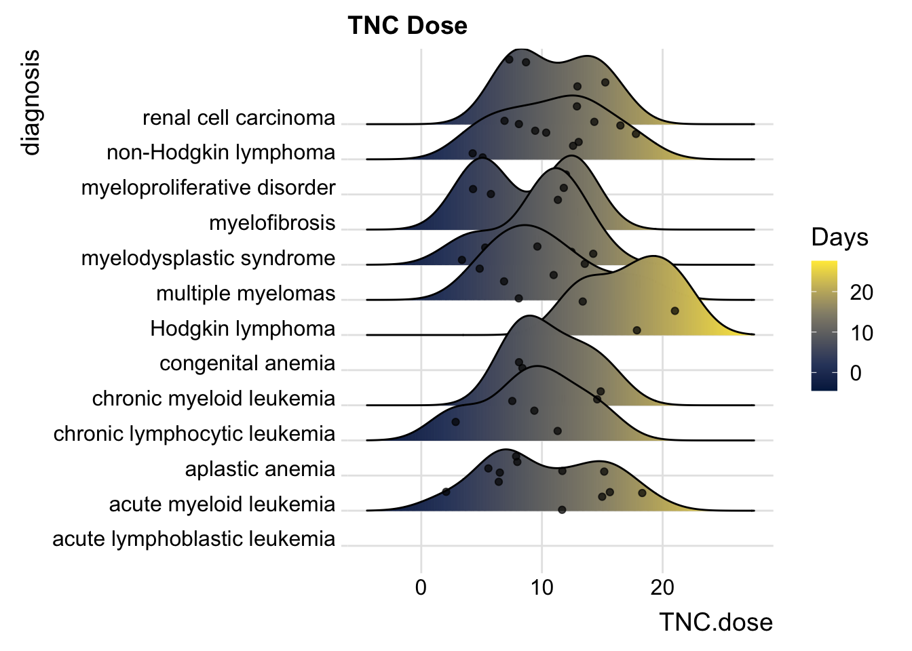

# Univariate ggplots to Visualize Distributions

When you first encounter a new dataset, it is often helpful to start with Data Exploration and Validation (DEV) . Note that DEV is different from EDA (Exploratory Data Analysis), which involves rummaging through your data (often with plots) and generating new hypotheses, performing multiple tests, and essentially data mining.

DEV has specific goals, which include identifying variables with problematic values (NA, outliers), unexpected distributions (sometimes bimodal), and less-than-helpful variable names or data types. In this chapter, we will look at investigating single continuous variables, looking for outliers, multi-modal distributions, and making comparisons across categories.

## Histograms

One of the most helpful ways to get started is to explore your continuous variables with the humble histogram or dotplot. These geoms in ggplot2 allow you to see a distribution of a single variable, and are a good way to get started with ggplot. Let's start by looking at the distribution of the number of colon polyps found in participants in a clinical trial. You just need to map a variable (in this case, *number12m*) to the x aesthetic, and you are good to go.


```r
medicaldata::polyps %>% 
  ggplot() + 
  aes(x = number12m) + 
  geom_histogram()
```

```
## `stat_bin()` using `bins = 30`. Pick better value with
## `binwidth`.
```

```
## Warning: Removed 2 rows containing non-finite values
## (`stat_bin()`).
```


This gives us a very basic histogram, with some participants with zero polyps, but many with much larger numbers.

We also learn that `geom_histogram` is a bit grumpy, and complains that we have not picked a binwidth (or a number of bins). Since the distribution goes out to 60+ polyps, let's pick a binwidth of 5 (or about 13 bins).


```r
polyps %>% 
  ggplot() + 
  aes(x = number12m) +
  geom_histogram(binwidth = 5)
```

```
## Warning: Removed 2 rows containing non-finite values
## (`stat_bin()`).
```


Even with 13 bins, most bins contain only one or two participants. It would be more helpful to visualize each participant as a single dot, which you can do with a dotplot (geom_dotplot).


```r
medicaldata::polyps %>% 
  ggplot() + 
  aes(x = number12m, fill = treatment) +
  geom_dotplot(binwidth = 1) +
  scale_y_continuous(NULL, breaks = NULL) + 
  # Make this ratio = (tallest column * binwidth * 1.5)
  coord_fixed(ratio = 6) +
  labs(title = "Distribution of Participants binned by number of Polyps", subtitle = "Colored by Treatment") +
  theme(legend.position = "top")
```

```
## Warning: Removed 2 rows containing missing values
## (`stat_bindot()`).
```


One of the nice things about geom_dotplot() is that it represents each participant as a dot, which is closer to reality than columns which look like they are portraying values, rather than counts. The y-axis is less helpful. It is showing the proportion of the total sample, which is sort of helpful, but this leaves a lot of empty space with no data most of the time.

### Comparisons of Distributions with Histograms

When you have a continuous variable that could vary across several categories of a categorical variable, you may want to compare the distributions across the categories. You can compare a small number of categories with histograms, usually 5 categories or less is manageable. There are several ways to make this kind of comparison.

-   You can set the fill aesthetic to the categorical variable. In this case, we will use the treatment variable. This is OK, as you can see the sulindac-treated patients are shifted to the left, but it is not great, as the counts are stacked, and this can make comparisons hard. Note that color = outline of bars color, as opposed to fill.

  
  ```r
    medicaldata::polyps %>% 
     ggplot() + 
     aes(x = number12m, fill = treatment) +
      geom_histogram(bins=15,
                     color = "purple") 
  ```
  
  ```
  ## Warning: Removed 2 rows containing non-finite values
  ## (`stat_bin()`).
  ```
  
  

-   A mirror histogram can work well for 2 categories. You filter the data by value within the geom, and set the y value to ..density.. for one category value, and to negative -..density.. for the other category value, as seen below. The ..density.. variable is a value ggplot calculates in the background with a stat function.


```r
    medicaldata::polyps %>% 
     ggplot(aes(x = number12m)) + 
      geom_histogram(fill = "red",
        aes(y = ..density..),
        data = . %>% 
          filter(treatment == 'placebo'),
        bins = 15) +
      geom_label(aes(x = 55, y = 0.03, label = "Placebo"), color = "red") +
      geom_histogram(fill = "#404080",
        aes(y = -..density..),
        data = . %>% 
          filter(treatment == 'sulindac'),
        bins = 15) +
      geom_label(aes(x = 20, y = -0.03, label = "Sulindac"), color = "#404080") 
```

```
## Warning: The dot-dot notation (`..density..`) was deprecated in
## ggplot2 3.4.0.
## ℹ Please use `after_stat(density)` instead.
```

```
## Warning: Removed 2 rows containing non-finite values
## (`stat_bin()`).
```


-   You can do small multiples with facet_wrap


```r
    medicaldata::polyps %>% 
     ggplot() + 
      aes(x = number12m, fill = treatment) +
      geom_histogram(bins =15) +
    facet_grid(. ~ treatment)
```

```
## Warning: Removed 2 rows containing non-finite values
## (`stat_bin()`).
```


    Note for facet_wrap and facet_grid, the formula notation or the arguments is y \~ x, so that by putting treatment after the tilde, the treatments are compared on the x axis, or side by side. If you put the treatment categorical value in the first (y) position, they would be shown as top and bottom.

  
  ```r
    medicaldata::polyps %>% 
     ggplot() + 
      aes(x = number12m, fill = treatment) +
      geom_histogram(bins =15) +
      facet_grid(treatment ~ .)
  ```
  
  ```
  ## Warning: Removed 2 rows containing non-finite values
  ## (`stat_bin()`).
  ```
  
  

-   While the viewer can generally make the comparisons with 2 categories, it can get more complicated with increasing numbers of categories.

### Histograms and Categories

You can also look at distributions of different categories, by color:


```r
mockstudy %>% 
  ggplot() + 
  aes(x = age, color = sex, fill = sex) +
  geom_histogram(alpha=0.3, position="identity")
```

```
## `stat_bin()` using `bins = 30`. Pick better value with
## `binwidth`.
```


Or with vertical facets:


```r
mockstudy %>% 
  ggplot() + 
  aes(x = fu.time, color = sex) +
  geom_histogram(fill="white", alpha=0.5, position="identity")+
  facet_grid(sex ~ .)
```

```
## `stat_bin()` using `bins = 30`. Pick better value with
## `binwidth`.
```


or horizontal facets:


```r
mockstudy %>% 
  ggplot() + 
  aes(x = age, color = sex) +
  geom_histogram(fill="white", alpha=0.5, position="identity")+
  facet_grid(. ~ sex)
```

```
## `stat_bin()` using `bins = 30`. Pick better value with
## `binwidth`.
```


## Density Plots

Density Plots are essentially smoothed versions of histograms. Density plots are helpful to show the distribution of a numeric variable. The defaults for smoothing are quite reasonable.

The only required aesthetic (like histogram) is an x variable. Optional aesthetics include

-   alpha - setting the transparency, from 0 (invisible) to 1 (the default). Used when there are a lot of overlapping points, usually in the range from 0.05-0.5.

-   group - for grouping into separate curves by a categorical variable.

-   color - color of the distribution line, like color = "orchid". When this is set to a categorical variable, geom_density will group by this variable and assign different colors to the groups. If you want to control the color assignments, you can use a palette with scale_color_brewer() or scale_color_manual (with the manual option you can set your own values or palette). Some options can be found [here](http://www.sthda.com/english/wiki/ggplot2-colors-how-to-change-colors-automatically-and-manually#change-colors-by-groups).

-   fill color. You can use a single color, or set this to a categorical variable and use scale_fill_brewer or scale_fill_manual. You can also use scale_fill_viridis.

-   size (line thickness) - the default is 1.

-   linetype (6 types 1-6). You can also use the names of these 6 standard line types in quotes which are "solid", "dashed", "dotted", "dotdash", "longdash", or "twodash". You can even define a cutsom line type, providing the lengths of (up to 8) consecutive on-off segments. The string "3313" specifies a line with 3 units on, 3 units off, 1 unit on, 3 units off (dash-dot). The standard dotted and dashed line types (types 2-6) correspond to "44", "13". "1343", "73" and "2262".


```r
mockstudy %>% 
  ggplot() + 
  aes(x = age) +
  geom_density() +
  geom_density(fill="orchid", 
               size = 2,
               position="identity",
               alpha = 0.4,
               linetype = "dashed")+
  facet_grid(. ~ sex) +
  hrbrthemes::theme_ipsum()
```

```
## Warning: Using `size` aesthetic for lines was deprecated in ggplot2
## 3.4.0.
## ℹ Please use `linewidth` instead.
```


### Comparisons with Density plots

You can compare a small number of categories with density plots, usually 5 or less. <https://www.r-graph-gallery.com/density-plot>

-   You can set color and fill to the same variable. But you may have a lot of overlap. It may help to make these semi-transparent. It can be problematic if there is a lot of overlap and multiple categories, as they can hide each other

-   A mirror density chart can work well for 2 categories.

-   You can do small multiples with facet_wrap

-   You can even do a stacked density chart. This is not great, as after the first layer, the baseline changes, and it ban be hard to compare. Can work for large differences between categories, but not good for small differences.

## Comparing Distributions Across Categories

Several geoms are designed for comparisons of distributions across multiple categories, and are more useful for this than histograms or density plots, particularly when the number of categories is large. These include

-   Boxplots

-   Ridgeline plots

-   Violin plots

All of these can be combined with plotting of individual data points to give both a summary of the distribution and visualization of the actual data. This can be important, especially when the number data points varies across categories, or of the number of data points are quite low in one part of the distribution.

## Boxplots

Boxplots are quick summaries of a distribution. They quickly give you a median line, and 25th and 75th percentiles (the ends of the box). The upper whisker is found at the last observation less than or equal to the 75th percentile plus 1.5\* the IQR (interquartile range, or 75th-25th percentile). The lower whisker is found at the last observation less than or equal to the 25th percentile minus 1.5\* the IQR. Points beyond the whiskers are considered "outliers".

Boxplots can be useful to compare distributions of a continuous variable across several categories.

However, boxplots have several weakesses.

Boxplots assume that your data are unimodal, and hide the distribution of your data points, which can be problematic if they are truly bimodal or trimodal (or even more local modes! (as in a Likert scale).

Boxplots can also hide the number of observations, which may be quite different between categories. When this is an issue, it can be helpful to add data points, with geoms like jitter, beeswarm, or sina, or in ridgeline/raincloud plots. If there are a lot of overlapping points, you may need to set the geom_point alpha argument to a low value (0.05-0.5), rather than the default transparency of one.

It can help the viewer of box plots to arrange your categories by order of their median, to make the interpretation easier. If your categories have a natural order (like months of the year), you will generally be better off keeping this natural order than ordering by median.

## Violin Plots

<https://www.r-graph-gallery.com/violin_and_boxplot_ggplot2.html>

Violin Plots are essentially distribution plots that are symmetrical around their baseline. They are better than boxplots in that they don't hide the distribution of your data points, and they don't assume that the data are unimodal. You can see multiple local clusters if they are present in your data. A bimodal distribution will give you a shape that is reminiscent of a violin body.

Violin plots can be helpful for comparing the distribution of a continuous variable across many categories.

Violin plots can hide the number of observations, which may be quite different between categories. When this is an issue, it can be helpful to add points, with geoms like jitter, beeswarm, or sina, or in ridgeline/raincloud plots. If there are a lot of overlapping points, you may need to set the geom_point alpha argument to a low value (0.05-0.5), rather than the default transparency of one.

Violin plots are helpful when you are comparing many groups.

## Ridgeline Plots

<https://www.r-graph-gallery.com/ridgeline-plot>

Ridgeline plots are a nice way to show the distribution of a continuous variable, and compare distributions across several categories.

Ridgeline plots are great for showing off striking differences between categories. Because they can have some overlap, they are not best for small or subtle differences.

Note that you can add the N in each category to the category label when the number in each category varies.


```r
cmv %>% 
ggplot(aes(x = time.to.transplant, y = diagnosis)) + geom_density_ridges(scale = 0.9) 
```

```
## Picking joint bandwidth of 8.96
```

```
## Warning: Removed 1 rows containing non-finite values
## (`stat_density_ridges()`).
```


### Including Plots

You can also embed plots, for example:


```r
cmv %>% 
ggplot(aes(x = time.to.agvhd, y = diagnosis,
           fill= stat(x))) + 
  geom_density_ridges_gradient(scale = 0.9) +
  scale_fill_viridis_c(name = "Days", option = "A") +
  labs(title = "Time to AGvHD in Days")
```

```
## Warning: `stat(x)` was deprecated in ggplot2 3.4.0.
## ℹ Please use `after_stat(x)` instead.
```

```
## Picking joint bandwidth of 8.13
```


### Including Points

You can also add data points, for example:


```r
cmv %>% 
ggplot(aes(x = time.to.cmv, y = diagnosis,
           fill= stat(x))) + 
  geom_density_ridges_gradient(scale = 0.5,
        jittered_points = TRUE,
        position = "raincloud",
        alpha = 0.5) +
  scale_fill_viridis_c(name = "Days", option = "B") +
  labs(title = "Time to CMV in Days") +
  theme_ridges()
```

```
## Picking joint bandwidth of 8.96
```


### Including Points

You can also add data points, for example:


```r
cmv %>% 
ggplot(aes(x = CD8.dose, y = diagnosis,
           fill= stat(x))) + 
  geom_density_ridges_gradient(scale = 0.9) +
  scale_fill_viridis_c(name = "Days", option = "C") +
  labs(title = "CD8 Dose") +
  theme_ridges()
```

```
## Picking joint bandwidth of 0.249
```


### Including Points

You can also add data points, for example:


```r
cmv %>% 
ggplot(aes(x = CD3.dose, y = diagnosis,
           fill= stat(x))) + 
  geom_density_ridges_gradient(scale = 0.7,
        jittered_points = TRUE,
        position = "raincloud") +
  scale_fill_viridis_c(name = "Days", option = "D") +
  labs(title = "CD3 Dose") +
  theme_ridges()
```

```
## Picking joint bandwidth of 0.761
```


### Including Points

You can also add data points, for example:


```r
cmv %>% 
ggplot(aes(x = TNC.dose, y = diagnosis,
           fill= stat(x))) + 
  geom_density_ridges_gradient(scale = 2,
        jittered_points = TRUE,
        position = "points_sina",
        alpha = 0.7) +
  scale_fill_viridis_c(name = "Days", option = "E") +
  labs(title = "TNC Dose") +
  theme_ridges()
```

```
## Picking joint bandwidth of 2.19
```


