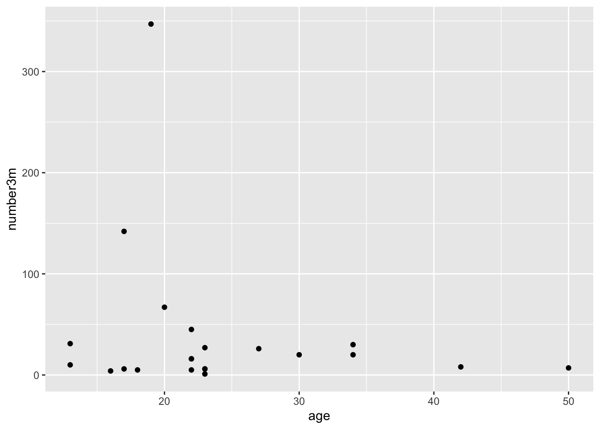
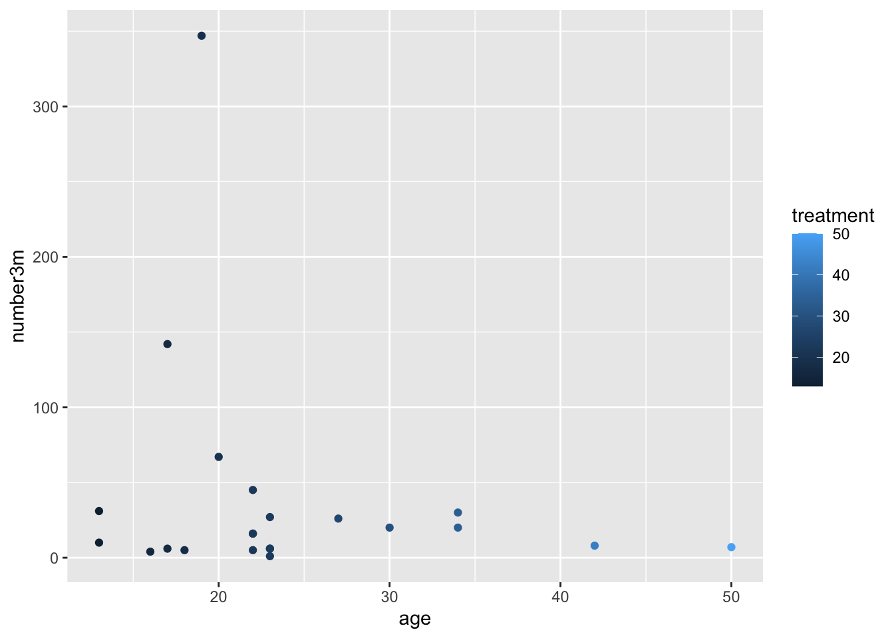
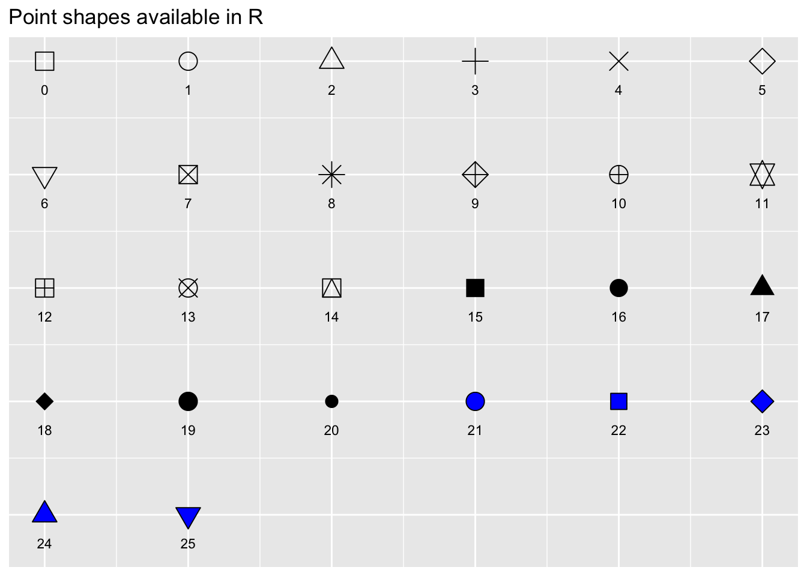
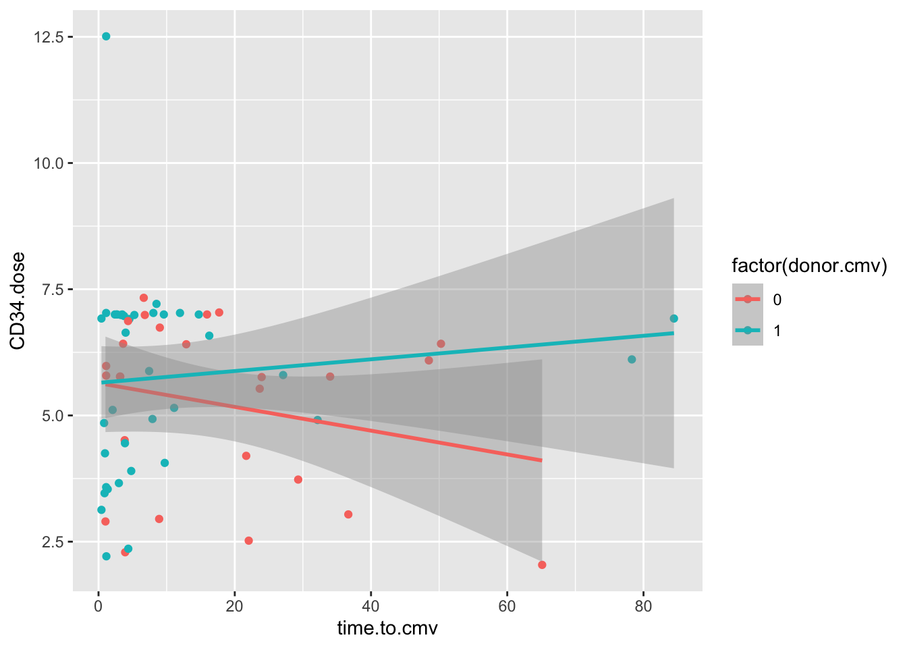
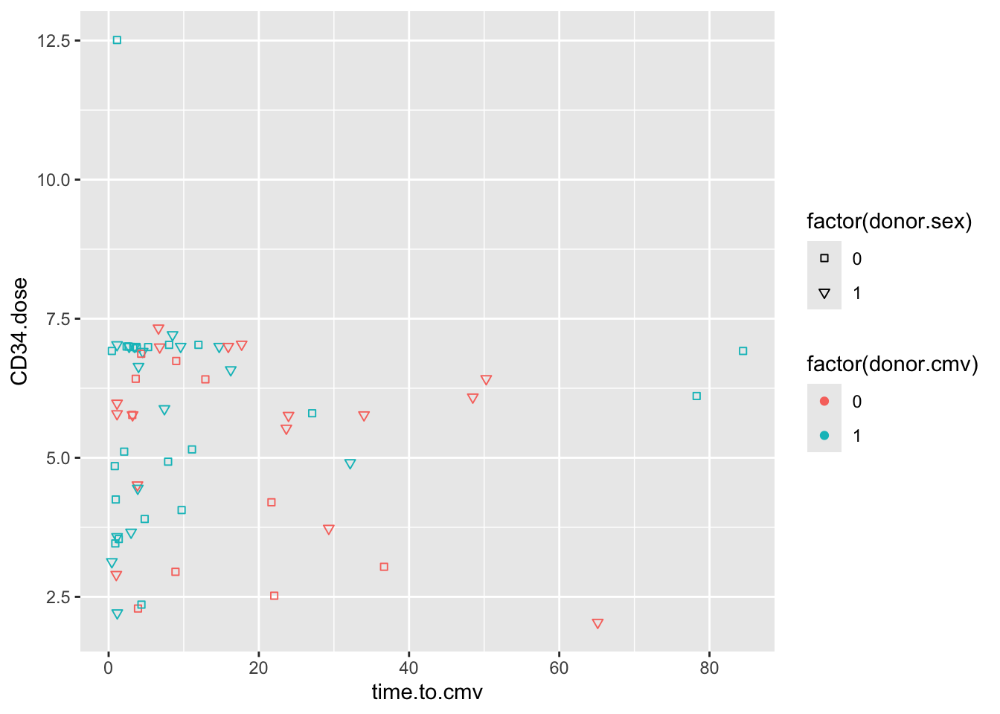
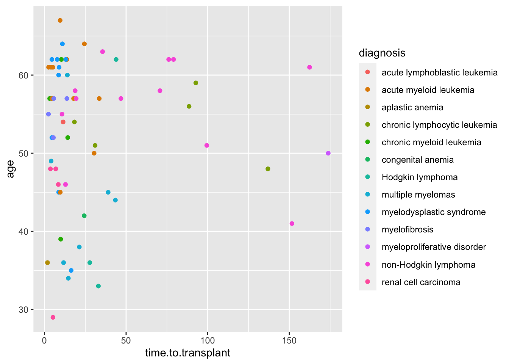

# Bivariate ggplot2 Scatterplots to Visualize Relationships Between Variables

## Packages used in this Chapter

Use `library(packagename)` to load these packages,
and `install.packages("packagename")` to install these if they are not already installed.

- {tidyverse}
- {medicaldata}
- {ggpubr}

## Data Exploration and Validation (DEV)

When you first encounter a new dataset, it is often helpful to start with Data Exploration and Validation (DEV) . Note that DEV is different from EDA (Exploratory Data Analysis), which involves rummaging through your data (often with plots) and generating new hypotheses, performing multiple tests, and essentially data mining.

DEV has specific goals, which include identifying variables with problematic values (NA, outliers), unexpected distributions (sometimes bimodal), and less-than-helpful variable names or data types. In this chapter, we will look at investigating pairs of continuous variables, looking for relationships and correlations.

We will also add some new skills to help you customize your scatter plots, and to learn to think conceptually about building up ggplots in layers.

## Scatterplots

One of the most helpful ways to get started in exploring relationships between continuous variables is to explore pairs of continuous variables with a scatterplot. These are accomplished with geom_point() in ggplot2. A scatterplot allows you to see the relationship between two continuous variables, and is a good way to get started with ggplot. Let's start by looking at the realtionship between the number of colon polyps found in participants in a clinical trial and their age. We start by building up layers

- data layer - tell R which dataset to use
- ggplot command - start a ggplot
- aesthetic mapping layer (ask R to map variables)
- geom layer (how to draw the datapoints)

In this example, we will map the participant `age` to x, and the `baseline` number of polyps to y,
and use `geom_point` as the geom.


``` r
medicaldata::polyps %>% 
  ggplot() + 
  aes(x = age, y = baseline) + 
  geom_point()
```


Copy this code to your RStudio console, and run it to get this plot.

This gives us a very basic scatterplot, with a y-axis range between 7 and 318 polyps (that would have been a looooong colonoscopy if you tried to remove all 318 polyps).

Not a dramatic correlation, though you could imagine a downward slope with age if you fitted a linear regression line. Though this is likely pulled way up at age 18 by the participant with many polyps.

Now try changing the code to map y to the number of polyps at 3 months (`number3m`). The code example below adds a linear regression line with `method = "lm"`. `lm` stands for linear model. Add a smoothing line to your code in the Console. Try `method = "loess"` for a different look, rather than forcing a linear relationship.


``` r
polyps %>% 
  ggplot() + 
  aes(x = age, y = baseline) + 
  geom_point() +
  geom_smooth(method = 'loess')
```

```
## `geom_smooth()` using formula = 'y ~ x'
```


Does it matter whether you map x or y first, in the aes() function? Try swapping these to find out.

### Micro-quiz!

(correct answers will be green!)

- X must always be mapped before Y in ggplot2 `aes()` functions <select class='webex-select'><option value='blank'></option><option value=''>TRUE</option><option value='answer'>FALSE</option></select>

- The `medicaldata::polyps` line of code represents the <select class='webex-select'><option value='blank'></option><option value=''>geom</option><option value='answer'>data</option><option value=''>aesthetic</option></select> layer of the ggplot.

- The `aes()` function is the aesthetic layer, which <select class='webex-select'><option value='blank'></option><option value=''>pipes</option><option value=''>glues</option><option value='answer'>maps</option></select> data variables to visual properties (aesthetics) of the plot.

## Mapping More Variables

You can add more information to a plot by mapping additional variables, which can help you make comparisons.

You can map the `treatment` variable (sulindac or placebo) to the color aesthetic for the points. You just add `color = varname` to map a new variable named (varname) to the color.

Try this by modifying the code below.
Remember to put a comma between mappings, and to put your aesthetic mapping *inside* the `aes()` function.

Then run the code chunk to generate a plot.


``` r
polyps %>% 
  ggplot() + 
  aes(x = age, y = number3m) + 
  geom_point(color = 'blue') +
  geom_smooth(method = 'lm')
```

```
## `geom_smooth()` using formula = 'y ~ x'
```


If this did not work, put `, color = treatment` after `y = number3m` inside the `aes()` parentheses.

This should produce a plot with 2 colors of points, for placebo and sulindac, and 2 smoothed lines, one for each treatment. While the confidence intervals overlap, this does suggest that participants receiving sulindac might have fewer polyps.

Try this for the 12 month polyp count, using `y = number12m`. This should look even more impressive.

You can map the `treatment` variable to other aesthetics (visual properties) of the plot. Try this out with a few options:

- mapping `treatment` to shape (and color!)
- mapping `number3m` to size, and/or alpha
- NOTE that alpha is a term for the degree of opacity of a visual object, with zero = transparent.
- NOTE that a variable can be mapped to **more than one** visual property.
- BUT if you try to map more than one variable to a single visual property within the `aes()` function, the subsequent mappings will be ignored. The 1st mapping (within one aes) wins.


``` r
polyps %>% 
  ggplot() + 
  aes(x = age, y = number3m) + 
  geom_point()
```



::: {.warning}
If you try to map a variable to a visual property **outside** of the `aes()` function, it will be treated as a constant, not a variable, which can lead to strange results. Try moving `color = treatment` to a spot inside of the `geom_point()` function parentheses. Or even better, try `color = 'blue'` to within geom_point(). What happens?
:::


## Inheritance and Layering in ggplot2

Adding layers to a ggplot allows you to increase the complexity and customize a plot, building it up, layer by layer. 

This layered structure allows you to map a visual property (aesthetic) once, in the ggplot layer, or in the aes() layer. All subsequent layers `inherit` these visual properties, unless you specify differently. So your geom_point() layer inherits the mappings from the aesthetic layer. 
But if you want to, you can over-write the inherited properties, by stating a different `aes()` mapping. 

See the example below - the color mapping in geom_point over-writes the color mapping in the aesthetic layer, because it is in a later layer. In this case, the last layer wins. 


``` r
polyps %>% 
  ggplot() + 
  aes(x = age, y = number3m, color = treatment) + 
  geom_point(aes(color = age))
```




You can choose to do this deliberately. In the case below, this is done to make a **single** regression line that is purple, rather than the default black color.

Because the color in `geom_smooth()` is set to a constant, you only get one (overall) regression line.

Also notice that the color of the points is a bit dimmer than the previous plot. This is because the geom_smooth gray confidence interval from the linear regression is covering most of the points. Test this out by moving the geom_point() layer to the line **after** geom_smooth(). This should bring these points to the front. Whatever layer is last in the code is plotted on top.

You can also 'lighten up' the confidence interval by setting the alpha for `geom_smooth()` to 0.1 (on a 0 to 1 opacity scale)


``` r
polyps %>% 
  ggplot() + 
  aes(x = age, y = number3m, color = treatment) + 
  geom_point() +
  geom_smooth(method = 'lm', color = 'purple') 
```


## Aesthetic mapping Micro-Quiz!

(correct answers will be green!)

- Which one of the following is NOT a visual property that you can map a variable to in a scatterplot  <select class='webex-select'><option value='blank'></option><option value=''>fill</option><option value=''>color</option><option value=''>shape</option><option value=''>alpha</option><option value='answer'>data</option><option value=''>size</option></select>

- All mapping of variables to visual properties must be within the parentheses of the <select class='webex-select'><option value='blank'></option><option value=''>ggplot</option><option value=''>geom_point</option><option value=''>color</option><option value='answer'>aes</option><option value=''>scale</option></select> function.

- You should assign visual properties to constant values, like `color = "blue"` or `size = 2` within `ggplot()` or the geom_point() function, but **outside** of an `aes()` function <select class='webex-select'><option value='blank'></option><option value='answer'>TRUE</option><option value=''>FALSE</option></select>.

## Controlling Point Shape, Size, and Color Manually

There are 25 point shapes available in R, which can be seen here, with the help of the _show_point_shapes()_ function from {ggpubr}:

``` r
ggpubr::show_point_shapes()
```



Notice that the shapes 21-25 have an outline color, and can be filled with a different color, while shapes 1-20 only have a single color option.

By default, ggplot2 selects shapes and colors for you automatically (in order, 1-25, for shapes, and in the order of the default color palette for colors), so that you don't have to worry about specifying these.

But if you want to take the wheel, you can have more control of the shape, size, and color of your scatterplot points with _scale_ functions.

Let's try this with a scatterplot using the **cmv** dataset. We will look at the relationship between the CD34 cell dose at the time of bone marrow transplant, and the time to development of CMV.

For our base plot, we will map donor cmv status to color. Since the donor.cmv variable is stored as a `double` it is continuous, but we actually want this as a dichtomous 0/1 variable, so we will recode this 'on the fly' in the aesthetic mapping as `factor(donor.cmv)` instead of just `donor.cmv`. You can remove `factor()` from the code below to how this helps.


``` r
cmv %>% 
  ggplot() + 
  aes(y = CD34.dose, x = time.to.cmv, color = factor(donor.cmv)) + 
  geom_point()  +
  geom_smooth(method = 'lm')
```



These data show an interaction between cmv.donor status and the CD34.dose. In folks who receive a CMV+ donor BMT, higher doses of CD34 cells are associated with a delay in the onset of CMV, but this is not the case with CMV negative BMT donors.

### Manual Shapes
To control the point shapes, let's replace the geom_smooth line with `scale_shape_manual()` and set the values to 22 and 25. We also have to set an aesthetic mapping for shape. Let's map this to the donor.sex variable.


``` r
cmv %>% 
  ggplot() + 
  aes(y = CD34.dose, x = time.to.cmv, color = factor(donor.cmv), shape = factor(donor.sex)) + 
  geom_point()  +
  scale_shape_manual(values = c(22, 25))
```



Again, because donor.sex is stored as a numeric variable, we have to make it into a dichotomous factor on the fly in order to map this variable to shapes.

Note that when you use the fillable shapes (21-25), you can also map a fill aesthetic to different color properties, separate from the color outline of the shape.

You can also see that encoding `donor.sex` as 0 or 1 is not terribly helpful. It is often helpful to store data in `#_label` format, like 0_male, 1_female, to keep the encoding clear. You can extract the numeric portion with `parse_number()` if you want to do math on the variable later.

If you have a lot of categories (like the 13 diagnosis categories in the cmv dataset), it can be easier to let ggplot handle the shapes, rather than having to specify 13 shapes.

### Manual Sizes
Let's manually control the sizes of points - use the same approach, with `scale_size_manual()`. We want to emphasize the points with donor.cmv = 1, to see how this relates to the outcome variable, cmv, which is mapped to color.

Run the scatter plot below as an example, then edit the code to map size to `factor(donor.cmv)`. Then add a line of code for `scale_size_manual()`, and set the values to 1 and 4.


``` r
cmv %>% 
  ggplot() + 
  aes(y = age, x = time.to.transplant, size = CD8.dose, color = factor(cmv)) +
  geom_point() 
```


### Manual Color
Let's manually control the colors - use the same approach, with `scale_color_manual()`.
Run the scatter plot below as an example, then edit the code to map color to `factor(donor.cmv)`. Then add a line of code for `scale_color_manual()`, and set the values to "green" and "red".


``` r
cmv %>% 
  ggplot() + 
  aes(y = age, x = time.to.transplant, color = diagnosis) +
  geom_point() 
```


