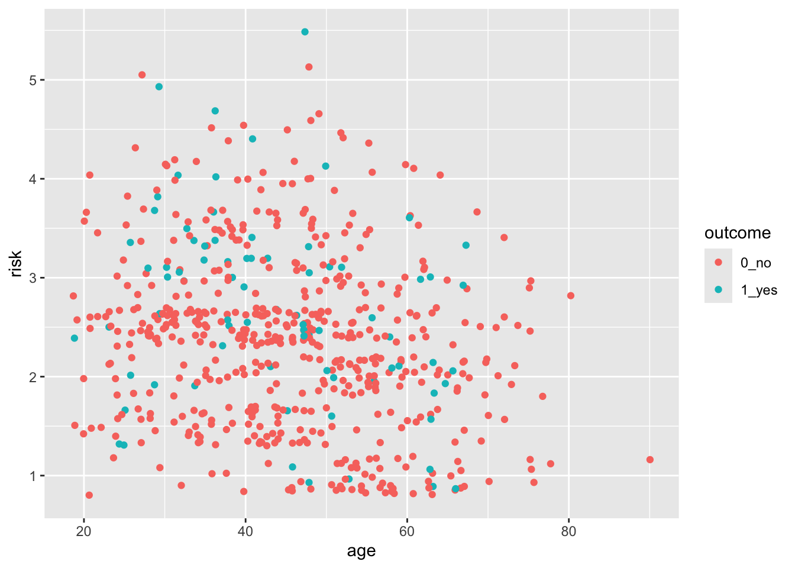
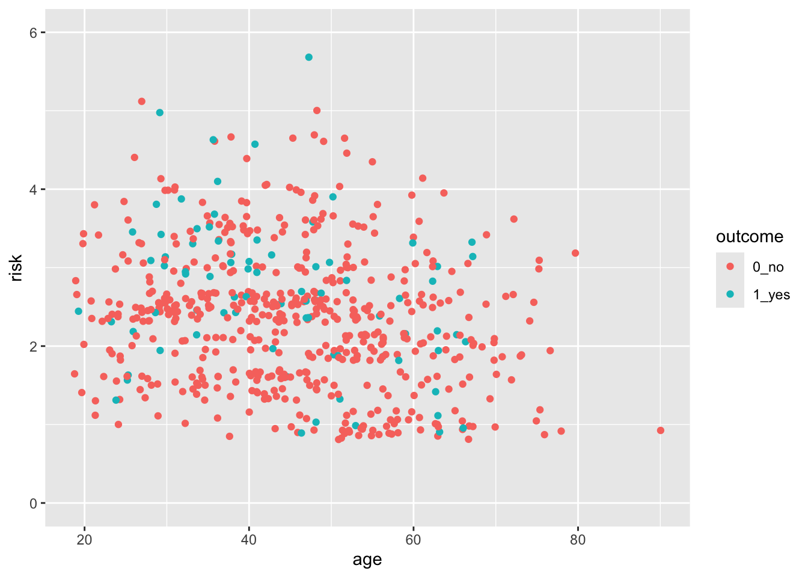
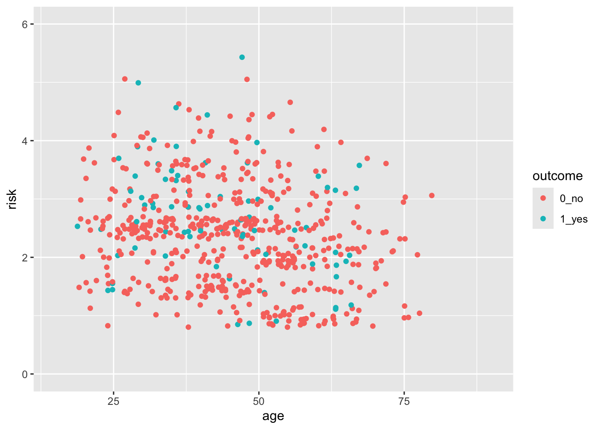
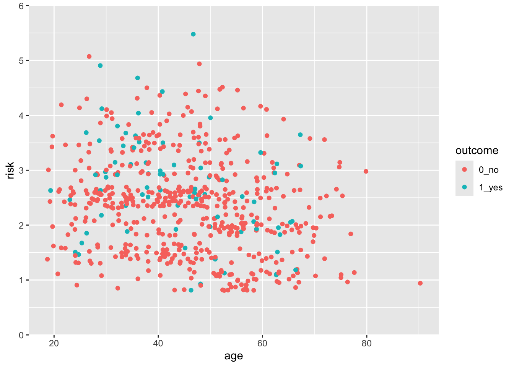
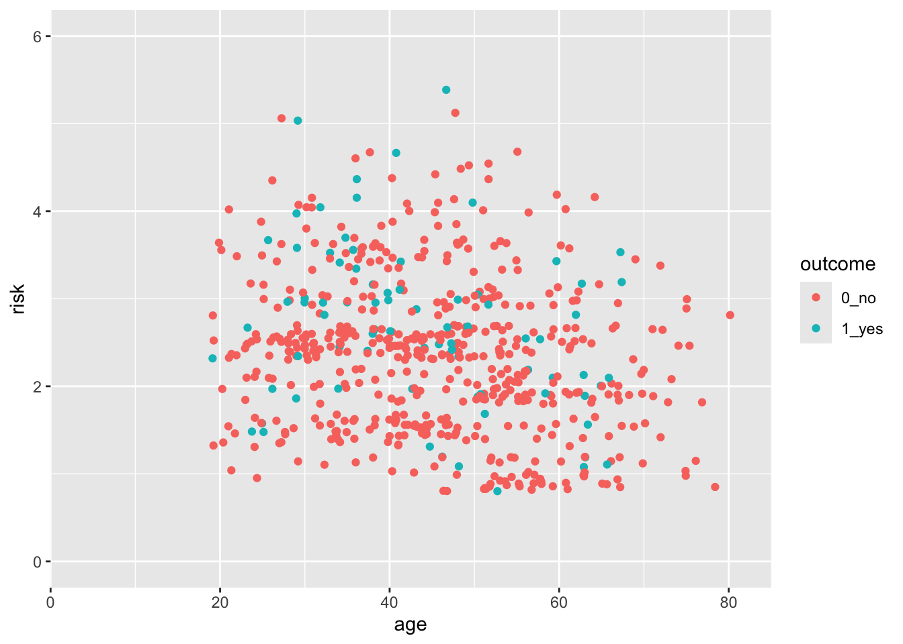
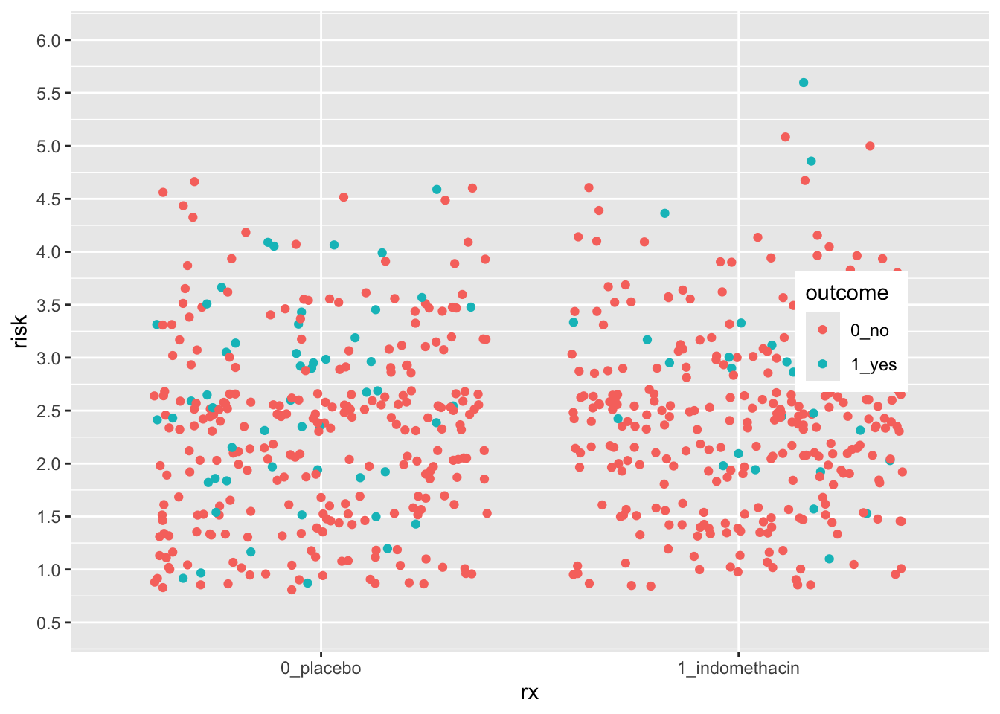
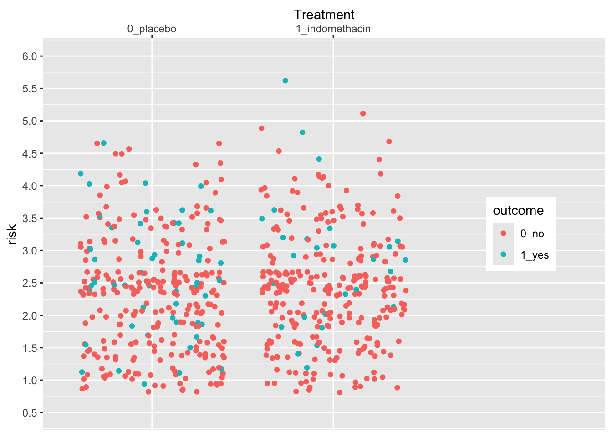
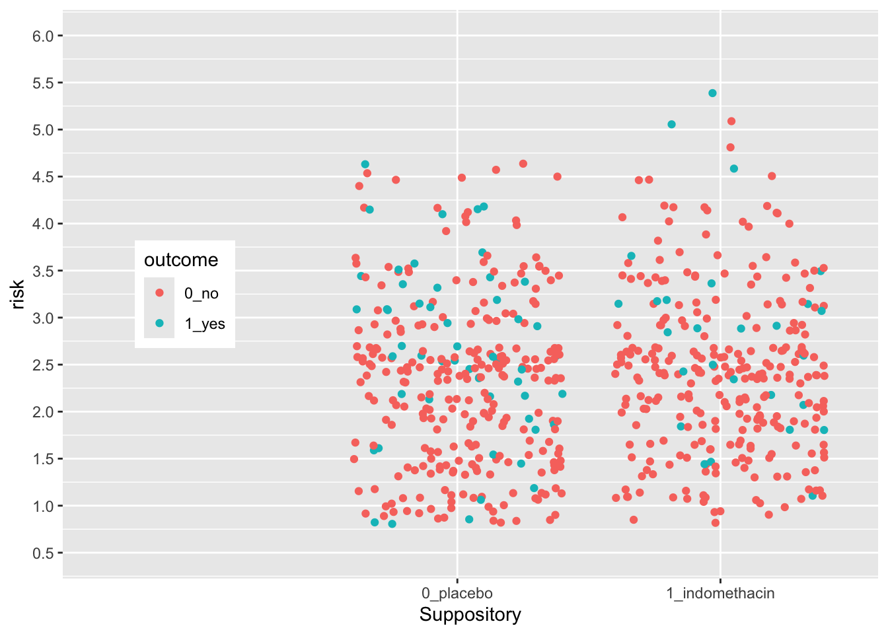
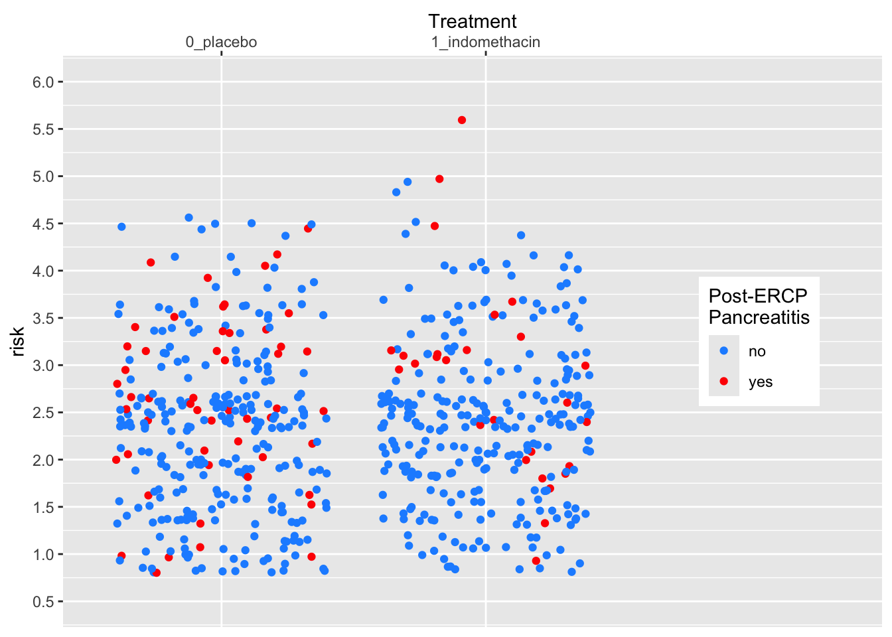
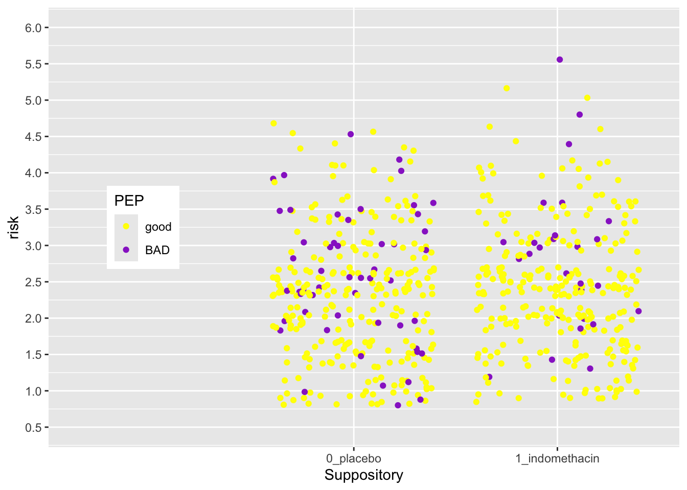

# Customizing Plot Scales

## Goals for this Chapter
 - learn how to use scales to control x and y axes
 - learn how to use scales to control shape, color, and alpha
 - learn how to use scales to control the legend
 - learn how to use scales for dates, percents, log, ordinals, dollars, and scientific notation
 
## Packages Needed for this chapter

You will need {tidyverse}, {medicaldata}, and {scales}


``` r
# install.packages('tidyverse')
# install.packages('medicaldata')
# install.packages('scales')
library(tidyverse)
library(medicaldata)
library(scales)
```

## A Flipbook of Where We Are Going With Scales

See the flipbook below, which contains some examples of what you can do with customized scales. These control both the axes and the legend(s). You can click on the flipbook arrows and move forward or backward in the slides with the left and right arrows to see what each line of code actually does. Go forward and backward until you understand the function of each line.

You can use the the icons in the bottom bar to expand to full screen or share this flipbook. If you are in full screen mode, you can use the Home button to go the the first slide and the End button to go to the last slide, and the Escape key to get out of full screen mode.

<!---FLIPBOOK EX 1--> 

<iframe style="margin:0 auto; border: solid black;" 
id="myIframe11" width="763" height="432"
src="https://higgi13425.github.io/mini_flipbooks/scales_microflip.html#1" 
scrolling="no" data-external="1" 
allowfullscreen
loading="lazy">
</iframe>

<!-------------> 

## A Basic Scatterplot

Let's start with a scatterplot of age vs risk of PEP in the indo_rct dataset


``` r
indo_rct <- medicaldata::indo_rct
indo_rct %>% 
  ggplot() +
  aes(x = age, y = risk, color = outcome) + 
  geom_jitter()
```



The axes cover the whole range by default, whith a bit of space added at the edges. This occurs because the default for *scale_(x|y)_continuous* for continuous variables adds 5% at either end so that points are not right at the edge.
Similarly, the scale_*_discrete function for discrete variables adds 0.6 of a category to the width to either side.

## But what if you want the scale for risk to start at 0?

You can do this, by taking control of the scales. In this case, the `scale_y_continuous()` function. 


``` r
indo_rct %>% 
  ggplot() +
  aes(x = age, y = risk, color = outcome) + 
  geom_jitter() +
  scale_y_continuous(limits = c(0,6))
```



:::tryit

Now try this yourself. Copy the code above (click on the copy icon in the top right of the code chunk), paste it into your RStudio IDE, and edit to:

- change the x axis so that it starts at age 15, and ends at 90. Click on the `Solution` button to toggle showing or hiding the solution.


<div class='webex-solution'><button>Solution</button>


``` r
indo_rct %>% 
  ggplot() +
  aes(x = age, y = risk, color = outcome) + 
  geom_jitter() +
  scale_y_continuous(limits = c(0,6)) +
  scale_x_continuous(limits = c(15,90))
```

```
## Warning: Removed 1 row containing missing values or values outside the scale range
## (`geom_point()`).
```



</div>


:::


## But this axis does not really start at Exactly 0

You can see that the x- and y-axes extend a bit past 0. This is because there is a default expansion of the scales (5% for continuous variables). You can control this default with the `expand()` function. Let's see how this works to make the y-axis start at exactly zero. You can set the expansion term as a multiplier (`mult`) or an additive (`add`).


``` r
indo_rct %>% 
  ggplot() +
  aes(x = age, y = risk, color = outcome) + 
  geom_jitter() +
  scale_y_continuous(limits = c(0,6), expand = expansion(mult =0)) 
```



:::tryit

Now try this yourself. Copy the code above (click on the copy icon in the top right of the code chunk), paste it into your RStudio IDE, and edit to:

- Change the x axis so that it starts at age 0, and ends at 85. 
- Make the x-axis expansion multiplier zero (not the default of 0.05). 

Click on the `Solution` button to toggle showing or hiding the solution.


<div class='webex-solution'><button>Solution</button>


``` r
indo_rct %>% 
  ggplot() +
  aes(x = age, y = risk, color = outcome) + 
  geom_jitter() +
  scale_y_continuous(limits = c(0,6)) +
  scale_x_continuous(limits = c(0,85),
          expand = expansion(mult = 0))
```

```
## Warning: Removed 1 row containing missing values or values outside the scale range
## (`geom_point()`).
```




</div>

:::

## Control the Limits and the Breaks

You can see that ggplot picks sensible breaks, but the defaults might not always work for you. Let's change the risk scale to breaks of 0.5, using the `breaks` argument. Note that using the `limits` argument also lets you establish the limits of the y-axis. 


``` r
indo_rct %>% 
  ggplot() +
  aes(x = age, y = risk, color = outcome) + 
  geom_point() +
  scale_y_continuous(limits = c(0,6),
                     breaks = seq(0, 6, by = 0.5)) 
```


:::tryit

Now try this yourself. Copy the code above (click on the copy icon in the top right of the code chunk), paste it into your RStudio IDE, and edit to:

- Change the x axis so that it starts at age 0, and ends at 95, with breaks at every decade from 10-90 (but not zero). 

Click on the `Solution` button to toggle showing or hiding the solution.


<div class='webex-solution'><button>Solution</button>


``` r
indo_rct %>% 
  ggplot() +
  aes(x = age, y = risk, color = outcome) + 
  geom_jitter() +
  scale_y_continuous(limits = c(0,6)) +
  scale_x_continuous(limits = c(0,95), 
                     expand = expansion(mult = 0),
                     breaks = seq(10, 90, by = 10))
```


Notice that the y axis has the default 5% multiplier, but the x axis does not, so it has limits exactly at 0 and 95.

</div>

:::

## Test what you have learned

(correct answers will be green!)

- You can set the start and end points of an axis with the `limits` argument <select class='webex-select'><option value='blank'></option><option value='answer'>TRUE</option><option value=''>FALSE</option></select>

- You can set the ticks on an axis with the <select class='webex-select'><option value='blank'></option><option value='answer'>breaks</option><option value=''>ticks</option><option value=''>lines</option></select> argument in a scales function.

- To expand the margin of a plot on one side by a specific amount, you use the <select class='webex-select'><option value='blank'></option><option value=''>mult</option><option value=''>sqrt</option><option value='answer'>add</option></select> argument in the expand argument within a scales function.

## Continuous vs. Discrete Plots and Scales

You can see below that ggplot picks sensible spacing and breaks for a discrete scale, but the defaults might not always work for you. 


``` r
indo_rct %>% 
  ggplot() +
  aes(x = rx, y = risk, color = outcome) + 
  geom_jitter() +
  theme(legend.position = c(0.85, 0.5)) +
  scale_y_continuous(limits = c(0.5,6),
                     breaks = seq(0.5, 6, by = 0.5)) 
```

```
## Warning: A numeric `legend.position` argument in `theme()` was deprecated in ggplot2
## 3.5.0.
## ℹ Please use the `legend.position.inside` argument of `theme()` instead.
## This warning is displayed once every 8 hours.
## Call `lifecycle::last_lifecycle_warnings()` to see where this warning was
## generated.
```



Let's expand the x axis to the righ to make room for a legend in the plot on the right, using the `expand` argument. We can change the axis `name` and `position` as well.


``` r
indo_rct %>% 
  ggplot() +
  aes(x = rx, y = risk, color = outcome) + 
  geom_jitter() +
  theme(legend.position = c(0.85, 0.5)) +
  scale_y_continuous(limits = c(0.5,6),
                     breaks = seq(0.5, 6, by = 0.5)) +
  scale_x_discrete(expand = expansion(add =c(0.6,1.5)),
                   name = "Treatment",
                   position = "top") 
```



:::tryit

Now try this yourself. Copy the code above (click on the copy icon in the top right of the code chunk), paste it into your RStudio IDE, and edit to:

- Change the x axis so that you 
- add 1.5 to the left side (add 1.5, 0.6), 
- move the legend to the left (0.15, 0.5)
- change the title to "Suppository"
- move the title position to the bottom

Click on the `Solution` button to toggle showing or hiding the solution.


<div class='webex-solution'><button>Solution</button>


``` r
indo_rct %>% 
  ggplot() +
  aes(x = rx, y = risk, color = outcome) + 
  geom_jitter() +
  theme(legend.position = c(0.15, 0.5)) +
  scale_y_continuous(limits = c(0.5,6),
                     breaks = seq(0.5, 6, by = 0.5)) +
  scale_x_discrete(expand = expansion(add =c(1.5, 0.6)),
                   name = "Suppository",
                   position = "bottom") 
```


The legend position is based on the proportion of the x axis (0-1) and the y axis (0-1), so that legend.position (0,0) is the bottom left, and legend.position (1,1) is the top right.

</div>

:::

## Using Scales to Customize a Legend

Legends are also scales, for discrete or continuous scales. You can use scales_(color|size|shape|alpha)_nnn functions to customize them. Let's see an example below.


``` r
medicaldata::indo_rct %>% 
    ggplot() +
    aes(x = rx, y = risk, color = outcome) + 
    geom_jitter() +
    theme(legend.position = c(0.85, 0.5)) +
    scale_y_continuous(limits = c(0.5,6),
                       breaks = seq(0.5, 6, by = 0.5)) +
    scale_x_discrete(expand = expansion(add =c(0.6,1.5)),
                     name = "Treatment",
                     position = "top") + 
    scale_color_manual(name = "Post-ERCP\nPancreatitis", 
                        labels = c("no", "yes"),
                        values = c("dodgerblue", "red")) 
```



:::tryit

Now try this yourself. Copy the code above (click on the copy icon in the top right of the code chunk), paste it into your RStudio IDE, and edit to:

- Change the legend 
- make the title "PEP" 
- change the labels to "good" and "BAD"
- change the colors to "yellow" and "darkorchid"

Click on the `Solution` button to toggle showing or hiding the solution.


<div class='webex-solution'><button>Solution</button>


``` r
medicaldata::indo_rct %>% 
  ggplot() +
  aes(x = rx, y = risk, color = outcome) + 
  geom_jitter() +
  theme(legend.position = c(0.15, 0.5)) +
  scale_y_continuous(limits = c(0.5,6),
                     breaks = seq(0.5, 6, by = 0.5)) +
  scale_x_discrete(expand = expansion(add =c(1.5, 0.6)),
                   name = "Suppository",
                   position = "bottom")  + 
    scale_color_manual(name = "PEP", 
                        labels = c("good", "BAD"),
                        values = c("yellow", "darkorchid")) 
```


The legend position is based on the proportion of the x axis (0-1) and the y axis (0-1), so that legend.position (0,0) is the bottom left, and legend.position (1,1) is the top right.

</div>

:::

## Test what you have learned

(multiple-choice, fill-in-the-blank, and TRUE/FALSE - correct answers will be green!)

- You can take complete control of colors with `scale_color_` <select class='webex-select'><option value='blank'></option><option value=''>continuous</option><option value=''>discrete</option><option value='answer'>manual</option></select>

- You can set the title of a color legend within the `scale_color_discrete()` function with the <input class='webex-solveme nospaces' size='4' data-answer='["name"]'/> argument.

- You can set the names of each level of a discrete color legend within the `scale_color_discrete()` function with the <input class='webex-solveme nospaces' size='6' data-answer='["labels"]'/> argument.

- You can set each color of a discrete color legend within the `scale_color_discrete()` function with the `values` <select class='webex-select'><option value='blank'></option><option value='answer'>TRUE</option><option value=''>FALSE</option></select> argument.

### More Examples with Flipbooks

<!---FLIPBOOK EX 2--> 

<iframe style="margin:0 auto; border: solid black;" 
id="myIframe12" width="763" height="432"
src="https://higgi13425.github.io/mini_flipbooks/scales2_microflip.html#1" 
scrolling="no" data-external="1" 
allowfullscreen
loading="lazy">
</iframe>

<!-------------> 


:::challenge

Now try some challenging code exercises using scales in the learnr app below.

Use your knowledge to try to do these without hints, but press the Hints button if needed. In each case, the 2nd hint is the solution.
:::
<!---SHINY APP--> 

<iframe style="margin:0 auto; border: solid black;" 
id="myIframe13" width="763" height="432"
src="https://higginslab-rshiny.med.umich.edu/shiny-apps/learn_scales/" 
scrolling="yes" data-external="1" 
allowfullscreen
loading="lazy">
</iframe>

<!-------------> 

