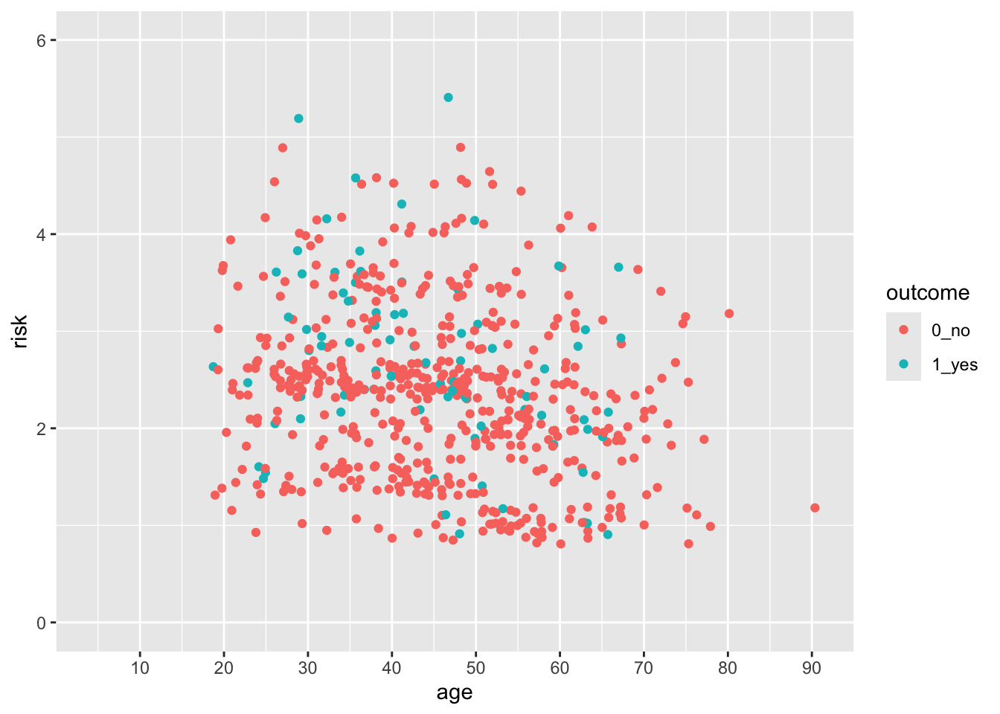

# Customizing Plot Scales

## A Basic Scatterplot

Let's start with a scatterplot of age vs risk of PEP in the indo_rct dataset


```r
indo_rct %>% 
  ggplot() +
  aes(x = age, y = risk, color = outcome) + 
  geom_jitter()
```


The axes cover the whole range by default, whith a bit of space added at the edges. This occurs because the default for scale_*_continuous for continuous variables adds 5% at either end so that points are not right at the edge.
Similarly, the scale_*_discrete function for discrete variables adds 0.6 of a category to the width to either side.

## But what if you want the scale for risk to start at 0?

You can do this, by taking control of the scales. In this case, the `scale_y_continuous()` function. 


```r
indo_rct %>% 
  ggplot() +
  aes(x = age, y = risk, color = outcome) + 
  geom_jitter() +
  scale_y_continuous(limits = c(0,6))
```


:::tryit

Now try this yourself. Copy the code above (click on the copy icon in the top right of the code chunk), paste it into your RStudio IDE, and edit to:

- change the x axis so that it starts at age 15, and ends at 90. Click on the `Solution` button to toggle showing or hiding the solution.


<div class='webex-solution'><button>Solution</button>


```r
indo_rct %>% 
  ggplot() +
  aes(x = age, y = risk, color = outcome) + 
  geom_jitter() +
  scale_y_continuous(limits = c(0,6)) +
  scale_x_continuous(limits = c(15,90))
```

```
## Warning: Removed 1 rows containing missing values
## (geom_point).
```


</div>


:::


## But this axis does not really start at Exactly 0

You can see that the x- and y-axes extend a bit past 0. This is because there is a default expansion of the scales (5% for continuous variables). You can control this default with the `expand()` function. Let's see how this works to make the y-axis start at exactly zero. You can set the expansion term as a multiplier (`mult`) or an additive (`add`).


```r
indo_rct %>% 
  ggplot() +
  aes(x = age, y = risk, color = outcome) + 
  geom_jitter() +
  scale_y_continuous(limits = c(0,6), expand = expansion(mult =0)) 
```


:::tryit

Now try this yourself. Copy the code above (click on the copy icon in the top right of the code chunk), paste it into your RStudio IDE, and edit to:

- Change the x axis so that it starts at age 0, and ends at 85. 
- Make the x-axis expansion multiplier zero (not the default of 0.05). 

Click on the `Solution` button to toggle showing or hiding the solution.


<div class='webex-solution'><button>Solution</button>


```r
indo_rct %>% 
  ggplot() +
  aes(x = age, y = risk, color = outcome) + 
  geom_jitter() +
  scale_y_continuous(limits = c(0,6)) +
  scale_x_continuous(limits = c(0,85),
          expand = expansion(mult = 0))
```

```
## Warning: Removed 1 rows containing missing values
## (geom_point).
```


</div>

:::

## Control the Limits and the Breaks

You can see that ggplot picks sensible breaks, but the defaults might not always work for you. Let's change the risk scale to breaks of 0.5, using the `breaks` argument. Note that this also establishes your limits. 


```r
indo_rct %>% 
  ggplot() +
  aes(x = age, y = risk, color = outcome) + 
  geom_point() +
  scale_y_continuous(limits = c(0,6),
                     breaks = seq(0, 6, by = 0.5)) 
```


:::tryit

Now try this yourself. Copy the code above (click on the copy icon in the top right of the code chunk), paste it into your RStudio IDE, and edit to:

- Change the x axis so that it starts at age 0, and ends at 95, with breaks at every decade from 10-90 (but not zero). 

Click on the `Solution` button to toggle showing or hiding the solution.


<div class='webex-solution'><button>Solution</button>


```r
indo_rct %>% 
  ggplot() +
  aes(x = age, y = risk, color = outcome) + 
  geom_jitter() +
  scale_y_continuous(limits = c(0,6)) +
  scale_x_continuous(limits = c(0,95), 
                     expand = expansion(mult = 0),
                     breaks = seq(10, 90, by = 10))
```


Notice that the y axis has the default 5% multiplier, but the x axis does not, so it has limits exactly at 0 and 95.

</div>

:::

## Continuous vs. Discrete Plots and Scales

You can see below that ggplot picks sensible spacing and breaks for a discrete scale, but the defaults might not always work for you. 


```r
indo_rct %>% 
  ggplot() +
  aes(x = rx, y = risk, color = outcome) + 
  geom_jitter() +
  theme(legend.position = c(0.85, 0.5)) +
  scale_y_continuous(limits = c(0.5,6),
                     breaks = seq(0.5, 6, by = 0.5)) 
```


Let's expand the x axis to the righ to make room for a legend in the plot on the right, using the `expand` argument. We can change the axis `name` and `position` as well.


```r
indo_rct %>% 
  ggplot() +
  aes(x = rx, y = risk, color = outcome) + 
  geom_jitter() +
  theme(legend.position = c(0.85, 0.5)) +
  scale_y_continuous(limits = c(0.5,6),
                     breaks = seq(0.5, 6, by = 0.5)) +
  scale_x_discrete(expand = expansion(add =c(0.6,1.5)),
                   name = "Treatment",
                   position = "top") 
```


:::tryit

Now try this yourself. Copy the code above (click on the copy icon in the top right of the code chunk), paste it into your RStudio IDE, and edit to:

- Change the x axis so that you 
- add 1.5 to the left side (add 1.5, 0.6), 
- move the legend to the left (0.15, 0.5)
- change the title to "Suppository"
- move the title position to the bottom

Click on the `Solution` button to toggle showing or hiding the solution.


<div class='webex-solution'><button>Solution</button>


```r
indo_rct %>% 
  ggplot() +
  aes(x = rx, y = risk, color = outcome) + 
  geom_jitter() +
  theme(legend.position = c(0.15, 0.5)) +
  scale_y_continuous(limits = c(0.5,6),
                     breaks = seq(0.5, 6, by = 0.5)) +
  scale_x_discrete(expand = expansion(add =c(1.5, 0.6)),
                   name = "Suppository",
                   position = "bottom") 
```


The legend position is based on the proportion of the x axis (0-1) and the y axis (0-1), so that legend.position (0,0) is the bottom left, and legend.position (1,1) is the top right.

</div>

:::


