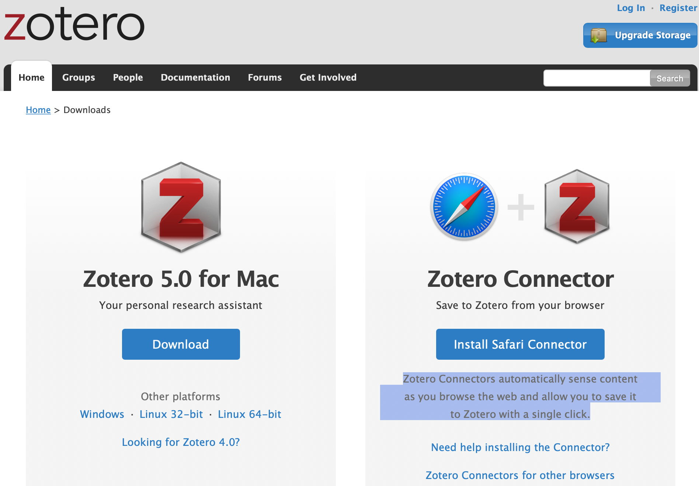
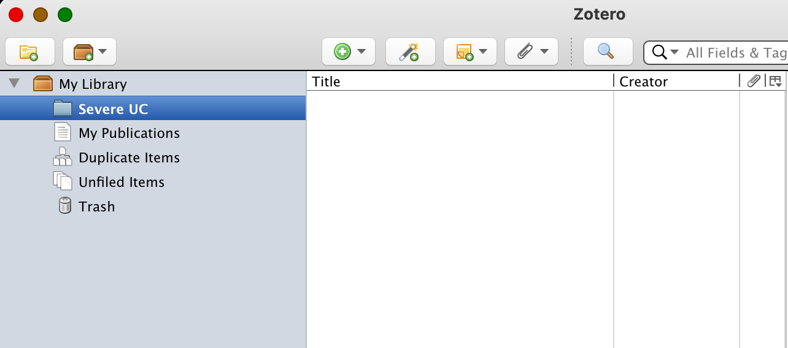
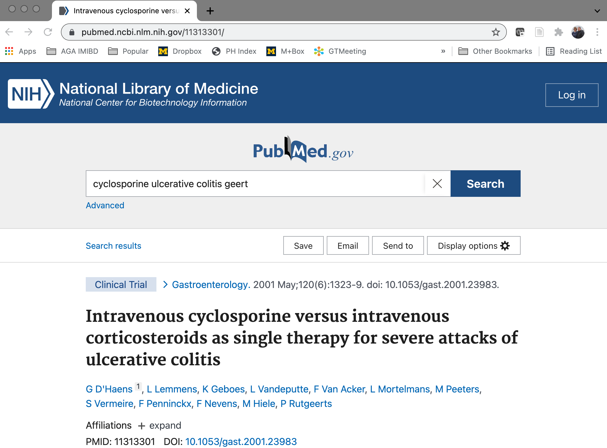
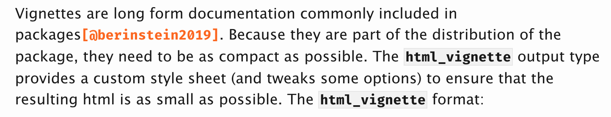
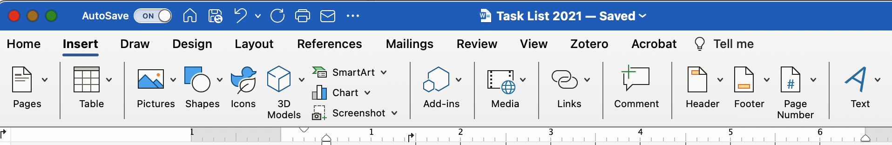
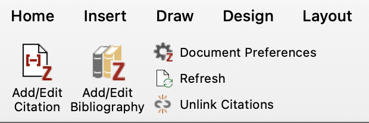
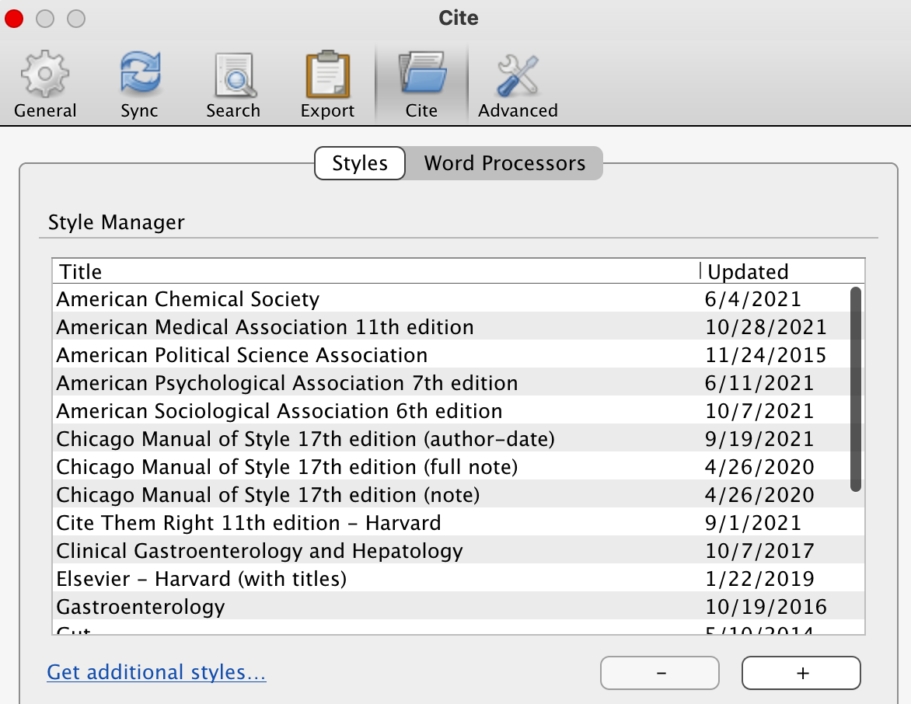

 ---
 title: "Customizing Plot Scales"
 author: "Peter Higgins"
 date: "10/21/2021"
 output: html_document
---


``` r
# install.packages('tidyverse')
# install.packages('tidyverse')
# install.packages('tidyverse')
# install.packages('tidyverse')

library(tidyverse)
```

```
## ── Attaching core tidyverse packages ──────────────────────── tidyverse 2.0.0 ──
## ✔ dplyr     1.1.4     ✔ readr     2.1.5
## ✔ forcats   1.0.0     ✔ stringr   1.5.2
## ✔ ggplot2   4.0.0     ✔ tibble    3.3.0
## ✔ lubridate 1.9.4     ✔ tidyr     1.3.1
## ✔ purrr     1.1.0     
## ── Conflicts ────────────────────────────────────────── tidyverse_conflicts() ──
## ✖ dplyr::filter() masks stats::filter()
## ✖ dplyr::lag()    masks stats::lag()
## ℹ Use the conflicted package (<http://conflicted.r-lib.org/>) to force all conflicts to become errors
```

``` r
library(medicaldata)
library(webexercises)
library(scales)
```

```
## 
## Attaching package: 'scales'
## 
## The following object is masked from 'package:purrr':
## 
##     discard
## 
## The following object is masked from 'package:readr':
## 
##     col_factor
```

``` r
indo_rct <- medicaldata::indo_rct
```

# Adding Citations to your RMarkdown

 ## Goals for this Chapter

 -   install Zotero and its web browser extensions
 -   learn how to use the Rmarkdown visual editor to add citations
 -   download csl (Citation Style Language) files to format citations for a particular journal style
 -   format citations in a particular csl style

 ## Packages Needed for this chapter

 You will need {tidyverse}, {medicaldata}, and {rmarkdown}, and an updated version of RStudio (at least version 1.4). If needed, copy the block of code below into your RStudio and run the code to load these packages. You can remove the hashtags from the `install.packages` functions to install these packages if needed.

 ## Getting Set Up for Citations

 You are probably familiar with some sort of commercial reference manager software, which can store and format references for manuscripts. Common products include EndNote and RefMan. RStudio markdown uses an open-source reference manager named Zotero. Zotero is free, and includes (separately) web browser extensions for Google Chrome, Firefox, and several other browsers. These "Zotero connectors" allow you to browse the web to a reference (i.e. browsing in PubMed), and allow you to save the reference to a Zotero library with a single click, without leaving your browser.

 We will start by downloading and installing Zotero and a web extension.

 Go to the Zotero web page [here](https://www.zotero.org/download/) and download the most current version of Zotero for your computer system.

 

 Installation is straightforward - click on the downloaded file to start the installation process.

 ### Installing the Zotero Connector

 It is very helpful to add a web extension plugin to your usual browser in order to make it easier to build libraries of references. Open your favorite browser and search for zotero connector. In Google Chrome, this will take you to the chrome web store, where you can click on the button "Add to Chrome" to install the Zotero Connector. You may have difficulties with Apple Safari 13, as currently (as of November 2021) the ZC extensions work better with Chrome and Firefox. The issue with Apple Safari 13 is expected(?) to be fixed by Mac OS Monterey, available in early 2022.

 When the Zotero Connector is installed and active, there should be a new icon at the top right of your browser window, to the right of the URL. This is a rectangle with a folded upper right corner, which looks a bit like a dog-eared page of a book. If you don't see this, you may need to widen your browser window, or make sure that your extension is turned on (go to Manage Extensions) If you hover over this, the pop-up text should read, "Save to Zotero".

 ### Registration for Zotero

 If you choose to register for a free Zotero account, you can log in to get access to 300 MB of cloud reference storage for free. More storage is more expensive, in several tiers, up to the Unlimited plan which is \$130 USD per year as of November 2021. This is not entirely necessary, but can be convenient to have a single site for your reference libraries accessible from any computer.

 ## Building your First Zotero Collection

 Open the Zotero Application.

 In the left pane is a listing of your Collections of references. Click on File/New Collection (or right click on My Library) to start a new collection of references. Give it a name related to some area of your research in which you already know a few relevant references. In the example below, I created a Collection for "Severe UC" (ulcerative colitis). This is stored within your **My Library** folder

 

 ## Adding References to Your Zotero Collection

 Now you can go to [PubMed](https://pubmed.ncbi.nlm.nih.gov) and search for some of your go-to references in this field.
 ## Inline Code and Caching

 In the example below, the Zotero Connector is able to sense that this is a reference, and the dog-eared page icon is active in the top right of the web browser (in this case, Google Chrome).

 If I click on the icon, this reference is saved to my default library (the first listed), or I can use the dropdown arrow to save it to a different library. Switch back to Zotero to see that the reference has been added to your library.

 

 Flip back to Pubmed in the browser, and search for other helpful references, and add them to your collection. Aim for at least 5 distinct references (for now) that we can add to an rmarkdown document. Include one on some sort of methodology that you commonly use, and at least one of your own published articles.

 When you find helpful references, click on the Zotero Connector icon to add them to your Zotero collection.

 

 ::: tip
 Tip - you can export your MyBibliography from your Pubmed NCBI page in RIS or BibTeX format, and then import these (Zoetero File/Import) into your My Publications collection in Zotero to have these handy.
 :::

 ## Inserting References into Documents (Rmarkdown)

 Versions of RStudio 1.4+ are tightly integrated with Zotero, to make citations while you write easier. These are easily created in the RStudio Visual Editor. To use the RSVE, open RStudio.

 When you have RStudio open, start a new project, with <br> File/New Version Control/Git.

 Enter this URL: <br> `https://github.com/higgi13425/rmd-cite.git`.

 Name the project `rmd-cite`. Create the project.

 Now open the file 'manuscript.Rmd'.

 Your file will be in the top left pane by default, and there will be an icon at the top right that looks a little like a geometry compass, or possibly more like an Angstrom symbol (if you were chemistry major). Click on this link to make your document more like a word processor, where "what you see is what you get" (WYSIWYG). You can control styles, bold, italic, numbering, etc. from the RSVE menus, which are found in a ribbon below the main Knit menu. You can toggle this visual editor on and off to see the underlying rmarkdown symbols, code, etc. when needed.

 Now scroll down to the sentence, "Insert the second citation here." Click between the last "e" and the period to prepare to insert a reference. Click on the Insert menu, and select "\@ Citation". This opens up a window to Zotero.

 

 In the left sidebar, select Zotero, then (within the **My Library** folder) the particular library that you created.

 Now select the reference that you want to use.

 Then click the insert button.

 This will insert the reference into a `references.bib` file, which is the default bibliography file for each document. RStudio will create a new `references.bib` file if you don't have one already.

 You can also insert citations with the \@ toolbar button, or the shortcut Shift-Cmd-F8 (Mac)/ Shift-Ctrl-F8 (Windows).

 The citation will appear in the text like this:

 

 You can click on the reference to see how it will be formatted in your bibliography. Insert 5 (or more) references into your document in the 5 locations where the text requests a reference.

 The storage and formatting of references works because of a few settings in the YAML header at the top of the document. The key one is `bibliography: references.bib`.

 This tells Rmarkdown where to look for the references for this document, and Zotero by default puts the references in this file (which can be found under your **Files** tab in RStudio.

 ### Formatting your Bibliography

 The default formatting for Rmarkdown bibliographies is the `Chicago` style. You can choose from many other journal styles, using `*.csl` files. These *Citation Style Language* files are available for nearly every journal.

 You can download new `*.csl` files for the journals you frequently publish in from the Zotero Style Repository [here](https://www.zotero.org/styles).

 Just search for the desired Journal title, and download the `*.csl` file. Then move this file (copy/paste) from your Downloads folder to the working directory for this project. The `*.csl` file should be stored in same working directory as your rmarkdown file. You should already have 2 csl files in this directory (so download a different one for variety):

 -   gastroenterology.csl

 -   the-new-england-journal-of-medicine.csl

 When this new \*.csl file is in place, you can change the bibiography style from the default by adding a line to the YAML header, just below the `bibliography: references.bib` line. Add a new line just below it with `csl: the-new-england-journal-of-medicine.csl` to set the format to the *NEJM*, or `csl: gastroenterology.csl` to set to the format of the journal *Gastroenterology*. See the formatting changes when you hover/click the references. Knit the manuscript with each of the csl formats. Now try knitting to the format of the other journal you downloaded.

 

 ## Inserting References into Documents (MS Word)

 Zotero is bundled with a variety of plug-ins for word processors, which are added in the background. If you open your word processor, in this case, Microsoft Word, you will notice that you now have a Zotero tab on the ribbon menu.

 

 Click on the Zotero menu tab, and you will have options to add a bibliography, or a particular citation.

 

 The first time you try to add a citation or a bibliography, Zotero will ask you which journal to use as the default format. It has several examples available as defaults, but you will probably want to add formatting for journals specific to your specialty. You can change this later by clicking on Document Preferences within the Zotero menu.

 You can select one of the available styles, , click on the "Manage Styles" link below and to the right of the list of Citation Styles. This will bring up the Style Manager window shown below. Click on the "Get Additional Styles" button below the list of Styles.

 

 This opens up the Zotero Style Repository. You can search for the Journal title that you want for your citation format.

  Once you have the formatting style sorted, you can start to insert footnotes or endnotes. A red search box will open. Start typing a search term, and options in your Zotero collection will pop up.

 

 Click on one or more to select references.  Then press the return key to insert the reference into your manuscript.

 

 If you like, you can change the formatting of all of the inserted references to a different style by clicking on Document Preferences in the Zotero menu.
