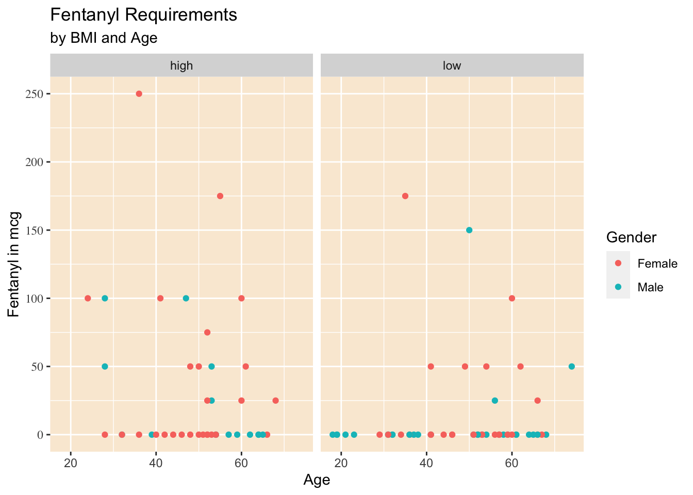

# Helping out with ggplot

The {ggplot} package is extremely powerful, and has many extension packages that augment that power for data visualization. But the number of options, particularly for theming, can get overwhelming. This is especially true if you are not using {ggplot} every day. Medical day (and night) jobs can get in the way of great data visualizations.

But there are several helper packages to make your life easier, including {ggx}, {ggThemeAssist}, and {esquisse}.

## ggx::gghelp()

Let's start with {ggx}.

The *gghelp()* function in this simple package converts natural language queries (in quotes) into a ggplot command string. It can be helpful for styling axes, labels, font size, title, and legends. It is limited by its library of commands and range of styling, but can be helpful in a pinch. Try a few questions below, and make your own.


```r
ggx::gghelp("how do I remove the legend")
```

```
## theme(legend.position = "none")
```

```r
ggx::gghelp("how do I increase the font size of the title")
```

```
## theme(axis.title.x=element_text(size=rel(2)))
```

```r
ggx::gghelp("change the x axis label to 'systolic blood pressure'")
```

```
## xlab('systolic blood pressure')
```

## Getting more help with theming with ggThemeAssist

ggThemeAssist is an RStudio add-in that you install when you install the {ggThemeAssist} package. It is used after you have your basic plot in place, with the right geom, and the x and y variables in place.

Let's start you out with a simple plot from the {medicaldata} package. This plots the fentanyl requirements for anesthesia in the `supraclavicular` dataset comparing high and low BMI, age, and gender effects. Run this code block to see what the basic plot looks like.


```r
plot1 <- medicaldata::supraclavicular %>% 
  filter(!is.na(bmi)) %>% 
  mutate(gender_cat = case_when(gender == 1 ~ "Male",
                             gender == 0 ~ "Female")) %>% 
  mutate(bmi_cat = case_when(bmi <30 ~ "low",
                             bmi >= 30 ~ "high")) %>% 
  ggplot(aes(x=age, y = fentanyl, col = gender_cat)) +
  geom_point() +
  facet_wrap(. ~ bmi_cat) 

plot1 + theme(axis.text.y = element_text(family = "serif"), 
    panel.background = element_rect(fill = "antiquewhite"), 
    plot.background = element_rect(fill = "white")) +
  labs(title = "Fentanyl Requirements", x = "Age", 
    y = "Fentanyl in mcg", colour = "Gender", 
    subtitle = "by BMI and Age")
```

```
## Warning: Removed 1 rows containing missing values
## (geom_point).
```



Now select the code that generates the plot. You can also assign the plot (with an assignment arrow) to an imaginative name, like plot1. You can then select this object as well.

Once you have the plot selected in your code, you can activate ggThemeAssist in one of two ways:

-   Go to your Addins dropdown menu, and select ggThemeAssist

-   type in the Console: `ggthemeAssistGaget(plot1)`

-   Either approach will open up an interactive window, with 6 tabs and a bunch of options.

-   These tabs include:

    -   Settings

    -   Panel and Background

    -   Axis

    -   Title and Label

    -   Legend

    -   Subtitle and Caption

Open these up and experiment. You will see the results as you change options. When you are happy with the result, click on the Done button in the top right. This will add all of your thematic changes as valid R code to the existing plot object.

## Website helpers for ggplot

Several websites provide quick help for ggplot needs, and are worth bookmarking.

The Aesthetics Helper, at <https://ggplot2tor.com/aesthetics/>, provides a quick guide to which aesthetics are required (green), and which other aesthetics are available (optional, in orange) to map variables in your dataset to components of a plot for each geom.

The Guide to Scales, at <https://ggplot2tor.com/scales>, helps you find the proper names of scales in ggplot2, by selecting your variable type and (if needed) the aesthetic for the scale. Then by clicking on one of the available scales, you can get example code with appropriate syntax for multiple arguments. This can be very helpful in preventing frustration with not having the scales quite right.

The R Graph Gallery, at <https://www.r-graph-gallery.com>, is a popular overview of available graph types. You can quickly scan a bunch of plots based on distributions, correlations, rankings, parts of a whole, change over time, maps, and flow and select one that looks interesting. When you find one you like, you can click on it and get the underlying ggplot code.

Another popular web gallery with code is the Top 50 ggplot2 visualizations, at <http://r-statistics.co/Top50-Ggplot2-Visualizations-MasterList-R-Code.html>

Cedric Scherer has a lengthy free tutorial with lots of great examples at <https://www.cedricscherer.com/2019/08/05/a-ggplot2-tutorial-for-beautiful-plotting-in-r/>

There is also a gallery of all the many extension packages people have built as add-ons to ggplot, often for specific and specialized plotting needs. Take a loot at <https://exts.ggplot2.tidyverse.org/gallery/> Packages ggridges, ggalluvial, ggmosaic, ggdist, gghalves, and ComplexUpset have proven quite popular. Take a look at all the options for extending ggplot.

## Getting Even more help with esquisse

{esquisse} is an RStudio add-in that you install when you install the {esquisse} package. It is used to create plots from scratch in ggplot.

A nice website on how to get started can be found at: <https://cran.r-project.org/web/packages/esquisse/vignettes/get-started.html>

But the two ways to get started are to either:

-   run `esquisser(dataframe)` in the Console, with the dataframe that you want to make a plot from, or

-   In the Addins menu, select `ggplot2_builder` under ESQUISSE

Either approach opens up a new window. If you did not specify a dataframe, it will ask you to select one, either from the Global Environment, or from a data package. For our purposes, select the {medicaldata} package, and the dataframe `blood_storage`. This will give you a window with many options, and a sandbox full of variables.

-   To look at the data, click on the `Show Data` icon at top left

-   You can drag variables into different aesthetic mappings. Start with

    -   PreopPSA for x

    -   TimeToRecurrence for y

    -   Age mapped to color

    -   FamHx or AA mapped to Size

    -   You can drag variables out of mappings and back to the variable sandbox if needed

-   You can click on the Settings Gear at the top right to activate more aesthetics

-   You can click on the geom icon at top left to change the plot type

-   You can edit the Title and Labels with this tab

-   You can edit Plot Options

-   You can edit the plot appearance

-   When you are happy with it, you can click on the Code tab, and copy it to your script.

{esquisse} can get you started on good plots, and remind you of ggplot options you may have forgotten (or never knew) about. There are a number of fancy plots and extensions it can not do, and it will not clean your data for you, or reorder factors. But it can be really helpful if you are not plotting very often or if you are just getting started with ggplot.
