# Getting Started and Installing Your Tools

One of the most intimidating parts of getting started with something new is the actual getting started part. Don't worry, we will walk you through this step-by step. 

## Goals for this Chapter
- Install R on your Computer
- Install RStudio on your Computer
- Install Git on your Computer
- Get Acquainted with the RStudio IDE

## Website links needed for this Chapter
While in many chapters, we will list the R packages you need, in this chapter, you will be downloading and installing new software, so we will list the links here for your reference    

- https://www.r-project.org
- https://rstudio.com/products/rstudio/download/
- https://git-scm.com/downloads 

## Pathway for this Chapter
This Chapter is part of the **TOOLS** pathway.
Chapters in this pathway include

- Getting Started and Installing Your Tools
- Updating R, RStudio, and Your Packages
- Advanced Use of the RStudio IDE
- When You Don't Want to Update Packages (Using _renv_)
- Major R Updates (Where Are My Packages?)

## Installing R on your Computer
R is a statistical programming language, designed for non-programmers (statisticians). It is optimized to work with data in tables. It is a very fast and powerful programming engine, but it is not terribly comfortable or convenient. R itself is not terribly user-friendly. It is a lot like a drag racing car, which is basically a person with a steering wheel strapped to an airplane engine. 
 

 
Very aerodynamic and fast, but not comfortable for the long run (more than about 8 seconds).
You will need something more like a production car, with a nice interior and a dashboard, and comfy leather seats.  
 

 
This is provided by the RStudio IDE (Integrated Developer Environment). We want you to install both R and RStudio, in that order.     
Let's start with installing R.    
R is free and available for download on the web. Go to the [r-project website](https://r-project.org/) to get started. 

This screen will look like this
    
 
You can see from the blue link (download R) that you can download R, but you will be downloading it faster if you pick a local CRAN mirror.   
You might be wondering what CRAN and CRAN Mirrors are. Nothing to do with cranberries, fortunately. CRAN is the Comprehensive R Archive Network. Each site (mirror) in the network contains an archive of all R versions and packages, and the sites are scattered over the globe. A CRAN Mirror maintains an up to date copy of all of the R versions and packages on CRAN. If you use the nearest CRAN mirror, you will generally get faster downloads.   
At this point, you might be wondering what a package is...   
A package is a set of functions and/or data that you can download to upgrade and add features to R. It is a lot like a downloadable upgrade to a Tesla that lets you play the video game _Witcher 3_ on your console, but more useful.
   

Now click on the blue link that says "download R".    
This will take you to a page to select your local CRAN Mirror , from which you will download R.
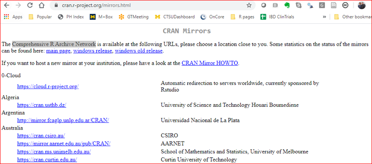
Scroll down to your country (yes, the USA is at the bottom), and a CRAN mirror near you.
This is an example from northern Michigan, USA.
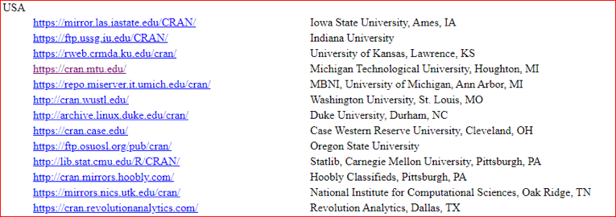
Once you click on a CRAN Mirror site to select the location, you will be taken to the actual Download site.

Select the link for the operating system you want to use. We will walk through this with Windows first, then Mac. If you are using a Mac, skip forward to the Mac install. If you are using Linux, you can clearly figure it out on your own (it will look a lot like these).  
Once you have clicked through, your next screen will look like this    
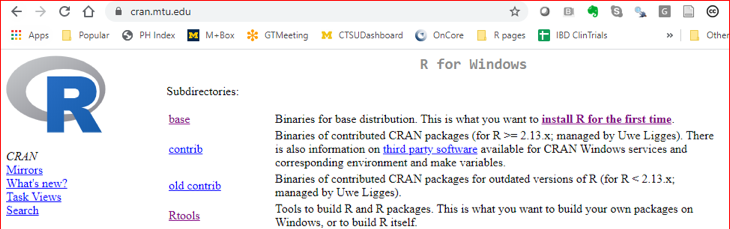
You want to download both base and Rtools (you might need Rtools later). The base link will take you to the latest version, which will look something like this.

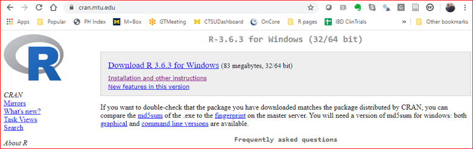
Click on this link, and you will be able to save a file named R-N.N.N-win.exe (Ns depending on version number) to your Downloads folder. Click on the Save button to save it.
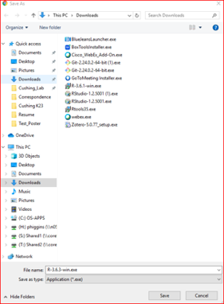
Now, go to your Downloads folder in Windows, and double clinic on the R installation file (R-N.N.N-win.exe). Click Yes to allow this to install.
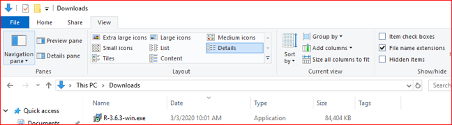
Now select your language option

You will be asked to accept the GNU license - do so. Click Yes to allow this to install. Then select where to install - generally use the default- a local (often C) drive - do not install on a shared network drive or in the cloud.

Then select the Components - generally use the defaults, but newer computers can skip the 32 bit version.
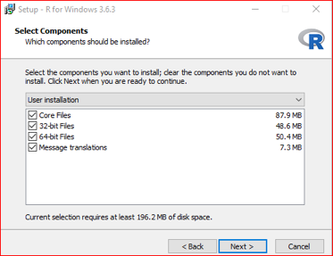
In the next dialog box, accept the default startup options.
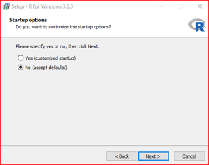
You can choose the start menu folder. The default R folder is fine.

You probably won't need shortcuts, so leave these unchecked in the next dialog box.

Then the Setup Wizard will appear - click Finish, and the rest of the installation will occur.

### Testing

Now you want to test whether your Windows installation was successful. Can you find R and make it work?
Hunt for your C folder, then for OS-APPS within that folder. Keep drilling down to the Program Files folder. Then the R folder, and the current version folder within that one (R-N.N.N). Within that folder will be the bin folder, and within that will be your R-N.N.N.exe file. Double click on this to run it. The example paths below can help guide you.

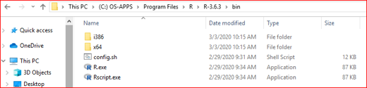
Opening the exe file will produce a classic 2000-era terminal window, called Rterm, with 64 bit if that is what your computer uses. The version number should match what you downloaded. The messaging should end with a ">" prompt.

At this prompt, type in:     
 
paste(‘Two to the seventh power is’, 2^7)
 
(don't leave out the comma) - then press the Enter key.

This should produce the following:    

Note that you have explained what is being done and computed the result. 

### Mac Install of R
The installation for Mac is very similar, but the windows look a bit different. At the Download Version page, you click on the Mac Download.
You will then click on the link for R-N.N.N.pkg, and allow downloads from CRAN.

 

Then go to Finder, and navigate to the Downloads folder. Click on R-N.N.N.pkg
You will then click on the link for R-N.N.N.pkg, and allow downloads from CRAN.

Click on Continue on 2 consecutive screens to download

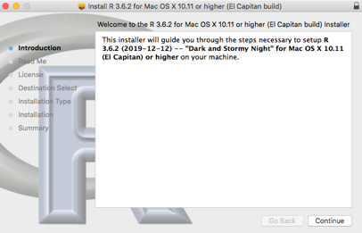

Then you need to agree with the License Agreement, 

then Click on Install, and provide your Mac password for permission to install.
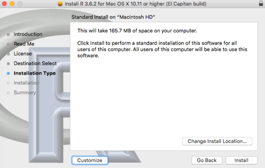
When the installation is complete, click on the Close button. Accept the prompt to move the installer file to the trash.

### Testing R on the Mac
Go to Finder, and then your Applications folder. Scroll down to the R file. Double click on this to run it. 

You should get this 2000=era terminal window named R Console. The version number should match what you downloaded, and the messaging should end with a ">" prompt.
At this prompt, type in 
 
paste(‘Two to the seventh power is’, 2^7)
 
(DON’T leave out the comma)
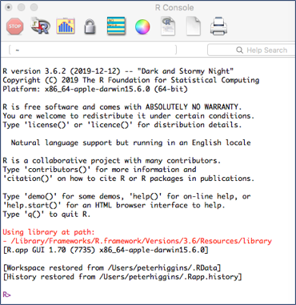

This should result in

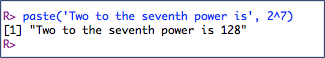

### Successful testing!

Awesome. You are now Ready to R!

## Installing RStudio on your Computer

Now that R is working, we will install RStudio. This is an IDE (Integrated Development Environment), with lots of bells and whistles to help you do reproducible medical research. 

This is a lot like adding a dashboard with polished walnut, a large video screen map, and heated car seats with Corinthian Leather. Not absolutely necessary, but nice to have. 
The RStudio IDE wraps around the R engine to make your experience more comfortable and efficient.

Fortunately, RStudio is a lot cheaper than any of these cars. In fact, it is free and open source. You can download it from the web at:  
[rstudio](https://rstudio.com/products/rstudio/)  
Click on the RStudio Desktop icon to begin.  

 
This will take you to a new site, where you will select the Open Source Edition of RStudio Desktop  

 
This will take you to a new site, where you will select the Free Version of RStudio Desktop  
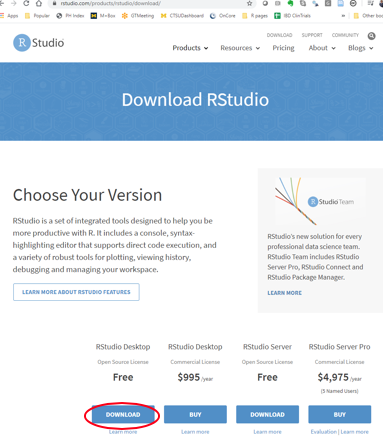
 
Now select the right version for your Operating syxtem - Windows or Mac. 

### Windows Install
Now save the Rstudio.N.N.N.exe file (Ns will be digits representing the version number) to your downloads folder.
 
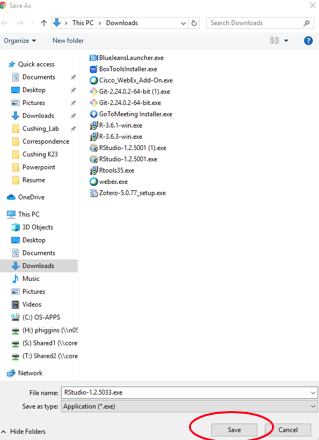
 
Now go to your downloads folder, and double click on the Rstudio.N.N.N.exe file.
 

 
Allow this app to make changes. Click Next to Continue, and Agree to the Install Location.
 

 
Click Install to put Rstudio in the default Start Menu Folder, and when done, click the Finish button.
 

 

 
Now select your preferred language option, accept the GNU license, Click Yes to allow this to install. Select where to install. This is generally on a local (often C:) drive, and usually **not** a shared network drive or in the cloud.
 
### Testing Windows RStudio
Now you should be ready to test your Windows installation of Rstudio. 
Open your Start menu Program list, and find Rstudio. Pin it as a favorite now. 
Click to Open Rstudio. 
Within the Console window of Rstudio, an instance of R is started up. Check that the version number matches the version of R that you downloaded. 
 
Now run a test at the prompt (">") in the Console window. Type in  
`paste("Three to the 5th power is", 3^5)` 
** do not leave out the quotes or the comma**
Then press the enter key
 
and this should be your result.

 
A successful result means that you are ready to roll in Rstudio and R! 
 

 

### Installing R on the Mac
Start at this link: [Rstudio Download](https://rstudio.com/products/rstudio/download/
) 
Select the Free RStudio Desktop Version 

 
Then click on the big button to Download RStudio for Mac.
 
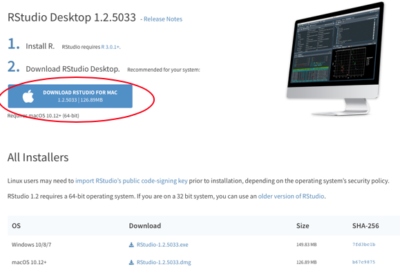
 
After the Download is complete, go to Finder and the Downloads Folder. Double click on the Rstudio.N.N.N.dmg file in your Downloads folder.  
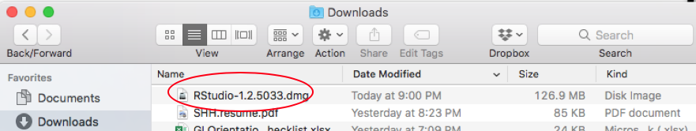
 
This will open a window that looks like this
 
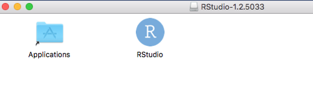
 
Use your mouse to drag the RStudio icon into the Applications folder.
 
Now go back to Finder, then into the Applications folder.
Double click on the RStudio icon, and click OK to Open. Pin your RStudio to the Dock. Double Click to run RStudio. 
RStudio will open an instance of R inside the Console pane of RStudio with the version number of R that you installed, and a ">" prompt.  
### Testing the Mac Installation of RStudio
Type in  
`paste("Three to the 5th power is", 3^5)` 
** do not leave out the quotes or the comma**
Then press the enter key
 
and this should be your result. 
 

 
A successful result means that you are ready to roll in Rstudio and R! 
 

## Installing Git on your Computer

## Getting Acquainted with the RStudio IDE

## Introduction {#intro}

There are many books about Data Science. 
 
Why does the world need another one, particularly one targeting physicians?

- There is a lot of health care data
- There are a lot of interesting questions in health care
- There are particular and challenging issues in doing data analysis with PHI (Protected Health Information)

Syllabus:  Data Science for Physicians (DS4P) 

- Instructor: Peter Higgins, MD, PhD, MSc (CRDSA), Professor of Internal Medicine
- Office Hours: MSRB One 6510
- In-person class time
  - MSRB One 6510, Thursday evenings 6:30-8:30 PM
  

## Course Description and Objectives

### Description
A practical introduction to data collection and security, data cleaning, statistical methods and computational tools needed to make sense of data, and methods for reporting and sharing your findings. This course is not a traditional introductory statistics courses in that computing plays a more central role than mathematics and a higher emphasis is placed on “thinking with data.” Topics include 

- secure HIPPA-compliant data collection
- data cleaning and validation
- data visualization
- data wrangling
- confidence intervals
- hypothesis testing, and 
- regression 
The course has no mathematics or computer science prerequisites.
 

### Objectives

1.	Have students engage in the data/science research pipeline in as faithful a manner as possible while maintaining a level suitable for novices.
2.	Foster a conceptual understanding of statistical topics and methods using real clinical data whenever possible, and simulation/resampling to support teaching concepts of inference. 
3.	Use a flipped classroom model by incorporating online learning for new concepts, with limited face-to-face time for real-time problem-solving 
4.	Introduce best practices for reproducible research and collaboration.
5.	Develop statistical literacy by, among other ways, tying in the curriculum to actual clinical data, demonstrating the importance statistics and computing plays in advancing medicine
 

### Topics
Roughly speaking we will cover the following topics (a more detailed outline is found below:

1.	Introduction and Tools (R, RStudio, and R Markdown)
2.	Data Import, and Handling
3.	Data Collection
4.	Checking, Validating, And Exploring your Data
5.	Data Types
6.	Data Wrangling with Tidyr and Dplyr
7.	Graphic Summaries for a Single Variable – ggplot package
8.	Descriptive Data for a Single Variable
9.	Graphic Summaries for Two or More Variables – ggplot2
10.	Descriptive Data for Two or More Variables
11.	Presenting your Results in a report with RMarkdown
12.	Statistical inference
13.	Study Design
14.	Sample Size and Power
15.	Sources of Bias
16.	Study Types
17.	One variable, single group
18.	One variable, two groups
19.	Multiple groups
20.	Linear Regression
21.	Reporting results interactively with Shiny
22.	Logistic Regression
23.	Meta-Analysis
 

### Learning Resources

•	E-Textbooks: 
Open Intro Statistics, at www.openintro.org  

•	E-Books on R
 
These are at different levels:

Level:    Absolute Beginner 
Textbook: R Basics	 
Goal:     Set up R and RStudio on a laptop, introduce the concept of an IDE  
Link:

Level:    New to R & Statistics	 
Textbook: Modern Dive 
Goal:     Learn basics of Data Management and visualization, introduction to hypothesis testing and statistical modeling   
Link:
 

Level:    Comfortable with R	
Textbook: Hands-On R Programming  
Goal:      
Link: 
 

Level:    Ready to Understand More	
Textbook: R for Data Science  
Link:      
 

•	Software: 

- Local laptop/desktop free open-source version of R and RStudio
- Cloud-based RStudio Server, which you can access in your browser via:
 
 Note if you are off-campus you must first log into the UM VPN. 
 
 
•	Online:

- DataCamp. A brower based interactive tool for learning R through short, focused courses, each 3-4 hours long.
- RStudio. Website with many resources for learning about the RStudio IDE and the tidyverse.
- r-cookbook – an often useful website with concrete examples of how to use R packages
- Stack Overflow and Google. Remarkably helpful to search for explanations of error messages, or explanations of problems that someone else has probably also experienced. For using Google, search for any topic or your error message and add “in R”
- package vignettes – variable quality, but when well done, can be extremely helpful examples of how to use the functions in each package
- R twitter – follow Rbloggers, #rstats
 

### Evaluation
This course is entirely voluntary. I hope that you will learn valuable skills that will advance your research career. I would like you to progress to using these skills on your own data as quickly as possible, as this will greatly help you reinforce your new skills. There are no grades and no formal evaluations. You can, however, earn certificates on DataCamp for completing courses.
 

### Task Goals
1.	Learn concepts through Data Camp  
a.	Multiple short courses to correspond with each unit
2.	Test yourself with assignments in ModernDive
a.	Chapters corresponding to each unit
3.	Three Challenges
a.	Clean data and perform descriptive data analysis on the biofire dataset
b.	Clean data and model outcomes in the health satisfaction dataset, producing a final report
c.	Use logistic regression to model dichotomous outcomes and produce a Shiny app to allow users to make predictions for future patients 
4.	Final Project 
There will be a final capstone project. This is an opportunity for you to use your statistics and data science skills developed during the challenges and perform your own start-to-finish data analysis project. The project will involving you addressing a scientific question by choosing a data set (or preferably, using one of your own), performing an analysis using the concepts and tools we have covered in this course, and writing a report. This can be done solo or with a partner.
 

### Learning Goals
1.	Recognize the importance of data collection, identify limitations in data collection methods, and determine how they affect the generalizability of your findings
2.	Use statistical software (R) to summarize data numerically and visually, and to perform data analysis.
3.	Have a conceptual understanding of statistical inference.
4.	Apply estimation and testing methods to analyze single variables or the relationship between two variables in order to understand data relationships and make data-based conclusions.
5.	Model numerical response variables and dichotomous response variables using a single explanatory variable or multiple explanatory variables in order to investigate relationships between variables.
6.	Interpret results correctly, effectively, and in context without relying on statistical jargon.
7.	Critique data-based claims and evaluate data-based decisions.
 

### Tips for success
1.	Read materials for each unit
2.	Do Data Camp courses for each unit – usually around 1 chapter (1 hour) per day.
3.	Do Data Camp daily practice on any day that you don’t have time to do a full chapter
4.	At end of each course, review material, take notes, copy/reproduce/save code on your laptop
5.	Try new skills on your own data, or on one of the open data sets
6.	Use RStudio and DataCamp Cheat sheets
7.	Annotate your code to help ‘future you’ understand it.
8.	Save and reuse your code for future projects
 

### Expected work load  
This course is entirely voluntary. It is expected that you have lots of clinical and/or research work to keep up with, along with the occasional call or night rotation. This is an investment in future skills to help your career. I recommend that you try to do up to one hour a day on most days, and on days when that is not realistic, to just do the 10 minutes of daily practice on DataCamp to keep the information fresh in your mind.  
 
Other learning resources:
 
 
 

## Access RStudio cloud  

 

## R basics E-book  

 
Use the e-book Rbasics by Chester Ismay 

https://ismayc.github.io/rbasics-book/

 

## RStudio tips document  

 
