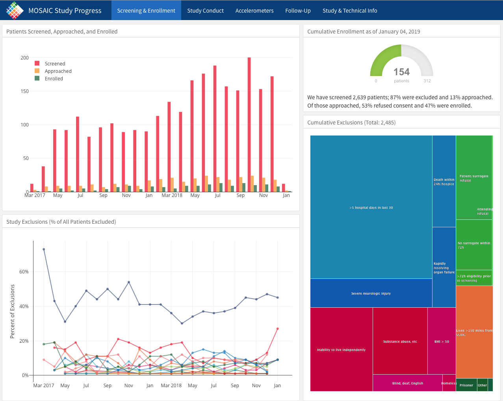

```{r setup, include=FALSE}
library(tidyverse)
library(medicaldata)
library(rayrender)
library(plotly)
```

# A Tasting Menu of R

In this chapter, we will introduce you to a lot of neat things that you can do with R and RStudio, and you will publish a simple data analysis on the Internet that you can share with friends and family.


## Setting the Table

At the end of this chapter, you will publish a data analysis to *RPubs*, a free website site where you can share your data analyses and visualizations.
First you will need to set up an account on RPubs.
Start by opening a new tab in your browser, and navigating to this [RPubs link](https://rpubs.com/users/new).
It should look like the image below.
\
<br> Enter your name, email, username and password, and click on the *Register Now* button, and you will be set up to use RPubs.\
This will bring you to this pag
e. In the image below, we have set up an account for pd
r.\
 Click on the *Here's How You Get Started* l
ink. \
You are now all set up and ready
to go. Now you have a place on the internet to share your R crea
tions. On to the creation
part!

## Goals for this Chapter

-   Open a New Rmarkdown document
-   Read in Data from a file
-   Wrangle Your Data
-   Visualize Your Data
-   Publish your work to RPubs
-   Check out Interactive Plots
-   Check out Animated Graphics
-   Check out a Clinical Trial Dashboard
-   Check out a Shiny App

## Packages needed for this Chapter

You will need to enter this line of code into your console, to make sure that the tidyverse package is installed on your computer.
`install.packages("tidyverse")`

In the setup chunk of your Rmarkdown document, you will need to access the tidyverse package with one line of code: `library(tidyverse)`

## Website links needed for this Chapter

In this chapter, you will need to access the RPubs website.\
- <https://rpubs.com/>

## Pathway for this Chapter

This Chapter is part of the **XXX** pathway.
Chapters in this pathway include

## Open a New Rmarkdown document

Let's get started in R.
Turn on your computer, and open the RStudio application.
You should see the familiar panes for the Console, Environment, and Files.\
You need to open up a new document to activate the Source pane.
While in RStudio, click on File/New File/RMarkdown.
It should look like this.
\
 Now you will see the window belo
w. Rename the document from "Untitled" to "Tasting", Enter your own name as the Author, and click the OK butto
n. 

Now the file is open, and looks like the window below.
Click on the save icon (like a floppy disk in the top left), and save this document as tasting.Rmd.


You have created a new Rmarkdown document.
An Rmarkdown document lets you mix data, code, and descriptive text.
It is very helpful for presenting and explaining data and visualizations.
An Rmarkdown document can be converted (Knit) to HTML for a web page, Microsoft Word, Powerpoint, PDF, and several other formats.

**Code chunks** are in a gray color, and both start and end with 3 backticks (\`\`\`).

```{r chunk1, eval = FALSE}
code goes here
```

**Text** can be body text, or can be headers and titles.
The number of hashtags before some header text defines what level the header is.\
You can insert **links**, **images**, and even YouTube **videos** into Rmarkdown documents if it is helpful to explain your point.

The first code chunk in each Rmarkdown document is named `setup`.
The name comes after the left curly brace and the r (`{r`) at the beginning of the setup chunk.
The letter `r` tells RStudio that what is coming on the next line is R code (RStudio can also use SQL, C++, python, and several other languages).
After the comma, you can define options for this code chunk.
In this case, the option `include` is set to FALSE, so that when this Rmarkdown document is knitted, this code chunk will not appear.

## Read in Data from a file

We will start by reading in some data from the {medicaldata} package.

### Installing Packages

Before we begin, you have to have a few R packages installed on your computer.

Go to your Console tab, and type in (or copy and paste in) the following 3 lines (below the {r} ):

```{r, eval=FALSE}
install.packages('tidyverse')
install.packages('janitor')
install.packages('medicaldata')
```

Press Enter to run these functions.
These will install the 3 packages, {tidyverse}, {janitor}, and {medicaldata}.
Installing packages is like buying apps for your phone.
But these apps are not loaded unless you tell R and RStudio that you want them loaded in the current session.
You do this with the *library()* function.

### Loading Packages with library()

Copy and paste to add the following 4 lines (below the {r} line) to your `setup` chunk in your "Tasting.Rmd" Rmarkdown document:

```{r, eval=FALSE}
library(tidyverse)
library(janitor)
library(medicaldata)
prostate <- medicaldata::blood_storage %>% clean_names()
```

These functions will load 3 packages and reads in data from a study of prostate cancer and blood storage into the `prostate` object.

To run these functions, click on the green rightward arrow at the top right of the `setup` code chunk.

The {tidyverse} package (it is actually a meta-package that contains multiple packages) will be quite chatty, telling you which packages are being attached, and when conflicts with identically-named functions in the {stat} package have occurred.
When you call these functions, *filter()* and *lag()*, the versions from the {tidyverse} package will be used by default, and the versions from the {stats} package will be masked.

The {janitor} package will tell you that it has 2 conflicts with the {stats} package, and will supercede (mask) the {stats} functions for *chisq.test()* and *fisher.test().*

If you really want to access the versions from the {stats} package, you can do so by using the **package::function** construction, e.g. `stats::chisq.test().`

If you check the Environment tab in the top right pane of RStudio, you will find that you now have a **prostate** object under the Data header.
You can click on the white-on-blue arrow to the left of the word prostate to get an overview of each variable, the variable type (numeric, string, etc.), and the first few values of each variable.

You can also click on the word prostate in the Environment window to open up a View of the whole dataset in the Source pane (top left).
You can scroll up and down the rows, or right and left in the columns to inspect the data.

If you check the Console tab (lower left), you will see that when you clicked on prostate, this sent a function to the console to **View(prostate)**.
You can view any dataset in the Environment tab with this function.

You can also look at your data in the Console, with

`summary(prostate) or`

`glimpse(prostate)`

Underneath the setup chunk, write something about the prostate dataset.
You can write in Normal text, and add headers by starting a line with 2 hashtags, a space, and text like this

\#\# Headline about Prostate data

Write a few sentences after your headline.
You can add *italics* or **bold** text by wrapping the text to be highlighted in underscores or 2 asterisks, respectively.

## Wrangle Your Data

Add a new code chunk

name it

wrangle it - select, filter

## Visualize Your Data

```{r}

```

first ggplot

## Publish your work to RPubs

push to RPubs

You did it.

Share website with others

## The Dessert Cart

Below are some examples of neat things you can do with medical data in R.
These are more advanced approaches, but completely doable when you have more experience with R.

### Interactive Plots

Below is an interactive plot.
Click on the plot to activate it.
Then you can hover your mouse over each point to get more details about the data.
You can also use the crosshairs to draw a zoom rectangle, or use the plotly menu bar at top right to zoom in or out of a region of the data.

```{r, echo=FALSE}
p <- medicaldata::cytomegalovirus %>% 
  ggplot(aes(x = time.to.transplant, y = time.to.agvhd,
             color = factor(donor.cmv))) +
  geom_point() +
  labs(title = "Time to Transplant vs Time to Acute GVHD by Donor CMV Status",
       x = "Time to Transplant", y = "Time to Acute GVHD",
       color = "Donor\nCMV\nStatus") +
  theme_bw() 

ggplotly(p)
```

### Animated Graphics

Here is an example of animated graphics that you can create in R to illustrate changes in data over time.

```{r ,echo=FALSE}
knitr::include_graphics("images/vaccination-animation.gif")
```

### A Clinical Trial Dashboard

Below is an screen capture picture of a web flexdashboard to track the data in an ongoing clinical trial (which is now completed and published).
You can see the actual web dashboard [here](https://jenthompson.me/examples/progressdash.html).

Check out the various tabs.
Imagine how useful it would be to track enrollment, exclusions, missing data, and outcomes in real time.

Details on how this is done can be found [here](https://jenthompson.me/2018/02/09/flexdashboards-monitoring/), and the underlying code [here](https://github.com/jenniferthompson/MOSAICProgress).

All of this work was done in R by [Jenn Thompson](https://jenthompson.me/about/).

```{r, echo = FALSE, fig.width=10}

```

### A Shiny App

The frame below shows a publicly available Shiny web application, built with R, which can help clinicians calculate the probablity of intestinal TB vs. Crohn's disease with available clinical data.
And to determine how new test results would change this estimate.

The web app can be accessed [here](https://www.pathology.med.umich.edu/shiny/tbcrohns/).

```{r, echo = FALSE, fig.width=10}
knitr::include_graphics("images/tb_shiny_app.png")
```

### An Example of Synergy in the R Community

One of the remarkable things about the open source R community is that people build all kinds of new R functions and packages that are useful to them, and then share them publicly with tools like *Github* so that they can be useful to others.
Often combining bits of several packages leads to **emergent properties** - completely new creations that can only occur because all of the parts (packages) are present.
The collaborative nature of the R community, in this case on Twitter (follow the \#rstats hashtag), can lead to surprising collaborations and outcomes.\
Go ahead and play the example below, which uses rayrendering (all coded entirely in R) to show a 3D map of John Snow's cholera case data in 1854, which led him to identify the Broad Street water pump as the source of the cholera outbreak, and led to the removal of the pump handle and the end of outbreak.
\

<iframe width="560" height="315" src="https://www.youtube.com/embed/B_UsX5vfPJU" frameborder="0" allow="accelerometer; autoplay; encrypted-media; gyroscope; picture-in-picture" allowfullscreen>

</iframe>

```{r echo=FALSE}
knitr::write_bib("rayrender", "packages.bib")
```

If you are not familiar with John Snow and the Broad Street pump, there is a fun series of YouTube animations (parts 1-3 and an epilogue) to explain the history.
Start by clicking [here](https://www.youtube.com/watch?v=TLpzHHbFrHY&feature=emb_rel_end).
