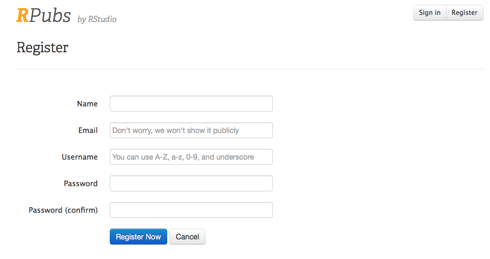
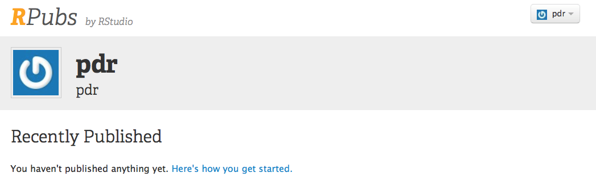
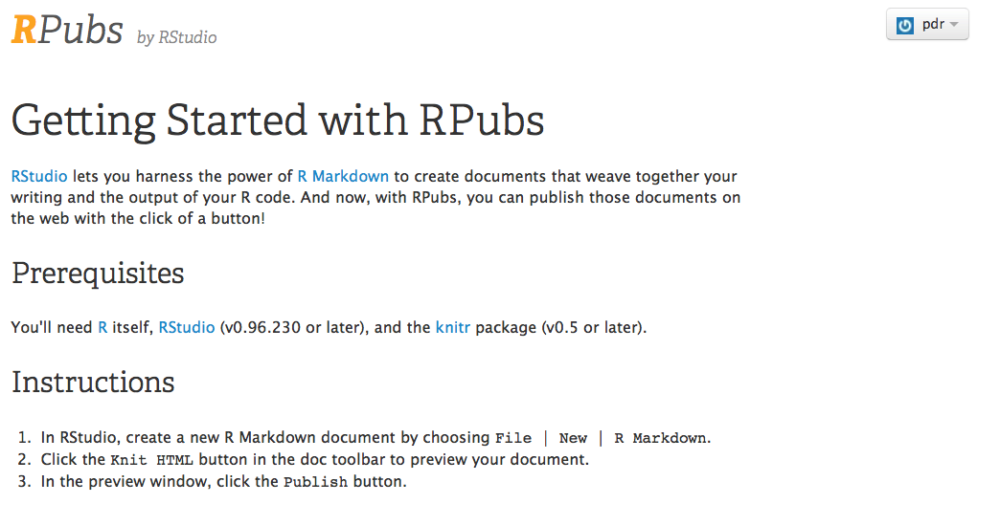

```{r setup, include=FALSE}
knitr::opts_chunk$set(echo = TRUE)
library(tidyverse)
```

# A Tasting Menu of R
In this chapter, we will introduce you to a lot of neat things that you can do with R and RStudio, and you will publish a simple data analysis on the Internet 
that you can share with friends and family.

## Getting Set Up

At the end of this chapter, you will publish a data analysis to *RPubs*, a free website site where you can share your data analyses and visualizations. First you will need to set up an account on RPubs. Start by going to this [RPubs link](https://rpubs.com/users/new).
    
<br>
Enter your name, email, username and password, and you will be set up to use RPubs.    
This will bring you to this page. We have set up an account for pdr.    
 
Click on the _Here's How You Get Started_ link.
    
You are now all set up and ready to go. Now you have a place on the internet to share your R creations!

## Goals for this Chapter
- Open a New Rmarkdown document\
- Read in Data from a file
- Wrangle Your Data
- Visualize Your Data
- Publish your work to RPubs
- Check out Interactive Plots
- Check out Animated Graphics
- Check out a Clinical Trial Dashboard
- Check out a Shiny App

## Packages needed for this Chapter
You will need to enter this line of code into your console, to make sure that the tidyverse package is installed on your computer.
`install.packages("tidyverse")`      

In the setup chunk of your Rmarkdown document, you will need to access the tidyverse package with one line of code:
`library(tidyverse)`

## Website links needed for this Chapter
In this chapter, you will need to access the RPubs website.   

- https://rpubs.com/

## Pathway for this Chapter
This Chapter is part of the **XXX** pathway.
Chapters in this pathway include


