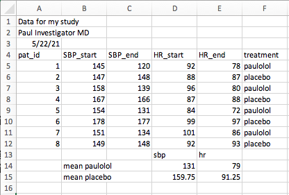

```{r setup, include=FALSE}
library(tidyverse)
library(medicaldata)
library(readxl)
library(skimr)
library(here)
library(glue)
library(webex)
scurvy <- medicaldata::scurvy
write_csv(scurvy, 'data/scurvy.csv')
strep_tb <- medicaldata::strep_tb
write_tsv(strep_tb, 'data/strep_tb.tsv')
url_stem <- "https://raw.githubusercontent.com/higgi13425/rmrwr-book/master/"
```

# Importing Your Data into R

For most of this book, we will be using datasets from the {medicaldata} package.
These are easy to load.
You just type into the Console pane `medicaldata::scurvy` and you get James Lind's scurvy dataset (actually, a reconstruction of what it might have looked like for his 12 participants).
If you want to save this data to an object in your work environment, you just need to assign this to a named object, like `scurvy`, like so:

```{r}
scurvy <- medicaldata::scurvy

# now print the columns for id and treatment
scurvy %>% select(study_id:treatment)
```

There are a number of medical datasets to explore and learn with, within the {medicaldata} package.

However, at some point, you will want to use R to work on your **own** data.
You may already be itching to get started on your own data.
This is a good thing.
Working with your own data, toward your own goals, will be a motivating example, and will help you learn R.
As you go through the different chapters, use the example data and exercises to get you started and to learn the principles, and then try what you have learned on your own data.

::: {.warning}
Reproducibility and Raw Data<br>
It is an important principle to *always* save an untouched copy of your raw data.
You can copy it to a new object, and experiment with modifying it, cleaning it, making plots, etc., but *always* leave the original data file untouched.
You want to create a completely reproducible, step-by-step trail from your raw data to your finished analysis and final report, and you can only do that if you preserve the original raw data.
That is the cornerstone of your analysis.
It is tempting to fix minor data entry errors, or other aspects of the raw data.
Do not do this - leave all errors intact in your raw data, and explicitly make edits with explanations of - who made the edit - when it was made - what was changed - why it was made - provide a justification, and identify source documents to support the rationale. Every edit should be documented in your code, with who, when, what, and why.
:::

Now, on to the fun part.
Let's read in some data!

## Reading data with the {readr} package

Many of the standard data formats can be read with functions in the {readr} package.
These include:

-   read_csv() for comma-separated values (\*.csv) files
-   read_tsv() for tab-separated values (\*.tsv) files
-   read_delim() for files with a different delimiter that you can specify (instead of commas or tabs, there might be semicolons), or you can let {readr} guess the delimiter in readr 2.0.
-   read_fwf() for fixed width files
-   read_table() for tabular files where columns are separated by white-space.
-   read_log() is specifically for web log files

Let's read a csv file.
First, make sure that you have the {readr} package loaded (or the {tidyverse} meta-package, which includes {readr}).
You can load {readr} with the `library()` function.

```{r}
library(readr)
# or you can use
library(tidyverse) # which will load 8 packages, including readr
```

Note that this will *not* work if you do not already have the {readr} package installed on your computer.
You will get an error, like this: `Error in library(readr) : there is no package called 'readr'`

This is not a problem - you just have to install the package first.
You only need to do this once, like buying a book, and putting it in your personal library.
Each time you use the package, you have to pull the book off the shelf, with `library(packagename)`.
To install the {readr} package, we can install the whole {tidyverse} package, which will come in handy later.
Just enter the following in your Console pane:

`install.packages('tidyverse')`

Note that quotes around 'tidyverse' are required, as tidyverse is not yet a known object or package in your working environment.
Once the {tidyverse} package is installed, you can use `library(tidyverse)` without quotes, as it is a known (installed) package.

OK, after that detour, we should be all caught up - you should be able to run `library(tidyverse)` or `library(readr)` without an error.
Now that you have {readr} loaded, you can read in some csv data.
Let's start with a file named `scurvy.csv` in a `data` folder on GitHub. You will need to glue together the url_stem and "data/scurvy.csv" to get the full web address. Run the code chunk below to see the url_stem and the dataset.

```{r}
url_stem
read_csv(glue(url_stem, 'data/scurvy.csv'))
```

Let's look at what was extracted from the csv file.
This starts after the url_stem (web address) is printed out.

The Console pane has a print out of the Column specification, followed by the data in rectangular format.
In the Column specification, the delimiter between items of data is identified (a comma), and a listing of variables with the `character` (chr) data type is printed. There are no non-character data types in this particular dataset.
The 'guessing' of what data type is appropriate for each variable is done 'automagically', as the read_csv() function reads the first 1000 rows, then guesses what data type is present in each column (variable).
It is often conservative, and in this case, made all of these columns into character variables (also called strings).
You could argue that the col_character() assignment should be numeric for the study_id variable, or that the Likert scales used for outcomes like gum_rot_d6 and skin_sores_d6 should be coded as ordinal variables, known as ordered factors in R.
You will learn to control these data types during data import with the `spec()` argument.

The second piece of output is the data itself.
This is first identified as a 'tibble', which is a type of data table, with 12 rows and 8 columns, in `# A tibble: 12 x 8`.
This is followed by a header row of variable names, and just below that is the data type (`<chr>` for character) for each column.
Then, on the left are gray row numbers (not actually part of the data set), followed by (to the right) rows of data.
A tibble, by default, only prints out 10 rows of data, and no more columns than will fill your current console window.
The other columns are listed in order at the bottom of the tibble in gray type.

Now, by simply reading in the data, you can look at it, but you can't do anything with it, as you have not saved it as an object in your working Environment.
If you want to do things with this data, and make them last, you have to *assign* the data to an object, and give it a name.
To do this, you need to use an assignment arrow, as below

```{r}
scurvy_data <- read_csv(glue(url_stem, 'data/scurvy.csv'))
```

Now this is saved to `scurvy_data` in your working Environment.
You can look in the Environment tab (top right pane in RStudio) and see that scurvy_data has now appeared in the Data section, with 12 observations of 8 variables.
This is not a file written (saved) to disk, but this dataset is now available in the working environment as an assigned data object.
You can now print this out at any time by typing `scurvy_data` into the Console, or into a script. Try this out in the Console pane.

### Test yourself on scurvy

- How many limes did the British seamen in the citrus arm receive each day? 

`r webex::mcq(c('3', '2', answer = 'zero', '1.5'))`

You can also start with the `scurvy_data` object, and *do* things to this data object, like summarize it, or graph it, or calculate total_symptom_score in a data pipeline.
Once you have assigned your data to an object, it will stick around in that R session for later use.

The csv (comma separated values) format is a very common data format, and most data management programs have a way to export `*.csv` files.
The csv format is simple, is not owned by anyone, and works across platforms.
However, it can occasionally be tricky if you have commas in the middle of a variable like `degree`, with entries like 'md, phd' in a column that is mostly 'md'.
The read_csv function is pretty smart, and usually gets the number of columns right, but this is something to watch out for.
**Notice** that read_csv had no problem with the dosing of vinegar ("two spoonfuls, three times a day") in the scurvy dataset.

If you happen to come across a tab-separated values file, *read_tsv()* works the same way.
Both of these functions have reasonable defaults, so that most of the time, you just have to use the path to your file (usually on your hard drive, rather than on the web) as the only argument.
On occasion, though, you will want to take control of some of the other arguments, and use something other than the defaults.

::: {.warning}
### What is a path?<br>
A **path** is the trail through the folders in your hard drive (or on the web) that the computer needs to follow to find a particupar file. Paths can look something like: <br>

- C:/Documents/Rcode/my_file.R
- ~/User/Documents/Rcode/my_file.R

and can get pretty complicated to keep track of. One particularly nice feature of Projects in RStudio is that the project directory is always your home, or root directory. You can make your life easier by using the {here} package, which memorizes the path to your project, so you can just write `here(my_file.R)`, and not have to worry about making a typo in a long path name.
:::

When your data has no column names (headers), read_csv will (by default) assume that the first row of the data is the column names.
To fix this, add the argument, **col_names** = FALSE.
You can also assign your own **col_names** by setting a vector, like c("patient_id", "treatment", "outcome") to col_names, as below

```{r}
read_csv(file = glue(url_stem, 'data/scurvy.csv'), 
col_names = c("pat_id", "arm", "dose", "gums", "skin", "weak", "lass", "fit"))
```

In this case, when we set our own **col_names**, there are now **13** rows of data, and the original column headers are now listed as the first row of data.
We can fix this with the **skip** argument within the parentheses of the `read_csv()` function, which has a default of 0.
We can skip as many lines as we want, which can be helpful if you have an Excel file with a lot of blank lines or commentary at the top of the spreadsheet.
When we set skip = 1 in this case, we get a cleaner dataset, without variable names as data.

```{r}
read_csv(file = glue(url_stem, 'data/scurvy.csv'), 
         col_names = c("pat_id", "arm", "dose", "gums", "skin", "weak", "lass", "fit"),
         skip = 1)
```

Now we don't have extra column names as data, and we are back to 12 rows.
Also note that in this code chunk, we put each argument to the function on its own line, with commas between them.
This is a good practice, to make your code more readable.
You can also set **n_max** to a particular number of rows to be read in (the default is infinity, or `Inf`) You might want a smaller number if you have a very large dataset and limited computer memory.
Another important argument (option) for both read_csv and read_tsv is **col_types**, which lets you take control of the column types during the data

What if you want to take more control of the import process with read_xxx()?
You can add a col_types argument to the read_csv() function.
You can copy the Column specifications from the first attempt at importing, and then make some edits. You can get the column specifications as guessed by {readr} by running the `spec()` function on the scurvy_data object.
Try this out in the code chunk below.

```{r}
spec(scurvy_data)
```
This sets the data type for each column (variable).
This is helpful if you want to change a few of these.

Take a look at the next code chunk below.
I have added the col_types argument to _read_csv()_, and set it equal to the Column specifications (copied from above).
Then I edited study_id to `col_integer()`, and treatment to `col_factor()`.
Run the code chunk below to see how this works.
The `glimpse` function will give an overview of the new `scurvy_cols` object that I assigned the data to.

```{r}
scurvy_cols <- read_csv(
  file = glue(url_stem, 'data/scurvy.csv'),
    col_types = cols(
  study_id = col_integer(),
  treatment = col_factor(),
  dosing_regimen_for_scurvy = col_character(),
  gum_rot_d6 = col_character(),
  skin_sores_d6 = col_character(),
  weakness_of_the_knees_d6 = col_character(),
  lassitude_d6 = col_character(),
  fit_for_duty_d6 = col_character()
)
)
glimpse(scurvy_cols)
```

You can see that study_id is now considered the integer data type (`<int>`), and the treatment variable is now a factor (`<fct>`).
You can choose as data types: 

- col_integer ()
- col_character() 
- col_number() (handles \#s with commas) 
- col_double() (to specify decimal \#s) 
- col_logical() (only TRUE and FALSE) 
- col_date(format = "") - may need to define format 
- col_time(format = "") - col_datetime(format = "") 
- col_factor(levels = "", ordered = TRUE) - you may want to set levels and ordered if ordinal.
- col_guess() - is the default 
- col_skip() if you want to skip a column

The read_csv() guesses may be fine, but you can take more control if needed.

This *col_types()* approach gives you fine control of each column.
But it is a lot of typing.
Sometimes you want to set all the column types with a lot less typing, and you don't need to set levels for factors, or formats for dates.
You can do this by setting col_types to a string, in which each letter specifies the column type for each column.
Run the example below by clicking on the green arrow at the top right of the code chunk, in which I use i for col_integer, c for col_character, and f for col_factor.

```{r}
scurvy_cols2 <- read_csv(
  file = glue(url_stem, 'data/scurvy.csv'),
         col_types = "ifcffff")

glimpse(scurvy_cols2)
```

### Try it Yourself

Now try this yourself with a *.tsv file.
The file `strep_tb.tsv` is located in the same GitHub folder, and you can use the same url_stem.

In the example code chunk below, there are several blanks.
Copy this code chunk (use the copy button in the top right of the code chunk - hover to find it) to your RStudio Console pane.
Edit it to make the two changes listed, and run the code chunk as directed below.

-   Fill in the second part of the read_xxx() function correctly to read this file
-   Fill in the correct file name to complete the path

This version of the code chunk will read in every column as the character data type.
This is OK, but not quite right.
Now edit the `col_types` string to make:

-   both doses numeric (n or d) (variables 3,4)
-   `gender` a factor (f) (var 5)
-   all 4 of the `baseline` variables into factors (var 6-9)
-   skip over strep_resistance and radiologic_6m - set as hyphens (`-`) (var 10-11)
-   `rad_num` into an integer (i) (var 12)
-   `improved` into a logical (l) (var 13)

```{r, error=TRUE, eval=FALSE}
strep_tb_cols <- read_---(
    file = glue(url_stem, 'data/----.tsv'),
      col_types = "ccccccccccccc")

glimpse(strep_tb_cols)
```

## Reading Excel Files with readxl

While file types like \*.csv and \*.tsv are common, it is also common to use Microsoft Excel or an equivalent for data entry.
There are a lot of reasons that this is not a good idea (see chapter XX and video at [link](https://www.youtube.com/watch?v=9f-hpJbjKZo)), but Excel is so ubiquitous, that it is often used for data entry.

Fortunately, the {readxl} package provides functions for reading excel files.
The *read_xl()* function works nearly the same as *read_csv()*.
But there are a few bonus arguments (options) that are really helpful.

The *read_excel()* function includes helpful arguments like **skip**, **col_names**, **col_types**, and **n_max**, much like *read_csv()*.
In addition, read_excel() has a **sheet** argument, which lets you specify which sheet in an excel workbook you want to read.
The default is the first worksheet, but you can set this to sheet = 4 for the 4th worksheet from the left, or sheet = "raw_data" to get the correct worksheet.
You can also set the range argument to only read in a particular range of cells, like range = "B2:G14".
Below is an example of how to read in an Excel worksheet.

```{r, error=TRUE}
read_excel(path = 'data/paulolol.xlsx',
           sheet = 1,
           skip = 1)

```

### Test yourself on strep_tb

- which argument in read_excel lets you skip rows of commentary? 

`r webex::mcq(c('sheet', answer = 'skip', 'path'))`

- which argument in read_excel lets you pick which spreadsheet tab to read? 

`r webex::mcq(c(answer = 'sheet', 'skip', 'path'))`

- How many missing (NA) values are in this dataset (as run with skip =1)?

`r webex::fitb('15')`

- what should the **range** argument be to read in these data cleanly? 

`r webex::mcq(c(answer = 'A3:F8', 'A1:L30', 'B4:K15'))`

## Bringing in data from other Statistical Programs (SAS, Stata, SPSS) with the {haven} package

It is common to have the occasional collaborator who still uses one of the older proprietary statistical packages. They will send you files with filenames like `data.sas7bdat` (SAS), `data.dta` (Stata), or `data.sav` (SPSS).

The {haven} package makes reding in these data files straightforward. 


** Set up **


```{r}
haven::read_sas(glue(url_stem, "data/blood_storage.sas7bdat"))
```

** write files, add examples for Stata, SPSS **


## Other strange file types with rio

Once in a while, you will run into a strange data file that is not a csv or Excel or from a common statistical package (SAS, Stata, SPSS). These might include Systat, Minitab, RDA, or others.

This is when the {rio} package comes to the rescue. The name, rio, stands for R input and output. The {rio} package looks at the file extension (like .csv, .xls, .dta) to guess the file type, and then applies the appropriate method to read in the data. The import() function in {rio} makes data import much easier. You don't always have the fine control seen in {readr}, but {rio} is an all-purpose tool that can get nearly any data format into R.

Try this out with the code chunk below.
Just replace the *filename* in the code chunk with one of the files named below.
Try to use the same `import()` function to read 

- scurvy.csv
- strep_tb.tsv
- paulolol.xlsx
- blood_storage.sas7bdat

```{r, error = TRUE}
rio::import(glue(url_stem, "data/filename"))
```

It can be very convenient to use {rio} for unusual file types.

## Data exploration with glimpse, str, and head/tail

Once you have a dataset read into your working Environment (see the Environment tab in RStudio), you will want to know more about it.
There are several helpful functions and packages to get you started in exploring your data.

### Taking a glimpse with *glimpse()*

The *glimpse()* function is part of the tidyverse, and is a helpful way to see a bit of all of the variables in a dataset.
Let's try this with the scurvy dataset, which we have already assigned to the object `scurvy` in the working Environment.
Just put the object name as an argument within the *glimpse()* function (inside the parentheses), as below.
Run the code chunk below to get the glimpse() output.

```{r}
glimpse(scurvy)
```

The *glimpse()* function output tells you that there are 12 rows (observations) and 8 columns (variables).
Then it lists each of the 8 variables, followed by the data type, and the first few values (or as much as will fit in the width of your Console pane).
We can see that study_id and dosing_regimen_for_scurvy are both of the `character` (aka string) data type, and the other 6 variables are factors.

### Try this out yourself.

What can you learn about the strep_tb dataset with *glimpse()*?
Edit the code chunk below to find out about strep_tb.

```{r, error=TRUE, eval=FALSE}
glimpse(----)
```

### Test yourself on strep_tb

- which variable is the logical data type? 

`r webex::mcq(c('baseline_esr', answer = 'improved', 'patient_id'))`

- which variable is the dbl numeric data type?

`r webex::mcq(c('arm', 'patient_id', answer = 'rad_num'))`

- How many observations are in this dataset?

`r webex::fitb('107')`


### Examining Structure with *str()*

The *str()* function is part of the {utils} package in base R, and can tell you the structure of any object in R, whether a list, a dataset, a tibble, or a single variable.
It is very helpful for reality-checking your data, especially when you are getting errors in your code.
A common source of errors is trying to run a function that requires a particular data structure or data type on the wrong data structure or data type.
Sometimes just checking the data structure will reveal the source of an error.

The *str()* function does largely what *glimpse()* does, but provides a bit more detail, with less attractive formatting.
Run the code chunk below to see the output of *str()*.

```{r}
str(scurvy)
```

The str() output starts by telling you that scurvy is a tibble, which is a modern sort of data table.
A tibble will by default only print 10 rows of data, and only the number of columns that will fit in your Console pane.
Then you see [12 x 8], which means that there are 12 rows and 8 columns - the default in R is to always list rows first, then columns (R x C notation).
Then you learn that this is an S3 object, that is a tbl_df (tibble), and a tbl, and also a data.frame).
Then you get a listing of each variable, data type, and a bit of the data, much like *glimpse()*.
Another extra detail provided by str() is that it tells you some of the levels of each factor variable, and then shows these as integers (how the data is actually stored).

### Test yourself on the scurvy dataset

- what is the dose of cider? 

`r webex::mcq(c('25 drops', answer = '1 quart per day', 'one-half rood'))`

- how many levels of gum_rot are there?

`r webex::fitb('4')`

- Which numeric value indicates 'fit for duty'?

`r webex::fitb('1')`


Note that you can also use *str()* and *glimpse()* on a single variable.
You often use this approach when you get an error message that tells you that you have the wrong data type.
Try this with the strep_tb dataset variable `patient_id` by running the code chunk below.
Imagine that you wanted to get the mean of `patient_id`.
You got a **warning** that pointed out that the `argument is not numeric or logical`.
So you run *str()* to find out the data structure of this variable.

```{r}
mean(strep_tb$patient_id)
str(strep_tb$patient_id)
```

This shows you that patient_id is actually a character variable.
If you wanted to find the mean value, you would have to change it to numeric (with *as.numeric()* first).
The glimpse() function provides identical output to str() for a variable in a table.

```{r}
glimpse(strep_tb$patient_id)
```

You can choose whether you prefer the details of *str()* or the nicer formatting of *glimpse()* for yourself.

### Examining a bit of data with *head()* and *tail()*

Oftentimes, you want just a quick peek at your data, especially after a merge or a mutate, to make sure that things have gone as expected.
This is where the base R functions *head()* and *tail()* can be helpful.
As you might have guessed, these functions give you a quick view of the head (top 6 rows) and tail (last 6 rows) of your data.
Try this out with scurvy or strep_tb.

```{r}
head(scurvy)
tail(strep_tb)

```

Note that since these are tibbles, they will only print the columns that will fit into your Console pane.
You can see all variables and the whole width (though it will wrap around to new lines) by either (1) converting these to a data frame first, to avoid tibble behavior, or (2) by using print, which has a width argument that allows you to control the number of columns (it also has an *n* argument that lets you print all rows).
Run the code chunk below to see how this is different.

```{r}
head(as.data.frame(scurvy))
print(tail(strep_tb), width = Inf)
```

It is actually much easier to see the full width and height of a data set by scrolling, which you can do when you *View()* a dataset in the RStudio viewer. Try this out in the Console pane, with `View(strep_tb)`.

### Test yourself on the printing tibbles

- What function (and argument) let you print all the columns of a tibble?

`r webex::mcq(c(answer = 'print(x, width=Inf)', 'filter(starts_with("width"))','sum(na.rm=TRUE)'))`

- What function (and argument) let you print all the *rows* of a tibble?

`r webex::mcq(c('filter(ends_with("all"))','median(na.rm=TRUE)', answer = 'print(x, n=Inf)'))`

If you just want a quick view of a few critical columns of your data, you can obtain this with the *select()* function, as in the code chunk below.
Note that if you want to look at a random sample of your dataset, rather than the head or tail, you can use *sample_frac()* or *sample_n()* to do this. This sampling can be helpful if your data are sorted, or the head and tail rows are not representative of the whole dataset.
See how this is used by running the code chunk below, which uses a 10% random sample of strep_tb to check that the mutate steps to generate the variables `rad_num` and `improved` worked correctly.

```{r}
#check that radiologic_6m, rad_num, and improved all match
strep_tb %>% 
  sample_frac(0.1) %>% 
  select(radiologic_6m, rad_num, improved)
```


## More exploration with skimr and DataExplorer

Once you have your data read in, you usually want to get an overview of this new dataset. While there are many ways to explore a dataset, I will introduce two:

- skim() from the {skimr} package
- create_report() from the {DataExplorer} package

You can get a more detailed look at a dataset with the {skimr} package, which has the `skim()` function, gives you a quick look at each variable in the dataset, with simple output in the Console. Try this out with the **strep_tb** dataset.
Run the code chunk below, applying the `skim()` function to the strep_tb dataset.

```{r}
skimr::skim(strep_tb)
```

### Test yourself on the `skim()` results

- How many females participated in the strep_tb study? 

`r webex::mcq(c('52', answer = '59', '48'))`

- What proportion of subjects in strep_tb were improved? 

`r webex::mcq(c('0.493', answer = '50.514', '0.55'))`

- What is the mean value for rad_num in strep_tb? 

`r webex::mcq(c(answer = '3.93', '1.89', '4.7'))`


A fancier approach is taken by the DataExplorer package, which can create a full html report with correlations and PCA analysis. Copy and run the chunk below to see what the Data Profiling Report looks like.

```{r}
DataExplorer::create_report(strep_tb)
```

### Test yourself on the `create_report()` results

- What percentage of the baseline_esr values were missing? 

`r webex::mcq(c('9.3%', '0.09%', answer = '0.93%', '1%'))`

- How many total data points ('observations') are there in the strep_tb dataset? 

`r webex::mcq(c('10,000', answer = '1,391', '107'))`

You can choose which you prefer, the simpler approach of {skimr} vs the fancier reports of {DataExplorer.}

## Practice loading data from multiple file types

## Practice saving (writing to disk) data objects in formats including csv, rds, xls, xlsx and statistical program formats

## How do readr and readxl parse columns?

## What are the variable types?

- Numeric - integer and double 
- Character - string 
- Logical - TRUE/FALSE 
- Dates - an unholy formatting mess 
- Factors - categorical variables 
  - nominal factors (no order) 
  - ordinal factors (with a meaningful order)

## Controlling Parsing

## Chapter Challenges

1. There is a file named "paulolol.xlsx" with the path of 'data/paulolol.xlsx'. A picture of this problematic file is shown below.<br>



- Read in this file with the {readxl} package. Just for fun, try this see how this turns out with no additional arguments.
- Be sure to skip the problematic non-data first few rows
- Be sure to exclude the problematic non-data calculations below the table.

Solution to Challenge 1: paulolol.xlsx
`r hide("Show Me Solution 1")`
```{r}
read_excel(path = 'data/paulolol.xlsx',
           skip = 3,
           n_max = 8)
```
`r unhide()`

2. Our intrepid Investigator has inserted a chart in place of his data table on sheet 1, and moved the data table to a 2nd sheet named 'data', and placed in the top left corner, at the suggestion of his harried statistician, in a new file with the path of 'data/paulolol2.xlsx"

- Try reading this file in with read_excel()
- read the help file `help(read_excel)` to figure out how to read in the data from this excel file.

Solution to Challenge 2: paulolol2.xlsx
`r hide("Show Me Solution 2")`
```{r}
read_excel(path = 'data/paulolol2.xlsx',
           sheet = 'data')
```
`r unhide()`

## Future forms of data ingestion
- https://www.datacamp.com/community/tutorials/r-data-import-tutorial?utm_source=adwords_ppc&utm_campaignid=1658343521&utm_adgroupid=63833880415&utm_device=c&utm_keyword=%2Bread%20%2Bdata%20%2Br&utm_matchtype=b&utm_network=g&utm_adpostion=&utm_creative=469789579368&utm_targetid=aud-392016246653:kwd-309793905111&utm_loc_interest_ms=&utm_loc_physical_ms=9016851&gclid=Cj0KCQjwxJqHBhC4ARIsAChq4auwh82WzCiJsUDzDOiaABetyowW0CXmTLbUFkQmnl1pn4Op9xcCcdQaAhMWEALw_wcB
- reading data from the web with readr
- reading data from Google Sheets with googlesheets
- reading data from web tables with rvest

