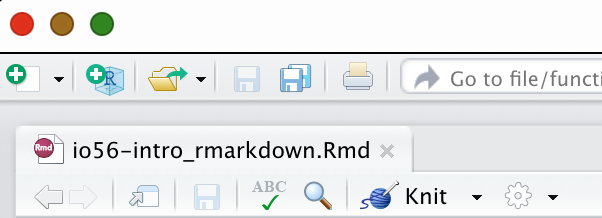

```{r setup, include=FALSE}
knitr::opts_chunk$set(echo = TRUE)
library(tidyverse)
library(medicaldata)
library(lubridate)
library(parsedate)
library(janitor)
library(webexercises)
```

# Dates and Times in R





```{r medicaldata}
covid <- medicaldata::covid_testing
glimpse(covid)
```


## Inserting Code Chunks


```{r print-covid}
head(covid)
```

### Code Chunk Icons


+------------------------------+------------------------------------+
| Icon                         | Uses                               |
+==============================+====================================+
| Settings Gear                | Allows you to                      |
|                              |                                    |
|                              | -   Name the code chunk            |
|                              |                                    |
|                              | -   Set options for this chunk     |
+------------------------------+------------------------------------+
| Run Chunks Above (down       | Runs all of the preceding code     |
| arrow)                       | chunks, including the setup chunk  |
+------------------------------+------------------------------------+
| Run Chunk (rightward arrow)  | Runs the entire current chunk      |
+------------------------------+------------------------------------+

: Code Chunk Icons


## Including Plots


```{r plot, echo=TRUE, warning=FALSE}
covid %>% 
  ggplot() +
  aes(x = pan_day, y = ct_result) +
  geom_point() +
  labs(title = "COVID Testing in First 100 Days of Pandemic",
       x = "Pandemic Day, 2020",
       y = "Cycle Threshold \n45 is a Negative Test")
```


## Including Tables


```{r table, echo=TRUE, warning=FALSE}
covid %>% 
  count(demo_group, gender) %>% 
  gt() %>% 
  tab_header(title = "Demographics of COVID Testing",
             subtitle = "By Group and Gender") %>% 
  tab_source_note(source_note = "From CHOP, 2020") %>% 
  cols_label(demo_group = "Group",
             gender = "Gender",
             n = "Count")
```


## Other languages in code chunks


## Code Chunk Options


+--------------+--------------+--------------------------+
| Option       | Values       | Output                   |
+==============+==============+==========================+
| eval         | TRUE/FALSE   | Whether or not the code  |
|              |              | is run.                  |
+--------------+--------------+--------------------------+
| echo         | TRUE/FALSE   | Show or hide the code    |
+--------------+--------------+--------------------------+
| include      | TRUE/FALSE   | Whether or not the       |
|              |              | resulting output of a    |
|              |              | code chunk is displayed  |
|              |              | in the document. `FALSE` |
|              |              | means that the code      |
|              |              | *will* run, but will not |
|              |              | display results.         |
|              |              | `include = FALSE` is     |
|              |              | often used for the setup |
|              |              | chunk.                   |
+--------------+--------------+--------------------------+
| warning      | TRUE/FALSE   | Whether warnings         |
|              |              | generated from your code |
|              |              | will be displayed in the |
|              |              | document.                |
+--------------+--------------+--------------------------+
| message      | TRUE/FALSE   | Whether messages         |
|              |              | generated from your code |
|              |              | will be displayed in the |
|              |              | document.                |
+--------------+--------------+--------------------------+
| fig.align    | default,     | Where on the page the    |
|              | left, right, | output figure should     |
|              | center       | align. Text options      |
|              |              | should be in quotes,     |
|              |              | like\                    |
|              |              | `fig.align = "right"`    |
+--------------+--------------+--------------------------+
| fig.width    | default = 7  | figure width in inches   |
+--------------+--------------+--------------------------+
| fig .height  | default = 7  | figure height in inches  |
+--------------+--------------+--------------------------+
| error        | TRUE/FALSE   | If `TRUE`, will not stop |
|              |              | building the document if |
|              |              | there is an error in a   |
|              |              | code chunk.              |
+--------------+--------------+--------------------------+
| cache        | TRUE/FALSE   | If `TRUE`, will store    |
|              |              | the results and not      |
|              |              | re-run the chunk.        |
|              |              | Helpful for long, slow   |
|              |              | calculations. But watch  |
|              |              | out for this if your     |
|              |              | data change and your     |
|              |              | results do not(!!).      |
+--------------+--------------+--------------------------+

: Code Chunk Options


::: tryit
## Try Out Other Chunk Options

Try adding different chunk options, including

-   `include = FALSE`

-   `eval = FALSE, echo = TRUE`

-   `eval=TRUE, echo = FALSE`
:::

## The `setup` chunk


## The Easy Button - Visual Markdown Editing


The mean cycle threshold in this study was
`r longmcq(c(answer = "r covid %>%  mean(ct_result, na.rm = TRUE) %>% format(digits = 5)", "r covid %>% median(ct_result, na.rm = TRUE) %>% format(digits = 7)", "r covid %>%  sd(ct_result, na.rm=TRUE) %>% format(digits =3)"))`
<br>

The standard deviation of the cycle threshold in this study was
`r longmcq(c("r covid %>%  mean(ct_result, na.rm = TRUE) %>% format(digits = 5)", "r covid %>% median(ct_result, na.rm = TRUE) %>% format(digits = 7)", answer = "r covid %>%  sd(ct_result, na.rm=TRUE) %>% format(digits =3)"))`

<br>


:::

## A Quick Quiz

1.  Which code chunk option hides the code?
    `r mcq(c("eval = TRUE", "warning = FALSE", answer = "echo = FALSE"))`
2.  Which code chunk always comes first, and includes libraries and data
    import steps? `r mcq(c("plot", answer = "setup",  "top_chunk"))`
3.  What is the name of the code block (and the markup language it is
    written in), set off with 3 hyphens(---) at the very top of your
    Rmarkdown document, that tells `pandoc` how to format the final
    document? `r mcq(c("HTML", answer = "YAML",  "SPAM", "formatter"))`
4.  What symbols do you use to make text bold in Rmarkdown?
    `r mcq(c("one asterisk", answer = "two asterisks",  "underscores", "Exclamation points"))`
5.  Which {knitr} function do you use to add images to your document
    with a code chunk?
    `r mcq(c("paste()", answer = "include_image()",  "insert()", "insert_pic()"))`
