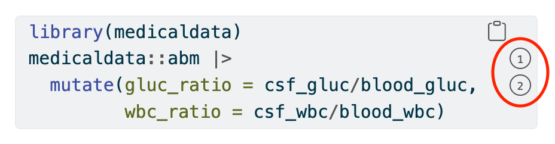

```{r setup, include=FALSE}
knitr::opts_chunk$set(echo = TRUE)
library(tidyverse)
library(medicaldata)
library(webexercises)
library(scales)
library(flextable)
library(gt)
```

# Quarto is a Next-Generation RMarkdown

## Goals for this Chapter

-   introduce Quarto
-   Install Quarto CLI
-   Explore Quarto Features

## Packages Needed for this chapter

You will need {tidyverse}, {medicaldata}, {rmarkdown}, {flextable), {gt}, and updated versions of R and RStudio. If needed, copy the block of code below into your RStudio and run the code to load these packages. You can remove the hashtags from the `install.packages` functions to install these packages if needed.

```{r}
# install.packages('tidyverse')
# install.packages('medicaldata')
# install.packages('rmarkdown')
# install.packages('flextable')
# install.packages('gt')
library(tidyverse)
library(medicaldata)
library(rmarkdown)
library(flextable)
library(gt)
```

## Introducing Quarto

Quarto is the next-generation version of RMarkdown. RMarkdown grew organically, with many spinoffs (blogdown, bookdown, posterdown), with great creativity. But there was not master plan in mind, and a fair number of hacky workarounds became standard. There was some inconsistency between implementations, there was no command-line interface, the approach was specific to R, and past decisions made some new features impossible to implement.

So the folks at Posit (formerly RStudio) decided to rebuild RMarkdown from scratch with a coherent master plan, a command line interface, the ability to use many languages (including Python, bash, Julia, etc.), and pathways to more features that were not possible in RMarkdown. In many ways, Quarto documents (\*.qmd) look a lot like rmd documents. There is a familiar YAML header, text and code chunks, formatting with markdown tags, and the ability to use Pandoc to render (instead of knit) documents to a variety of output formats.

Let's take a moment to go to the [quarto page](https://quarto.org). Click on the **Get Started** button to go to the installation page.

Now click on the *Download Quarto CLI* button to download the right version of quarto for your computer. Note that installing a current version of RStudio will also install the Quarto CLI, but it is not an R package.

Installation is straightforward - go to your downloads folder, and click on the downloaded file to start the installation process. Once this is complete, and the original package moved to the trash, you are ready to open RStudio and work with Quarto documents and presentations.

## A Tour of Quarto

Quarto is an authoring framework that lets you create a variety of output documents, including HTML, MS Word, MS Powerpoint, and others, from a mix of text and code chunks. You can show (during analysis) or hide (for manuscript) code chunks, and show or hide the output. Quarto is a great way to document your background, analysis, and conclusions. It is also a useful format for collaborating and for code review. Think of it as an analytic notebook that can fold up your code and present results when needed.

You can open a New File/Quarto Document, or a New File/Quarto Presentation. Your Document format options are HTML, PDF, or MS Word. The visual editor is on by default, which gives you and WYSIWYG (What You See Is What You Get) environment, like MS Word or Google Docs. You can also switch to the source editor for more control of formatting.

## Opening a New Quarto Document

Try this yourself - in RStudio, open New File/Quarto Document, and select HTML as the format. Give it a title and author, then click the `Create` button.

The default document starts with a YAML chunk, which controls the document output and global options, which looks something like this:

```{r}
#| error: true
#| eval: false
---
title: "Prostate data"
date: 2022-09-12
format: html
---
```

The rest of the document consists of explanatory text and code chunks. The explanatory text can be formatted in the Visual Editor (as in MS Word) or in the source editor with markdown tags for bold, italic, etc.

## Annotating code in Quarto

There are many times that you want to annotate code for collaborators or for your future self. This can be a bit clunky if mixed in with the code. Annotation of code can be done more neatly with Quarto.

You first add the code-annotations style to the YAML header as shown below (options - below, hover, or select), <br>
then add comments as numbers between angle brackets (you can apply the same number to more than one line),
then detail the numbers with full comments below the code chunk, as shown below

```{r}
#| eval: false
---
# Add to YAML header
code-annotations: hover
---
library(tidyverse)
library(medicaldata)
medicaldata::abm |>                         #<1>
  mutate(gluc_ratio = csf_gluc/blood_gluc,  #<2>
         wbc_ratio = csf_wbc/blood_wbc)     #<2>
```
1. Take the abm dataset, and then
2. add new columns for glucose and wbc ratio

Then, when you hover over the comment number, the text comment is shown.
The select option requires clicking the number.

This requires at least Quarto version >= 1.3, and when rendered, looks like this (with the annotation markers that you can hover over circled in red in this case):



## The Visual Editor vs. Source Editor in Quarto

When the Visual Editor is activated by its toggle button, you will see a toolbar at the top of your source pane that looks like this:

{fig-alt="Quarto Visual Editor"} This allows you to easily apply bold, italic, or code formatting, insert headers of several levels, bulleted or numbered lists, links, images, or tables. <br> The Source Editor toggle button gives you a display that is not as pretty, but it shows all the markdown tags, and gives you finer control of formatting, and looks more like this:

```{r}
#| eval: false
#| error: true

## Text formatting

*italic* **bold** ~~strikeout~~ `code`

superscript^2^ subscript~2~

[underline]{.underline} [small caps]{.smallcaps}

## Headings

# 1st Level Header

## 2nd Level Header

### 3rd Level Header

## Lists

-   Bulleted list item 1

-   Item 2

    -   Item 2a

    -   Item 2b

1.  Numbered list item 1

2.  Item 2.
    The numbers are incremented automatically in the output.

## Links and images

<http://example.com>

[linked phrase](http://example.com)

{fig-alt="Quarto logo"}

## Tables

| First Header | Second Header |
|--------------|---------------|
| Content Cell | Content Cell  |
| Content Cell | Content Cell  |
```

## Adding Code Chunks

To add a new code chunk,

-   type Cmd/Ctrl + Option + I or
-   choose the green C (chunk) icon at the top right of the source pane (left of the Run button), and select R from the dropdown menu, or
-   you could manually type 3 backticks (\`\`\`) then `{r}` alone on a line at the top and then 3 backticks (\`\`\`) alone on a line at the bottom of the code chunk.

Note that you can insert code chunks from a variety of languages.

To insert new text, just type plain text, and format as desired with markdown tags or the Visual Editor buttons. You can use the Outline toggle button to turn on or off the outline in the right sidebar of the Source pane. It uses your headings to create a nested outline.

## Organized Options in Code Chunks with the Hash-Pipe #\|

Previously in Rmarkdown, you could state options for your code chunk after the {r} header, inside of the curly braces. This could get a bit messy and sometimes hard to read. You can now add options to each code chunk with the hash-pipe operator (#\|) right after the {r} header, starting on the next line, with one option on each line. This looks something like:

```{r}
#| label: example-chunk
#| error: true
#| eval: false
#| hide: true
#| echo: true
#| cache: true
```

Some of the popular options are

| Option                | What it Does                                                                                                              |
|------------------------|-----------------------------------------------|
| echo                  | Shows (true) or hides (false) code                                                                                        |
| eval                  | whether or not to evaluate the code and show results                                                                      |
| label                 | name of the chunk (must be unique in your qmd document)                                                                   |
| include               | show chunk and output (true), or just run without any output (often used for the `setup` chunk to load libraries quietly) |
| fig.width, fig.height | sets these, default unit is inches                                                                                        |
| warning               | whether to show text warnings                                                                                             |
| message               | whether to show text messages                                                                                             |
| cache                 | Cache and use previous result (true) - helpful if long calculation you don't want to repeat                               |
| fig.cap               | set the figure caption                                                                                                    |
| results: hide         | hides printed output                                                                                                      |
| fig-show: hide        | hides plots                                                                                                               |

: Options for Code Chunks

All of the possible options for a code chunk can be found [here](https://yihui.org/knitr/options/).

Code chunks and their outcomes:

| Option           | Run code | Show Code | Output | Plots | Messages | Warnings |
|------------------|----------|-----------|--------|-------|----------|----------|
| `eval: false`    | N        | **Y**     | N      | N     | N        | N        |
| `include: false` | **Y**    | N         | N      | N     | N        | N        |
| `echo: false`    | Y        | **N**     | Y      | Y     | Y        | Y        |
| `results: hide`  | Y        | Y         | **N**  | Y     | Y        | Y        |
| `fig-show: hide` | Y        | Y         | Y      | **N** | Y        | Y        |
| `message: false` | Y        | Y         | Y      | Y     | **N**    | Y        |
| `warning: false` | Y        | Y         | Y      | Y     | Y        | **N**    |

## Stating Global Options in Your YAML Header

### Code Options and Code Folding

To add global code options for all code chunks, you can set the `execute` options in your YAML section to things like `echo: false`. Note that you need to add a return after `execute:` to make a new line, then keep the default indent when you add options like `eval: false` or `fig-show: hide`.

<br>

To fold (hide) your code with an option for the user to click on a `Code button` to see it, set up your YAML chunk at the top of the qmd document with the `format:` `html:` option of `code-fold: true`. Note that this requires the correct line breaks and indents to work.

```{r}
#| eval: false
#| echo: true
---
title: "Quarto Document"
execute: 
  echo: false
format:
  html:
    code-fold: true
---
```

### Parameters

You can also render a quarto document to prepare a report for one subset of your data, and set the key parameter in the YAML chunk. For example, you can run an fuel economy report with a plot only for SUVs, as seen below.

```{r}
#| eval: false
---
title: "Report by Vehicle Class"
output: html_document
params:
  my_class: "suv"
---

#| label: setup
#| include: false
library(tidyverse)
class <- mpg |> filter(class == params$my_class)

# Fuel economy plot for `r params$my_class`
ggplot(class, aes(x = displ, y = hwy)) + 
  geom_point() + 
  geom_smooth(se = FALSE)
```

## Figures

There are a number of options for controlling figure output. Figure sizing is controlled with:

-   fig-width (width of figure created by R, in inches)

-   fig-height (height of figure created by R, in inches)

-   fig-asp (for aspect ratio - can only specify 2 of width, height, and aspect ratio), the ratio of height to width

-   out-width - often set to 70% of the width of the page and centered with `fig.align`, out.width = "70%"

-   out-height

Other options:

-   fig-cap: "Caption Goes Here"

-   fig-alt: "Alternative text if the image is not shown"

-   fig-align: "center", or "default", "left", "right"

    -   layout-ncol: 2 - this creates 2 columns

## Tables

Markdown tables can be inserted in the Visual Editor with `Insert>Table`.

You can also generate tables from your data with a code chunk. The default display is what you would normally see in the Console, with minimal formatting. You can pipe any table generated with a code chunk into a package for formatting tables and get much nicer HTML, Word, or PDF tables. The {`flextable`} package will work for any format, while the {`gt`} package is excellent for HTML and PDF. The knitr::kable() function will work for converting console output to HTML, and the {`kableExtra`} package will add nicer formatting. Other packages that can work well with tables include `reactable, stargazer, huxtable, tables,` and `ascii`.

Here are two examples from the abm (bacterial menintgitis) dataset with flextable and gt, using conditional formatting to highlight high blood band count and low csf glucose.

```{r}
# Flextable
medicaldata::abm |> 
  select(csf_wbc, csf_gluc, blood_band_pct, gram) |> 
  arrange(-csf_wbc) |> 
  head(7) |> 
  as_flextable() |> # i is row, j is column
  bold(i = ~ csf_gluc < 25, j = ~ csf_gluc) |> 
  color(color = "red",
  i = ~ blood_band_pct > 5, j = ~ blood_band_pct)
  
```

You can learn more about the many formatting options in {flextable} [here](https://davidgohel.github.io/flextable/index.html).

```{r}
# gt package
medicaldata::abm |> 
  select(csf_wbc, csf_gluc, blood_band_pct, gram) |> 
  arrange(-csf_wbc) |> 
  head(7) |> 
  gt() |> 
  tab_style(style = cell_text(weight = "bold"),
    locations = cells_body(
      columns = csf_gluc,
      rows = csf_gluc < 25)) |> 
  tab_style(style = cell_text(color = "red"),
    locations = cells_body(
      columns = blood_band_pct,
      rows = blood_band_pct > 5)) 

```

You can learn more about the many formatting options in {gt} [here](https://gt.rstudio.com).

## Inline Code and Caching

You can run R code and place the output into your text. much like Rmarkdown, by placing a single backtick before **r** and another single backtick after the code needed.

For example, you can write out "my two-sided p value is `` `r
2*(1-pnorm(7, mean = 5, sd = 1.1))` ``," which shows the code as written. When this R code between the backticks is evaluated (when you render the document), the resulting p value is shown. This will read: <br> My two-sided p value is `r 2*(1-pnorm(7, mean = 5, sd = 1.1))`.

## Quarto at the Command Line

As you work on a \*.qmd document (in this case, named `document.qmd`), you will want to preview it in an adjacent browser window. You can do this at the command line (Terminal in Mac, Run cmd in Windows) with

`quarto preview document.qmd --to html` for the html version, or

`quarto preview document.qmd --to docx` for the Microsoft Word version.

To render your saved qmd document from the command line, you can use with

`quarto render document.qmd --to html` for the html version, or

`quarto render document.qmd --to docx` for the Microsoft Word version. The render commands will produce a final document.

## Citations in Quarto

Citations in Quarto work much like they do in Rmarkdown. In the Visual Editor, you can use Insert\>Citation. You can enter a DOI (Digital Object Identifier), pull a reference from a Zotero library, pull references with PubMed IDs, or get references from a bibliography file (a `*.bib` file in the same directory as your document). If you add a citation using one of the first three methods, the visual editor will automatically create a bibliography `*.bib` file for you and add the reference to it. It will also add a bibliography field (required to identify the file) to the document YAML. As you add more references, this file will get populated with their citations.

When Quarto renders your file, it will build and append a bibliography to the end of your document. The bibliography will contain each of the cited references from your bibliography file, but it will not contain a section heading. As a result it is common practice to end your file with a section header for the bibliography, such as # References.

You can change the style of your citations and bibliography by referencing a CSL (citation style language) file (with the full path to the file) in the csl field in the YAML header.

```{r}
#| eval: false
bibliography: my_bibliography.bib
csl: R/csl_files/gastroenterology.csl
```

You can find many journal bibliography styles (and download them) at https://www.zotero.org/styles or  https://github.com/citation-style-language/styles.


:::challenge
## Challenge Yourself
1. Create a new Quarto Document, and do a simple analysis of one of the {medicaldata} datasets with code chunks that generate a table and a figure, and add some text about your conclusions. Add some header text for the different sections. Try rendering this document (separately) to both HTML and MS Word.
2. Experiment with the visual editor and the source editor. Insert a code chunk, a citation (try this DOI - 10.1016/j.cgh.2021.05.038), a table, and a horizontal line. Toggle back and forth to compare WYSIYG to markdown tags. Render the document and peek at the YAML and the end of the document to see how it handles the citation.
3. With a quarto document open, toggle the Outline button at the top right of the Source pane, and see how your heading text becomes a nested outline.
4. Experiment with the code chunk options in section 34.9, and render the chunks to see what the different options do.
5. Take a code chunk that generates a plot, and experiment with the figure options in chapter sections 9 and 11. Render the document, and see if you get the output you expected.
:::

:::explore
## Exploring further

1.  The Quarto Getting Started Tutorials found (in left sidebar) [here](https://quarto.org/docs/get-started/)

2.  The [Quarto Chapter](https://r4ds.hadley.nz/quarto.html) in R for Data Science.

3. The Quarto website is the definitive reference [here](https://quarto.org/)
:::
