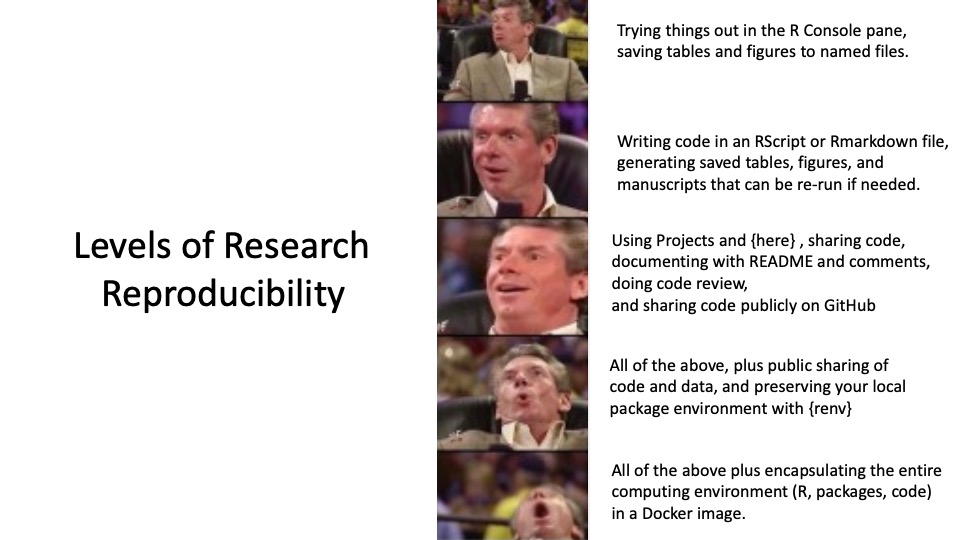
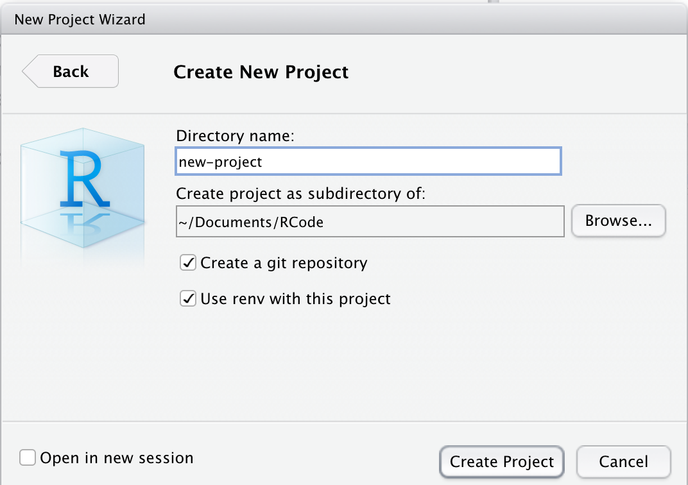

```{r setup, include=FALSE}
knitr::opts_chunk$set(echo = TRUE)
library(tidyverse)
library(medicaldata)
library(janitor)
library(here)
library(renv)
```

# Intermediate Steps Toward Reproducibility

Now that you have become familiar with storing your code in saved Rmarkdown documents or RScripts, let's continue on our journey to Research Reproducibility.



In this chapter, you will learn how to:
- Use RStudio Projects
- Organize multiple files and folders in a project
- Use the {here} package to avoid file paths that are specific to your computer
- Do code review with a coding partner
- Share code on Github
- Sharing deidentified data on websites like *figshare* and *Open Science Foundation* 
- Building project-specific libraries with {renv} and *snapshots* to maintain your package environment.

## Level 3 Reproducibility

At this point, you may have a very long Rmarkdown document, or several documents with code, for a particular data project. There are challenges to organizing your files, your data, and your outputs. 

RStudio Projects help greatly in organizing your work.

These Projects organize a coherent research project into a single folder in your storage/file system, anchored by a unique *.Rproj file in the folder.

To get started, you may want to create a particular folder for R projects on your computer. I typically put an `Rcode` folder inside the Documents folder, and store RStudio Projects inside of the `Rcode` folder. Take a moment to create your `Rcode` folder, if you don't have one already.

:::warning
It is best **not** to store RStudio Projects inside of other Projects. RStudio looks for the `name.Rproj` file to identify a project, and it gets confused if these are nested. Avoid having a `name.Rproj` file in either your Documents folder or your Rcode folder, to avoid problems.
:::

Now that you have an Rcode folder, let's set it as the default location for your files and Projects in R.

In RStudio, select (**Tools/Global Options**). Click on the General Tab on the left.


Under R Sessions, enter the Default directory as `~/Documents/Rcode`, or use the Browse button to browse to this folder and select it.


### Creating a New Project in RStudio

Open a new RStudio Session (**Session/New Session**), and start a new project, by selecting (**File/New Project**). You will be presented with a box of 3 options. 

- Most of the time you will select **New Directory**. 
- If you have already started on a research project, with data and code files in a particular folder that is not yet an RStudio project, you can select **Existing Directory**, and browse to the correct folder, and make it an official RStudio project. 
- If you or a collaborator have already shared a project on GitHub, you can select **Version Control**, select Git, enter the repository URL, and *clone* this project to your computer. 

After you select *New Directory*, you will be asked to select *New Project* (rather than R package, Shiny App, website, book, etc.), then give the project (and its directory) a short name. It is generally a good idea to check both of the boxes to (1) Create a git repository, and (2) Use renv with this project.



Then click the **Create Project** button.

This creates a new folder on your computer, named **new-project**, within your Rcode folder. This currently only contains a file named **new-project.Rproj** and a folder named **.Rproj.user** which handles files for you. Check your Rcode folder to find the new folder. You can copy or move your data files for this project to this folder. If you have started your coding for this project, move your code files to this project folder as well.  

Now you need to begin to organize your Project Folder. There are a lot of opinions and workflow templates for this, but most include folders for:

- data_raw - untouched raw data files 
- data_processed (numbered in order if several iterations) 
- R (for scripts, functions)
- metadata - plans/aims, TODO lists, descriptions of datafiles
- code - analysis files (Rmarkdown, numbered in order)
- output - output tables, figures, manuscript

and a README.Rmd file to orient someone new to the project - what are the goals, where are data found, where are the analysis scripts, and how to run the code in order to reproduce the analysis.

#### Naming and Numbering Files

In general, it is helpful to name code files with a short useful title that describes their function, along with a leading number, so that the order of running the code files is clear, like

`01-import-clean_redcap_data.Rmd` <br>
`02-import-clean_data-warehouse_data.Rmd` <br>
`03-merge_redcap_data-warehouse_data.Rmd`

These will be easily sorted and organized in your `new-project/code/` folder, as the leading numbers help organize these (keeping the leading 0 on the front of 0 through 9 helps sorting a lot when you have more than 10 files).

It is also helpful to number and name your data files clearly. These should usually correspond to the code files that created them. At the end of a code step, you can save/write your resulting data file to an `*.rda` file or a `*.csv` file, to be loaded at the start of the next code file. These might look like the following in the `new-project/processed-data/` folder.

`01-cleaned_redcap_data.csv` <br>
`02-cleaned_data-warehouse_data.csv` <br>
`03-merged_redcap_data-warehouse_data.csv` <br>

Note that we are using 'chunked' naming, so that the files have a consistent naming pattern with chunks in the same order, and distinct chunks are separated by underscores, while informative chunks composed of more than one word are separated by dashes. 

It is surprisingly important to be thoughtful about your chunked naming scheme early on, as it can help you in many ways in organizing, sorting, and manipulating files later.

### File paths and the {here} package

One of the great frustrations in sharing an RStudio project with a collaborator is that it is common to refer to files with `absolute file paths` which are specific to your computer. 

Unfortunately, the files will inevitably not be in the same place on your collaborator's computer, and all of the path references to load or write/save files will not work.

This frustration has led reasonable people to threaten computer arson, and to propose better approaches.


In order to have a set of file paths that work on **any** computer that has a copy of your Project, you need to use the {here} package. Go ahead and install it now and load it `library(here)` if you don't have it already.

```{r}
# install.packages("here")
library(here)
here()
```

Then run the here() function in your Console pane. It will return the path to your current Project. It essentially figures out where your project directory is, and provides this as a home base. This can be used to reference other folders in your project in a relative way. For example, to list the files in your `data-raw` folder (aka directory, or dir), you can use the `{fs}` package and the _here()_ function, as in:

```{r, eval=FALSE}
fs::dir_ls(here("data-raw"))
```

The _here()_ function supplies the file path details up to your RStudio Project folder, and then you can add any subfolder or filename details within the parentheses. Similarly, you can write your cleaned and merged data file to the `data-processed` folder with

```{r, eval=FALSE}
write_csv(here("data-processed/03-merged_redcap_data-warehouse_data.csv"))
```

Which will write the csv file to the `data-processed` folder within your Project. 

Now when you share the Project with a collaborator, the file paths for reading and writing files will now all work. 


:::tryit
- Move a data file and a code file into your Project Folder.
- Create folders like `data-raw, data-processed, metadata, code`. You can do this by 'hand' with your computer's operating system, or with the fs package, using `fs::create_dir("name")`
- Use `fs:dir_ls(here())` to list the files in the top level of your project
- Move the files into the appropriate folders
- re-run `fs:dir_ls(here())` to see the change in the listing
- Now run `fs:dir_ls(here("foldername"))` to see the contents of each of the folders (by name) that you created.
:::

## Code Review with a Coding Partner    

Checking code is a largely thankless job, but it is extremely important to prevent errors. It also encourages you to document your thinking and your code more thoroughly if you know someone else will be reviewing and checking it. If they can't understand what you are doing, they can't adequately review your code. 

It is important to find someone, often at a parallel position in their career, who is doing data coding for their research, so that you can become code review partners. Each of you can help the other become a better, clearer coder, and each of you can be more confident that your code does not contain mistakes.

It can be **very** helpful to do this in several stages, to prevent problems later, rather than trying to review an entire project's code in one go.

1. after data import, cleaning, relabeling and merging
2. After initial analysis
3. After all figures, tables, manuscript ready

### Checklist for Code Review

This is a general and fairly comprehensive guidance. Use the items you (and the code creator) wish to focus on.

1. Review a small, manageable chunk of code at a time. This takes a lot of focus, and often a lot of solving mysteries (poorly documented code).
2. Make sure you understand the goal of the code, and/or the hypothesis being tested
3. Is the README clear enough on where the data are, where the code is located, and what to run in what order? 
4. Is the code itself, with comments & text, readable and understandable? Does it stand on its own without a lot of over-the-shoulder explanations?
5. Is it structured in a project with {here} and {renv} to have consistent file paths and package versions?
6. Are there libraries loaded that are not needed? Are all libraries loaded at the top of the code script?
7. Think about file names and variable names - are they clear and helpful? Could they be better?
8. Do the variable names include units, when appropriate, like sbp_mmHg, ast_iu-mL, cr_mg-L, to make clear what is being measured without a codebook?
9. Are the values (for categorical and ordinal scales) self-explanatory? (e.g "0_No" and "1_Yes" are superior to 0/1, or "1_Asian", "2_Black", or "1_placebo", "2_amazingmab", rather than having to backtrack to a codebook?
10. Has data been checked for missing data, outliers, time trends, correlations? Are things that should be correlated actually correlated? (Data Exploration and Validation (DEV?))
11. Does the data contain any PHI that needs to be de-identified? Can it be scrubbed?
12. Does all the code run in a new, clean session on a different computer?
13. Use {tidylog} to track data cleaning/processing steps. Are there a lot more rows/columns disappearing than expected?
14. Check and validate data cleaning steps - was the result what was intended?
15. Check and validate merges - was the result what was intended?
16. Check and validate recoding of variables - mutate steps, case_when steps, intervention arms, outcome definitions - as the result what was intended?
17. Keep notes, make recommendations for improvement
18. If things are unclear, suggest how to make them clear
19. Are there repeated steps that could be made into functions?
20. Are there functions repeated multiple times that could be done once with purrr::map?
21. Are there scientific threats to the validity of the research? Is there possible bias? mis-measurement? Potential confounders not present in the dataset? is this the best dataset to answer this question?
22. Any general recommendations or suggestions of tools, packages, or functions that could be used to make this (or future) code projects better?
23. Sign off on this code chunk - add a signoff comment at the end `# I, NAME, have reviewed this code for errors and clarity on DATE and APPROVE this code.` 

## Sharing code on GitHub
